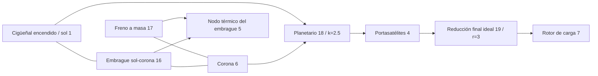

# Engranajes ideales acoplados y restricciones planetarias

[English](GEAR_NETWORK.md) · [简体中文](GEAR_NETWORK.zh-CN.md) · [Français](GEAR_NETWORK.fr.md) · [Русский](GEAR_NETWORK.ru.md) · [日本語](GEAR_NETWORK.ja.md) · [한국어](GEAR_NETWORK.ko.md) · [Deutsch](GEAR_NETWORK.de.md) · **Español** · [Italiano](GEAR_NETWORK.it.md) · [Português](GEAR_NETWORK.pt-BR.md)

`ideal_gear` y `planetary_gear` son restricciones permanentes sin pérdidas en la misma resolución de Core que los ejes, los motores RL, los cilindros y los embragues controlados. JSON, CLI/MCP y el asset portátil v10 llevan las mismas definiciones. Las [referencias de carga constante](IDEAL_GEARS.es.md) independientes siguen siendo oráculos de verificación. Todos los parámetros de investigación actuales son `unverified`.

## Topología y signos

`ComponentDefinition.IdealGear(id, a, b, ratio)` conecta nodos rotacionales distintos y exige una relación con signo finita y distinta de cero. `ComponentDefinition.PlanetaryGear(id, sun, ring, carrier, ringToSunTeethRatio)` exige tres nodos rotacionales distintos y una relación de dientes corona/sol finita y mayor que uno. JSON usa `node_a`, `node_b`, `node_c` para sol, corona y portasatélites; `node_c` se aplica solo al planetario. Cada rotor acoplado conserva su inercia positiva explícita. No se infiere una masa fija de un puerto de engranaje ausente; usa un freno a masa explícito cuando un miembro planetario debe quedar retenido.

```text
Ideal pair: omega_A - r omega_B = 0
Reactions on rotors: [lambda, -r lambda]

Planetary: omega_S + k omega_R - (1+k) omega_C = 0
Reactions on rotors: [lambda, k lambda, -(1+k) lambda]
```

Estas relaciones dan potencia de reacción combinada nula. No hay inercia de engrane, flexibilidad, juego, pérdidas ni calor. Añade de forma explícita ejes elásticos, inercias acopladas y embragues. La relación de dientes no establece geometría del diente, resistencia, lubricación ni calibración. Los signos y las fuentes físicas de referencia están registrados en [IDEAL_GEARS.es.md](IDEAL_GEARS.es.md).

Registros de componente de ejemplo:

```json
{"id":18,"kind":"planetary_gear","node_a":1,"node_b":6,"node_c":4,"parameters":{"ratio":2.5}}
{"id":19,"kind":"ideal_gear","node_a":4,"node_b":7,"parameters":{"ratio":3}}
```

Los engranajes no tienen entrada de control. Los embragues eligen un camino de potencia restringiendo o liberando otros grados de libertad; cambiar una relación de engranaje en tiempo de ejecución no es una operación de entrada.

## Condiciones iniciales y rango de las restricciones

Las velocidades iniciales deben satisfacer todas las relaciones permanentes dentro del redondeo relativo de binary64. Las filas se dividen por su coeficiente mayor; el límite inicial es `64 epsilon` veces la suma de los términos de velocidad normalizados en valor absoluto, sin banda muerta absoluta de baja velocidad. Un estado inicial incompatible devuelve un diagnóstico `Connection` sobre `initial_speed`. No hay impulso finito de sincronización ni energía cinética inicial descartada.

Los ángulos iniciales de los rotores definen la fase relativa del engranaje. Sus desfases no tienen que ser cero; la restricción preserva esa fase inicial. `constraint_error` informa la desviación respecto de ella. El modelo no infiere el indexado de dientes ni aplica una corrección de posición a los datos del usuario.

Las restricciones permanentes deben ser independientes. Los bucles de engranaje duplicados o dependientes se rechazan en la compilación con `Solver / gear.constraints`; elimina las filas dependientes o corrige el camino de potencia. Un bucle de rango completo puede restringir todos los rotores al reposo. Un embrague cuyo deslizamiento ya está totalmente restringido por engranajes permanentes se rechaza con `Solver / clutch.coupling`, porque su reacción independiente está indefinida. Los bucles redundantes de *embrague* conservan el comportamiento acotado de conjunto activo documentado aparte en [CLUTCH_NETWORK.es.md](CLUTCH_NETWORK.es.md).

## Integración acoplada

Sea `D = I - h A/2` la matriz de punto medio electromecánica existente, y `C` las filas de restricción normalizadas que actúan sobre las velocidades de los rotores. Para el punto medio no restringido `y`, construye la respuesta restringida sin rigidez de penalización:

```text
R = D^-1 (h/2 M^-1 C^T)
G = C R
G lambda = -C y
x_mid = y + R lambda
x_next = 2 x_mid - x_old
```

`M^-1` aplica las inercias de los rotores acoplados; la respuesta incluye el acoplamiento existente de eje, ángulo y motor a través de `D`. Las respuestas de par del cilindro y del embrague usan la misma proyección. La iteración no lineal de trabajo por presión y las reacciones acotadas del embrague evolucionan por tanto dentro de las restricciones permanentes. Las contribuciones de reacción de la resolución libre, de las fuerzas finales del cilindro y de las fuerzas finales del embrague se acumulan de forma coherente para obtener el par medio de cada engranaje.

La factorización del tick completo y las respuestas son datos compilados inmutables. Cuando una captura o una inversión del embrague subdivide un tick, esa simulación posee los factores de intervalo variable, las respuestas de proyección y los búferes de multiplicadores. No se comparte ningún espacio de trabajo mutable de la resolución entre simulaciones. La compilación y la construcción asignan matrices densas acotadas; los avances correctos y las instantáneas del búfer del llamador no asignan memoria gestionada, incluidos los intervalos internos de captura del embrague.

Las reacciones de engranaje no realizan calor físico ni trabajo de fuentes. Las pérdidas del embrague siguen entrando en el nodo térmico indicado o en el libro externo de calor. La energía total, los inventarios de gas y químicos y el trabajo por presión del motor conservan su contabilidad existente. La restricción ideal no añade un orden nuevo de convergencia del paso de tiempo: el sistema lineal de punto medio es de segundo orden; siguen aplicándose los límites térmicos e híbridos de los solvers existentes.

## Contrato observable y de transacción

| Campo | Unidad | Significado |
|---|---|---|
| `slip_speed` | rad/s | Residuo actual de velocidad de par o de Willis, sin normalizar |
| `constraint_error` | rad | Relación angular actual sin normalizar, menos su valor inicial |
| `torque` | Nm | Reacción media del último tick completo en A/sol |
| `torque_at_b` | Nm | Reacción media del último tick completo en B/corona |
| `torque_at_c` | Nm | Reacción media del último tick completo en el portasatélites; solo planetario |

Las reacciones medias iniciales son cero, antes de que se haya resuelto un intervalo. Los cambios de entrada de frontera no reescriben las salidas del tick precedente. Con eventos internos de embrague, las medias suman los impulsos de reacción aceptados de todos los intervalos y dividen por la duración del tick exterior entero. El historial de reacción se copia, se hashea y se revierte con el resto del estado.

El tiempo externo sigue siendo nanosegundos enteros acotados. Las llamadas de varios ticks fallidas o canceladas no confirman ni una salida parcial de reacción ni ningún calor interno aceptado, ni historial de gas, fase, entrada o libro. Las bifurcaciones poseen estado y factores variables independientes. Los modelos de engranaje añaden la etiqueta de huella 9; los modelos sin engranajes conservan las huellas y los hashes de repetición anteriores. La contabilidad conservativa de capacidad de estado incluye una entrada de historial de reacción media por cada restricción ideal.

## Límites numéricos y recuperación

La factorización de restricciones usa el umbral de pivote LU escalado existente de `64 epsilon`. La movilidad del embrague tras la proyección permanente debe superar `64 epsilon` veces su movilidad libre. Escalas mal condicionadas de inercia o de relación pueden por tanto rechazar incluso datos finitos. En un estado aceptado, cada residuo de velocidad normalizado debe ser como máximo `2e-12 + 512 epsilon * sum(abs(speed terms))`; el error de fase normalizado debe ser como máximo `2e-10 + 1024 epsilon * (abs(initial phase) + sum(abs(angle terms)))`. Las salidas en bruto y el historial de reacción deben seguir siendo finitos. Estas son tolerancias del solver, no calibración ni garantías universales de error relativo. No se afirma precisión híbrida de tick grande.

Un fallo en tiempo de ejecución deja el lote sin cambios. Inspecciona la topología y el rango, y las escalas de inercia y de relación. Reduce el tick y recrea la sesión ante límites de resolución del trabajo por presión, de las válvulas, de la combustión o de los eventos de embrague. Los ticks más cortos no curan restricciones permanentes dependientes. Los límites de iteraciones no lineales, de iteraciones de restricción y de eventos internos siguen siendo descubribles en las capacidades.

## Laboratorio de transmisión planetaria encendida

El [laboratorio](../assets/labs/fired-planetary.power.json) nuevo conecta un cilindro encendido sintético al sol. Un freno de corona selecciona la reducción; un embrague sol/corona selecciona la directa. El portasatélites acciona una carga inercial aparte a través de una reducción final de relación tres.



El freno inicial retiene la corona y da una relación cigüeñal/carga de 10.5. A los 200.05 ms el freno se libera y el embrague sol/corona se acopla; tras la captura, la relación cigüeñal/carga es tres. A los 450.05 ms el embrague se libera y el freno de corona vuelve a acoplarse. La carga cambia a los 600.05 ms, y el experimento termina a los 800 ms. Estos programas de ticks exactos aportan una subida y una bajada de marcha; no implementan una TCU ni un actuador hidráulico.

Los **84 límites** coinciden entre lotes alternos, reproducción portátil y el servidor MCP real. El informe final registra unos **-56.83 J** de trabajo neto de fuentes externas, **254.52 J** de calor del embrague sol/corona y **156.32 J** de calor del freno. El nodo térmico llega a **302.0542 K**; las velocidades de cigüeñal y de carga son unos **76.81549** y **7.315761 rad/s**, con la corona retenida. El residuo final de energía es de unos **2.51e-10 J**. La huella es `6703f00c995e6b62`; el hash de estado final es `b328de221532fbae`. Son resultados numéricos sintéticos, no un rendimiento medido de la transmisión.

Pide `get_example_model` con `name: "fired-planetary"`, o ejecuta:

```sh
dotnet src/Power.Cli/bin/Release/net10.0/Power.Cli.dll assets/labs/fired-planetary.power.json --output artifacts/reports/fired-planetary.json
```

La compilación exporta `FiredPlanetary.powerasset`. Studio muestra conexiones esquemáticas del planetario de tres puertos y de la reducción final, junto a vistas de rotor y de fase del embrague. Las pruebas de importación, repetición del cambio, reinicio y limpieza están preparadas; la ejecución real de Editor, Play Mode e IL2CPP sigue pendiente.

## Evidencia y alcance restante

Las pruebas comparan el movimiento del grafo, el desplazamiento y cada reacción con las referencias exactas independientes de par y de planetario. Un tren de varias etapas comprueba la inercia reflejada y el orden por ID estable; los modelos de motor/térmico y de cilindro reactivo coinciden con modelos de inercia equivalente. Un oscilador restringido demuestra convergencia de segundo orden y energía conservada. El cambio del embrague planetario coincide con el tiempo analítico de captura, la velocidad final de directa y el calor de fricción, y después vuelve a la reducción. La cancelación, la sobrecarga tras un prefijo de cambio aceptado, el agrupamiento en lotes, las bifurcaciones y la captura sin asignaciones preservan el contrato de transacción.

Las pruebas del asset v10 cubren la topología de tres puertos, registros mal formados, ausentes o duplicados, puertos inválidos y degradaciones falsificadas. Un fixture auténtico v7 de embrague encendido conserva su huella y la repetición actualizada; los fixtures más antiguos siguen admitidos. Las pruebas estrictas de JSON y de agente cubren errores de rango y de velocidad inicial, la atomicidad de revisión y de entrada, y la distinción entre una ejecución correcta y unos KPIs aprobados. Consulta la [validación](VALIDATION.es.md) y el [formato de asset](ASSET_FORMAT.es.md).

Esto es un camino de potencia de transmisión ideal acoplado. El [convertidor mapeado](CONVERTER_NETWORK.es.md) lo amplía ahora con transferencia de fluido y bloqueo aparte. La topología DCT/AT completa, la dinámica hidráulica de bomba y pistón, la coordinación de par ECU/TCU, la dosificación de combustible y el encendido del motor, la admisión y el escape detallados, las pérdidas, el comportamiento ante fallos, la calibración medida del vehículo y la evidencia real del Player de Unity siguen formando parte del objetivo completo de Power!.
