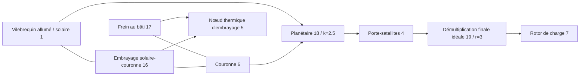

# Engrenages idéaux et contraintes planétaires couplés

[English](GEAR_NETWORK.md) · [简体中文](GEAR_NETWORK.zh-CN.md) · **Français** · [Русский](GEAR_NETWORK.ru.md) · [日本語](GEAR_NETWORK.ja.md) · [한국어](GEAR_NETWORK.ko.md) · [Deutsch](GEAR_NETWORK.de.md) · [Español](GEAR_NETWORK.es.md) · [Italiano](GEAR_NETWORK.it.md) · [Português](GEAR_NETWORK.pt-BR.md)

`ideal_gear` et `planetary_gear` sont des contraintes permanentes sans pertes dans la même résolution du cœur que les arbres, les moteurs RL, les cylindres et les embrayages commandés. JSON, la CLI/MCP et l'asset portable v10 portent les mêmes définitions. Les [références à charge constante](IDEAL_GEARS.fr.md) indépendantes restent des oracles de vérification. Tous les paramètres de recherche courants sont `unverified`.

## Topologie et signes

`ComponentDefinition.IdealGear(id, a, b, ratio)` relie des nœuds de rotation distincts et exige un rapport signé fini et non nul. `ComponentDefinition.PlanetaryGear(id, sun, ring, carrier, ringToSunTeethRatio)` exige trois nœuds de rotation distincts et un rapport de dents couronne/solaire fini, supérieur à un. Le JSON utilise `node_a`, `node_b`, `node_c` pour le solaire, la couronne et le porte-satellites ; `node_c` ne s'applique qu'au planétaire. Chaque rotor attaché conserve son inertie positive explicite. Le bâti n'est pas déduit d'un port d'engrenage manquant ; utilisez un frein au bâti explicite lorsqu'un élément planétaire doit être maintenu.

```text
Ideal pair: omega_A - r omega_B = 0
Reactions on rotors: [lambda, -r lambda]

Planetary: omega_S + k omega_R - (1+k) omega_C = 0
Reactions on rotors: [lambda, k lambda, -(1+k) lambda]
```

Ces relations donnent une puissance de réaction combinée nulle. L'inertie d'engrènement, la compliance, le jeu, les pertes et la chaleur sont absents. Ajoutez explicitement des arbres élastiques, des inerties attachées et des embrayages. Le rapport de dents n'établit ni la géométrie des dents, ni la résistance, ni la lubrification, ni la calibration. Les signes et les sources de référence physique sont consignés dans [IDEAL_GEARS.fr.md](IDEAL_GEARS.fr.md).

Exemples d'enregistrements de composants :

```json
{"id":18,"kind":"planetary_gear","node_a":1,"node_b":6,"node_c":4,"parameters":{"ratio":2.5}}
{"id":19,"kind":"ideal_gear","node_a":4,"node_b":7,"parameters":{"ratio":3}}
```

Les engrenages n'ont pas d'entrée de commande. Les embrayages choisissent un chemin de puissance en contraignant ou en libérant d'autres degrés de liberté ; changer un rapport d'engrenage à l'exécution n'est pas une opération d'entrée.

## Conditions initiales et rang des contraintes

Les vitesses initiales doivent satisfaire toutes les relations permanentes dans l'arrondi relatif binary64. Les lignes sont divisées par leur plus grand coefficient ; la borne initiale est `64 epsilon` fois la somme des termes de vitesse normalisés en valeur absolue, sans zone morte absolue à basse vitesse. Un état initial incompatible renvoie un diagnostic `Connection` sur `initial_speed`. Il n'y a pas d'impulsion de synchronisation finie ni d'énergie cinétique initiale écartée.

Les angles initiaux des rotors définissent la phase relative de l'engrenage. Leurs décalages n'ont pas besoin d'être nuls ; la contrainte conserve cette phase initiale. `constraint_error` rapporte l'écart par rapport à elle. Le modèle n'infère pas l'indexation des dents et n'applique pas de correction de position aux données de l'utilisateur.

Les contraintes permanentes doivent être indépendantes. Les boucles d'engrenage dupliquées ou dépendantes sont rejetées à la compilation avec `Solver / gear.constraints` ; retirez les lignes dépendantes ou corrigez le chemin de puissance. Une boucle de rang plein peut contraindre chaque rotor au repos. Un embrayage dont le glissement est déjà entièrement contraint par des engrenages permanents est rejeté avec `Solver / clutch.coupling`, parce que sa réaction indépendante est indéfinie. Les boucles d'*embrayage* redondantes conservent le comportement d'ensemble actif borné, documenté séparément dans [CLUTCH_NETWORK.fr.md](CLUTCH_NETWORK.fr.md).

## Intégration couplée

Soit `D = I - h A/2` la matrice de point milieu électromécanique existante, et `C` les lignes de contrainte normalisées agissant sur les vitesses des rotors. Pour le point milieu non contraint `y`, construisez la réponse contrainte sans raideur de pénalité :

```text
R = D^-1 (h/2 M^-1 C^T)
G = C R
G lambda = -C y
x_mid = y + R lambda
x_next = 2 x_mid - x_old
```

`M^-1` applique les inerties des rotors attachés ; la réponse inclut le couplage existant d'arbre, d'angle et de moteur à travers `D`. Les réponses de couple du cylindre et de l'embrayage utilisent la même projection. L'itération non linéaire du travail de pression et les réactions d'embrayage bornées évoluent donc à l'intérieur des contraintes permanentes. Les contributions de réaction de la résolution libre, des efforts finaux du cylindre et des efforts finaux d'embrayage sont accumulées de façon cohérente pour obtenir le couple moyen de chaque engrenage.

La factorisation du tick complet et les réponses sont des données compilées immuables. Lorsqu'une capture ou une inversion d'embrayage subdivise un tick, cette simulation possède les facteurs à intervalle variable, les réponses de projection et les tampons de multiplicateurs. Aucun espace de travail de résolution mutable n'est partagé entre simulations. La compilation et la construction allouent des tableaux denses bornés ; l'avance réussie et les instantanés de tampons d'appelant n'allouent pas de mémoire managée, y compris les intervalles internes de capture d'embrayage.

Les réactions d'engrenage n'effectuent ni chaleur physique ni travail de source. Les pertes d'embrayage continuent d'entrer dans le nœud thermique spécifié ou le registre de chaleur externe. L'énergie totale, les inventaires gazeux et chimiques et le travail de pression moteur conservent leur comptabilité existante. La contrainte idéale n'ajoute pas de nouvel ordre de convergence du pas de temps : le système linéaire de point milieu est du second ordre ; les limites thermiques et hybrides des solveurs existants s'appliquent encore.

## Contrat observable et de transaction

| Champ | Unité | Signification |
|---|---|---|
| `slip_speed` | rad/s | Résidu de vitesse courant, non normalisé, de la paire ou de Willis |
| `constraint_error` | rad | Relation angulaire courante non normalisée, moins sa valeur initiale |
| `torque` | Nm | Réaction moyenne du dernier tick complet sur A/solaire |
| `torque_at_b` | Nm | Réaction moyenne du dernier tick complet sur B/couronne |
| `torque_at_c` | Nm | Réaction moyenne du dernier tick complet sur le porte-satellites ; planétaire seulement |

Les réactions moyennes initiales sont nulles, avant qu'un intervalle ait été résolu. Les changements d'entrée aux bornes ne réécrivent pas les sorties du tick précédent. Avec des événements d'embrayage internes, les moyennes somment les impulsions de réaction acceptées sur tous les intervalles et divisent par la durée du tick externe entier. L'historique de réaction est copié, haché et soumis au rollback avec tout le reste de l'état.

Le temps externe reste des nanosecondes entières bornées. Les appels multi-ticks échoués ou annulés ne valident ni une sortie de réaction partielle, ni aucun historique interne accepté de chaleur, de gaz, de phase, d'entrée ou de registre. Les forks possèdent un état et des facteurs variables indépendants. Les modèles d'engrenage ajoutent la balise d'empreinte 9 ; les modèles sans engrenage conservent les empreintes et les hachages de rejeu antérieurs. La comptabilité conservative de capacité d'état inclut une entrée d'historique de réaction moyenne par contrainte idéale.

## Bornes numériques et reprise

La factorisation des contraintes utilise le seuil de pivot LU mis à l'échelle existant de `64 epsilon`. La mobilité d'embrayage après projection permanente doit dépasser `64 epsilon` fois sa mobilité libre. Des échelles d'inertie/rapport mal conditionnées peuvent donc rejeter même des données finies. À un état accepté, chaque résidu de vitesse normalisé doit être au plus `2e-12 + 512 epsilon * sum(abs(speed terms))` ; l'erreur de phase normalisée doit être au plus `2e-10 + 1024 epsilon * (abs(initial phase) + sum(abs(angle terms)))`. Les sorties brutes et l'historique de réaction doivent rester finis. Ce sont des tolérances de solveur, pas une calibration ni des garanties universelles d'erreur relative. Aucune précision hybride à grand tick n'est revendiquée.

Un échec à l'exécution laisse le lot inchangé. Inspectez la topologie, le rang et les échelles d'inertie/rapport. Réduisez le tick et recréez la session pour les limites de résolution du travail de pression, des soupapes, de la combustion ou des événements d'embrayage. Des ticks plus courts ne guérissent pas des contraintes permanentes dépendantes. Les limites sur les itérations non linéaires, les itérations de contrainte et les événements internes restent découvrables dans les capacités.

## Laboratoire de transmission planétaire allumée

Le nouveau [laboratoire](../assets/labs/fired-planetary.power.json) relie un cylindre allumé synthétique au solaire. Un frein de couronne sélectionne la réduction ; un embrayage solaire/couronne sélectionne la prise directe. Le porte-satellites entraîne une charge inertielle distincte à travers une démultiplication finale de rapport trois.



Le frein initial maintient la couronne, ce qui donne un rapport vilebrequin/charge de 10.5. À 200.05 ms le frein se relâche et l'embrayage solaire/couronne s'engage ; après capture, le rapport vilebrequin/charge est trois. À 450.05 ms l'embrayage se relâche et le frein de couronne se réengage. La charge change à 600.05 ms, et l'expérience se termine à 800 ms. Ces séquences à ticks exacts fournissent une montée et une descente ; elles n'implémentent ni TCU ni actionneur hydraulique.

Les **84 bornes** coïncident toutes entre lots alternés, rejeu portable et serveur MCP réel. Le rapport final enregistre environ **-56.83 J** de travail de source externe net, **254.52 J** de chaleur d'embrayage solaire/couronne et **156.32 J** de chaleur de frein. Le nœud thermique atteint **302.0542 K** ; les vitesses du vilebrequin et de la charge sont d'environ **76.81549** et **7.315761 rad/s**, avec une couronne maintenue. Le résidu d'énergie final est d'environ **2.51e-10 J**. L'empreinte est `6703f00c995e6b62` ; le hachage d'état final est `b328de221532fbae`. Ce sont des résultats numériques synthétiques, pas une performance de transmission mesurée.

Demandez `get_example_model` avec `name: "fired-planetary"`, ou exécutez :

```sh
dotnet src/Power.Cli/bin/Release/net10.0/Power.Cli.dll assets/labs/fired-planetary.power.json --output artifacts/reports/fired-planetary.json
```

La construction exporte `FiredPlanetary.powerasset`. Studio montre les connexions schématiques du planétaire à trois ports et de la démultiplication finale, à côté des vues de phase des rotors et de l'embrayage. Les tests d'import, de rejeu de passage, de réinitialisation et de nettoyage sont préparés ; l'exécution réelle Editor/Play/IL2CPP reste en attente.

## Preuves et périmètre restant

Les tests comparent le mouvement du graphe, le déplacement et chaque réaction aux références exactes indépendantes de paire et de planétaire. Un train à plusieurs étages contrôle l'inertie ramenée et l'ordre des ID stables ; les modèles moteur/thermique et à cylindre réactif correspondent aux modèles d'inertie équivalente. Un oscillateur contraint démontre une convergence du second ordre et une énergie conservée. Le passage d'embrayage planétaire correspond au temps de capture analytique, à la vitesse finale de prise directe et à la chaleur de frottement, puis revient à la réduction. L'annulation, la surcharge après un préfixe de passage accepté, le traitement par lots, les forks et la capture sans allocation conservent le contrat de transaction.

Les tests d'asset v10 couvrent la topologie à trois ports, les enregistrements mal formés, manquants ou dupliqués, les ports invalides et les rétrogradations forgées. Un scénario authentique d'embrayage allumé v7 conserve son empreinte et son rejeu après mise à niveau ; les scénarios plus anciens restent pris en charge. Les tests JSON stricts et agent couvrent les erreurs de rang et de vitesse initiale, l'atomicité de révision et d'entrée, et la distinction entre une exécution réussie et des KPI satisfaits. Voir la [validation](VALIDATION.fr.md) et le [format d'asset](ASSET_FORMAT.fr.md).

C'est un chemin de puissance de transmission idéal couplé. Le [convertisseur cartographié](CONVERTER_NETWORK.fr.md) l'étend maintenant avec un transfert de fluide et un verrouillage séparé. La topologie DCT/AT complète, la dynamique hydraulique pompe/piston, la coordination de couple ECU/TCU, le dosage de carburant et l'allumage moteur, l'admission et l'échappement détaillés, les pertes, le comportement en défaut, la calibration véhicule mesurée et les preuves réelles de Player Unity restent dans l'objectif complet de Power!.
