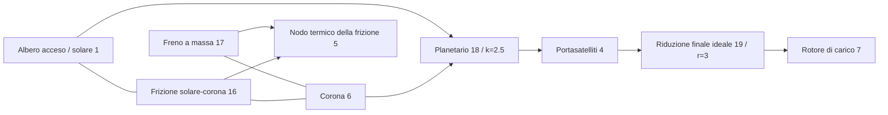

# Ingranaggi ideali accoppiati e vincoli planetari

[English](GEAR_NETWORK.md) · [简体中文](GEAR_NETWORK.zh-CN.md) · [Français](GEAR_NETWORK.fr.md) · [Русский](GEAR_NETWORK.ru.md) · [日本語](GEAR_NETWORK.ja.md) · [한국어](GEAR_NETWORK.ko.md) · [Deutsch](GEAR_NETWORK.de.md) · [Español](GEAR_NETWORK.es.md) · **Italiano** · [Português](GEAR_NETWORK.pt-BR.md)

`ideal_gear` e `planetary_gear` sono vincoli permanenti senza perdite, nella stessa risoluzione di Core di alberi, motori RL, cilindri e frizioni comandate. JSON, CLI/MCP e l'asset portabile v10 portano le stesse definizioni. I [riferimenti a carico costante](IDEAL_GEARS.it.md) indipendenti restano oracoli di verifica. Tutti i parametri di ricerca attuali sono `unverified`.

## Topologia e segni

`ComponentDefinition.IdealGear(id, a, b, ratio)` collega nodi rotazionali distinti e richiede un rapporto con segno finito e non nullo. `ComponentDefinition.PlanetaryGear(id, sun, ring, carrier, ringToSunTeethRatio)` richiede tre nodi rotazionali distinti e un rapporto dei denti corona/solare finito e maggiore di uno. JSON usa `node_a`, `node_b`, `node_c` per solare, corona e portasatelliti; `node_c` vale solo per il planetario. Ogni rotore collegato conserva la sua inerzia positiva esplicita. La massa non si deduce da una porta di ingranaggio mancante; usa un freno a massa esplicito quando un membro planetario deve essere tenuto.

```text
Ideal pair: omega_A - r omega_B = 0
Reactions on rotors: [lambda, -r lambda]

Planetary: omega_S + k omega_R - (1+k) omega_C = 0
Reactions on rotors: [lambda, k lambda, -(1+k) lambda]
```

Queste relazioni danno potenza di reazione combinata nulla. Inerzia di ingranamento, cedevolezza, gioco, perdite e calore sono assenti. Aggiungi in modo esplicito alberi elastici, inerzie collegate e frizioni. Il rapporto dei denti non stabilisce geometria, resistenza, lubrificazione o calibrazione dei denti. Segni e fonti del riferimento fisico sono registrati in [IDEAL_GEARS.it.md](IDEAL_GEARS.it.md).

Record di componente di esempio:

```json
{"id":18,"kind":"planetary_gear","node_a":1,"node_b":6,"node_c":4,"parameters":{"ratio":2.5}}
{"id":19,"kind":"ideal_gear","node_a":4,"node_b":7,"parameters":{"ratio":3}}
```

Gli ingranaggi non hanno input di controllo. Le frizioni scelgono un percorso di potenza vincolando o rilasciando altri gradi di libertà; cambiare un rapporto di ingranaggio a runtime non è un'operazione di input.

## Condizioni iniziali e rango dei vincoli

Le velocità iniziali devono soddisfare tutte le relazioni permanenti entro l'arrotondamento relativo binary64. Le righe sono divise per il loro coefficiente più grande; il limite iniziale è `64 epsilon` volte la somma dei termini di velocità normalizzati in valore assoluto, senza banda morta assoluta alle basse velocità. Uno stato iniziale incompatibile restituisce una diagnostica `Connection` su `initial_speed`. Non c'è un impulso di sincronizzazione finito e non si scarta energia cinetica iniziale.

Gli angoli iniziali dei rotori definiscono la fase relativa dell'ingranaggio. I loro offset non devono essere zero; il vincolo conserva quella fase iniziale. `constraint_error` riporta lo scostamento da essa. Il modello non deduce l'indicizzazione dei denti e non applica una correzione di posizione ai dati dell'utente.

I vincoli permanenti devono essere indipendenti. Cicli di ingranaggi duplicati o dipendenti sono rifiutati in compilazione con `Solver / gear.constraints`; rimuovi le righe dipendenti o correggi il percorso di potenza. Un ciclo a rango pieno può vincolare ogni rotore alla quiete. Una frizione il cui slittamento è già del tutto vincolato da ingranaggi permanenti è rifiutata con `Solver / clutch.coupling`, perché la sua reazione indipendente non è definita. I cicli di *frizione* ridondanti conservano il comportamento separato a insieme attivo limitato, documentato in [CLUTCH_NETWORK.it.md](CLUTCH_NETWORK.it.md).

## Integrazione accoppiata

Sia `D = I - h A/2` la matrice elettromeccanica al punto medio esistente, e `C` le righe di vincolo normalizzate che agiscono sulle velocità dei rotori. Per il punto medio non vincolato `y`, costruisci la risposta vincolata senza rigidezza di penalità:

```text
R = D^-1 (h/2 M^-1 C^T)
G = C R
G lambda = -C y
x_mid = y + R lambda
x_next = 2 x_mid - x_old
```

`M^-1` applica le inerzie dei rotori collegati; la risposta include l'accoppiamento esistente di albero, angolo e motore attraverso `D`. Le risposte di coppia del cilindro e della frizione usano la stessa proiezione. L'iterazione non lineare del lavoro di pressione e le reazioni di frizione limitate evolvono quindi dentro i vincoli permanenti. I contributi di reazione della risoluzione libera, delle forze finali del cilindro e delle forze finali della frizione si accumulano in modo coerente per ottenere la coppia media di ogni ingranaggio.

La fattorizzazione sull'intero tick e le risposte sono dati compilati immutabili. Quando una cattura o un'inversione di frizione suddivide un tick, quella simulazione possiede i fattori a intervallo variabile, le risposte di proiezione e i buffer dei moltiplicatori. Nessuno spazio di lavoro mutabile della risoluzione è condiviso fra simulazioni. Compilazione e costruzione allocano array densi limitati; i passi riusciti e gli snapshot nel buffer del chiamante non allocano memoria gestita, intervalli interni di cattura della frizione compresi.

Le reazioni degli ingranaggi non producono calore fisico né lavoro di sorgente. Le perdite della frizione continuano a entrare nel nodo termico specificato o nel registro esterno del calore. Energia totale, inventari di gas e chimici e lavoro di pressione del motore conservano la contabilità esistente. Il vincolo ideale non aggiunge un nuovo ordine di convergenza del passo: il sistema lineare al punto medio è del secondo ordine; restano i limiti termici e ibridi dei solver esistenti.

## Contratto osservabile e transazionale

| Campo | Unità | Significato |
|---|---|---|
| `slip_speed` | rad/s | Residuo attuale non normalizzato di velocità della coppia o di Willis |
| `constraint_error` | rad | Relazione angolare attuale non normalizzata, meno il suo valore iniziale |
| `torque` | Nm | Reazione media sull'ultimo tick completo in A/solare |
| `torque_at_b` | Nm | Reazione media sull'ultimo tick completo in B/corona |
| `torque_at_c` | Nm | Reazione media sull'ultimo tick completo sul portasatelliti; solo planetario |

Le reazioni medie iniziali sono zero, prima che un intervallo sia stato risolto. I cambi di input al confine non riscrivono le uscite del tick precedente. Con eventi interni di frizione, le medie sommano gli impulsi di reazione accettati su tutti gli intervalli e dividono per la durata del tick esterno intero. La storia delle reazioni è copiata, sottoposta a hash e riportata indietro con tutto l'altro stato.

Il tempo esterno resta in nanosecondi interi limitati. Le chiamate su più tick fallite o annullate non confermano né un'uscita di reazione parziale né calore, gas, fase, input o storia di registro interni accettati. I fork possiedono stato e fattori variabili indipendenti. I modelli con ingranaggi aggiungono il tag di impronta 9; i modelli senza ingranaggi conservano impronte e hash di replay precedenti. La contabilità conservativa della capacità di stato include una voce di storia della reazione media per ogni vincolo ideale.

## Limiti numerici e recupero

La fattorizzazione dei vincoli usa la soglia di pivot LU scalata esistente di `64 epsilon`. La mobilità della frizione dopo la proiezione permanente deve superare `64 epsilon` volte la sua mobilità libera. Scale di inerzia e rapporto mal condizionate possono quindi rifiutare anche dati finiti. In uno stato accettato, ogni residuo di velocità normalizzato deve essere al più `2e-12 + 512 epsilon * sum(abs(speed terms))`; l'errore di fase normalizzato deve essere al più `2e-10 + 1024 epsilon * (abs(initial phase) + sum(abs(angle terms)))`. Uscite grezze e storia delle reazioni devono restare finite. Queste sono tolleranze del solver, non calibrazione né garanzie universali di errore relativo. Non si rivendica accuratezza ibrida per tick grandi.

Un fallimento a runtime lascia il batch invariato. Controlla topologia e rango, e le scale di inerzia e rapporto. Riduci il tick e ricrea la sessione per i limiti di risoluzione del lavoro di pressione, delle valvole, della combustione o degli eventi di frizione. Tick più brevi non curano vincoli permanenti dipendenti. I limiti su iterazioni non lineari, iterazioni di vincolo ed eventi interni restano individuabili nelle capacità.

## Laboratorio della trasmissione planetaria accesa

Il nuovo [laboratorio](../assets/labs/fired-planetary.power.json) collega un cilindro acceso sintetico al solare. Un freno della corona seleziona la riduzione; una frizione solare/corona seleziona la presa diretta. Il portasatelliti comanda un carico inerziale separato attraverso una riduzione finale di rapporto tre.



Il freno iniziale tiene la corona, con rapporto albero/carico 10.5. A 200.05 ms il freno si rilascia e la frizione solare/corona si innesta; dopo la cattura, il rapporto albero/carico è tre. A 450.05 ms la frizione si rilascia e il freno della corona si reinnesta. Il carico cambia a 600.05 ms, e l'esperimento termina a 800 ms. Queste programmazioni su tick esatti forniscono un passaggio in salita e uno in discesa; non implementano una TCU né un attuatore idraulico.

Tutti gli **84 limiti** coincidono fra batch alternativi, riproduzione portabile e server MCP reale. Il report finale registra circa **-56.83 J** di lavoro netto delle sorgenti esterne, **254.52 J** di calore della frizione solare/corona e **156.32 J** di calore del freno. Il nodo termico raggiunge **302.0542 K**; le velocità di albero e carico sono circa **76.81549** e **7.315761 rad/s**, con la corona tenuta. Il residuo energetico finale è circa **2.51e-10 J**. L'impronta è `6703f00c995e6b62`; l'hash di stato finale è `b328de221532fbae`. Sono risultati numerici sintetici, non prestazioni di trasmissione misurate.

Richiedi `get_example_model` con `name: "fired-planetary"`, oppure esegui:

```sh
dotnet src/Power.Cli/bin/Release/net10.0/Power.Cli.dll assets/labs/fired-planetary.power.json --output artifacts/reports/fired-planetary.json
```

La build esporta `FiredPlanetary.powerasset`. Studio mostra collegamenti schematici del planetario a tre porte e della riduzione finale, insieme alle viste di rotore e di fase della frizione. I test di importazione, replay del cambio, reset e pulizia sono preparati; l'esecuzione reale di Editor, Play e IL2CPP resta in sospeso.

## Evidenze e ambito restante

I test confrontano moto del grafo, spostamento e ogni reazione con i riferimenti esatti indipendenti di coppia e planetario. Un treno a più stadi controlla l'inerzia riflessa e l'ordinamento per ID stabile; i modelli motore/termico e di cilindro reagente coincidono con modelli a inerzia equivalente. Un oscillatore vincolato mostra convergenza del secondo ordine ed energia conservata. Il cambio a frizione del planetario coincide con il tempo di cattura analitico, la velocità finale in presa diretta e il calore di attrito, poi torna in riduzione. Annullamento, sovraccarico dopo un prefisso di cambio accettato, batch, fork e cattura senza allocazioni conservano il contratto transazionale.

I test dell'asset v10 coprono la topologia a tre porte, record malformati, mancanti o duplicati, porte non valide e declassamenti contraffatti. Un fixture autentico v7 della frizione accesa conserva impronta e replay aggiornato; i fixture più vecchi restano supportati. I test JSON rigorosi e quelli dell'agente coprono errori di rango e di velocità iniziale, atomicità di revisione e input, e la distinzione fra esecuzione riuscita e superamento dei KPI. Vedi la [validazione](VALIDATION.it.md) e il [formato degli asset](ASSET_FORMAT.it.md).

Questo è un percorso di potenza di trasmissione ideale accoppiato. Il [convertitore mappato](CONVERTER_NETWORK.it.md) lo estende ora con il trasferimento di fluido e un blocco separato. Topologia DCT/AT completa, dinamica idraulica di pompa e stantuffo, coordinamento di coppia ECU/TCU, dosatura del carburante e accensione del motore, aspirazione e scarico dettagliati, perdite, comportamento di guasto, calibrazione misurata del veicolo ed evidenza reale del Player Unity restano parte dell'obiettivo completo di Power!.
