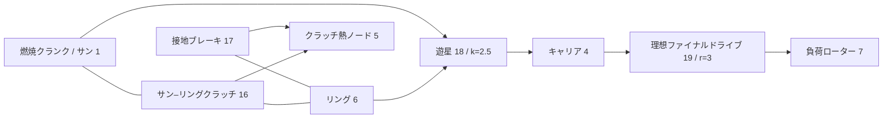

# 連成した理想歯車と遊星拘束

[English](GEAR_NETWORK.md) · [简体中文](GEAR_NETWORK.zh-CN.md) · [Français](GEAR_NETWORK.fr.md) · [Русский](GEAR_NETWORK.ru.md) · **日本語** · [한국어](GEAR_NETWORK.ko.md) · [Deutsch](GEAR_NETWORK.de.md) · [Español](GEAR_NETWORK.es.md) · [Italiano](GEAR_NETWORK.it.md) · [Português](GEAR_NETWORK.pt-BR.md)

`ideal_gear` と `planetary_gear` は、シャフト、RL モーター、気筒、制御されたクラッチと同じ Core 求解の中にある、恒久で無損失の拘束です。JSON、CLI/MCP、移植可能アセット v10 は同じ定義を運びます。独立した[一定負荷の参照](IDEAL_GEARS.ja.md)は、検証のオラクルのままです。現在の研究パラメーターはすべて `unverified` です。

## トポロジーと符号

`ComponentDefinition.IdealGear(id, a, b, ratio)` は別々の回転ノードを結び、有限で非零の符号付き比を要求します。`ComponentDefinition.PlanetaryGear(id, sun, ring, carrier, ringToSunTeethRatio)` は 3 つの別々の回転ノードと、1 より大きい有限なリング/サン歯数比を要求します。JSON はサン、リング、キャリアに `node_a`、`node_b`、`node_c` を使います。`node_c` は遊星にだけ適用されます。接続されたローターはすべて、明示的な正の慣性を保ちます。欠けた歯車ポートから接地は推定しません。遊星部材を保持する必要があるときは、明示的な接地ブレーキを使ってください。

```text
Ideal pair: omega_A - r omega_B = 0
Reactions on rotors: [lambda, -r lambda]

Planetary: omega_S + k omega_R - (1+k) omega_C = 0
Reactions on rotors: [lambda, k lambda, -(1+k) lambda]
```

これらの関係は、合わせた反力動力を零にします。噛み合い慣性、コンプライアンス、バックラッシュ、損失、熱はありません。弾性シャフト、取り付け慣性、クラッチは明示的に加えてください。歯数比は、歯の幾何、強度、潤滑、キャリブレーションを確立しません。符号と物理的な参考文献は [IDEAL_GEARS.ja.md](IDEAL_GEARS.ja.md) に記録されています。

コンポーネントレコードの例:

```json
{"id":18,"kind":"planetary_gear","node_a":1,"node_b":6,"node_c":4,"parameters":{"ratio":2.5}}
{"id":19,"kind":"ideal_gear","node_a":4,"node_b":7,"parameters":{"ratio":3}}
```

歯車に制御入力はありません。クラッチは、他の自由度を拘束するか解放することで動力経路を選びます。実行時に歯車比を変えることは、入力操作ではありません。

## 初期条件と拘束の階数

初期速度は、相対的な binary64 の丸めの範囲で、すべての恒久関係を満たさなければなりません。行は最大の係数で割られます。初期の限界は、正規化された速度項の絶対値の和の `64 epsilon` 倍で、絶対的な低速不感帯はありません。適合しない初期状態は、`initial_speed` に対する `Connection` 診断を返します。有限の同期力積はなく、捨てられる初期運動エネルギーもありません。

初期のローター角度は、歯車の相対位相を定義します。そのオフセットは零である必要はありません。拘束はその初期位相を保ちます。`constraint_error` は、そこからのずれを報告します。モデルは歯の割出しを推定せず、ユーザーデータへ位置補正を適用しません。

恒久拘束は独立でなければなりません。重複または従属の歯車ループは、コンパイル時に `Solver / gear.constraints` で拒否されます。従属の行を除くか、動力経路を直してください。フルランクのループは、すべてのローターを静止へ拘束し得ます。滑りが恒久歯車によってすでに完全に拘束されているクラッチは、`Solver / clutch.coupling` で拒否されます。独立した反力が未定義だからです。冗長な*クラッチ*ループは、[CLUTCH_NETWORK.ja.md](CLUTCH_NETWORK.ja.md)に記録された、別の有界アクティブセットの挙動を保ちます。

## 連成積分

`D = I - h A/2` を既存の電気機械の中点行列、`C` をローター速度に作用する正規化拘束行とします。拘束のない中点 `y` に対し、ペナルティ剛性なしで拘束応答を構成します。

```text
R = D^-1 (h/2 M^-1 C^T)
G = C R
G lambda = -C y
x_mid = y + R lambda
x_next = 2 x_mid - x_old
```

`M^-1` は取り付けられたローター慣性を適用します。応答は、`D` を通じて既存のシャフト、角度、モーターの連成を含みます。気筒トルクの応答とクラッチトルクの応答は、同じ射影を使います。したがって、非線形の圧力仕事の反復と有界なクラッチ反力は、恒久拘束の中で発展します。自由求解、最終の気筒力、最終のクラッチ力からの反力寄与は、各歯車の平均トルクを得るために一貫して累積されます。

フルティックの因数分解と応答は、不変のコンパイル済みデータです。クラッチの捕捉/反転がティックを分割するとき、そのシミュレーションが可変区間の因子、射影応答、乗数バッファを所有します。可変の求解作業領域は、シミュレーション間で共有されません。コンパイルと構築は有界な密配列を割り当てます。成功したステッピングと、呼び出し側バッファのスナップショットは、内部のクラッチ捕捉区間を含めて、マネージドメモリを割り当てません。

歯車反力は、物理的な熱も源仕事も行いません。クラッチ損失は、指定された熱ノードまたは外部熱台帳へ入り続けます。全エネルギー、ガス/化学の在庫、エンジン圧力仕事は、既存の会計を保ちます。理想拘束は、新しいタイムステップの収束次数を加えません。線形の中点系は二次です。既存ソルバーの熱およびハイブリッドの限界は、引き続き適用されます。

## 観測とトランザクションの契約

| フィールド | 単位 | 意味 |
|---|---|---|
| `slip_speed` | rad/s | 現在の、非正規化のペア/Willis 速度残差 |
| `constraint_error` | rad | 現在の、非正規化の角度関係からその初期値を引いたもの |
| `torque` | Nm | 最後の完全なティックにおける、A/サンへの平均反力 |
| `torque_at_b` | Nm | 最後の完全なティックにおける、B/リングへの平均反力 |
| `torque_at_c` | Nm | 最後の完全なティックにおける、キャリアへの平均反力。遊星のみ |

初期の平均反力は、区間が解かれる前は零です。境界の入力変更は、先行するティックの出力を書き換えません。内部クラッチイベントがあるとき、平均は受理された反力力積をすべての区間で合計し、整数の外側ティックの時間で割ります。反力履歴は、他のすべての状態とともにコピー、ハッシュ、ロールバックされます。

外部時刻は有界な整数ナノ秒のままです。失敗またはキャンセルされた複数ティックの呼び出しは、部分的な反力出力も、受理された内部の熱、ガス、位相、入力、台帳の履歴も確定しません。分岐は独立した状態と可変因子を所有します。歯車モデルはフィンガープリントタグ 9 を加えます。歯車のないモデルは、以前のフィンガープリントとリプレイハッシュを保ちます。保存的な状態容量の会計は、理想拘束ごとに 1 つの平均反力履歴エントリを含みます。

## 数値限界と回復

拘束の因数分解は、既存のスケールされた LU ピボットしきい値 `64 epsilon` を使います。恒久射影のあとのクラッチ可動性は、自由な可動性の `64 epsilon` 倍を超えなければなりません。したがって、慣性/比の尺度が悪条件だと、有限なデータでも拒否され得ます。受理された状態では、各正規化速度残差はたかだか `2e-12 + 512 epsilon * sum(abs(speed terms))` でなければなりません。正規化された位相誤差はたかだか `2e-10 + 1024 epsilon * (abs(initial phase) + sum(abs(angle terms)))` でなければなりません。生の出力と反力履歴は有限のままでなければなりません。これらはソルバー許容差であり、キャリブレーションや、普遍的な相対誤差の保証ではありません。大きなティックのハイブリッド精度は主張しません。

実行時の失敗はバッチを変えません。トポロジー/階数と慣性/比の尺度を調べてください。圧力仕事、バルブ、燃焼、またはクラッチイベントの分解能の限界に対しては、ティックを減らし、セッションを作り直してください。より短いティックは、従属の恒久拘束を治しません。非線形反復、拘束反復、内部イベントの限界は、capabilities から発見できます。

## 燃焼遊星トランスミッションのラボラトリー

新しい[ラボラトリー](../assets/labs/fired-planetary.power.json)は、合成の燃焼気筒をサンへつなぎます。リングブレーキは減速を選び、サン/リングクラッチは直結を選びます。キャリアは、比 3 のファイナルドライブを通じて、別の慣性負荷を駆動します。



初期のブレーキはリングを保持し、クランク/負荷の比は 10.5 です。200.05 ms でブレーキが解放され、サン/リングクラッチが係合します。捕捉のあと、クランク/負荷の比は 3 です。450.05 ms でクラッチが解放され、リングブレーキが再係合します。負荷は 600.05 ms で変わり、実験は 800 ms で終わります。これらの正確なティックのスケジュールは昇段と降段を提供します。TCU や油圧アクチュエーターは実装しません。

**84 境界**はすべて、別のバッチ、移植可能な再生、実際の MCP サーバーの間で一致します。最終レポートは、正味の外部源仕事約 **-56.83 J**、サン/リングクラッチ熱 **254.52 J**、ブレーキ熱 **156.32 J** を記録します。熱ノードは **302.0542 K** に達します。クランクと負荷の速度は約 **76.81549** と **7.315761 rad/s** で、リングは保持されています。最終エネルギー残差は約 **2.51e-10 J** です。フィンガープリントは `6703f00c995e6b62`、最終状態ハッシュは `b328de221532fbae` です。これらは合成の数値結果であり、実測のトランスミッション性能ではありません。

`name: "fired-planetary"` で `get_example_model` を要求するか、次を実行します。

```sh
dotnet src/Power.Cli/bin/Release/net10.0/Power.Cli.dll assets/labs/fired-planetary.power.json --output artifacts/reports/fired-planetary.json
```

ビルドは `FiredPlanetary.powerasset` をエクスポートします。Studio は、模式的な 3 ポートの遊星とファイナルドライブの接続を、ローターとクラッチ位相の表示とともに示します。インポート、変速リプレイ、リセット、クリーンアップのテストは用意されています。実際のエディター/Play/IL2CPP の実行は未着手です。

## エビデンスと残る範囲

テストは、グラフの運動、変位、各反力を、独立した厳密なペア/遊星の参照と比べます。多段トレインは換算慣性と安定 ID の順序を検査します。モーター/熱および反応する気筒のモデルは、等価慣性のモデルと一致します。拘束された振動子は、二次の収束と保存されるエネルギーを示します。遊星クラッチの変速は、解析的な捕捉時刻、最終の直結速度、摩擦熱と一致し、その後減速へ戻ります。キャンセル、受理された変速の前段のあとの過負荷、バッチ化、分岐、割り当てなしの捕捉は、トランザクション契約を保ちます。

アセット v10 のテストは、3 ポートトポロジー、不正/欠落/重複レコード、不正なポート、偽造されたダウングレードを扱います。真正な v7 の燃焼クラッチフィクスチャは、フィンガープリントとアップグレードされたリプレイを保ちます。より古いフィクスチャもサポートされたままです。厳密な JSON とエージェントのテストは、階数/初期速度のエラー、リビジョン/入力の原子性、成功した実行と KPI 合格の区別を扱います。[検証記録](VALIDATION.ja.md)と[アセット形式](ASSET_FORMAT.ja.md)を参照してください。

これは連成した理想トランスミッションの動力経路です。[マップ化されたコンバーター](CONVERTER_NETWORK.ja.md)は、流体の伝達と別のロックアップでこれを拡張するようになりました。完全な DCT/AT トポロジー、ポンプ/ピストンの油圧動特性、ECU/TCU のトルク協調、エンジンの燃料計量と点火、詳細な吸排気、損失、故障挙動、実測の車両キャリブレーション、実際の Unity Player のエビデンスは、Power! の全体目標の一部のままです。
