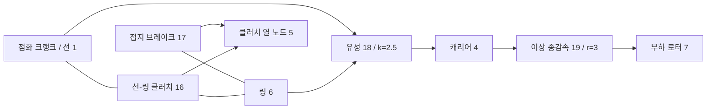

# 결합 이상 기어와 유성 제약

[English](GEAR_NETWORK.md) · [简体中文](GEAR_NETWORK.zh-CN.md) · [Français](GEAR_NETWORK.fr.md) · [Русский](GEAR_NETWORK.ru.md) · [日本語](GEAR_NETWORK.ja.md) · **한국어** · [Deutsch](GEAR_NETWORK.de.md) · [Español](GEAR_NETWORK.es.md) · [Italiano](GEAR_NETWORK.it.md) · [Português](GEAR_NETWORK.pt-BR.md)

`ideal_gear`와 `planetary_gear`는 축, RL 모터, 실린더, 제어되는 클러치와 같은 Core 풀이 안의 영구 무손실 제약입니다. JSON, CLI/MCP, 이식 가능한 자산 v10은 같은 정의를 담습니다. 독립적인 [일정 부하 기준](IDEAL_GEARS.ko.md)은 검증 오라클로 남습니다. 현재의 연구 매개변수는 모두 `unverified`입니다.

## 토폴로지와 부호

`ComponentDefinition.IdealGear(id, a, b, ratio)`는 서로 다른 회전 노드를 잇고, 유한하고 0이 아닌 부호 있는 비가 필요합니다. `ComponentDefinition.PlanetaryGear(id, sun, ring, carrier, ringToSunTeethRatio)`는 서로 다른 회전 노드 세 개와, 1보다 큰 유한한 링/선 잇수 비가 필요합니다. JSON은 선, 링, 캐리어에 `node_a`, `node_b`, `node_c`를 씁니다. `node_c`는 유성에만 적용됩니다. 부착된 모든 로터는 명시적인 양의 관성을 유지합니다. 빠진 기어 포트에서 접지를 추론하지 않습니다. 유성 부재를 고정해야 하면 명시적 접지 브레이크를 쓰세요.

```text
Ideal pair: omega_A - r omega_B = 0
Reactions on rotors: [lambda, -r lambda]

Planetary: omega_S + k omega_R - (1+k) omega_C = 0
Reactions on rotors: [lambda, k lambda, -(1+k) lambda]
```

이 관계는 합산 반력 동력을 0으로 둡니다. 물림 관성, 컴플라이언스, 백래시, 손실, 열은 없습니다. 탄성 축, 부착 관성, 클러치는 명시적으로 추가하세요. 잇수 비는 이 형상, 강도, 윤활, 교정을 정하지 않습니다. 부호와 물리 참고 출처는 [IDEAL_GEARS.ko.md](IDEAL_GEARS.ko.md)에 기록되어 있습니다.

컴포넌트 레코드 예:

```json
{"id":18,"kind":"planetary_gear","node_a":1,"node_b":6,"node_c":4,"parameters":{"ratio":2.5}}
{"id":19,"kind":"ideal_gear","node_a":4,"node_b":7,"parameters":{"ratio":3}}
```

기어에는 제어 입력이 없습니다. 클러치는 다른 자유도를 구속하거나 풀어 동력 경로를 고릅니다. 실행 중에 기어 비를 바꾸는 것은 입력 연산이 아닙니다.

## 초기 조건과 제약 랭크

초기 속도는 상대 binary64 반올림 안에서 모든 영구 관계를 만족해야 합니다. 행은 가장 큰 계수로 나눕니다. 초기 한계는 정규화된 속도 항의 절댓값 합에 `64 epsilon`을 곱한 값이며, 절대 저속 데드밴드는 없습니다. 호환되지 않는 초기 상태는 `initial_speed`에 대한 `Connection` 진단을 반환합니다. 유한한 동기화 임펄스는 없고, 버려지는 초기 운동 에너지도 없습니다.

초기 로터 각이 기어의 상대 위상을 정의합니다. 그 오프셋이 0일 필요는 없습니다. 제약은 그 초기 위상을 보존합니다. `constraint_error`는 그곳에서 벗어난 양을 보고합니다. 모델은 이 인덱싱을 추론하지 않고, 사용자 데이터에 위치 보정을 적용하지도 않습니다.

영구 제약은 독립이어야 합니다. 중복되거나 종속된 기어 루프는 컴파일 때 `Solver / gear.constraints`로 거부됩니다. 종속 행을 제거하거나 동력 경로를 고치세요. 완전 랭크 루프는 모든 로터를 정지 상태로 제약할 수 있습니다. 슬립이 이미 영구 기어로 완전히 제약된 클러치는 독립 반력이 정의되지 않으므로 `Solver / clutch.coupling`으로 거부됩니다. 중복된 *클러치* 루프는 [CLUTCH_NETWORK.ko.md](CLUTCH_NETWORK.ko.md)에 적힌 별도의 유계 활성 집합 동작을 유지합니다.

## 결합 적분

`D = I - h A/2`를 기존의 전기기계 중점 행렬로, `C`를 로터 속도에 작용하는 정규화된 제약 행으로 둡니다. 제약되지 않은 중점 `y`에 대해, 페널티 강성 없이 제약된 응답을 구성합니다.

```text
R = D^-1 (h/2 M^-1 C^T)
G = C R
G lambda = -C y
x_mid = y + R lambda
x_next = 2 x_mid - x_old
```

`M^-1`은 부착된 로터 관성을 적용합니다. 응답에는 `D`를 통한 기존의 축, 각, 모터 결합이 포함됩니다. 실린더 토크 응답과 클러치 토크 응답은 같은 사영을 씁니다. 따라서 비선형 압력 일 반복과 유계 클러치 반력은 영구 제약 안에서 진화합니다. 자유 풀이, 최종 실린더 힘, 최종 클러치 힘에서 온 반력 기여는 일관되게 누적되어 각 기어의 평균 토크를 얻습니다.

전체 틱의 인수분해와 응답은 불변인 컴파일 데이터입니다. 클러치 포획/반전이 틱을 나누면, 그 시뮬레이션이 가변 구간 인자, 사영 응답, 승수 버퍼를 소유합니다. 시뮬레이션 사이에 공유되는 가변 풀이 작업 공간은 없습니다. 컴파일과 생성은 유계 밀집 배열을 할당합니다. 성공한 진행과 호출자 버퍼 스냅샷은, 내부 클러치 포획 구간을 포함해 관리형 메모리를 할당하지 않습니다.

기어 반력은 물리적 열이나 소스 일을 하지 않습니다. 클러치 손실은 계속 지정된 열 노드나 외부 열 장부에 들어갑니다. 총 에너지, 가스/화학 재고, 엔진 압력 일은 기존 회계를 유지합니다. 이상 제약은 새로운 시간 간격 수렴 차수를 더하지 않습니다. 선형 중점 시스템은 2차이고, 기존 솔버의 열 및 하이브리드 한계는 그대로 적용됩니다.

## 관측과 트랜잭션 계약

| 필드 | 단위 | 의미 |
|---|---|---|
| `slip_speed` | rad/s | 현재의 정규화되지 않은 쌍/윌리스 속도 잔차 |
| `constraint_error` | rad | 현재의 정규화되지 않은 각 관계에서 그 초기값을 뺀 값 |
| `torque` | Nm | 마지막으로 완료된 틱에서 A/선에 작용한 평균 반력 |
| `torque_at_b` | Nm | 마지막으로 완료된 틱에서 B/링에 작용한 평균 반력 |
| `torque_at_c` | Nm | 마지막으로 완료된 틱에서 캐리어에 작용한 평균 반력. 유성만 |

초기 평균 반력은, 구간이 풀리기 전에 0입니다. 경계 입력 변경은 앞선 틱의 출력을 다시 쓰지 않습니다. 내부 클러치 이벤트가 있으면, 평균은 모든 구간에서 수용된 반력 임펄스를 합한 뒤 정수 외부 틱의 지속 시간으로 나눕니다. 반력 이력은 다른 모든 상태와 함께 복사되고, 해시되고, 롤백됩니다.

외부 시간은 유계 정수 나노초로 남습니다. 실패하거나 취소된 다중 틱 호출은 부분 반력 출력도, 수용된 내부 열, 가스, 단계, 입력, 장부 이력도 커밋하지 않습니다. 분기는 독립된 상태와 가변 인자를 소유합니다. 기어 모델은 지문 태그 9를 더합니다. 기어가 없는 모델은 이전 지문과 리플레이 해시를 유지합니다. 보수적인 상태 용량 회계에는 이상 제약마다 평균 반력 이력 항목이 하나 포함됩니다.

## 수치 한계와 복구

제약 인수분해는 기존의 스케일된 LU 피벗 문턱 `64 epsilon`을 씁니다. 영구 사영 뒤의 클러치 이동도는 자유 이동도의 `64 epsilon` 배를 넘어야 합니다. 따라서 관성/변속비 척도의 조건이 나쁘면 유한한 데이터도 거부될 수 있습니다. 수용된 상태에서 각 정규화 속도 잔차는 최대 `2e-12 + 512 epsilon * sum(abs(speed terms))`입니다. 정규화 위상 오차는 최대 `2e-10 + 1024 epsilon * (abs(initial phase) + sum(abs(angle terms)))`입니다. 원시 출력과 반력 이력은 유한해야 합니다. 이것은 솔버 허용 오차이지, 교정이나 보편적인 상대 오차 보장이 아닙니다. 큰 틱의 하이브리드 정확도는 주장하지 않습니다.

실행 중 실패는 배치를 바꾸지 않은 채로 둡니다. 토폴로지/랭크와 관성/변속비 척도를 검사하세요. 압력 일, 밸브, 연소, 클러치 이벤트 해상도 한계에는 틱을 줄이고 세션을 다시 만드세요. 더 짧은 틱이 종속된 영구 제약을 고치지는 않습니다. 비선형 반복, 제약 반복, 내부 이벤트의 한계는 capabilities에서 찾을 수 있습니다.

## 점화 유성 변속기 실험실

새 [실험실](../assets/labs/fired-planetary.power.json)은 합성 점화 실린더를 선에 연결합니다. 링 브레이크는 감속을 고르고, 선/링 클러치는 직결을 고릅니다. 캐리어는 비 3의 종감속을 통해 별도의 관성 부하를 구동합니다.



초기 브레이크가 링을 고정하면 크랭크/부하 비는 10.5입니다. 200.05 ms에 브레이크가 풀리고 선/링 클러치가 체결됩니다. 포획 뒤 크랭크/부하 비는 3입니다. 450.05 ms에 클러치가 풀리고 링 브레이크가 다시 체결됩니다. 부하는 600.05 ms에 바뀌고, 실험은 800 ms에 끝납니다. 이 정확한 틱 스케줄은 상단 변속과 하단 변속을 제공합니다. TCU나 유압 액추에이터를 구현하지는 않습니다.

대체 배치, 이식 가능한 재생, 실제 MCP 서버 사이에서 모든 **84개 경계**가 일치합니다. 최종 보고서는 순 외부 소스 일 약 **-56.83 J**, 선/링 클러치 열 **254.52 J**, 브레이크 열 **156.32 J**를 기록합니다. 열 노드는 **302.0542 K**에 도달합니다. 크랭크와 부하 속도는 약 **76.81549**와 **7.315761 rad/s**이고 링은 고정되어 있습니다. 최종 에너지 잔차는 약 **2.51e-10 J**입니다. 지문은 `6703f00c995e6b62`이고 최종 상태 해시는 `b328de221532fbae`입니다. 이것은 합성 수치 결과이지, 측정된 변속기 성능이 아닙니다.

`name: "fired-planetary"`로 `get_example_model`을 요청하거나 다음을 실행하세요.

```sh
dotnet src/Power.Cli/bin/Release/net10.0/Power.Cli.dll assets/labs/fired-planetary.power.json --output artifacts/reports/fired-planetary.json
```

빌드는 `FiredPlanetary.powerasset`을 내보냅니다. Studio는 개략적인 3포트 유성과 종감속 연결을 로터 및 클러치 단계 보기와 함께 보여 줍니다. 가져오기, 변속 리플레이, 재설정, 정리 검사가 준비되어 있습니다. 실제 편집기/Play/IL2CPP 실행은 아직 남아 있습니다.

## 증거와 남은 범위

검사는 그래프의 운동, 변위, 각 반력을 독립적인 정확한 쌍/유성 기준과 비교합니다. 다단 트레인은 반사 관성과 안정 ID 순서를 확인합니다. 모터/열 모델과 반응 실린더 모델은 등가 관성 모델과 일치합니다. 제약된 진동자는 2차 수렴과 보존된 에너지를 보여 줍니다. 유성 클러치 변속은 해석적 포획 시간, 최종 직결 속도, 마찰열과 일치한 뒤 감속으로 돌아갑니다. 취소, 수용된 변속 접두 뒤의 과부하, 배치, 분기, 무할당 포획은 트랜잭션 계약을 유지합니다.

자산 v10 검사는 3포트 토폴로지, 잘못된/누락/중복 레코드, 유효하지 않은 포트, 위조된 다운그레이드를 다룹니다. 진본 v7 점화 클러치 픽스처는 지문과 업그레이드된 리플레이를 보존합니다. 더 오래된 픽스처도 지원됩니다. 엄격한 JSON과 에이전트 검사는 랭크/초기 속도 오류, 개정/입력 원자성, 그리고 성공한 실행과 KPI 통과의 구분을 다룹니다. [검증 기록](VALIDATION.ko.md)과 [자산 형식](ASSET_FORMAT.ko.md)을 참고하세요.

이것은 결합된 이상 변속기 동력 경로입니다. [맵 기반 컨버터](CONVERTER_NETWORK.ko.md)는 이제 유체 전달과 별도의 록업으로 그것을 확장합니다. 완전한 DCT/AT 토폴로지, 펌프/피스톤 유압 동역학, ECU/TCU 토크 협조, 엔진 연료 계량과 점화, 상세한 흡기/배기, 손실, 결함 거동, 측정된 차량 교정, 실제 Unity Player 증거는 전체 Power! 목표의 일부로 남아 있습니다.
