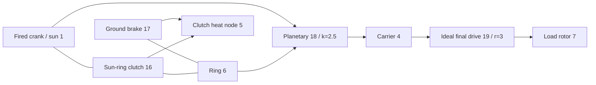

# Coupled ideal gears and planetary constraints

`ideal_gear` and `planetary_gear` are permanent lossless constraints in the same Core
solve as shafts, RL motors, cylinders and controlled clutches. JSON, CLI/MCP and portable
asset v10 carry the same definitions. The independent [constant-load references](IDEAL_GEARS.md)
remain verification oracles. All current research parameters are `unverified`.

## Topology and signs

`ComponentDefinition.IdealGear(id, a, b, ratio)` connects distinct rotational nodes and
requires a finite nonzero signed ratio. `ComponentDefinition.PlanetaryGear(id, sun,
ring, carrier, ringToSunTeethRatio)` requires three distinct rotational nodes and a
finite ring/sun tooth ratio greater than one. JSON uses `node_a`, `node_b`, `node_c` for
sun, ring, carrier; `node_c` applies only to the planetary. Every attached rotor retains
its explicit positive inertia. Ground is not inferred from a missing gear port; use an
explicit ground brake when a planetary member needs to be held.

```text
Ideal pair: omega_A - r omega_B = 0
Reactions on rotors: [lambda, -r lambda]

Planetary: omega_S + k omega_R - (1+k) omega_C = 0
Reactions on rotors: [lambda, k lambda, -(1+k) lambda]
```

These relations give zero combined reaction power. Mesh inertia, compliance, backlash,
losses and heat are absent. Add elastic shafts, attached inertias and clutches explicitly.
The tooth ratio does not establish tooth geometry, strength, lubrication or calibration.
The signs and physical reference sources are recorded in [IDEAL_GEARS.md](IDEAL_GEARS.md).

Example component records:

```json
{"id":18,"kind":"planetary_gear","node_a":1,"node_b":6,"node_c":4,"parameters":{"ratio":2.5}}
{"id":19,"kind":"ideal_gear","node_a":4,"node_b":7,"parameters":{"ratio":3}}
```

Gears have no control input. Clutches choose a power path by constraining or releasing
other degrees of freedom; changing a gear ratio at runtime is not an input operation.

## Initial conditions and constraint rank

Initial speeds must satisfy all permanent relations within relative binary64 rounding.
Rows are divided by their largest coefficient; the initial bound is `64 epsilon` times
the sum of absolute normalized speed terms, with no absolute low-speed deadband.
An incompatible initial state returns a `Connection` diagnostic on `initial_speed`.
There is no finite synchronization impulse and no discarded initial kinetic energy.

Initial rotor angles define the gear's relative phase. Their offsets need not be zero;
the constraint preserves that initial phase. `constraint_error` reports departure from
it. The model does not infer tooth indexing or apply a position correction to user data.

Permanent constraints must be independent. Duplicate or dependent gear loops are rejected
at compilation with `Solver / gear.constraints`; remove dependent rows or correct the
power path. A full-rank loop may constrain every rotor to rest. A clutch whose slip is
already fully constrained by permanent gears is rejected with `Solver / clutch.coupling`,
because its independent reaction is undefined. Redundant *clutch* loops retain the
separate bounded active-set behavior documented in [CLUTCH_NETWORK.md](CLUTCH_NETWORK.md).

## Coupled integration

Let `D = I - h A/2` be the existing electromechanical midpoint matrix, and `C` the
normalized constraint rows acting on rotor velocities. For the unconstrained midpoint
`y`, construct the constrained response without penalty stiffness:

```text
R = D^-1 (h/2 M^-1 C^T)
G = C R
G lambda = -C y
x_mid = y + R lambda
x_next = 2 x_mid - x_old
```

`M^-1` applies the attached rotor inertias; the response includes the existing shaft,
angle and motor coupling through `D`. Cylinder torque responses and clutch torque
responses use the same projection. Nonlinear pressure-work iteration and bounded clutch
reactions therefore evolve within the permanent constraints. Reaction contributions
from the free solve, final cylinder forces and final clutch forces are accumulated
consistently to obtain each gear's mean torque.

The full-tick factorization and responses are immutable compiled data. When a clutch
capture/reversal subdivides a tick, that simulation owns the variable-interval factors,
projection responses and multiplier buffers. No mutable solve workspace is shared across
simulations. Compilation and construction allocate bounded dense arrays; successful
stepping and caller-buffer snapshots allocate no managed memory, including internal
clutch capture intervals.

Gear reactions perform no physical heat or source work. Clutch losses continue to enter
the specified thermal node or external heat ledger. Total energy, gas/chemical inventories
and engine pressure work retain their existing accounting. The ideal constraint adds no
new timestep convergence order: the linear midpoint system is second order; the thermal
and hybrid limits of the existing solvers still apply.

## Observable and transaction contract

| Field | Unit | Meaning |
|---|---|---|
| `slip_speed` | rad/s | Current unnormalized pair/Willis speed residual |
| `constraint_error` | rad | Current unnormalized angle relation minus its initial value |
| `torque` | Nm | Last complete tick's mean reaction on A/sun |
| `torque_at_b` | Nm | Last complete tick's mean reaction on B/ring |
| `torque_at_c` | Nm | Last complete tick's mean reaction on carrier; planetary only |

Initial mean reactions are zero, before an interval has been solved. Boundary input
changes do not rewrite the preceding tick's outputs. With internal clutch events, means
sum accepted reaction impulses over all intervals and divide by the integer outer tick's
duration. Reaction history is copied, hashed and rolled back with all other state.

External time remains bounded integer nanoseconds. Failed/cancelled multi-tick calls
commit neither partial reaction output nor any accepted internal heat, gas, phase,
input or ledger history. Forks own independent state and variable factors. Gear models
add fingerprint tag 9; models without gears retain prior fingerprints and replay hashes.
The conservative state-capacity accounting includes one mean-reaction history entry
per ideal constraint.

## Numerical bounds and recovery

Constraint factorization uses the existing scaled LU pivot threshold of `64 epsilon`.
Clutch mobility after permanent projection must exceed `64 epsilon` times its free
mobility. Ill-conditioned inertia/ratio scales can therefore reject even finite data.
At an accepted state, each normalized speed residual must be at most
`2e-12 + 512 epsilon * sum(abs(speed terms))`; normalized phase error must be at most
`2e-10 + 1024 epsilon * (abs(initial phase) + sum(abs(angle terms)))`. Raw outputs and
reaction history must remain finite. These are solver tolerances, not calibration or
universal relative-error guarantees. No large-tick hybrid accuracy is claimed.

Runtime failure leaves the batch unchanged. Inspect topology/rank and inertia/ratio
scales. Reduce the tick and recreate the session for pressure-work, valve, combustion
or clutch-event resolution limits. Shorter ticks do not cure dependent permanent
constraints. Limits on nonlinear iterations, constraint iterations and internal events
remain discoverable in capabilities.

## Fired planetary transmission laboratory

The new [laboratory](../assets/labs/fired-planetary.power.json) connects a synthetic fired
cylinder to the sun. A ring brake selects reduction; a sun/ring clutch selects direct
drive. The carrier drives a separate inertial load through a ratio-three final drive.



The initial brake holds the ring, giving crank/load ratio 10.5. At 200.05 ms the brake
releases and the sun/ring clutch engages; after capture, crank/load ratio is three.
At 450.05 ms the clutch releases and the ring brake re-engages. The load changes at
600.05 ms, and the experiment ends at 800 ms. These exact-tick schedules provide an
upshift and downshift; they do not implement a TCU or a hydraulic actuator.

All **84 boundaries** match between alternate batches, portable playback and the actual
MCP server. The final report records about **-56.83 J** of net external source work, **254.52 J**
of sun/ring clutch heat and **156.32 J** of brake heat. The heat node reaches **302.0542 K**;
crank and load speeds are about **76.81549** and **7.315761 rad/s**, with a held ring.
Final energy residual is about **2.51e-10 J**. Fingerprint is `6703f00c995e6b62`; final
state hash is `b328de221532fbae`. These are synthetic numerical results, not measured
transmission performance.

Request `get_example_model` with `name: "fired-planetary"`, or run:

```sh
dotnet src/Power.Cli/bin/Release/net10.0/Power.Cli.dll assets/labs/fired-planetary.power.json --output artifacts/reports/fired-planetary.json
```

The build exports `FiredPlanetary.powerasset`. Studio shows schematic three-port
planetary and final-drive connections, alongside rotor and clutch phase views. Import,
shift replay, reset and cleanup tests are prepared; actual Editor/Play/IL2CPP execution
remains pending.

## Evidence and remaining scope

Tests compare graph motion, displacement and each reaction with the independent exact
pair/planetary references. A multi-stage train checks reflected inertia and stable-ID
ordering; motor/thermal and reacting-cylinder models match equivalent-inertia models.
A constrained oscillator demonstrates second-order convergence and conserved energy.
The planetary clutch shift matches analytic capture time, final direct-drive speed and
friction heat, then returns to reduction. Cancellation, overload after an accepted shift
prefix, batching, forks and allocation-free capture preserve the transaction contract.

Asset v10 tests cover three-port topology, malformed/missing/duplicate records, invalid
ports and forged downgrades. A genuine v7 fired-clutch fixture preserves its fingerprint
and upgraded replay; older fixtures remain supported. Strict JSON and agent tests cover
rank/initial-speed errors, revision/input atomicity and the distinction between successful
execution and passing KPIs. See [validation](VALIDATION.md) and [asset format](ASSET_FORMAT.md).

This is a coupled ideal transmission power path. The [mapped converter](CONVERTER_NETWORK.md)
now extends it with fluid transfer and separate lockup. Complete DCT/AT topology, pump/piston hydraulic dynamics, ECU/TCU torque coordination, engine fuel metering and
ignition, detailed intake/exhaust, losses, fault behavior, measured vehicle calibration
and actual Unity Player evidence remain part of the full Power! objective.
