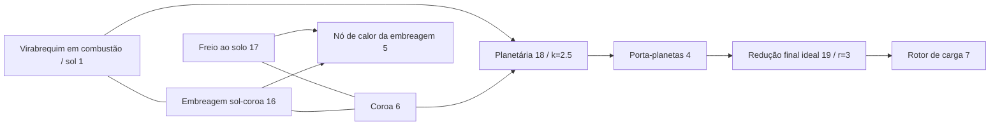

# Engrenagens ideais acopladas e restrições planetárias

[English](GEAR_NETWORK.md) · [简体中文](GEAR_NETWORK.zh-CN.md) · [Français](GEAR_NETWORK.fr.md) · [Русский](GEAR_NETWORK.ru.md) · [日本語](GEAR_NETWORK.ja.md) · [한국어](GEAR_NETWORK.ko.md) · [Deutsch](GEAR_NETWORK.de.md) · [Español](GEAR_NETWORK.es.md) · [Italiano](GEAR_NETWORK.it.md) · **Português**

`ideal_gear` e `planetary_gear` são restrições permanentes sem perdas na mesma solução do Core que eixos, motores RL, cilindros e embreagens controladas. JSON, CLI/MCP e o asset portátil v10 carregam as mesmas definições. As [referências de carga constante](IDEAL_GEARS.pt-BR.md) independentes continuam oráculos de verificação. Todos os parâmetros de pesquisa atuais são `unverified`.

## Topologia e sinais

`ComponentDefinition.IdealGear(id, a, b, ratio)` liga nós rotacionais distintos e exige uma relação finita, diferente de zero e com sinal. `ComponentDefinition.PlanetaryGear(id, sun, ring, carrier, ringToSunTeethRatio)` exige três nós rotacionais distintos e uma relação finita de dentes coroa/sol maior que um. O JSON usa `node_a`, `node_b`, `node_c` para sol, coroa e porta-planetas; `node_c` vale só para a planetária. Cada rotor acoplado conserva a inércia positiva explícita. O solo não é inferido de uma porta de engrenagem ausente; use um freio ao solo explícito quando um membro planetário precisa ser retido.

```text
Ideal pair: omega_A - r omega_B = 0
Reactions on rotors: [lambda, -r lambda]

Planetary: omega_S + k omega_R - (1+k) omega_C = 0
Reactions on rotors: [lambda, k lambda, -(1+k) lambda]
```

Essas relações dão potência de reação combinada zero. Inércia de engrenamento, flexibilidade, folga de engrenamento, perdas e calor estão ausentes. Acrescente de forma explícita eixos elásticos, inércias acopladas e embreagens. A relação de dentes não estabelece geometria de dente, resistência, lubrificação nem calibração. Os sinais e as fontes de referência física estão registrados em [IDEAL_GEARS.pt-BR.md](IDEAL_GEARS.pt-BR.md).

Registros de componente de exemplo:

```json
{"id":18,"kind":"planetary_gear","node_a":1,"node_b":6,"node_c":4,"parameters":{"ratio":2.5}}
{"id":19,"kind":"ideal_gear","node_a":4,"node_b":7,"parameters":{"ratio":3}}
```

Engrenagens não têm entrada de controle. As embreagens escolhem um caminho de potência restringindo ou liberando outros graus de liberdade; mudar uma relação de engrenagem em tempo de execução não é uma operação de entrada.

## Condições iniciais e posto da restrição

As velocidades iniciais precisam satisfazer todas as relações permanentes dentro do arredondamento relativo de binary64. As linhas são divididas pelo maior coeficiente; o limite inicial é `64 epsilon` vezes a soma dos termos de velocidade normalizados em valor absoluto, sem banda morta absoluta de baixa velocidade. Um estado inicial incompatível devolve um diagnóstico `Connection` em `initial_speed`. Não há impulso finito de sincronização nem energia cinética inicial descartada.

Os ângulos iniciais dos rotores definem a fase relativa da engrenagem. Os deslocamentos não precisam ser zero; a restrição preserva essa fase inicial. `constraint_error` informa o afastamento dela. O modelo não infere indexação de dentes nem aplica uma correção de posição aos dados do usuário.

As restrições permanentes precisam ser independentes. Laços de engrenagem duplicados ou dependentes são rejeitados na compilação com `Solver / gear.constraints`; remova linhas dependentes ou corrija o caminho de potência. Um laço de posto completo pode restringir todos os rotores ao repouso. Uma embreagem cujo deslizamento já está totalmente restringido por engrenagens permanentes é rejeitada com `Solver / clutch.coupling`, porque a reação independente dela é indefinida. Laços redundantes de *embreagem* conservam o comportamento separado de conjunto ativo limitado documentado em [CLUTCH_NETWORK.pt-BR.md](CLUTCH_NETWORK.pt-BR.md).

## Integração acoplada

Seja `D = I - h A/2` a matriz de ponto médio eletromecânica existente, e `C` as linhas de restrição normalizadas que atuam nas velocidades dos rotores. Para o ponto médio irrestrito `y`, construa a resposta restringida sem rigidez de penalidade:

```text
R = D^-1 (h/2 M^-1 C^T)
G = C R
G lambda = -C y
x_mid = y + R lambda
x_next = 2 x_mid - x_old
```

`M^-1` aplica as inércias dos rotores acoplados; a resposta inclui o acoplamento existente de eixo, ângulo e motor através de `D`. As respostas de torque do cilindro e as respostas de torque da embreagem usam a mesma projeção. A iteração não linear de trabalho de pressão e as reações limitadas da embreagem evoluem, portanto, dentro das restrições permanentes. As contribuições de reação da solução livre, das forças finais do cilindro e das forças finais da embreagem são acumuladas de forma consistente para obter o torque médio de cada engrenagem.

A fatoração do tick completo e as respostas são dados compilados imutáveis. Quando uma captura/reversão de embreagem subdivide um tick, essa simulação é dona dos fatores de intervalo variável, das respostas de projeção e dos buffers de multiplicadores. Nenhum espaço de trabalho mutável da solução é compartilhado entre simulações. A compilação e a construção alocam arranjos densos limitados; o avanço bem-sucedido e os instantâneos no buffer de quem chama não alocam memória gerenciada, inclusive nos intervalos internos de captura da embreagem.

As reações de engrenagem não realizam calor físico nem trabalho de fonte. As perdas da embreagem continuam entrando no nó térmico especificado ou no livro externo de calor. A energia total, os inventários de gás/químicos e o trabalho de pressão do motor conservam a contabilidade existente. A restrição ideal não acrescenta uma nova ordem de convergência do passo: o sistema linear de ponto médio é de segunda ordem; os limites térmicos e híbridos dos solvers existentes continuam valendo.

## Contrato observável e de transação

| Campo | Unidade | Significado |
|---|---|---|
| `slip_speed` | rad/s | Resíduo atual de velocidade do par/Willis, não normalizado |
| `constraint_error` | rad | Relação angular atual não normalizada menos o valor inicial |
| `torque` | Nm | Reação média do último tick completo em A/sol |
| `torque_at_b` | Nm | Reação média do último tick completo em B/coroa |
| `torque_at_c` | Nm | Reação média do último tick completo no porta-planetas; só planetária |

As reações médias iniciais são zero, antes de um intervalo ter sido resolvido. Mudanças de entrada na fronteira não reescrevem as saídas do tick anterior. Com eventos internos de embreagem, as médias somam os impulsos de reação aceitos em todos os intervalos e dividem pela duração do tick externo inteiro. O histórico de reação é copiado, hasheado e revertido com todo o restante do estado.

O tempo externo continua sendo nanossegundos inteiros limitados. Chamadas de vários ticks que falham ou são canceladas não confirmam saída parcial de reação nem qualquer calor interno, gás, fase, entrada ou histórico de livro aceitos. As ramificações são donas de estado e de fatores variáveis independentes. Os modelos de engrenagem acrescentam a etiqueta de impressão digital 9; modelos sem engrenagens conservam impressões digitais e hashes de replay anteriores. A contabilidade conservativa de capacidade de estado inclui uma entrada de histórico de reação média por restrição ideal.

## Limites numéricos e recuperação

A fatoração das restrições usa o limiar existente de pivô LU escalado de `64 epsilon`. A mobilidade da embreagem depois da projeção permanente precisa exceder `64 epsilon` vezes a mobilidade livre. Escalas mal condicionadas de inércia/relação podem, portanto, rejeitar até dados finitos. Num estado aceito, cada resíduo de velocidade normalizado precisa ser no máximo `2e-12 + 512 epsilon * sum(abs(speed terms))`; o erro de fase normalizado precisa ser no máximo `2e-10 + 1024 epsilon * (abs(initial phase) + sum(abs(angle terms)))`. As saídas brutas e o histórico de reação precisam permanecer finitos. Essas são tolerâncias do solver, não calibração nem garantias universais de erro relativo. Não se reivindica precisão híbrida de tick grande.

Uma falha em tempo de execução deixa o lote inalterado. Inspecione topologia/posto e escalas de inércia/relação. Reduza o tick e recrie a sessão para limites de resolução de trabalho de pressão, válvula, combustão ou evento de embreagem. Ticks mais curtos não curam restrições permanentes dependentes. Os limites de iterações não lineares, iterações de restrição e eventos internos continuam descobríveis nas capacidades.

## Laboratório de transmissão planetária em combustão

O novo [laboratório](../assets/labs/fired-planetary.power.json) liga um cilindro sintético em combustão ao sol. Um freio da coroa seleciona redução; uma embreagem sol/coroa seleciona a direta. O porta-planetas aciona uma carga inercial separada através de uma redução final de relação três.



O freio inicial retém a coroa, dando relação virabrequim/carga 10.5. Em 200.05 ms o freio libera e a embreagem sol/coroa engata; depois da captura, a relação virabrequim/carga é três. Em 450.05 ms a embreagem libera e o freio da coroa reengata. A carga muda em 600.05 ms, e o experimento termina em 800 ms. Esses cronogramas de tick exato fornecem uma subida e uma descida; não implementam uma TCU nem um atuador hidráulico.

Todas as **84 fronteiras** coincidem entre lotes alternativos, reprodução portátil e o servidor MCP real. O relatório final registra cerca de **-56.83 J** de trabalho líquido de fonte externa, **254.52 J** de calor da embreagem sol/coroa e **156.32 J** de calor do freio. O nó de calor chega a **302.0542 K**; as velocidades do virabrequim e da carga são cerca de **76.81549** e **7.315761 rad/s**, com a coroa retida. O resíduo final de energia é cerca de **2.51e-10 J**. A impressão digital é `6703f00c995e6b62`; o hash de estado final é `b328de221532fbae`. São resultados numéricos sintéticos, não desempenho medido de transmissão.

Peça `get_example_model` com `name: "fired-planetary"`, ou execute:

```sh
dotnet src/Power.Cli/bin/Release/net10.0/Power.Cli.dll assets/labs/fired-planetary.power.json --output artifacts/reports/fired-planetary.json
```

A compilação exporta `FiredPlanetary.powerasset`. O Studio mostra conexões esquemáticas de três portas da planetária e da redução final, junto com vistas de fase de rotor e de embreagem. Os testes de importação, replay de troca, reinício e limpeza estão preparados; a execução real de Editor/Play/IL2CPP continua pendente.

## Evidência e escopo restante

Os testes comparam movimento do grafo, deslocamento e cada reação com as referências exatas independentes de par/planetária. Um trem de vários estágios confere inércia refletida e ordenação de ID estável; modelos de motor/térmico e de cilindro reagente coincidem com modelos de inércia equivalente. Um oscilador restringido demonstra convergência de segunda ordem e energia conservada. A troca da embreagem planetária coincide com o tempo analítico de captura, a velocidade final de direta e o calor de atrito, e depois volta à redução. Cancelamento, sobrecarga depois de um prefixo de troca aceito, lotes, ramificações e captura sem alocação preservam o contrato de transação.

Os testes do asset v10 cobrem topologia de três portas, registros malformados/ausentes/duplicados, portas inválidas e rebaixamentos forjados. O fixture autêntico v7 de embreagem em combustão preserva a impressão digital e o replay atualizado; os fixtures mais antigos continuam suportados. Testes estritos de JSON e de agente cobrem erros de posto/velocidade inicial, atomicidade de revisão/entrada e a distinção entre execução bem-sucedida e KPIs aprovados. Veja a [validação](VALIDATION.pt-BR.md) e o [formato de asset](ASSET_FORMAT.pt-BR.md).

Este é um caminho de potência de transmissão ideal acoplado. O [conversor mapeado](CONVERTER_NETWORK.pt-BR.md) agora o estende com transferência de fluido e trava separada. Topologia DCT/AT completa, dinâmica hidráulica de bomba/pistão, coordenação de torque ECU/TCU, dosagem de combustível e ignição do motor, admissão/escape detalhados, perdas, comportamento de falha, calibração medida de veículo e evidência real de Unity Player continuam parte do objetivo completo do Power!.
