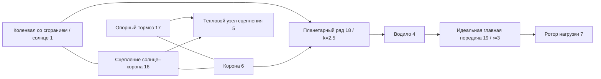

# Связанные идеальные шестерни и планетарные связи

[English](GEAR_NETWORK.md) · [简体中文](GEAR_NETWORK.zh-CN.md) · [Français](GEAR_NETWORK.fr.md) · **Русский** · [日本語](GEAR_NETWORK.ja.md) · [한국어](GEAR_NETWORK.ko.md) · [Deutsch](GEAR_NETWORK.de.md) · [Español](GEAR_NETWORK.es.md) · [Italiano](GEAR_NETWORK.it.md) · [Português](GEAR_NETWORK.pt-BR.md)

`ideal_gear` и `planetary_gear` — постоянные связи без потерь в том же решении Core, что валы, электродвигатели RL, цилиндры и управляемые сцепления. JSON, CLI/MCP и переносимый актив v10 несут те же определения. Независимые [эталоны постоянной нагрузки](IDEAL_GEARS.ru.md) остаются оракулами проверки. Все текущие исследовательские параметры — `unverified`.

## Топология и знаки

`ComponentDefinition.IdealGear(id, a, b, ratio)` соединяет различные вращательные узлы и требует конечного ненулевого знакового отношения. `ComponentDefinition.PlanetaryGear(id, sun, ring, carrier, ringToSunTeethRatio)` требует трёх различных вращательных узлов и конечного отношения чисел зубьев короны и солнца больше единицы. JSON использует `node_a`, `node_b`, `node_c` для солнца, короны и водила; `node_c` применяется только к планетарному ряду. Каждый присоединённый ротор сохраняет свою явную положительную инерцию. Земля не выводится из отсутствующего порта шестерни; используйте явный опорный тормоз, когда звено планетарного ряда нужно удерживать.

```text
Ideal pair: omega_A - r omega_B = 0
Reactions on rotors: [lambda, -r lambda]

Planetary: omega_S + k omega_R - (1+k) omega_C = 0
Reactions on rotors: [lambda, k lambda, -(1+k) lambda]
```

Эти соотношения дают нулевую суммарную мощность реакций. Инерции зацепления, податливости, бокового зазора, потерь и теплоты нет. Упругие валы, присоединённые инерции и сцепления добавляйте явно. Отношение чисел зубьев не устанавливает геометрию зуба, прочность, смазку или калибровку. Знаки и физические источники зафиксированы в [IDEAL_GEARS.ru.md](IDEAL_GEARS.ru.md).

Примеры записей компонентов:

```json
{"id":18,"kind":"planetary_gear","node_a":1,"node_b":6,"node_c":4,"parameters":{"ratio":2.5}}
{"id":19,"kind":"ideal_gear","node_a":4,"node_b":7,"parameters":{"ratio":3}}
```

У шестерён нет управляющего входа. Сцепления выбирают силовую цепь, ограничивая или освобождая другие степени свободы; изменение передаточного отношения во время выполнения — не входная операция.

## Начальные условия и ранг связей

Начальные скорости должны удовлетворять всем постоянным соотношениям в пределах относительного округления binary64. Строки делятся на свой наибольший коэффициент; начальная граница — `64 epsilon`, умноженный на сумму модулей нормированных членов скорости, без абсолютной мёртвой зоны на малой скорости. Несовместимое начальное состояние возвращает диагностику `Connection` на `initial_speed`. Конечного импульса синхронизации нет, и начальная кинетическая энергия не отбрасывается.

Начальные углы роторов задают относительную фазу шестерни. Их смещения не обязаны быть нулём; связь сохраняет эту начальную фазу. `constraint_error` сообщает отклонение от неё. Модель не выводит индексацию зубьев и не применяет поправку положения к данным пользователя.

Постоянные связи должны быть независимы. Повторяющиеся или зависимые контуры шестерён отвергаются при компиляции с `Solver / gear.constraints`; уберите зависимые строки или исправьте силовую цепь. Контур полного ранга может связать каждый ротор с покоем. Сцепление, чьё проскальзывание уже полностью ограничено постоянными шестернями, отвергается с `Solver / clutch.coupling`, потому что его независимая реакция не определена. Избыточные контуры *сцеплений* сохраняют отдельное ограниченное поведение активного множества, описанное в [CLUTCH_NETWORK.ru.md](CLUTCH_NETWORK.ru.md).

## Связанная интеграция

Пусть `D = I - h A/2` — существующая матрица электромеханики в средней точке, а `C` — нормированные строки связей, действующие на скорости роторов. Для неограниченной средней точки `y` постройте ограниченный отклик без штрафной жёсткости:

```text
R = D^-1 (h/2 M^-1 C^T)
G = C R
G lambda = -C y
x_mid = y + R lambda
x_next = 2 x_mid - x_old
```

`M^-1` применяет инерции присоединённых роторов; отклик включает существующую связь вала, угла и электродвигателя через `D`. Отклики момента цилиндра и момента сцепления используют ту же проекцию. Поэтому итерация нелинейной работы давления и ограниченные реакции сцепления развиваются внутри постоянных связей. Вклады реакций свободного решения, конечных сил цилиндра и конечных сил сцепления накапливаются согласованно, чтобы получить средний момент каждой шестерни.

Факторизация полного тика и отклики — неизменяемые скомпилированные данные. Когда захват или разворот сцепления дробит тик, эта симуляция владеет факторами переменного интервала, откликами проекции и буферами множителей. Ни одна изменяемая рабочая область решения не разделяется между симуляциями. Компиляция и построение выделяют ограниченные плотные массивы; успешные шаги и снимки в буфер вызывающего не выделяют управляемой памяти, включая внутренние интервалы захвата сцепления.

Реакции шестерён не совершают физической теплоты и работы источников. Потери сцепления по-прежнему входят в указанный тепловой узел или внешний журнал теплоты. Полная энергия, запасы газа и химии и работа давления двигателя сохраняют свой существующий учёт. Идеальная связь не добавляет нового порядка сходимости по шагу: линейная система средней точки — второго порядка; тепловые и гибридные пределы существующих решателей по-прежнему действуют.

## Наблюдаемый и транзакционный контракт

| Поле | Единица | Смысл |
|---|---|---|
| `slip_speed` | rad/s | Текущий ненормированный остаток скорости пары или по Виллису |
| `constraint_error` | rad | Текущее ненормированное угловое соотношение минус его начальное значение |
| `torque` | Nm | Средняя реакция последнего полного тика на A или солнце |
| `torque_at_b` | Nm | Средняя реакция последнего полного тика на B или корону |
| `torque_at_c` | Nm | Средняя реакция последнего полного тика на водило; только планетарный ряд |

Начальные средние реакции равны нулю, до того как интервал решён. Изменения входа на границе не переписывают выходы предыдущего тика. При внутренних событиях сцепления средние суммируют принятые импульсы реакций по всем интервалам и делят на длительность целого внешнего тика. История реакций копируется, хешируется и откатывается вместе со всем остальным состоянием.

Внешнее время остаётся ограниченными целыми наносекундами. Неудачные или отменённые вызовы на несколько тиков не фиксируют ни частичный выход реакций, ни какую-либо принятую внутреннюю теплоту, газ, фазу, вход или историю журнала. Ветки владеют независимым состоянием и переменными факторами. Модели шестерён добавляют тег отпечатка 9; модели без шестерён сохраняют прежние отпечатки и хеши повтора. Сохраняющий учёт ёмкости состояния включает одну запись истории средней реакции на идеальную связь.

## Численные границы и восстановление

Факторизация связей использует существующий порог ведущего элемента масштабированного LU `64 epsilon`. Подвижность сцепления после постоянной проекции должна превышать `64 epsilon`, умноженный на его свободную подвижность. Поэтому плохо обусловленные масштабы инерции и отношения могут отвергнуть даже конечные данные. В принятом состоянии каждый нормированный остаток скорости должен быть не больше `2e-12 + 512 epsilon * sum(abs(speed terms))`; нормированная ошибка фазы — не больше `2e-10 + 1024 epsilon * (abs(initial phase) + sum(abs(angle terms)))`. Сырые выходы и история реакций должны оставаться конечными. Это допуски решателя, а не калибровка и не универсальные гарантии относительной ошибки. Точность гибридной схемы на крупном тике не заявляется.

Отказ во время выполнения оставляет пакет неизменным. Проверьте топологию и ранг и масштабы инерции и отношения. Уменьшите тик и создайте сессию заново для пределов разрешения работы давления, клапана, сгорания или события сцепления. Более короткие тики не лечат зависимые постоянные связи. Пределы нелинейных итераций, итераций связей и внутренних событий остаются обнаруживаемыми в возможностях.

## Лаборатория планетарной трансмиссии со сгоранием

Новая [лаборатория](../assets/labs/fired-planetary.power.json) соединяет синтетический цилиндр со сгоранием с солнцем. Тормоз короны выбирает понижение; сцепление солнца с короной выбирает прямую передачу. Водило приводит отдельную инерционную нагрузку через главную передачу с отношением три.



Начальный тормоз удерживает корону, давая отношение коленвала к нагрузке 10.5. На 200.05 ms тормоз отпускает, и сцепление солнца с короной замыкается; после захвата отношение коленвала к нагрузке равно трём. На 450.05 ms сцепление размыкается, и тормоз короны замыкается снова. Нагрузка меняется на 600.05 ms, и эксперимент заканчивается на 800 ms. Эти расписания на точных тиках дают переключение вверх и вниз; они не реализуют TCU и гидравлический исполнительный механизм.

Все **84 границы** совпадают между альтернативными пакетами, переносимым воспроизведением и фактическим сервером MCP. Конечный отчёт фиксирует около **-56.83 J** чистой работы внешних источников, **254.52 J** теплоты сцепления солнца с короной и **156.32 J** теплоты тормоза. Тепловой узел достигает **302.0542 K**; скорости коленвала и нагрузки — около **76.81549** и **7.315761 rad/s**, корона удерживается. Конечный остаток энергии — около **2.51e-10 J**. Отпечаток — `6703f00c995e6b62`; конечный хеш состояния — `b328de221532fbae`. Это синтетические численные результаты, а не измеренные характеристики трансмиссии.

Запросите `get_example_model` с `name: "fired-planetary"` или выполните:

```sh
dotnet src/Power.Cli/bin/Release/net10.0/Power.Cli.dll assets/labs/fired-planetary.power.json --output artifacts/reports/fired-planetary.json
```

Сборка экспортирует `FiredPlanetary.powerasset`. Studio показывает схематичные соединения трёхпортового планетарного ряда и главной передачи рядом с видами роторов и фаз сцепления. Тесты импорта, повтора переключения, сброса и очистки подготовлены; фактическое выполнение Editor/Play/IL2CPP ещё не проведено.

## Свидетельства и оставшийся объём

Тесты сравнивают движение графа, перемещение и каждую реакцию с независимыми точными эталонами пары и планетарного ряда. Многоступенчатая цепь проверяет приведённую инерцию и порядок устойчивых ID; модели электродвигателя с теплом и реагирующего цилиндра совпадают с моделями эквивалентной инерции. Ограниченный осциллятор показывает сходимость второго порядка и сохраняемую энергию. Переключение сцепления планетарного ряда совпадает с аналитическим временем захвата, конечной скоростью прямой передачи и теплотой трения, затем возвращается к понижению. Отмена, перегрузка после принятого префикса переключения, пакетирование, ветки и захват без выделений сохраняют транзакционный контракт.

Тесты актива v10 покрывают трёхпортовую топологию, неверные, отсутствующие и повторяющиеся записи, недопустимые порты и поддельные понижения версии. Подлинная фикстура fired-clutch v7 сохраняет свой отпечаток и обновлённый повтор; более старые фикстуры остаются поддержанными. Строгие тесты JSON и агента покрывают ошибки ранга и начальной скорости, атомарность ревизии и входа и различие между успешным выполнением и пройденными KPI. См. [валидацию](VALIDATION.ru.md) и [формат активов](ASSET_FORMAT.ru.md).

Это связанная идеальная силовая цепь трансмиссии. [Табличный гидротрансформатор](CONVERTER_NETWORK.ru.md) теперь расширяет её переносом жидкости и отдельной блокировкой. Полная топология DCT/AT, гидравлическая динамика насоса и поршня, согласование момента ECU/TCU, дозирование топлива и зажигание двигателя, подробные впуск и выпуск, потери, поведение при неисправностях, измеренная калибровка автомобиля и фактические свидетельства Unity Player остаются частью полной цели Power!.
