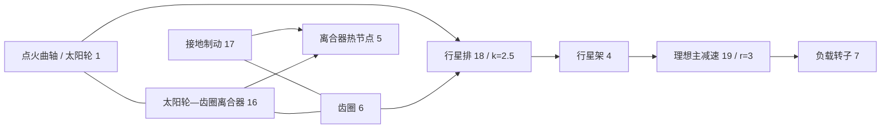

# 耦合理想齿轮与行星约束

[English](GEAR_NETWORK.md) · **简体中文** · [Français](GEAR_NETWORK.fr.md) · [Русский](GEAR_NETWORK.ru.md) · [日本語](GEAR_NETWORK.ja.md) · [한국어](GEAR_NETWORK.ko.md) · [Deutsch](GEAR_NETWORK.de.md) · [Español](GEAR_NETWORK.es.md) · [Italiano](GEAR_NETWORK.it.md) · [Português](GEAR_NETWORK.pt-BR.md)

`ideal_gear` 与 `planetary_gear` 是永久无损失约束,与轴、RL 电机、气缸和受控离合器处于同一个 Core 求解中。JSON、CLI/MCP 和可移植资产 v10 携带同一套定义。独立的[恒定载荷参考](IDEAL_GEARS.zh-CN.md)仍是验证参照。当前全部研究参数均为 `unverified`。

## 拓扑与符号

`ComponentDefinition.IdealGear(id, a, b, ratio)` 连接不同的转动节点,并要求有限、非零的有符号速比。`ComponentDefinition.PlanetaryGear(id, sun, ring, carrier, ringToSunTeethRatio)` 要求三个不同的转动节点,以及大于一的有限齿圈/太阳轮齿数比。JSON 用 `node_a`、`node_b`、`node_c` 表示太阳轮、齿圈、行星架;`node_c` 只用于行星排。每个连接的转子保留其显式正惯量。不会从缺失的齿轮端口推断接地;行星构件需要被保持时,使用显式接地制动。

```text
Ideal pair: omega_A - r omega_B = 0
Reactions on rotors: [lambda, -r lambda]

Planetary: omega_S + k omega_R - (1+k) omega_C = 0
Reactions on rotors: [lambda, k lambda, -(1+k) lambda]
```

这些关系给出的合反作用功率为零。没有啮合惯量、柔性、齿隙、损失和热。弹性轴、连接惯量和离合器需要显式添加。齿数比不确立轮齿几何、强度、润滑或标定。符号与物理参考来源记在 [IDEAL_GEARS.md](IDEAL_GEARS.zh-CN.md)。

示例组件记录:

```json
{"id":18,"kind":"planetary_gear","node_a":1,"node_b":6,"node_c":4,"parameters":{"ratio":2.5}}
{"id":19,"kind":"ideal_gear","node_a":4,"node_b":7,"parameters":{"ratio":3}}
```

齿轮没有控制输入。离合器通过约束或释放其他自由度来选择动力路径;在运行时改变齿轮速比不是输入操作。

## 初始条件与约束秩

初始速度必须在相对 binary64 舍入之内满足全部永久关系。各行除以其最大系数;初始界限是绝对归一化速度项之和的 `64 epsilon` 倍,没有绝对低速死区。不相容的初始状态在 `initial_speed` 上返回 `Connection` 诊断。没有有限的同步冲量,也不丢弃初始动能。

初始转子角度定义齿轮的相对相位。它们的偏移不必为零;约束保持该初始相位。`constraint_error` 报告相对它的偏离。模型不推断轮齿分度,也不对用户数据施加位置修正。

永久约束必须独立。重复或相关的齿轮回路在编译时以 `Solver / gear.constraints` 拒绝;请去掉相关行或修正动力路径。满秩回路可以把每个转子都约束到静止。滑差已经由永久齿轮完全约束的离合器以 `Solver / clutch.coupling` 拒绝,因为其独立反作用未定义。冗余的*离合器*回路保留 [CLUTCH_NETWORK.md](CLUTCH_NETWORK.zh-CN.md)所记录的分开的有界活动集行为。

## 耦合积分

令 `D = I - h A/2` 为现有的机电中点矩阵,`C` 为作用在转子速度上的归一化约束行。对无约束中点 `y`,构造无惩罚刚度的约束响应:

```text
R = D^-1 (h/2 M^-1 C^T)
G = C R
G lambda = -C y
x_mid = y + R lambda
x_next = 2 x_mid - x_old
```

`M^-1` 施加所连接转子的惯量;响应通过 `D` 包含现有的轴、角度和电机耦合。气缸扭矩响应和离合器扭矩响应使用同一投影。因此非线性压力功迭代和有界离合器反作用在永久约束之内演化。自由求解、最终气缸力和最终离合器力的反作用贡献被一致累加,以得到每个齿轮的平均扭矩。

整节拍分解与响应是不可变的编译数据。当离合器捕获/反向把一个节拍细分时,该仿真拥有变区间因子、投影响应和乘子缓冲区。仿真之间不共享可变求解工作区。编译与构造分配有界稠密数组;成功的步进和调用方缓冲区快照不分配托管内存,包括内部离合器捕获区间。

齿轮反作用不产生物理热或源功。离合器损失继续进入指定的热节点或外部热账本。总能量、气体/化学存量以及发动机压力功保留其现有记账。理想约束不增加新的时间步收敛阶:线性中点系统是二阶;现有求解器的热与混合极限仍然适用。

## 可观测与事务契约

| 字段 | 单位 | 含义 |
|---|---|---|
| `slip_speed` | rad/s | 当前未归一化的齿轮副/Willis 转速残差 |
| `constraint_error` | rad | 当前未归一化的角度关系减去其初始值 |
| `torque` | Nm | 最近一个完整节拍上 A/太阳轮的平均反作用 |
| `torque_at_b` | Nm | 最近一个完整节拍上 B/齿圈的平均反作用 |
| `torque_at_c` | Nm | 最近一个完整节拍上行星架的平均反作用;仅行星排 |

初始平均反作用为零,此时还没有求解过区间。边界输入变化不改写前一节拍的输出。存在内部离合器事件时,平均是把所有区间上接受的反作用冲量求和,再除以整数外部节拍的时长。反作用历史与所有其他状态一起复制、哈希和回滚。

外部时间仍是有界整数纳秒。失败或取消的多节拍调用既不提交部分反作用输出,也不提交任何已接受的内部热、气体、阶段、输入或账本历史。分支拥有独立的状态和可变因子。齿轮模型增加指纹标签 9;不含齿轮的模型保留先前的指纹和回放哈希。守恒的状态容量记账为每个理想约束包含一条平均反作用历史。

## 数值界限与恢复

约束分解使用现有的缩放 LU 主元阈值 `64 epsilon`。永久投影之后的离合器可动性必须超过其自由可动性的 `64 epsilon` 倍。因此病态的惯量/速比尺度即使对有限数据也可能拒绝。在被接受的状态上,每个归一化速度残差至多为 `2e-12 + 512 epsilon * sum(abs(speed terms))`;归一化相位误差至多为 `2e-10 + 1024 epsilon * (abs(initial phase) + sum(abs(angle terms)))`。原始输出和反作用历史必须保持有限。这些是求解器容差,不是标定,也不是普遍的相对误差保证。不声称大节拍混合精度。

运行时失败使批次保持不变。请检查拓扑/秩以及惯量/速比尺度。若是压力功、气门、燃烧或离合器事件的分辨率限制,请减小节拍并重建会话。更短的节拍不能治好相关的永久约束。非线性迭代、约束迭代和内部事件的限制仍可在能力中发现。

## 点火行星变速器实验室

新的[实验室](../assets/labs/fired-planetary.power.json)把合成的点火气缸接到太阳轮。齿圈制动选择减速;太阳轮/齿圈离合器选择直接驱动。行星架经速比为三的主减速驱动分开的惯性负载。



初始制动保持齿圈,使曲轴/负载速比为 10.5。在 200.05 ms,制动释放,太阳轮/齿圈离合器接合;捕获之后,曲轴/负载速比为三。在 450.05 ms,离合器释放,齿圈制动重新接合。负载在 600.05 ms 改变,实验在 800 ms 结束。这些精确节拍时序提供一次升挡和一次降挡;它们不实现 TCU 或液压执行器。

全部 **84** 个边界在交替批次、可移植回放和实际 MCP 服务器之间一致。最终报告记录约 **-56.83 J** 的净外部源功、**254.52 J** 的太阳轮/齿圈离合器热和 **156.32 J** 的制动热。热节点达到 **302.0542 K**;曲轴与负载转速约为 **76.81549** 与 **7.315761 rad/s**,齿圈被保持。最终能量残差约为 **2.51e-10 J**。指纹为 `6703f00c995e6b62`;最终状态哈希为 `b328de221532fbae`。这些是合成数值结果,不是实测变速器性能。

以 `name: "fired-planetary"` 请求 `get_example_model`,或运行:

```sh
dotnet src/Power.Cli/bin/Release/net10.0/Power.Cli.dll assets/labs/fired-planetary.power.json --output artifacts/reports/fired-planetary.json
```

构建导出 `FiredPlanetary.powerasset`。Studio 显示示意的三端口行星排和主减速连接,以及转子和离合器阶段视图。导入、换挡回放、重置和清理测试已准备;实际的编辑器/Play/IL2CPP 执行仍未完成。

## 证据与剩余范围

测试把图的运动、位移和每个反作用与独立的精确齿轮副/行星参考比较。多级轮系检查折算惯量和稳定 ID 排序;电机/热模型与反应气缸模型同等效惯量模型一致。受约束振荡器展示二阶收敛和能量守恒。行星离合器换挡与解析捕获时间、最终直接驱动速度和摩擦热一致,然后回到减速。取消、已接受换挡前缀之后的过载、批处理、分支和无分配捕获保持事务契约。

资产 v10 测试覆盖三端口拓扑、畸形/缺失/重复记录、无效端口和伪造降级。一份真实的 v7 点火离合器夹具保留其指纹和升级后的回放;更早的夹具仍受支持。严格 JSON 与智能体测试覆盖秩/初始速度错误、修订/输入原子性,以及执行成功与 KPI 通过的区别。参见[验证记录](VALIDATION.zh-CN.md)与[资产格式](ASSET_FORMAT.zh-CN.md)。

这是一条耦合的理想传动动力路径。[映射式液力变矩器](CONVERTER_NETWORK.zh-CN.md)现在用流体传递和分开的锁止扩展它。完整的 DCT/AT 拓扑、泵/活塞液压动力学、ECU/TCU 扭矩协调、发动机燃油计量与点火、详细的进/排气、损失、故障行为、实测车辆标定以及实际的 Unity Player 证据仍属于 Power! 的完整目标。
