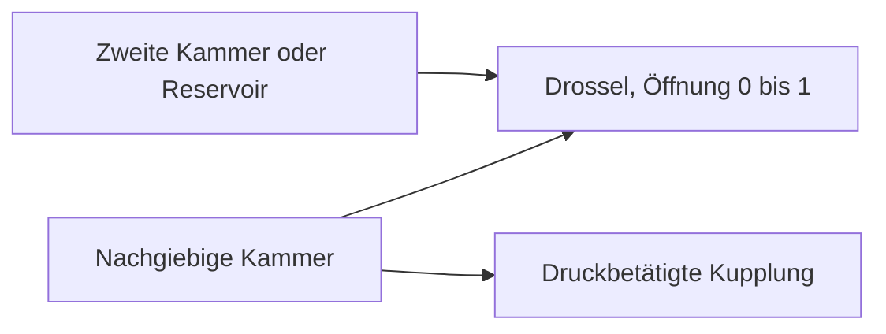

# Hydraulische Strömung und druckbetätigte Kupplungen

[English](HYDRAULIC_NETWORK.md) · [简体中文](HYDRAULIC_NETWORK.zh-CN.md) · [Français](HYDRAULIC_NETWORK.fr.md) · [Русский](HYDRAULIC_NETWORK.ru.md) · [日本語](HYDRAULIC_NETWORK.ja.md) · [한국어](HYDRAULIC_NETWORK.ko.md) · **Deutsch** · [Español](HYDRAULIC_NETWORK.es.md) · [Italiano](HYDRAULIC_NETWORK.it.md) · [Português](HYDRAULIC_NETWORK.pt-BR.md)

Die verwaltete hydraulische Domäne liefert Druck aus einem gelösten Strömungsnetz an Schaltkupplungen und die Überbrückung. Sie trägt nachgiebige Kammern, lineare Drosseln, regularisierte turbulente Drosseln, ausdrückliche Druckreservoirs und druckbetätigte Reibkupplungen. Hydraulikzustand und Konten nehmen an denselben inneren Kupplungsintervallen, dem vollständigen Batch-Rollback, den Abzweigungen und dem beobachtbaren Vertrag teil wie der gezündete Antriebsstrang.



## Druckspeicher und Umfang

Ein Knoten `hydraulic` hat positives `storage` C in `m3_pa` und nichtnegativen Anfangs-Überdruck in Pa oder bar. Alle Hydraulikdrücke nutzen denselben festen Tankbezug. Es gibt keinen abgeleiteten Atmosphärendruck, keine Fluideigenschaft, keine Leckage und keinen OEM-Parameter.

```text
stored reference-volume inventory = C * p
stored elastic pressure energy    = C * p^2 / 2
C * dp/dt                         = sum(incoming Q)
```

C ist eine ausdrückliche konstante wirksame Nachgiebigkeit. Die vertraute Grenze der schwach komprimierten Kammer ist `C = V / bulk_modulus`; ein nachgiebiges Stellglied oder eine nachgiebige Leitung kann zusätzlichen wirksamen Speicher haben. Power! verfolgt den Referenzvolumenbestand, nicht eine volle Flüssigkeitsmasse variabler Dichte oder eine temperaturabhängige Zustandsgleichung. Ein negativer finaler Überdruck liegt außerhalb dieses Modells und weist den vollständigen Batch zurück; er wird nicht stillschweigend in ein Kavitationsmodell geklemmt. Kavitation beim Absolutdruck, eingeschlossenes Gas und kalibriertes Fluid- und Blasenverhalten bleiben offen. [Gasgestützte Trenner](GAS_PISTON.de.md) und [bewegte Hydraulikkolben](HYDRAULIC_PISTON.de.md) sind ausdrückliche Erweiterungen.

Die Grundlage der Kompressibilität ist in [MathWorks Constant Volume Chamber (IL)](https://www.mathworks.com/help/simscape/ref/constantvolumechamberil.html) dokumentiert. Dessen allgemeines Flüssigkeitsmodell ist weiter als die Reduktion auf konstante Nachgiebigkeit in Power!. Es wurden keine Standardwerte für Fluideigenschaften und kein Implementierungscode übernommen.

## Drosseln, Quellenarbeit und Wärme

Beide Drosselkomponenten verbinden den hydraulischen `node_a` entweder mit einem anderen hydraulischen `node_b` oder mit einem ausdrücklichen Reservoir, wenn B weggelassen oder null ist. Der Überdruck des Reservoirs muss dann angegeben werden. `initial_input` ist ein ausdrücklicher Öffnungsanteil in `[0,1]`; ein optionaler Eingabekanal steuert ihn. Öffnung null dichtet den Pfad exakt. Leckage muss ein weiterer ausdrücklicher Pfad oder eine von null verschiedene Öffnung sein. Der optionale thermische `heat_node` empfängt den Druckverlust; ohne Senke geht der Verlust in die externe Bilanz.

Für `d = pA - pB` fließt positiver Volumenstrom Q von A nach B:

```text
hydraulic_resistance: Q = opening * G * d
hydraulic_orifice:    Q = opening * K * d / (d^2 + transition_pressure^2)^(1/4)
restriction loss:     Q * d >= 0
reservoir work:       reservoir_pressure * reference_volume_entering_network
```

G nutzt `m3_s_pa`, also m³/(s·Pa). K nutzt `m3_s_sqrt_pa`, also m³/(s·sqrt(Pa)). Der Übergangsdruck der Blende muss positiv sein und hat ausdrückliche Druckeinheiten. Er regularisiert die laminare Grenze, hält die Strömungsableitung bei Differenz null endlich und nähert sich bei großer Differenz einem vorzeichenbehafteten Wurzelstrom. Beiwerte dürfen null sein. Power! wertet den Nenner mit skalierter Arithmetik aus, um das Quadrieren sehr großer Drücke zu vermeiden.

Die glatte Drosselform folgt der Grenze großer Öffnung, konstanter Dichte und ohne Druckrückgewinn, dokumentiert von [MathWorks Local Restriction (IL)](https://www.mathworks.com/help/simscape/ref/localrestrictionil.html). K wird direkt vorgegeben; Power! erfindet keine Dichte, Viskosität, Reynolds-Zahl oder Flächenmessungen. Die Bestimmung aus Geometrie und Stoffeigenschaften bleibt spätere Arbeit.

Feste Reservoirs sind äußere Leistungsgrenzen. Ihre Arbeit wird sowohl in `hydraulic_work` als auch in der globalen `source_work` gezählt; sie ist keine modellierte Motor- oder Elektropumpe. Eine wellengetriebene Pumpe muss gleiche mechanische und hydraulische Arbeit austauschen, und der Betrieb einer Elektropumpe muss den elektrischen Kreis und die Reglerlast einschließen.

## Druckkupplung

`hydraulic_clutch` nutzt den bestehenden begrenzten Coulomb-Löser für Zwänge und Ereignisse, mit drehenden Anschlüssen A/B (oder einer Gestellbremse), vorzeichenbehafteter Übersetzung und optionaler Wärmesenke. Sie verlangt einen ausdrücklichen hydraulischen `pressure_node`, Kolbenfläche, Vorspannkraft, wirksamen Radius, Haft- und Gleitreibwerte und 1–128 Reibflächen. Sie hat keinen direkten Eingriffseingang. Erforderliche Dimensionen sind Fläche, Kraft und Länge; Reibung und Flächenzahl sind dimensionslos. Die Haftreibung muss mindestens die Gleitreibung sein, beide nichtnegativ.

```text
normal_force      = max(piston_area * gauge_pressure - preload_force, 0)
static_capacity   = static_friction  * surfaces * effective_radius * normal_force
sliding_capacity  = sliding_friction * surfaces * effective_radius * normal_force
```

Das ist eine Reduktion der Druckbetätigung mit starrem Kontakt. Der Hydraulikknoten trägt die ausdrückliche wirksame Nachgiebigkeit, und das Kupplungsgesetz leitet die Normalkraft ohne eine unmodellierte Verzögerung eines Druckbefehls ab. Es bildet keine freie Füllung, bewegte Druckplatten, Ausrückhebel, Kolbenträgheit, Verschleiß, Fliehkraftöldruck oder temperaturbedingtes Nachlassen ab. Diese Effekte brauchen zusätzliche erhaltende Komponenten und Messungen. Druckabhängige Reibkapazität beschreibt [MathWorks Disc Friction Clutch](https://www.mathworks.com/help/sdl/ref/discfrictionclutch.html); die erklärte Reduktion von Power! und die Lösergrenzen sind unabhängige Entwurfsentscheidungen.

## Integrations- und Transaktionsvertrag

Eine begrenzte implizite Mittelpunktlösung rückt alle Kammerdrücke und Drosselströme gemeinsam vor. Sie erlaubt 24 Newton-Iterationen und 16 halbierende Liniensuchversuche. Die Toleranz des Druckresiduums ist `2e-7 + 64*epsilon*(abs(midpoint)+abs(old)) Pa`. Die analytische Strömungsableitung bildet die Jacobi-Matrix des Netzes. Nach der Konvergenz aktualisieren paarweise Kantenüberträge die Kammerzustände und das Referenzvolumenkonto gemeinsam. Die tatsächlichen alten und neuen Mittelpunktdrücke bestimmen den Druckarbeitsverlust, passend zur gespeicherten quadratischen Energieänderung. Ein negativer akzeptierter Drosselverlust oder ein negativer finaler Überdruck weist das Intervall zurück.

Kupplungskapazitäten nutzen dieselben Mittelpunktdrücke des Intervalls. Innere Aufnahmeversuche wiederholen die hydraulische Lösung auf vollständigen spekulativen Zustandskopien; zurückgewiesene Versuche hinterlassen keinen Volumen-, Quellenarbeits- oder Wärmeverlauf. Druck, der die Vorspannschwelle kreuzt, nutzt die Intervallnäherung der Kapazität, daher ist nahe Einrücken und Lösen eine Verfeinerung der Zeitschritte nötig. Es gibt keinen Anspruch auf exakte kontinuierliche Schwellenzeit. Die bestehenden Grenzen für Kupplungsereignis und -bindung, Zahnrad, Gas und Verbrennung gelten weiter.

Mittlerer Drosselstrom und mittlere Leistung werden über akzeptierte innere Intervalle gewichtet und durch den vollen Tick geteilt. Kumulierte Wärme nutzt kompensierte Summation. Jeder Hydraulikknoten fügt einen logischen Zustand hinzu; jede Drossel fügt drei Verlaufszustände hinzu. Die bestehenden Grenzen von 32 Knoten, 64 Komponenten und 64 Zuständen bleiben. Alle Hydraulikverläufe werden kopiert und gehasht; fehlgeschlagene oder abgebrochene Batches schreiben keine Änderungen fest. Erfolgreiches Schreiten, einschließlich Kupplungsaufnahme, weist nach dem Aufwärmen keinen verwalteten Speicher zu.

Bei `numerical_failure` `step_ns` verkleinern und Nachgiebigkeit, Drosselbeiwerte, Druckmaßstäbe und Kupplungsgeometrie prüfen. Der implizite Mittelpunkt garantiert keinen positiven Druck bei beliebigen Schrittweiten. Der Compiler prüft Dimensionen und Topologie; er kann nicht garantieren, dass jeder künftige Befehl und Zeitschritt numerisch zulässig bleibt.

## Beobachtbarer Vertrag und Dokumentvertrag

| Objekt | Felder | Bedeutung |
|---|---|---|
| Hydraulikknoten | `pressure`, `volume`, `internal_energy` | Überdruck, Referenzvolumenbestand C·p, elastische Energie C·p²/2 |
| Drossel | `volume_flow`, `heat_flow`, `fluid_heat` | Mittlerer Strom A→B des letzten Ticks, mittlere Druckverlustleistung, kumulierter Verlust |
| Druckkupplung | Bestehende Kupplungsfelder; `clamp_force`, `static_capacity`, `sliding_capacity` | Aktuelle aus dem Druck abgeleitete Kraft und Kapazitäten plus akzeptierter Reibungsverlauf |
| Global | `hydraulic_volume_in`, `hydraulic_volume_residual`, `hydraulic_work` | Vorzeichenbehafteter Bestandsübertrag des Reservoirs, Bestandsänderung minus Übertrag, Druckarbeit des Reservoirs |

Mittlerer Strom und mittlere Leistung beginnen bei null. Das Ändern von Ventileingängen schreibt die Mittelwerte des vorherigen Ticks nicht um und ändert den gespeicherten Druck nicht augenblicklich. Quellenarbeit, Wärme und das Gesamtenergieresiduum schließen das Hydrauliknetz neben mechanischer, elektrischer und Gasenergie ein. Ein erfolgreich ausgeführtes Experiment kann die KPIs trotzdem verfehlen; die Kalibrierung bleibt `unverified`.

JSON, Core-Fabriken, CLI und MCP nutzen dieselben Definitionen. Asset v10 behält Strömungsbeiwerte, Reservoirdrücke, Druckanschlussverbindungen und Stellgeometrie; authentische Fixtures v1–v9 erhalten ältere Fingerabdrücke und das Replay. Hydraulikmodelle ergänzen den Fingerabdruck-Tag 11 und weisen `compliant_hydraulic_powertrain` aus. Modelle ohne Hydraulik behalten ihr bisheriges Löserverhalten und ihre Fingerabdrücke.

## Laboratorium und numerischer Nachweis

Das MCP-Beispiel `fired-hydraulic` anfordern oder ausführen:

```sh
dotnet src/Power.Cli/bin/Release/net10.0/Power.Cli.dll assets/labs/fired-hydraulic.power.json --output artifacts/reports/fired-hydraulic.json
```

Drei Kammern von 2e-12 m³/Pa und sechs ausdrückliche turbulente Ventilpfade betätigen die Sonnen-/Hohlradkupplung, die Hohlradbremse und die Wandlerüberbrückung. Der Versorgungsdruck ist 1 MPa Überdruck, der Ablauf ist null. Ventilzeitpläne enthalten bei jeder Schaltung eine ausdrückliche Lücke zwischen Lösen und Füllen; das ist ein Versuchszeitplan, kein ECU/TCU. Die Pumpendynamik wird nicht aus dem festen Versorgungsreservoir abgeleitet. Der Druck steigt und fällt durch die Strömung, statt dem Ventilbefehl augenblicklich zu folgen.

Das Laboratorium von 0.8 s nutzt Ticks von 50,000 ns und spielt alle 89 Grenzen exakt über portable Assets und MCP nach. Sein Fingerabdruck ist `01b69cb3abe52211`, der finale Zustands-Hash `46a01d103e6159d3`. Die Enddrehzahl von Kurbel und Turbinenrad ist 70.94321138 rad/s, die Lastdrehzahl 6.75649632 rad/s. Das Reservoir liefert 8 J hydraulische Arbeit; das endgültige Gesamtenergieresiduum liegt bei etwa `1.09e-9 J`, das Referenzvolumenresiduum bei etwa `-1.08e-18 m³`. Alle Parameter bleiben synthetisch und nicht verifiziert.

Prüfungen decken analytisches RC-Aufladen und den Ausgleich im geschlossenen Netz, exakte Arbeits- und Wärmeidentitäten, einen getrennt integrierten turbulenten RK4-Transient, Konvergenz zweiter Ordnung für Druck und Kupplungsimpuls, Vorspannung, Aufnahme und Lösung, Wärmeführung, transaktionales Versagen und Abbruch, Abzweigungen und zuweisungsfreie Aufnahme ab. Portable Prüfungen weisen fehlerhafte und fehlende physikalische Daten zurück, einschließlich Reservoirdruck, bei gültigen Digests. Das gezündete Experiment prüft Druckverzögerungen, vollständige Wärme- und Volumenkonten und Replay Grenze für Grenze. Das Abdichten aller Ventilpfade hält die Anfangsdrücke und verhindert, dass eine befohlene Überbrückung ohne Strömung erscheint.

Studio enthält schematische Hydraulikkammern, Reservoir- und Ventilpfade und Verbindungen der Druckkupplung. Vorbereitete Import- und Play-Prüfungen brauchen weiterhin den gepinnten Unity-Editor. Weder diese Baugruppen noch ein synthetisches Laboratorium schließen DCT-/AT-Topologie, Pumpen- und Reglerhardware, Regelungen, Motorverhalten, kalibrierte Fahrzeugbeispiele oder die Desktop-Freigabe ab.

## Nachfolgende wellengetriebene Versorgung

Die [Erweiterung für Pumpe und Druckbegrenzung](HYDRAULIC_PUMP.de.md) ergänzt einen kurbelgetriebenen Versorgungspfad und eine gemeinsame Lösung von Druck und Welle. Das Laboratorium mit festem Reservoir in diesem Dokument bleibt ein unveränderter Regressionsprüfpunkt. Pumpenverluste und -regelung, Reglerschieber und die Dynamik der Stellkolben bleiben getrennte, nicht abgeschlossene Arbeit.
