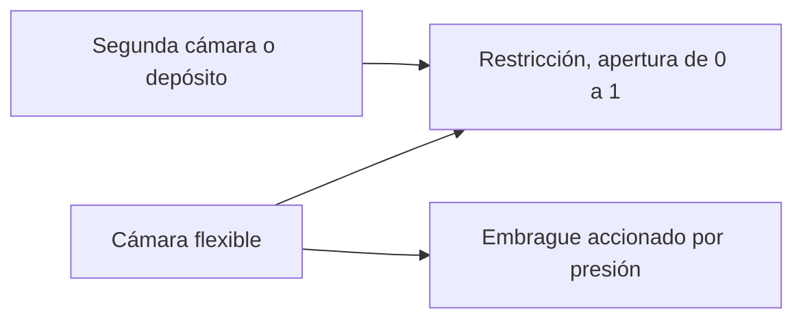

# Flujo hidráulico y embragues accionados por presión

[English](HYDRAULIC_NETWORK.md) · [简体中文](HYDRAULIC_NETWORK.zh-CN.md) · [Français](HYDRAULIC_NETWORK.fr.md) · [Русский](HYDRAULIC_NETWORK.ru.md) · [日本語](HYDRAULIC_NETWORK.ja.md) · [한국어](HYDRAULIC_NETWORK.ko.md) · [Deutsch](HYDRAULIC_NETWORK.de.md) · **Español** · [Italiano](HYDRAULIC_NETWORK.it.md) · [Português](HYDRAULIC_NETWORK.pt-BR.md)

El dominio hidráulico gestionado suministra presión desde una red de flujo resuelta a los embragues de cambio y al bloqueo. Admite cámaras flexibles, restricciones lineales, restricciones turbulentas regularizadas, depósitos de presión explícitos y embragues de fricción accionados por presión. El estado hidráulico y los libros participan en los mismos intervalos internos de embrague, la reversión completa del lote, las bifurcaciones y el contrato observable que el grupo motopropulsor encendido.



## Almacenamiento de presión y alcance

Un nodo `hydraulic` tiene un `storage` C positivo en `m3_pa` y una presión manométrica inicial no negativa en Pa o bar. Todas las presiones hidráulicas usan la misma referencia fija de tanque. No se infieren presión atmosférica, propiedad del fluido, fugas ni parámetro OEM.

```text
stored reference-volume inventory = C * p
stored elastic pressure energy    = C * p^2 / 2
C * dp/dt                         = sum(incoming Q)
```

C es una flexibilidad efectiva constante explícita. El límite familiar de cámara de compresión pequeña es `C = V / bulk_modulus`; un actuador o una línea flexibles pueden tener almacenamiento efectivo adicional. Power! rastrea el inventario de volumen de referencia, no una masa líquida completa de densidad variable ni una ecuación de estado dependiente de la temperatura. Una presión manométrica final negativa queda fuera de este modelo y rechaza el lote completo; no se fija nunca en silencio dentro de un modelo de cavitación. Siguen abiertos la cavitación a presión absoluta, el gas arrastrado y el comportamiento calibrado del fluido o de la vejiga. Los [separadores respaldados por gas](GAS_PISTON.es.md) y los [pistones hidráulicos móviles](HYDRAULIC_PISTON.es.md) son extensiones explícitas.

La base de compresibilidad está documentada en [MathWorks Constant Volume Chamber (IL)](https://www.mathworks.com/help/simscape/ref/constantvolumechamberil.html). Su modelo general de líquido es más amplio que la reducción de flexibilidad constante de Power!. No se copiaron valores por defecto de propiedades del fluido ni código de implementación.

## Restricciones, trabajo de fuentes y calor

Ambos componentes de restricción conectan el `node_a` hidráulico con un `node_b` hidráulico distinto o con un depósito explícito cuando B se omite o vale cero. La presión manométrica del depósito debe indicarse entonces. `initial_input` es una fracción de apertura explícita en `[0,1]`; un canal de entrada opcional la controla. Una apertura nula sella el camino exactamente. Las fugas deben ser otro camino explícito o una apertura distinta de cero. El `heat_node` térmico opcional recibe la pérdida de presión; si no hay sumidero, la pérdida entra en el libro externo de rechazo de calor.

Para `d = pA - pB`, un Q positivo fluye de A a B:

```text
hydraulic_resistance: Q = opening * G * d
hydraulic_orifice:    Q = opening * K * d / (d^2 + transition_pressure^2)^(1/4)
restriction loss:     Q * d >= 0
reservoir work:       reservoir_pressure * reference_volume_entering_network
```

G usa `m3_s_pa`, es decir m³/(s·Pa). K usa `m3_s_sqrt_pa`, es decir m³/(s·sqrt(Pa)). La presión de transición del orificio debe ser positiva y tiene unidades de presión explícitas. Regulariza el límite laminar, mantiene finita la derivada del caudal en diferencial nulo y se aproxima al caudal de raíz cuadrada con signo a diferencial grande. Los coeficientes pueden ser cero. Power! evalúa el denominador con aritmética escalada para evitar elevar al cuadrado presiones enormes.

La forma suave de la restricción sigue el límite de puerto grande, densidad constante y sin recuperación de presión documentado por [MathWorks Local Restriction (IL)](https://www.mathworks.com/help/simscape/ref/localrestrictionil.html). K se aporta de forma directa; Power! no inventa densidad, viscosidad, número de Reynolds ni mediciones de área. La identificación a partir de geometría o de propiedades sigue siendo trabajo futuro.

Los depósitos fijos son fronteras externas de potencia. Su trabajo se cuenta tanto en `hydraulic_work` como en el `source_work` global; no es una bomba de motor o eléctrica modelada. Una bomba accionada por eje debe acabar intercambiando trabajo mecánico e hidráulico iguales, y el funcionamiento de una bomba eléctrica debe incluir el circuito eléctrico y la carga de control.

## Embrague de presión

`hydraulic_clutch` usa el solver existente de restricción y de eventos de Coulomb acotado, con puertos rotacionales A/B (o un freno a masa), relación con signo y sumidero de calor opcional. Exige un `pressure_node` hidráulico explícito, área del pistón, fuerza de precarga, radio efectivo, coeficientes de fricción estática y deslizante, y de 1 a 128 superficies de fricción. No tiene entrada directa de acoplamiento. Las dimensiones exigidas son área, fuerza y longitud; la fricción y el número de superficies son adimensionales. La fricción estática debe ser al menos la fricción deslizante, y ambas no negativas.

```text
normal_force      = max(piston_area * gauge_pressure - preload_force, 0)
static_capacity   = static_friction  * surfaces * effective_radius * normal_force
sliding_capacity  = sliding_friction * surfaces * effective_radius * normal_force
```

Es una reducción de actuación por presión de contacto rígido. El nodo hidráulico lleva la flexibilidad efectiva explícita, y la ley del embrague deriva la fuerza normal sin un retardo no modelado de consigna de presión. No implementa el llenado libre, platos de presión móviles, palancas de desembrague, inercia del pistón, desgaste, presión centrífuga del aceite ni pérdida por temperatura. Esos efectos necesitan componentes conservativos adicionales y mediciones. La capacidad de fricción dependiente de la presión se describe en [MathWorks Disc Friction Clutch](https://www.mathworks.com/help/sdl/ref/discfrictionclutch.html); la reducción declarada de Power! y los límites del solver son decisiones de diseño independientes.

## Integración y contrato de transacción

Una resolución de punto medio implícito acotada hace avanzar juntas todas las presiones de cámara y los caudales de restricción. Permite 24 iteraciones de Newton y 16 intentos de búsqueda lineal por bisección. La tolerancia del residuo de presión es `2e-7 + 64*epsilon*(abs(midpoint)+abs(old)) Pa`. La derivada analítica del caudal construye el jacobiano de la red. Tras la convergencia, las transferencias de arista por pares actualizan juntas los estados de cámara y el libro de volumen de referencia. Las presiones reales antigua, nueva y de punto medio determinan la pérdida de trabajo por presión, en correspondencia con el cambio de energía cuadrática almacenada. Una pérdida de restricción aceptada negativa, o una presión manométrica final negativa, rechaza el intervalo.

Las capacidades del embrague usan estas mismas presiones de punto medio del intervalo. Los ensayos internos de captura repiten la resolución hidráulica sobre copias especulativas completas del estado; los ensayos rechazados no dejan historial de volumen, de trabajo de fuentes ni de calor. El cruce de la presión por el umbral de precarga usa la aproximación de capacidad del intervalo, así que hace falta refinar el paso de tiempo cerca del acoplamiento y de la liberación. No se afirma una temporización exacta del umbral continuo. Siguen aplicándose los límites existentes de evento y de restricción del embrague, de engranaje, de gas y de combustión.

El caudal y la potencia medios de la restricción se ponderan sobre los intervalos internos aceptados y se dividen por el tick completo. El calor acumulado usa suma compensada. Cada nodo hidráulico añade un estado lógico; cada restricción añade tres estados de historial. Permanecen los límites existentes de 32 nodos, 64 componentes y 64 estados. Todos los historiales hidráulicos se copian y se hashean; los lotes fallidos o cancelados no confirman cambios. El avance correcto, incluida la captura del embrague, no asigna memoria gestionada tras el calentamiento.

Ante `numerical_failure`, reduce `step_ns` e inspecciona la flexibilidad, los coeficientes de restricción, las escalas de presión y la geometría del embrague. El punto medio implícito no garantiza presión positiva a tamaños de paso arbitrarios. El compilador comprueba dimensiones y topología; no puede garantizar que cada consigna o paso de tiempo futuro siga siendo numéricamente admisible.

## Contrato observable y de documento

| Objeto | Campos | Significado |
|---|---|---|
| Nodo hidráulico | `pressure`, `volume`, `internal_energy` | Presión manométrica, inventario de volumen de referencia C·p, energía elástica C·p²/2 |
| Restricción | `volume_flow`, `heat_flow`, `fluid_heat` | Caudal medio A→B del último tick, potencia media de pérdida de presión, pérdida acumulada |
| Embrague de presión | Campos de embrague existentes; `clamp_force`, `static_capacity`, `sliding_capacity` | Fuerza y capacidades actuales derivadas de la presión, más el historial de fricción aceptado |
| Global | `hydraulic_volume_in`, `hydraulic_volume_residual`, `hydraulic_work` | Transferencia con signo del inventario del depósito, cambio de inventario menos transferencia, trabajo de presión del depósito |

El caudal y la potencia medios empiezan en cero. Cambiar las entradas de válvula no reescribe las medias del tick anterior ni altera de forma instantánea la presión almacenada. El trabajo de fuentes, el calor y el residuo de energía total incluyen la red hidráulica junto a la energía mecánica, eléctrica y de gas. Un experimento ejecutado con éxito puede seguir fallando los KPIs; la calibración permanece `unverified`.

JSON, las fábricas de Core, la CLI y el MCP usan las mismas definiciones. El asset v10 conserva los coeficientes de caudal, las presiones de depósito, las conexiones del puerto de presión y la geometría del actuador; los fixtures auténticos v1–v9 preservan las huellas y la repetición anteriores. Los modelos hidráulicos añaden la etiqueta de huella 11 y anuncian `compliant_hydraulic_powertrain`. Los modelos sin hidráulica conservan su comportamiento de solver y sus huellas anteriores.

## Laboratorio y evidencia numérica

Pide el ejemplo MCP `fired-hydraulic`, o ejecuta:

```sh
dotnet src/Power.Cli/bin/Release/net10.0/Power.Cli.dll assets/labs/fired-hydraulic.power.json --output artifacts/reports/fired-hydraulic.json
```

Tres cámaras de 2e-12 m³/Pa y seis caminos explícitos de válvula turbulenta operan el embrague sol/corona, el freno de corona y el bloqueo del convertidor. La presión de alimentación es 1 MPa manométricos y el drenaje es cero. Los programas de válvula incluyen un hueco explícito de liberación y de llenado durante cada cambio; es un programa de experimento, no una ECU/TCU. La dinámica de la bomba no se infiere del depósito de alimentación fijo. La presión sube y decae por el caudal, en lugar de seguir la consigna de válvula de forma instantánea.

El laboratorio de 0.8 s usa ticks de 50,000 ns y repite los 89 límites exactamente a través de los assets portátiles y del MCP. Su huella es `01b69cb3abe52211` y el hash de estado final `46a01d103e6159d3`. La velocidad final de cigüeñal/turbina es 70.94321138 rad/s y la velocidad de carga 6.75649632 rad/s. El depósito aporta 8 J de trabajo hidráulico; el residuo final de energía total es de unos `1.09e-9 J`, y el residuo de volumen de referencia de unos `-1.08e-18 m³`. Todos los parámetros siguen siendo sintéticos y no verificados.

Las pruebas cubren la carga RC analítica y la igualación de una red cerrada, identidades exactas de trabajo y de calor, un transitorio turbulento RK4 integrado por separado, la convergencia de segundo orden de la presión y del impulso del embrague, la precarga, la captura y la liberación, el encaminamiento térmico, el fallo y la cancelación transaccionales, las ramas y la captura sin asignaciones. Las pruebas portátiles rechazan datos físicos mal formados y ausentes, incluida la presión del depósito, con resúmenes válidos. El experimento encendido verifica los retardos de presión, los libros completos de calor y de volumen, y la repetición límite a límite. Sellar todos los caminos de válvula preserva las presiones iniciales e impide que aparezca un bloqueo mandado sin caudal.

Studio incluye cámaras hidráulicas esquemáticas, caminos de depósito y de válvula, y conexiones del embrague de presión. Las pruebas preparadas de importación y de Play siguen exigiendo el Unity Editor fijado. Ni estos ensamblados ni un laboratorio sintético completan la topología DCT/AT, el hardware de bomba y de regulador, los controles, el comportamiento del motor, las muestras de vehículo calibradas ni la publicación de escritorio.

## Alimentación posterior accionada por eje

El [incremento de bomba y alivio](HYDRAULIC_PUMP.es.md) añade un camino de alimentación accionado por cigüeñal y una resolución conjunta de presión y de eje. El laboratorio de depósito fijo de este documento sigue siendo un punto de regresión sin cambios. Las pérdidas y el control de la bomba, la corredera del regulador y la dinámica del pistón actuador siguen siendo trabajo aparte sin terminar.
