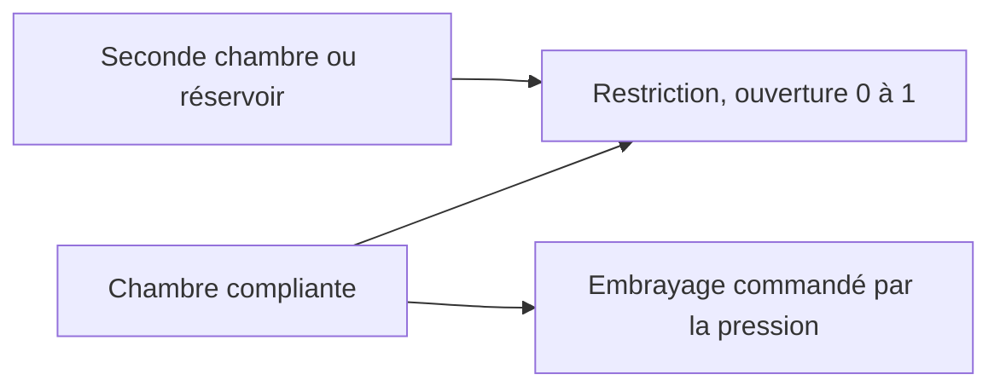

# Écoulement hydraulique et embrayages commandés par la pression

[English](HYDRAULIC_NETWORK.md) · [简体中文](HYDRAULIC_NETWORK.zh-CN.md) · **Français** · [Русский](HYDRAULIC_NETWORK.ru.md) · [日本語](HYDRAULIC_NETWORK.ja.md) · [한국어](HYDRAULIC_NETWORK.ko.md) · [Deutsch](HYDRAULIC_NETWORK.de.md) · [Español](HYDRAULIC_NETWORK.es.md) · [Italiano](HYDRAULIC_NETWORK.it.md) · [Português](HYDRAULIC_NETWORK.pt-BR.md)

Le domaine hydraulique managé fournit la pression d'un réseau d'écoulement résolu aux embrayages de passage et au verrouillage. Il prend en charge des chambres compliantes, des restrictions linéaires, des restrictions turbulentes régularisées, des réservoirs de pression explicites et des embrayages à frottement commandés par la pression. L'état hydraulique et les registres participent aux mêmes intervalles internes d'embrayage, au rollback de lot complet, aux forks et au contrat observable que le groupe motopropulseur allumé.



## Stockage de pression et périmètre

Un nœud `hydraulic` a un `storage` C positif en `m3_pa` et une pression manométrique initiale non négative en Pa ou en bar. Toutes les pressions hydrauliques utilisent la même référence de réservoir fixe. Il n'y a pas de pression atmosphérique, de propriété de fluide, de fuite ni de paramètre OEM inférés.

```text
stored reference-volume inventory = C * p
stored elastic pressure energy    = C * p^2 / 2
C * dp/dt                         = sum(incoming Q)
```

C est une compliance effective constante explicite. La limite familière de chambre à faible compression est `C = V / bulk_modulus` ; un actionneur ou une ligne compliant peut avoir un stockage effectif supplémentaire. Power! suit un inventaire de volume de référence, pas une masse liquide complète à densité variable ni une équation d'état dépendante de la température. Une pression manométrique finale négative est hors de ce modèle et rejette le lot complet ; elle n'est jamais ramenée silencieusement dans un modèle de cavitation. La cavitation en pression absolue, le gaz entraîné et le comportement calibré de fluide ou de vessie restent ouverts. Les [séparateurs à gaz](GAS_PISTON.fr.md) et les [pistons hydrauliques mobiles](HYDRAULIC_PISTON.fr.md) sont des extensions explicites.

La base de compressibilité est documentée dans [MathWorks Constant Volume Chamber (IL)](https://www.mathworks.com/help/simscape/ref/constantvolumechamberil.html). Son modèle de liquide général est plus large que la réduction à compliance constante de Power!. Aucune valeur par défaut de propriété de fluide ni aucun code d'implémentation n'ont été copiés.

## Restrictions, travail de source et chaleur

Les deux composants de restriction relient un `node_a` hydraulique soit à un `node_b` hydraulique distinct, soit à un réservoir explicite lorsque B est omis ou nul. La pression manométrique du réservoir doit alors être spécifiée. `initial_input` est une fraction d'ouverture explicite dans `[0,1]` ; un canal d'entrée optionnel la commande. Une ouverture nulle obture le chemin exactement. Une fuite doit être un autre chemin explicite ou une ouverture non nulle. Le `heat_node` thermique optionnel reçoit la perte de pression ; en l'absence de puits, la perte entre dans le registre de rejet thermique externe.

Pour `d = pA - pB`, un Q positif s'écoule de A vers B :

```text
hydraulic_resistance: Q = opening * G * d
hydraulic_orifice:    Q = opening * K * d / (d^2 + transition_pressure^2)^(1/4)
restriction loss:     Q * d >= 0
reservoir work:       reservoir_pressure * reference_volume_entering_network
```

G utilise `m3_s_pa`, soit m³/(s·Pa). K utilise `m3_s_sqrt_pa`, soit m³/(s·sqrt(Pa)). La pression de transition de l'orifice doit être positive et a des unités de pression explicites. Elle régularise la limite laminaire, garde la dérivée du débit finie à différentiel nul, et approche un écoulement en racine carrée signée à grand différentiel. Les coefficients peuvent être nuls. Power! évalue le dénominateur avec une arithmétique mise à l'échelle pour éviter de mettre au carré d'énormes pressions.

La forme lisse de restriction suit la limite à grand port, densité constante et sans récupération de pression documentée par [MathWorks Local Restriction (IL)](https://www.mathworks.com/help/simscape/ref/localrestrictionil.html). K est fourni directement ; Power! n'invente ni masse volumique, ni viscosité, ni nombre de Reynolds, ni mesures d'aire. L'identification fondée sur la géométrie ou les propriétés reste un travail futur.

Les réservoirs fixes sont des frontières de puissance externes. Leur travail est compté à la fois dans `hydraulic_work` et dans le `source_work` global ; ce n'est pas une pompe moteur ou électrique modélisée. Une pompe entraînée par arbre doit à terme échanger un travail mécanique et un travail hydraulique égaux, et le fonctionnement d'une pompe électrique doit inclure le circuit électrique et la charge de commande.

## Embrayage à pression

`hydraulic_clutch` utilise le solveur de contrainte et d'événement de Coulomb borné existant, avec des ports de rotation A/B (ou un frein au bâti), un rapport signé et un puits thermique optionnel. Il exige un `pressure_node` hydraulique explicite, une aire de piston, une force de précharge, un rayon effectif, des coefficients de frottement statique et glissant, et 1–128 surfaces de frottement. Il n'a pas d'entrée d'engagement directe. Les dimensions requises sont l'aire, la force et la longueur ; le frottement et le nombre de surfaces sont sans dimension. Le frottement statique doit être au moins égal au frottement glissant, les deux non négatifs.

```text
normal_force      = max(piston_area * gauge_pressure - preload_force, 0)
static_capacity   = static_friction  * surfaces * effective_radius * normal_force
sliding_capacity  = sliding_friction * surfaces * effective_radius * normal_force
```

C'est une réduction d'actionnement par pression à contact rigide. Le nœud hydraulique porte la compliance effective explicite, et la loi d'embrayage dérive la force normale sans retard de commande de pression non modélisé. Elle n'implémente pas le remplissage libre, les plateaux de pression mobiles, les leviers de débrayage, l'inertie de piston, l'usure, la pression d'huile centrifuge ni l'affaiblissement thermique. Ces effets exigent des composants conservatifs et des mesures supplémentaires. La capacité de frottement dépendante de la pression est décrite dans [MathWorks Disc Friction Clutch](https://www.mathworks.com/help/sdl/ref/discfrictionclutch.html) ; la réduction déclarée de Power! et les limites du solveur sont des décisions de conception indépendantes.

## Contrat d'intégration et de transaction

Une résolution de point milieu implicite bornée avance ensemble toutes les pressions de chambre et tous les débits de restriction. Elle permet 24 itérations de Newton et 16 tentatives de recherche linéaire par dichotomie. La tolérance de résidu de pression est `2e-7 + 64*epsilon*(abs(midpoint)+abs(old)) Pa`. La dérivée analytique du débit construit le jacobien du réseau. Après convergence, des transferts d'arêtes par paires mettent à jour ensemble les états de chambre et le registre de volume de référence. Les pressions réelles de point milieu ancienne et nouvelle déterminent la perte de travail de pression, en accord avec la variation d'énergie quadratique stockée. Une perte de restriction acceptée négative, ou une pression manométrique finale négative, rejette l'intervalle.

Les capacités d'embrayage utilisent ces mêmes pressions de point milieu d'intervalle. Les essais de capture internes répètent la résolution hydraulique sur des copies d'état spéculatives complètes ; les essais rejetés ne laissent aucun historique de volume, de travail de source ni de chaleur. Le franchissement du seuil de précharge par la pression utilise l'approximation de capacité de l'intervalle, donc un raffinement du pas de temps est requis près de l'engagement et du relâchement. Il n'y a pas de prétention à un minutage exact du seuil en temps continu. Les limites existantes d'événement et de contrainte d'embrayage, d'engrenage, de gaz et de combustion s'appliquent encore.

Le débit et la puissance moyens de restriction sont pondérés sur les intervalles internes acceptés et divisés par le tick complet. La chaleur cumulée utilise une sommation compensée. Chaque nœud hydraulique ajoute un état logique ; chaque restriction ajoute trois états d'historique. Les limites existantes de 32 nœuds, 64 composants et 64 états demeurent. Tous les historiques hydrauliques sont copiés et hachés ; les lots échoués ou annulés ne valident aucun changement. L'avance réussie, capture d'embrayage comprise, n'alloue pas de mémoire managée après échauffement.

Sur `numerical_failure`, réduisez `step_ns` et inspectez la compliance, les coefficients de restriction, les échelles de pression et la géométrie d'embrayage. Le point milieu implicite ne garantit pas une pression positive à des tailles de pas arbitraires. Le compilateur contrôle les dimensions et la topologie ; il ne peut pas garantir que chaque commande ou pas de temps futur reste numériquement admissible.

## Contrat observable et de document

| Objet | Champs | Signification |
|---|---|---|
| Nœud hydraulique | `pressure`, `volume`, `internal_energy` | Pression manométrique, inventaire de volume de référence C·p, énergie élastique C·p²/2 |
| Restriction | `volume_flow`, `heat_flow`, `fluid_heat` | Débit moyen A→B du dernier tick, puissance moyenne de perte de pression, perte cumulée |
| Embrayage à pression | Champs d'embrayage existants ; `clamp_force`, `static_capacity`, `sliding_capacity` | Force et capacités courantes dérivées de la pression, plus l'historique de frottement accepté |
| Global | `hydraulic_volume_in`, `hydraulic_volume_residual`, `hydraulic_work` | Transfert signé d'inventaire de réservoir, variation d'inventaire moins le transfert, travail de pression du réservoir |

Le débit et la puissance moyens commencent à zéro. Changer les entrées de vanne ne réécrit pas les moyennes du tick précédent et ne modifie pas instantanément la pression stockée. Le travail de source, la chaleur et le résidu d'énergie totale incluent le réseau hydraulique à côté de l'énergie mécanique, électrique et gazeuse. Une expérience exécutée avec succès peut encore échouer aux KPI ; la calibration reste `unverified`.

JSON, les fabriques du cœur, la CLI et le MCP utilisent les mêmes définitions. L'asset v10 conserve les coefficients d'écoulement, les pressions de réservoir, les connexions de port de pression et la géométrie d'actionneur ; les scénarios authentiques v1–v9 conservent les empreintes et le rejeu plus anciens. Les modèles hydrauliques ajoutent la balise d'empreinte 11 et annoncent `compliant_hydraulic_powertrain`. Les modèles sans hydraulique conservent leur comportement de solveur et leurs empreintes antérieurs.

## Laboratoire et preuves numériques

Demandez l'exemple MCP `fired-hydraulic`, ou exécutez :

```sh
dotnet src/Power.Cli/bin/Release/net10.0/Power.Cli.dll assets/labs/fired-hydraulic.power.json --output artifacts/reports/fired-hydraulic.json
```

Trois chambres de 2e-12 m³/Pa et six chemins de vanne turbulents explicites actionnent l'embrayage solaire/couronne, le frein de couronne et le verrouillage du convertisseur. La pression d'alimentation est 1 MPa manométrique et la vidange est nulle. Les séquences de vanne incluent un intervalle explicite de relâchement et de remplissage à chaque passage ; c'est une séquence d'expérience, pas une ECU/TCU. La dynamique de pompe n'est pas inférée du réservoir d'alimentation fixe. La pression monte et retombe par l'écoulement, plutôt que de suivre instantanément la commande de vanne.

Le laboratoire de 0.8 s utilise des ticks de 50,000 ns et rejoue les 89 bornes exactement via les assets portables et le MCP. Son empreinte est `01b69cb3abe52211`, son hachage d'état final `46a01d103e6159d3`. La vitesse finale vilebrequin/turbine est 70.94321138 rad/s et la vitesse de charge 6.75649632 rad/s. Le réservoir fournit 8 J de travail hydraulique ; le résidu d'énergie totale final est d'environ `1.09e-9 J`, et le résidu de volume de référence d'environ `-1.08e-18 m³`. Tous les paramètres restent synthétiques et non vérifiés.

Les tests couvrent la charge RC analytique et l'égalisation d'un réseau fermé, les identités exactes de travail et de chaleur, un transitoire turbulent RK4 intégré séparément, la convergence du second ordre de la pression et de l'impulsion d'embrayage, la précharge, la capture et le relâchement, le routage thermique, l'échec et l'annulation transactionnels, les branches et la capture sans allocation. Les tests portables rejettent les données physiques mal formées et manquantes, y compris la pression de réservoir, avec des condensés valides. L'expérience allumée vérifie les retards de pression, les registres complets de chaleur et de volume, et le rejeu borne par borne. Obturer tous les chemins de vanne conserve les pressions initiales et empêche un verrouillage commandé d'apparaître sans écoulement.

Studio inclut des chambres hydrauliques schématiques, des chemins de réservoir et de vanne, et des connexions d'embrayage à pression. Les tests d'import et Play préparés exigent encore l'éditeur Unity épinglé. Ni ces assemblys ni un laboratoire synthétique n'achèvent la topologie DCT/AT, le matériel de pompe et de régulateur, les contrôles, le comportement moteur, les échantillons de véhicule calibrés ou une version de bureau.

## Alimentation entraînée par arbre, ensuite

L'[incrément pompe/décharge](HYDRAULIC_PUMP.fr.md) ajoute un chemin d'alimentation entraîné au vilebrequin et une résolution conjointe pression/arbre. Le laboratoire à réservoir fixe de ce document reste un point de contrôle de régression inchangé. Les pertes et le contrôle de pompe, le coulisseau régulateur et la dynamique du piston d'actionneur restent un travail séparé inachevé.
