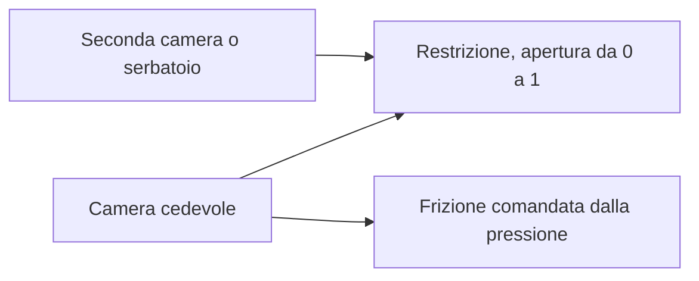

# Flusso idraulico e frizioni comandate dalla pressione

[English](HYDRAULIC_NETWORK.md) · [简体中文](HYDRAULIC_NETWORK.zh-CN.md) · [Français](HYDRAULIC_NETWORK.fr.md) · [Русский](HYDRAULIC_NETWORK.ru.md) · [日本語](HYDRAULIC_NETWORK.ja.md) · [한국어](HYDRAULIC_NETWORK.ko.md) · [Deutsch](HYDRAULIC_NETWORK.de.md) · [Español](HYDRAULIC_NETWORK.es.md) · **Italiano** · [Português](HYDRAULIC_NETWORK.pt-BR.md)

Il dominio idraulico gestito fornisce pressione da una rete di flusso risolta alle frizioni di cambio e al blocco. Supporta camere cedevoli, restrizioni lineari, restrizioni turbolente regolarizzate, serbatoi di pressione espliciti e frizioni di attrito comandate dalla pressione. Stato e registri idraulici partecipano agli stessi intervalli interni di frizione, al rollback completo del batch, ai fork e al contratto osservabile del gruppo motopropulsore acceso.



## Accumulo di pressione e ambito

Un nodo `hydraulic` ha `storage` C positivo in `m3_pa` e pressione manometrica iniziale non negativa, in Pa o bar. Tutte le pressioni idrauliche usano lo stesso riferimento fisso di serbatoio. Non si deducono pressione atmosferica, proprietà del fluido, trafilamento o parametri OEM.

```text
stored reference-volume inventory = C * p
stored elastic pressure energy    = C * p^2 / 2
C * dp/dt                         = sum(incoming Q)
```

C è una cedevolezza efficace costante esplicita. Il limite familiare di camera a piccola compressione è `C = V / bulk_modulus`; un attuatore o una linea cedevoli possono avere accumulo efficace aggiuntivo. Power! traccia l'inventario di volume di riferimento, non una massa liquida completa a densità variabile né un'equazione di stato dipendente dalla temperatura. Una pressione manometrica finale negativa è fuori da questo modello e rifiuta il batch completo; non viene mai saturata in silenzio in un modello di cavitazione. Cavitazione a pressione assoluta, gas trascinato e comportamento calibrato di fluido o membrana restano aperti. I [separatori sostenuti a gas](GAS_PISTON.it.md) e gli [stantuffi idraulici mobili](HYDRAULIC_PISTON.it.md) sono estensioni esplicite.

La base di comprimibilità è documentata in [MathWorks Constant Volume Chamber (IL)](https://www.mathworks.com/help/simscape/ref/constantvolumechamberil.html). Il suo modello generale di liquido è più ampio della riduzione a cedevolezza costante di Power!. Non sono stati copiati default di proprietà del fluido né codice di implementazione.

## Restrizioni, lavoro di sorgente e calore

Entrambi i componenti di restrizione collegano il nodo idraulico `node_a` o a un `node_b` idraulico distinto, o a un serbatoio esplicito quando B è omesso o zero. In quel caso si deve specificare la pressione manometrica del serbatoio. `initial_input` è una frazione di apertura esplicita in `[0,1]`; un canale di input facoltativo la comanda. Apertura zero sigilla il percorso in modo esatto. Il trafilamento deve essere un altro percorso esplicito, oppure un'apertura non nulla. Il `heat_node` termico facoltativo riceve la perdita di pressione; in assenza di un pozzo, la perdita entra nel registro esterno di rigetto del calore.

Per `d = pA - pB`, Q positiva fluisce da A a B:

```text
hydraulic_resistance: Q = opening * G * d
hydraulic_orifice:    Q = opening * K * d / (d^2 + transition_pressure^2)^(1/4)
restriction loss:     Q * d >= 0
reservoir work:       reservoir_pressure * reference_volume_entering_network
```

G usa `m3_s_pa`, cioè m³/(s·Pa). K usa `m3_s_sqrt_pa`, cioè m³/(s·sqrt(Pa)). La pressione di transizione dell'orifizio deve essere positiva e ha unità di pressione esplicite. Regolarizza il limite laminare, tiene finita la derivata della portata a differenza nulla e si avvicina alla portata a radice quadrata con segno per differenze grandi. I coefficienti possono essere zero. Power! valuta il denominatore con aritmetica scalata, per evitare di elevare al quadrato pressioni enormi.

La forma regolare della restrizione segue il limite a porta larga, densità costante e senza recupero di pressione documentato da [MathWorks Local Restriction (IL)](https://www.mathworks.com/help/simscape/ref/localrestrictionil.html). K è fornito in modo diretto; Power! non inventa densità, viscosità, numero di Reynolds o misure di area. L'identificazione basata su geometria e proprietà resta lavoro futuro.

I serbatoi fissi sono confini di potenza esterni. Il loro lavoro è contato sia in `hydraulic_work` sia nel `source_work` globale; non è una pompa di motore o elettrica modellata. Una pompa comandata dall'albero deve alla fine scambiare lavoro meccanico e idraulico uguali, e il funzionamento di una pompa elettrica deve includere il circuito elettrico e il carico di controllo.

## Frizione a pressione

`hydraulic_clutch` usa il solver esistente di vincoli ed eventi di Coulomb limitato, con porte rotazionali A/B (o un freno a massa), rapporto con segno e pozzo termico facoltativo. Richiede un `pressure_node` idraulico esplicito, area dello stantuffo, forza di precarico, raggio efficace, coefficienti di attrito statico e strisciante e da 1 a 128 superfici di attrito. Non ha un input diretto di innesto. Le dimensioni richieste sono area, forza e lunghezza; attrito e numero di superfici sono adimensionali. L'attrito statico deve essere almeno pari a quello strisciante, ed entrambi non negativi.

```text
normal_force      = max(piston_area * gauge_pressure - preload_force, 0)
static_capacity   = static_friction  * surfaces * effective_radius * normal_force
sliding_capacity  = sliding_friction * surfaces * effective_radius * normal_force
```

È una riduzione di azionamento a pressione con contatto rigido. Il nodo idraulico porta la cedevolezza efficace esplicita, e la legge della frizione ricava la forza normale senza un ritardo non modellato del comando di pressione. Non implementa riempimento libero, dischi di pressione mobili, leve di disinnesto, inerzia dello stantuffo, usura, pressione centrifuga dell'olio o decadimento termico. Quegli effetti richiedono altri componenti conservativi e misure. La capacità di attrito dipendente dalla pressione è descritta in [MathWorks Disc Friction Clutch](https://www.mathworks.com/help/sdl/ref/discfrictionclutch.html); la riduzione dichiarata di Power! e i limiti del solver sono decisioni di progetto indipendenti.

## Contratto di integrazione e di transazione

Una risoluzione implicita al punto medio, limitata, fa avanzare insieme tutte le pressioni delle camere e le portate delle restrizioni. Ammette 24 iterazioni di Newton e 16 tentativi di dimezzamento della ricerca lineare. La tolleranza del residuo di pressione è `2e-7 + 64*epsilon*(abs(midpoint)+abs(old)) Pa`. La derivata analitica della portata costruisce lo Jacobiano della rete. Dopo la convergenza, i trasferimenti di spigolo a coppie aggiornano insieme gli stati delle camere e il registro del volume di riferimento. Le pressioni reali vecchia, nuova e al punto medio determinano la perdita di lavoro di pressione, in accordo con la variazione di energia quadratica immagazzinata. Una perdita di restrizione accettata negativa, o una pressione manometrica finale negativa, rifiuta l'intervallo.

Le capacità della frizione usano queste stesse pressioni al punto medio dell'intervallo. Le prove interne di cattura ripetono la risoluzione idraulica su copie complete di stato speculativo; le prove rifiutate non lasciano storia di volume, lavoro di sorgente o calore. L'attraversamento della soglia di precarico usa l'approssimazione di capacità dell'intervallo, quindi serve l'affinamento del passo vicino a innesto e rilascio. Non si rivendica la temporizzazione esatta della soglia in tempo continuo. Restano i limiti esistenti di eventi e vincoli della frizione, di ingranaggi, di gas e di combustione.

Portata e potenza medie della restrizione sono pesate sugli intervalli interni accettati e divise per il tick intero. Il calore cumulativo usa la somma compensata. Ogni nodo idraulico aggiunge uno stato logico; ogni restrizione aggiunge tre stati di storia. Restano i limiti esistenti di 32 nodi, 64 componenti e 64 stati. Tutte le storie idrauliche sono copiate e sottoposte a hash; i batch falliti o annullati non confermano cambiamenti. I passi riusciti, cattura della frizione compresa, non allocano memoria gestita dopo il riscaldamento.

Su `numerical_failure`, riduci `step_ns` e controlla cedevolezza, coefficienti di restrizione, scale di pressione e geometria della frizione. Il punto medio implicito non garantisce pressione positiva a passi arbitrari. Il compilatore controlla dimensioni e topologia; non può garantire che ogni comando o passo futuro resti numericamente ammissibile.

## Contratto osservabile e di documento

| Oggetto | Campi | Significato |
|---|---|---|
| Nodo idraulico | `pressure`, `volume`, `internal_energy` | Pressione manometrica, inventario di volume di riferimento C·p, energia elastica C·p²/2 |
| Restrizione | `volume_flow`, `heat_flow`, `fluid_heat` | Portata media A→B dell'ultimo tick, potenza media di perdita di pressione, perdita cumulativa |
| Frizione a pressione | Campi di frizione esistenti; `clamp_force`, `static_capacity`, `sliding_capacity` | Forza e capacità attuali derivate dalla pressione, più la storia di attrito accettata |
| Globale | `hydraulic_volume_in`, `hydraulic_volume_residual`, `hydraulic_work` | Trasferimento con segno dell'inventario di serbatoio, variazione di inventario meno trasferimento, lavoro di pressione del serbatoio |

Portata e potenza medie partono da zero. Cambiare gli input delle valvole non riscrive le medie del tick precedente e non altera in modo istantaneo la pressione immagazzinata. Il residuo di lavoro di sorgente, calore ed energia totale include la rete idraulica insieme all'energia meccanica, elettrica e di gas. Un esperimento eseguito con successo può comunque fallire i KPI; la calibrazione resta `unverified`.

JSON, le factory di Core, CLI e MCP usano le stesse definizioni. L'asset v10 conserva coefficienti di flusso, pressioni di serbatoio, collegamenti della porta di pressione e geometria dell'attuatore; i fixture autentici v1–v9 conservano impronte e replay precedenti. I modelli idraulici aggiungono il tag di impronta 11 e dichiarano `compliant_hydraulic_powertrain`. I modelli senza idraulica conservano il comportamento del solver e le impronte precedenti.

## Laboratorio ed evidenza numerica

Richiedi l'esempio MCP `fired-hydraulic`, oppure esegui:

```sh
dotnet src/Power.Cli/bin/Release/net10.0/Power.Cli.dll assets/labs/fired-hydraulic.power.json --output artifacts/reports/fired-hydraulic.json
```

Tre camere da 2e-12 m³/Pa e sei percorsi di valvola turbolenti espliciti comandano la frizione solare/corona, il freno della corona e il blocco del convertitore. La pressione di alimentazione è 1 MPa manometrici e lo scarico è zero. Le programmazioni delle valvole includono un intervallo esplicito di rilascio e riempimento durante ogni cambio; è una programmazione di esperimento, non una ECU/TCU. La dinamica della pompa non si deduce dal serbatoio di alimentazione fisso. La pressione sale e decade per il flusso, invece di seguire in modo istantaneo il comando della valvola.

Il laboratorio di 0.8 s usa tick da 50,000 ns e riesegue in modo esatto tutti gli 89 limiti attraverso asset portabili e MCP. La sua impronta è `01b69cb3abe52211`, l'hash di stato finale `46a01d103e6159d3`. La velocità finale di albero e turbina è 70.94321138 rad/s e la velocità del carico 6.75649632 rad/s. Il serbatoio fornisce 8 J di lavoro idraulico; il residuo finale di energia totale è circa `1.09e-9 J`, e il residuo di volume di riferimento circa `-1.08e-18 m³`. Tutti i parametri restano sintetici e non verificati.

I test coprono carica RC analitica e equalizzazione di rete chiusa, identità esatte di lavoro e calore, un transitorio turbolento RK4 integrato a parte, convergenza del secondo ordine di pressione e impulso di frizione, precarico, cattura e rilascio, instradamento termico, fallimento e annullamento transazionali, rami e cattura senza allocazioni. I test portabili rifiutano dati fisici malformati e mancanti, pressione di serbatoio compresa, con digest validi. L'esperimento acceso verifica i ritardi di pressione, i registri completi di calore e volume e il replay limite per limite. Sigillare tutti i percorsi di valvola conserva le pressioni iniziali e impedisce che un blocco comandato compaia senza flusso.

Studio include camere idrauliche schematiche, percorsi di serbatoio e valvola e collegamenti della frizione a pressione. I test preparati di importazione e Play richiedono ancora l'Editor Unity fissato. Né questi assembly né un laboratorio sintetico completano la topologia DCT/AT, l'hardware di pompa e regolatore, i controlli, il comportamento del motore, campioni di veicolo calibrati o il rilascio desktop.

## Alimentazione successiva comandata dall'albero

L'[incremento pompa/scarico](HYDRAULIC_PUMP.it.md) aggiunge un percorso di alimentazione comandato dall'albero a gomiti e una risoluzione congiunta di pressione e albero. Il laboratorio a serbatoio fisso di questo documento resta un checkpoint di regressione invariato. Perdite e controllo della pompa, dinamica del cursore di regolazione e dello stantuffo attuatore restano lavoro separato e incompiuto.
