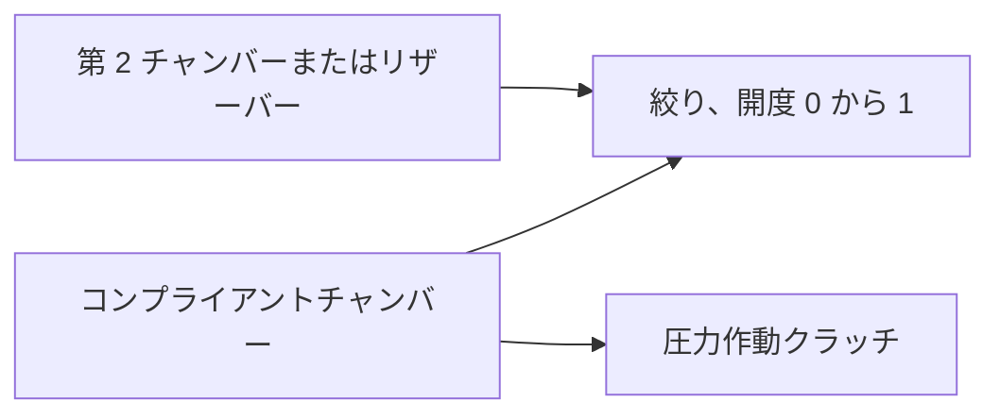

# 油圧流れと圧力作動クラッチ

[English](HYDRAULIC_NETWORK.md) · [简体中文](HYDRAULIC_NETWORK.zh-CN.md) · [Français](HYDRAULIC_NETWORK.fr.md) · [Русский](HYDRAULIC_NETWORK.ru.md) · **日本語** · [한국어](HYDRAULIC_NETWORK.ko.md) · [Deutsch](HYDRAULIC_NETWORK.de.md) · [Español](HYDRAULIC_NETWORK.es.md) · [Italiano](HYDRAULIC_NETWORK.it.md) · [Português](HYDRAULIC_NETWORK.pt-BR.md)

マネージドの油圧領域は、解かれた流れネットワークの圧力を変速クラッチとロックアップへ供給します。コンプライアントなチャンバー、線形絞り、正則化された乱流絞り、明示的な圧力リザーバー、圧力作動の摩擦クラッチに対応します。油圧の状態と台帳は、燃焼パワートレインと同じ内部クラッチ区間、完全なバッチロールバック、分岐、観測契約に加わります。



## 圧力の貯蔵と範囲

`hydraulic` ノードは、`m3_pa` の正の `storage` C と、Pa または bar の非負な初期ゲージ圧を持ちます。すべての油圧は、同じ固定されたタンク基準を使います。推定される大気圧、流体物性、漏れ、OEM パラメーターはありません。

```text
stored reference-volume inventory = C * p
stored elastic pressure energy    = C * p^2 / 2
C * dp/dt                         = sum(incoming Q)
```

C は明示的で一定の有効コンプライアンスです。よく知る小さな圧縮のチャンバー極限は `C = V / bulk_modulus` です。コンプライアントなアクチュエーター/ラインは、追加の有効貯蔵を持ち得ます。Power! が追跡するのは基準体積の在庫であり、可変密度の液体質量全体や、温度依存の状態方程式ではありません。負の最終ゲージ圧はこのモデルの外であり、バッチ全体を拒否します。キャビテーションモデルへ黙ってクランプされることはありません。絶対圧のキャビテーション、混入ガス、キャリブレーション済みの流体/ブラダー挙動は未解決です。[ガスで支えられた分離器](GAS_PISTON.ja.md)と[動く油圧ピストン](HYDRAULIC_PISTON.ja.md)は明示的な拡張です。

圧縮性の基礎は [MathWorks Constant Volume Chamber (IL)](https://www.mathworks.com/help/simscape/ref/constantvolumechamberil.html) に文書化されています。その一般的な液体モデルは、Power! の一定コンプライアンスへの縮約より広いです。流体物性の既定値や実装コードはコピーしていません。

## 絞り、源仕事、熱

両方の絞りコンポーネントは、油圧の `node_a` を、別の油圧 `node_b`、または B が省略/零のときの明示的なリザーバーへつなぎます。そのときはリザーバーゲージ圧を指定しなければなりません。`initial_input` は `[0,1]` の明示的な開度です。任意の入力チャンネルがそれを制御します。開度零は経路を正確に密封します。漏れは、別の明示的な経路か、非零の開度でなければなりません。任意の熱 `heat_node` が圧力損失を受けます。シンクがなければ、損失は外部の熱排出台帳へ入ります。

`d = pA - pB` について、正の Q は A から B へ流れます。

```text
hydraulic_resistance: Q = opening * G * d
hydraulic_orifice:    Q = opening * K * d / (d^2 + transition_pressure^2)^(1/4)
restriction loss:     Q * d >= 0
reservoir work:       reservoir_pressure * reference_volume_entering_network
```

G は `m3_s_pa`、つまり m³/(s·Pa) を使います。K は `m3_s_sqrt_pa`、つまり m³/(s·sqrt(Pa)) を使います。オリフィスの遷移圧力は正で、明示的な圧力単位を持ちます。これは層流極限を正則化し、差圧零で流量導関数を有限に保ち、大きな差圧では符号付き平方根の流れへ近づきます。係数は零でもかまいません。Power! は、巨大な圧力を二乗しないよう、スケールした算術で分母を評価します。

滑らかな絞りの形は、[MathWorks Local Restriction (IL)](https://www.mathworks.com/help/simscape/ref/localrestrictionil.html) が文書化する、大ポート、一定密度、圧力回復なしの極限に従います。K は直接与えられます。Power! は密度、粘度、レイノルズ数、面積の計測を作りません。幾何/物性に基づく同定は今後の作業です。

固定リザーバーは外部の動力境界です。その仕事は `hydraulic_work` と大域の `source_work` の両方に数えられます。モデル化されたエンジン/電動ポンプではありません。シャフト駆動ポンプは、最終的に等しい機械仕事と油圧仕事を交換しなければなりません。電動ポンプの動作は、電気回路と制御負荷を含まなければなりません。

## 圧力クラッチ

`hydraulic_clutch` は、既存の有界な Coulomb 拘束/イベントソルバーを使います。回転の A/B ポート（または接地ブレーキ）、符号付き比、任意の熱シンクを持ちます。明示的な油圧 `pressure_node`、ピストン面積、予圧の力、有効半径、静止/滑り摩擦係数、1–128 の摩擦面が必要です。直接の係合入力はありません。必要な次元は面積、力、長さです。摩擦と面の数は無次元です。静止摩擦は滑り摩擦以上で、どちらも非負でなければなりません。

```text
normal_force      = max(piston_area * gauge_pressure - preload_force, 0)
static_capacity   = static_friction  * surfaces * effective_radius * normal_force
sliding_capacity  = sliding_friction * surfaces * effective_radius * normal_force
```

これは剛接触の圧力駆動への縮約です。油圧ノードが明示的な有効コンプライアンスを担い、クラッチ則は、モデル化されていない圧力指令の遅れなしに垂直力を導きます。自由充填、動くプレッシャープレート、レリーズレバー、ピストン慣性、摩耗、遠心油圧、温度フェードは実装しません。それらの効果には、追加の保存的コンポーネントと計測が必要です。圧力依存の摩擦容量は [MathWorks Disc Friction Clutch](https://www.mathworks.com/help/sdl/ref/discfrictionclutch.html) に述べられています。Power! の宣言された縮約とソルバー限界は、独立した設計上の決定です。

## 積分とトランザクション契約

有界な陰的中点求解が、すべてのチャンバー圧力と絞り流量を一緒に進めます。Newton 反復は 24 回、半分化する直線探索は 16 回までです。圧力残差の許容差は `2e-7 + 64*epsilon*(abs(midpoint)+abs(old)) Pa` です。解析的な流量導関数がネットワークのヤコビアンを作ります。収束のあと、対ごとの辺の移送が、チャンバー状態と基準体積の台帳を一緒に更新します。実際の古い/新しい中点圧力が圧力仕事の損失を決め、蓄えられた二次エネルギーの変化と一致します。受理された絞り損失が負、または最終ゲージ圧が負なら、区間を拒否します。

クラッチ容量は、この同じ区間の中点圧力を使います。内部の捕捉試行は、完全な投機的状態コピーの上で油圧求解を繰り返します。拒否された試行は、体積、源仕事、熱の履歴を残しません。予圧しきい値を横切る圧力は区間の容量近似を使うので、係合と解放の近くではタイムステップの細分化が必要です。連続なしきい値時刻が正確だとは主張しません。既存のクラッチイベント/拘束、歯車、ガス、燃焼の限界は引き続き適用されます。

平均の絞り流量と動力は、受理された内部区間にわたって重み付けされ、フルティックで割られます。累積熱は補償加算を使います。各油圧ノードは論理状態を 1 つ加え、各絞りは履歴状態を 3 つ加えます。既存の 32 ノード、64 コンポーネント、64 状態の限界は残ります。すべての油圧履歴はコピーされハッシュされます。失敗またはキャンセルされたバッチは変更を確定しません。クラッチ捕捉を含む成功したステッピングは、ウォームアップ後にマネージドメモリを割り当てません。

`numerical_failure` では `step_ns` を減らし、コンプライアンス、絞り係数、圧力の尺度、クラッチ幾何を調べてください。陰的中点は、任意のステップサイズで圧力が正である保証ではありません。コンパイラは次元とトポロジーを検査します。将来のすべての指令/タイムステップが数値的に受理可能であることは保証できません。

## 観測とドキュメントの契約

| 対象 | フィールド | 意味 |
|---|---|---|
| 油圧ノード | `pressure`、`volume`、`internal_energy` | ゲージ圧、C·p の基準体積在庫、C·p²/2 の弾性エネルギー |
| 絞り | `volume_flow`、`heat_flow`、`fluid_heat` | 直前ティックの平均流量 A→B、平均圧力損失動力、累積損失 |
| 圧力クラッチ | 既存のクラッチフィールド。`clamp_force`、`static_capacity`、`sliding_capacity` | 現在の圧力から導いた力/容量に、受理された摩擦履歴を加えたもの |
| 大域 | `hydraulic_volume_in`、`hydraulic_volume_residual`、`hydraulic_work` | 符号付きのリザーバー在庫移送、在庫変化から移送を引いたもの、リザーバー圧力仕事 |

平均流量/動力は零から始まります。バルブ入力を変えても、直前ティックの平均は書き換わらず、蓄えられた圧力も瞬間的には変わりません。源仕事、熱、全エネルギー残差は、機械、電気、ガスのエネルギーと並んで油圧ネットワークを含みます。成功して実行された実験でも KPI は失敗し得ます。キャリブレーションは `unverified` のままです。

JSON、Core ファクトリ、CLI、MCP は同じ定義を使います。アセット v10 は流量係数、リザーバー圧力、圧力ポート接続、アクチュエーター幾何を保持します。真正な v1–v9 フィクスチャは、より古いフィンガープリント/リプレイを保ちます。油圧モデルはフィンガープリントタグ 11 を加え、`compliant_hydraulic_powertrain` を表明します。油圧のないモデルは、以前のソルバー挙動とフィンガープリントを保ちます。

## ラボラトリーと数値エビデンス

MCP の例 `fired-hydraulic` を要求するか、次を実行します。

```sh
dotnet src/Power.Cli/bin/Release/net10.0/Power.Cli.dll assets/labs/fired-hydraulic.power.json --output artifacts/reports/fired-hydraulic.json
```

2e-12 m³/Pa のチャンバー 3 つと、明示的な乱流バルブ経路 6 つが、サン/リングクラッチ、リングブレーキ、コンバーターロックアップを操作します。供給圧はゲージ 1 MPa、排出は零です。バルブスケジュールは、各変速の間に明示的な解放/充填の隙間を含みます。これは実験スケジュールであり、ECU/TCU ではありません。ポンプ動特性は、固定された供給リザーバーから推定されません。圧力はバルブ指令に瞬間的に従うのではなく、流れから上昇し減衰します。

0.8 s のラボラトリーは 50,000 ns ティックを使い、89 境界すべてを移植可能アセットと MCP を通じて正確にリプレイします。フィンガープリントは `01b69cb3abe52211`、最終状態ハッシュは `46a01d103e6159d3` です。最終のクランク/タービン速度は 70.94321138 rad/s、負荷速度は 6.75649632 rad/s です。リザーバーは 8 J の油圧仕事を供給します。最終の全エネルギー残差は約 `1.09e-9 J`、基準体積残差は約 `-1.08e-18 m³` です。パラメーターはすべて合成値で、`unverified` のままです。

テストは、解析的な RC 充電と閉じたネットワークの均一化、厳密な仕事/熱の恒等式、別に積分した RK4 の乱流過渡、二次の圧力とクラッチ力積の収束、予圧、捕捉/解放、熱の経路指定、トランザクション的な失敗/キャンセル、分岐、ゼロ割り当ての捕捉を扱います。移植可能テストは、リザーバー圧力を含む、不正で欠けた物理データを、妥当なダイジェストとともに拒否します。燃焼実験は、圧力の遅れ、完全な熱と体積の台帳、境界ごとのリプレイを検証します。すべてのバルブ経路を密封すると初期圧力が保たれ、流れなしに指令されたロックアップが現れることはありません。

Studio は、模式的な油圧チャンバー、リザーバー/バルブ経路、圧力クラッチの接続を含みます。用意されたインポート/Play テストには、固定された Unity エディターが引き続き必要です。これらのアセンブリも合成ラボラトリーも、DCT/AT トポロジー、ポンプ/レギュレーターのハードウェア、制御、エンジン挙動、キャリブレーション済み車両サンプル、デスクトップリリースを完成させません。

## その後のシャフト駆動供給

[ポンプ/リリーフの増分](HYDRAULIC_PUMP.ja.md)は、クランク駆動の供給経路と、圧力/シャフトの連成求解を加えます。このドキュメントの固定リザーバーのラボラトリーは、変わらない回帰チェックポイントのままです。ポンプ損失/制御、レギュレータースプール、アクチュエーターピストンの動特性は、別の未完了の作業のままです。
