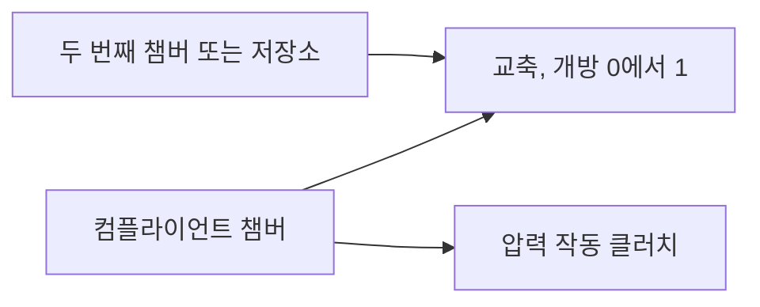

# 유압 흐름과 압력 작동 클러치

[English](HYDRAULIC_NETWORK.md) · [简体中文](HYDRAULIC_NETWORK.zh-CN.md) · [Français](HYDRAULIC_NETWORK.fr.md) · [Русский](HYDRAULIC_NETWORK.ru.md) · [日本語](HYDRAULIC_NETWORK.ja.md) · **한국어** · [Deutsch](HYDRAULIC_NETWORK.de.md) · [Español](HYDRAULIC_NETWORK.es.md) · [Italiano](HYDRAULIC_NETWORK.it.md) · [Português](HYDRAULIC_NETWORK.pt-BR.md)

관리형 유압 영역은 풀이된 흐름 네트워크의 압력을 변속 클러치와 록업에 공급합니다. 컴플라이언트 챔버, 선형 교축, 정규화된 난류 교축, 명시적 압력 저장소, 압력으로 작동하는 마찰 클러치를 지원합니다. 유압 상태와 장부는 점화 파워트레인과 같은 내부 클러치 구간, 완전한 배치 롤백, 분기, 관측 계약에 참여합니다.



## 압력 저장과 범위

`hydraulic` 노드는 `m3_pa` 단위의 양의 `storage` C와, Pa 또는 bar의 비음수 초기 게이지 압력을 갖습니다. 모든 유압 압력은 같은 고정 탱크 기준을 씁니다. 추론된 대기압, 유체 물성, 누출, OEM 매개변수는 없습니다.

```text
stored reference-volume inventory = C * p
stored elastic pressure energy    = C * p^2 / 2
C * dp/dt                         = sum(incoming Q)
```

C는 명시적인 일정한 유효 컴플라이언스입니다. 익숙한 작은 압축 챔버 한계는 `C = V / bulk_modulus`입니다. 컴플라이언트 액추에이터/라인은 추가적인 유효 저장을 가질 수 있습니다. Power!는 완전한 가변 밀도 액체 질량이나 온도 의존 상태 방정식이 아니라 기준 체적 재고를 추적합니다. 최종 게이지 압력이 음수이면 이 모델 밖이며 배치 전체를 거부합니다. 캐비테이션 모델로 조용히 클램프하지 않습니다. 절대 압력 캐비테이션, 혼입 가스, 교정된 유체/블래더 거동은 열려 있습니다. [가스가 받치는 분리기](GAS_PISTON.ko.md)와 [움직이는 유압 피스톤](HYDRAULIC_PISTON.ko.md)은 명시적 확장입니다.

압축성 근거는 [MathWorks Constant Volume Chamber (IL)](https://www.mathworks.com/help/simscape/ref/constantvolumechamberil.html)에 문서화되어 있습니다. 그 일반 액체 모델은 Power!의 일정 컴플라이언스 축소보다 넓습니다. 유체 물성 기본값이나 구현 코드는 복사하지 않았습니다.

## 교축, 소스 일, 열

두 교축 컴포넌트는 유압 `node_a`를, 서로 다른 유압 `node_b` 또는 B가 생략되었거나 0일 때 명시적 저장소에 연결합니다. 그러면 저장소 게이지 압력을 지정해야 합니다. `initial_input`은 `[0,1]`의 명시적 개방 분율입니다. 선택적 입력 채널이 그것을 제어합니다. 개방 0은 경로를 정확히 밀봉합니다. 누출은 또 다른 명시적 경로이거나 0이 아닌 개방이어야 합니다. 선택적 열 `heat_node`가 압력 손실을 받습니다. 싱크가 없으면 손실은 외부 열 방출 장부에 들어갑니다.

`d = pA - pB`일 때 양의 Q는 A에서 B로 흐릅니다.

```text
hydraulic_resistance: Q = opening * G * d
hydraulic_orifice:    Q = opening * K * d / (d^2 + transition_pressure^2)^(1/4)
restriction loss:     Q * d >= 0
reservoir work:       reservoir_pressure * reference_volume_entering_network
```

G는 `m3_s_pa`, 즉 m³/(s·Pa)를 씁니다. K는 `m3_s_sqrt_pa`, 즉 m³/(s·sqrt(Pa))를 씁니다. 오리피스 전이 압력은 양수여야 하고 명시적 압력 단위를 갖습니다. 이것은 층류 한계를 정규화하고, 차압 0에서 유량 미분을 유한하게 유지하며, 큰 차압에서는 부호 있는 제곱근 유동에 접근합니다. 계수는 0일 수 있습니다. Power!는 큰 압력을 제곱하지 않도록 분모를 스케일된 산술로 평가합니다.

매끄러운 교축 형태는 [MathWorks Local Restriction (IL)](https://www.mathworks.com/help/simscape/ref/localrestrictionil.html)이 문서화한, 큰 포트·일정 밀도·압력 회복 없음의 한계를 따릅니다. K는 직접 공급됩니다. Power!는 밀도, 점도, 레이놀즈 수, 면적 측정값을 만들어 내지 않습니다. 형상/물성 기반 식별은 이후 작업입니다.

고정 저장소는 외부 동력 경계입니다. 그 일은 `hydraulic_work`와 전역 `source_work` 양쪽에 집계됩니다. 모델링된 엔진/전기 펌프가 아닙니다. 축 구동 펌프는 결국 같은 크기의 기계 일과 유압 일을 교환해야 하고, 전기 펌프 운전은 전기 회로와 제어 부하를 포함해야 합니다.

## 압력 클러치

`hydraulic_clutch`는 기존의 유계 쿨롱 제약/이벤트 솔버를 쓰며, 회전 A/B 포트(또는 접지 브레이크), 부호 있는 비, 선택적 열 싱크를 갖습니다. 명시적 유압 `pressure_node`, 피스톤 면적, 예압, 유효 반경, 정지/슬립 마찰 계수, 마찰면 1–128개가 필요합니다. 직접적인 체결 입력은 없습니다. 필요한 차원은 면적, 힘, 길이입니다. 마찰과 면 수는 무차원입니다. 정지 마찰은 슬립 마찰 이상이어야 하고, 둘 다 음수가 아니어야 합니다.

```text
normal_force      = max(piston_area * gauge_pressure - preload_force, 0)
static_capacity   = static_friction  * surfaces * effective_radius * normal_force
sliding_capacity  = sliding_friction * surfaces * effective_radius * normal_force
```

이것은 강체 접촉의 압력 구동 축소입니다. 유압 노드는 명시적 유효 컴플라이언스를 나르고, 클러치 법칙은 모델링되지 않은 압력 명령 지연 없이 수직력을 유도합니다. 자유 충전, 움직이는 압력판, 릴리스 레버, 피스톤 관성, 마모, 원심 오일 압력, 온도 페이드는 구현하지 않습니다. 그 효과에는 추가적인 보존 컴포넌트와 측정이 필요합니다. 압력 의존 마찰 용량은 [MathWorks Disc Friction Clutch](https://www.mathworks.com/help/sdl/ref/discfrictionclutch.html)에 설명되어 있습니다. Power!의 선언된 축소와 솔버 한계는 독립적인 설계 결정입니다.

## 적분과 트랜잭션 계약

유계 암시적 중점 풀이가 모든 챔버 압력과 교축 유량을 함께 진행합니다. 뉴턴 반복 24회와 절반으로 줄이는 선 탐색 16회를 허용합니다. 압력 잔차 허용 오차는 `2e-7 + 64*epsilon*(abs(midpoint)+abs(old)) Pa`입니다. 해석적 유량 미분이 네트워크 야코비안을 만듭니다. 수렴 뒤, 쌍별 간선 전달이 챔버 상태와 기준 체적 장부를 함께 갱신합니다. 실제 이전/새 중점 압력이 압력 일 손실을 정하며, 저장된 이차 에너지 변화와 일치합니다. 수용된 교축 손실이 음수이거나 최종 게이지 압력이 음수이면 구간을 거부합니다.

클러치 용량은 이 같은 구간 중점 압력을 씁니다. 내부 포획 시도는 완전한 시험적 상태 복사본에서 유압 풀이를 반복합니다. 거부된 시도는 체적, 소스 일, 열 이력을 남기지 않습니다. 예압 문턱을 지나는 압력은 구간 용량 근사를 쓰므로, 체결과 해제 근처에서는 시간 간격 세밀화가 필요합니다. 연속 문턱 시각이 정확하다는 주장은 없습니다. 기존의 클러치 이벤트/제약, 기어, 가스, 연소 한계는 그대로 적용됩니다.

평균 교축 유량과 동력은 수용된 내부 구간에 걸쳐 가중한 뒤 전체 틱으로 나눕니다. 누적 열은 보정 합을 씁니다. 각 유압 노드는 논리 상태 하나를 더하고, 각 교축은 이력 상태 세 개를 더합니다. 기존의 32 노드, 64 컴포넌트, 64 상태 한계는 유지됩니다. 모든 유압 이력은 복사되고 해시됩니다. 실패하거나 취소된 배치는 변경을 커밋하지 않습니다. 클러치 포획을 포함한 성공한 진행은 워밍업 이후 관리형 메모리를 할당하지 않습니다.

`numerical_failure`가 나면 `step_ns`를 줄이고 컴플라이언스, 교축 계수, 압력 척도, 클러치 형상을 검사하세요. 암시적 중점이 임의의 간격에서 양의 압력을 보장하지는 않습니다. 컴파일러는 차원과 토폴로지를 검사합니다. 미래의 모든 명령/시간 간격이 수치적으로 허용된다는 보장은 할 수 없습니다.

## 관측과 문서 계약

| 대상 | 필드 | 의미 |
|---|---|---|
| 유압 노드 | `pressure`, `volume`, `internal_energy` | 게이지 압력, C·p 기준 체적 재고, C·p²/2 탄성 에너지 |
| 교축 | `volume_flow`, `heat_flow`, `fluid_heat` | 마지막 틱의 평균 유량 A→B, 평균 압력 손실 동력, 누적 손실 |
| 압력 클러치 | 기존 클러치 필드, `clamp_force`, `static_capacity`, `sliding_capacity` | 현재의 압력 유도 힘/용량과 수용된 마찰 이력 |
| 전역 | `hydraulic_volume_in`, `hydraulic_volume_residual`, `hydraulic_work` | 부호 있는 저장소 재고 전달, 재고 변화에서 전달을 뺀 값, 저장소 압력 일 |

평균 유량/동력은 0에서 시작합니다. 밸브 입력을 바꾸어도 이전 틱의 평균을 다시 쓰거나 저장된 압력을 순시에 바꾸지는 않습니다. 소스 일, 열, 총 에너지 잔차에는 기계, 전기, 가스 에너지와 함께 유압 네트워크가 포함됩니다. 성공적으로 실행된 실험도 KPI에 실패할 수 있습니다. 교정 상태는 `unverified`로 남습니다.

JSON, Core 팩토리, CLI, MCP는 같은 정의를 씁니다. 자산 v10은 유량 계수, 저장소 압력, 압력 포트 연결, 액추에이터 형상을 유지합니다. 진본 v1–v9 픽스처는 이전 지문/리플레이를 보존합니다. 유압 모델은 지문 태그 11을 더하고 `compliant_hydraulic_powertrain`을 공개합니다. 유압이 없는 모델은 이전 솔버 동작과 지문을 유지합니다.

## 실험실과 수치 증거

MCP 예제 `fired-hydraulic`을 요청하거나 다음을 실행하세요.

```sh
dotnet src/Power.Cli/bin/Release/net10.0/Power.Cli.dll assets/labs/fired-hydraulic.power.json --output artifacts/reports/fired-hydraulic.json
```

2e-12 m³/Pa 챔버 세 개와 명시적 난류 밸브 경로 여섯 개가 선/링 클러치, 링 브레이크, 컨버터 록업을 작동합니다. 공급 압력은 게이지 1 MPa이고 배출은 0입니다. 밸브 스케줄에는 각 변속 동안 명시적 해제/충전 간격이 있습니다. 이것은 실험 스케줄이지 ECU/TCU가 아닙니다. 펌프 동역학은 고정 공급 저장소에서 추론되지 않습니다. 압력은 밸브 명령을 순시에 따르지 않고 유동에 따라 오르고 내립니다.

0.8초 실험실은 50,000 ns 틱을 쓰며, 이식 가능한 자산과 MCP를 통해 경계 89개를 모두 정확히 리플레이합니다. 지문은 `01b69cb3abe52211`이고 최종 상태 해시는 `46a01d103e6159d3`입니다. 최종 크랭크/터빈 속도는 70.94321138 rad/s이고 부하 속도는 6.75649632 rad/s입니다. 저장소는 유압 일 8 J를 공급합니다. 최종 총 에너지 잔차는 약 `1.09e-9 J`이고, 기준 체적 잔차는 약 `-1.08e-18 m³`입니다. 모든 매개변수는 합성값이며 검증되지 않았습니다.

검사는 해석적 RC 충전과 닫힌 네트워크 균등화, 정확한 일/열 항등, 따로 적분한 RK4 난류 과도, 2차 압력 및 클러치 임펄스 수렴, 예압, 포획/해제, 열 경로, 트랜잭션 실패/취소, 분기, 무할당 포획을 다룹니다. 이식 가능 검사는 저장소 압력을 포함해 잘못되었거나 빠진 물리 데이터를 거부하며, 유효한 다이제스트를 갖습니다. 점화 실험은 압력 지연, 완전한 열 및 체적 장부, 경계별 리플레이를 검증합니다. 모든 밸브 경로를 밀봉하면 초기 압력이 유지되고, 유동 없이 명령된 록업이 나타나지 않습니다.

Studio에는 개략적인 유압 챔버, 저장소/밸브 경로, 압력 클러치 연결이 포함됩니다. 준비된 가져오기/Play 검사에는 여전히 고정된 Unity 편집기가 필요합니다. 이 어셈블리도, 합성 실험실도 DCT/AT 토폴로지, 펌프/조절기 하드웨어, 제어, 엔진 거동, 교정된 차량 샘플, 데스크톱 릴리스를 완성하지는 않습니다.

## 이후의 축 구동 공급

[펌프/릴리프 증분](HYDRAULIC_PUMP.ko.md)은 크랭크 구동 공급 경로와 결합 압력/축 풀이를 더합니다. 이 문서의 고정 저장소 실험실은 바뀌지 않은 회귀 검사점으로 남습니다. 펌프 손실/제어, 조절기 스풀, 액추에이터 피스톤 동역학은 별도로 끝나지 않은 작업으로 남습니다.
