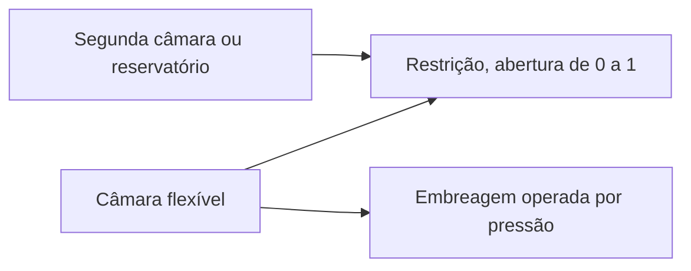

# Escoamento hidráulico e embreagens operadas por pressão

[English](HYDRAULIC_NETWORK.md) · [简体中文](HYDRAULIC_NETWORK.zh-CN.md) · [Français](HYDRAULIC_NETWORK.fr.md) · [Русский](HYDRAULIC_NETWORK.ru.md) · [日本語](HYDRAULIC_NETWORK.ja.md) · [한국어](HYDRAULIC_NETWORK.ko.md) · [Deutsch](HYDRAULIC_NETWORK.de.md) · [Español](HYDRAULIC_NETWORK.es.md) · [Italiano](HYDRAULIC_NETWORK.it.md) · **Português**

O domínio hidráulico gerenciado fornece pressão, a partir de uma rede de escoamento resolvida, às embreagens de troca e à trava. Suporta câmaras flexíveis, restrições lineares, restrições turbulentas regularizadas, reservatórios de pressão explícitos e embreagens de atrito operadas por pressão. O estado hidráulico e os livros participam dos mesmos intervalos internos de embreagem, do rollback completo do lote, das ramificações e do contrato observável do powertrain em combustão.



## Armazenamento de pressão e escopo

Um nó `hydraulic` tem `storage` C positivo em `m3_pa` e pressão manométrica inicial não negativa em Pa ou bar. Todas as pressões hidráulicas usam a mesma referência fixa de tanque. Não há pressão atmosférica, propriedade do fluido, vazamento nem parâmetro OEM inferidos.

```text
stored reference-volume inventory = C * p
stored elastic pressure energy    = C * p^2 / 2
C * dp/dt                         = sum(incoming Q)
```

C é uma flexibilidade efetiva constante e explícita. O limite familiar de câmara de pequena compressão é `C = V / bulk_modulus`; um atuador ou uma linha flexível pode ter armazenamento efetivo adicional. O Power! rastreia inventário de volume de referência, não uma massa líquida completa de densidade variável nem uma equação de estado dependente da temperatura. Uma pressão manométrica final negativa está fora deste modelo e rejeita o lote completo; nunca é limitada em silêncio para um modelo de cavitação. Cavitação em pressão absoluta, gás arrastado e comportamento calibrado de fluido/bexiga continuam em aberto. [Separadores apoiados em gás](GAS_PISTON.pt-BR.md) e [pistões hidráulicos móveis](HYDRAULIC_PISTON.pt-BR.md) são extensões explícitas.

A base de compressibilidade está documentada em [MathWorks Constant Volume Chamber (IL)](https://www.mathworks.com/help/simscape/ref/constantvolumechamberil.html). O modelo geral de líquido dela é mais amplo que a redução de flexibilidade constante do Power!. Nenhum padrão de propriedade de fluido nem código de implementação foi copiado.

## Restrições, trabalho de fonte e calor

Os dois componentes de restrição ligam o `node_a` hidráulico a um `node_b` hidráulico distinto ou a um reservatório explícito quando B é omitido/zero. A pressão manométrica do reservatório precisa então ser especificada. `initial_input` é uma fração de abertura explícita em `[0,1]`; um canal de entrada opcional a controla. Abertura zero veda o caminho exatamente. O vazamento precisa ser outro caminho explícito ou uma abertura diferente de zero. O `heat_node` térmico opcional recebe a perda de pressão; na ausência de sumidouro, a perda entra no livro externo de rejeição de calor.

Para `d = pA - pB`, Q positivo escoa de A para B:

```text
hydraulic_resistance: Q = opening * G * d
hydraulic_orifice:    Q = opening * K * d / (d^2 + transition_pressure^2)^(1/4)
restriction loss:     Q * d >= 0
reservoir work:       reservoir_pressure * reference_volume_entering_network
```

G usa `m3_s_pa`, isto é, m³/(s·Pa). K usa `m3_s_sqrt_pa`, isto é, m³/(s·sqrt(Pa)). A pressão de transição do orifício precisa ser positiva e tem unidades explícitas de pressão. Ela regulariza o limite laminar, mantém finita a derivada do escoamento em diferencial nulo e se aproxima do escoamento com sinal em raiz quadrada em diferencial grande. Os coeficientes podem ser zero. O Power! avalia o denominador com aritmética escalada para evitar elevar ao quadrado pressões enormes.

A forma suave da restrição segue o limite de porta grande, densidade constante e sem recuperação de pressão documentado por [MathWorks Local Restriction (IL)](https://www.mathworks.com/help/simscape/ref/localrestrictionil.html). K é fornecido diretamente; o Power! não inventa densidade, viscosidade, número de Reynolds nem medições de área. A identificação baseada em geometria/propriedade continua trabalho futuro.

Reservatórios fixos são fronteiras externas de potência. O trabalho deles é contado tanto em `hydraulic_work` quanto no `source_work` global; não é uma bomba de motor ou elétrica modelada. Uma bomba acionada por eixo precisa, no fim, trocar trabalho mecânico e hidráulico iguais, e a operação de bomba elétrica precisa incluir o circuito elétrico e a carga de controle.

## Embreagem de pressão

`hydraulic_clutch` usa o solver existente de restrição/evento de Coulomb limitado, com portas rotacionais A/B (ou um freio ao solo), relação com sinal e sumidouro de calor opcional. Exige um `pressure_node` hidráulico explícito, área do pistão, força de pré-carga, raio efetivo, coeficientes de atrito estático/de deslizamento e de 1 a 128 superfícies de atrito. Não tem entrada direta de engate. As dimensões exigidas são área, força e comprimento; atrito e número de superfícies são adimensionais. O atrito estático precisa ser pelo menos o de deslizamento, ambos não negativos.

```text
normal_force      = max(piston_area * gauge_pressure - preload_force, 0)
static_capacity   = static_friction  * surfaces * effective_radius * normal_force
sliding_capacity  = sliding_friction * surfaces * effective_radius * normal_force
```

Esta é uma redução de acionamento por pressão com contato rígido. O nó hidráulico carrega a flexibilidade efetiva explícita, e a lei da embreagem deriva a força normal sem um atraso não modelado de comando de pressão. Não implementa enchimento livre, pratos de pressão móveis, alavancas de liberação, inércia do pistão, desgaste, pressão centrífuga do óleo nem queda por temperatura. Esses efeitos precisam de componentes conservativos adicionais e de medições. A capacidade de atrito dependente da pressão está descrita em [MathWorks Disc Friction Clutch](https://www.mathworks.com/help/sdl/ref/discfrictionclutch.html); a redução declarada do Power! e os limites do solver são decisões de projeto independentes.

## Contrato de integração e de transação

Uma solução implícita limitada de ponto médio avança juntas todas as pressões de câmara e os escoamentos das restrições. Permite 24 iterações de Newton e 16 tentativas de busca em linha por redução à metade. A tolerância do resíduo de pressão é `2e-7 + 64*epsilon*(abs(midpoint)+abs(old)) Pa`. A derivada analítica do escoamento monta o jacobiano da rede. Depois da convergência, transferências de aresta aos pares atualizam juntas os estados das câmaras e o livro de volume de referência. As pressões reais de ponto médio antigo/novo determinam a perda de trabalho de pressão, coincidindo com a variação da energia quadrática armazenada. Uma perda de restrição aceita negativa ou uma pressão manométrica final negativa rejeita o intervalo.

As capacidades da embreagem usam essas mesmas pressões de ponto médio do intervalo. Ensaios internos de captura repetem a solução hidráulica em cópias especulativas completas do estado; ensaios rejeitados não deixam histórico de volume, de trabalho de fonte nem de calor. A travessia da pressão pelo limiar de pré-carga usa a aproximação de capacidade do intervalo, então o refinamento do passo é necessário perto do engate e da liberação. Não há reivindicação de temporização exata do limiar contínuo. Os limites existentes de evento/restrição de embreagem, engrenagem, gás e combustão continuam valendo.

O escoamento médio e a potência média da restrição são ponderados ao longo dos intervalos internos aceitos e divididos pelo tick completo. O calor acumulado usa soma compensada. Cada nó hidráulico acrescenta um estado lógico; cada restrição acrescenta três estados de histórico. Os limites existentes de 32 nós, 64 componentes e 64 estados permanecem. Todos os históricos hidráulicos são copiados e hasheados; lotes que falham ou são cancelados não confirmam mudanças. O avanço bem-sucedido, inclusive a captura da embreagem, não aloca memória gerenciada depois do aquecimento.

Em `numerical_failure`, reduza `step_ns` e inspecione flexibilidade, coeficientes de restrição, escalas de pressão e geometria da embreagem. O ponto médio implícito não garante pressão positiva em tamanhos arbitrários de passo. O compilador confere dimensões e topologia; não pode garantir que todo comando/passo futuro continue numericamente admissível.

## Contrato observável e de documento

| Objeto | Campos | Significado |
|---|---|---|
| Nó hidráulico | `pressure`, `volume`, `internal_energy` | Pressão manométrica, inventário de volume de referência C·p, energia elástica C·p²/2 |
| Restrição | `volume_flow`, `heat_flow`, `fluid_heat` | Escoamento médio A→B do último tick, potência média de perda de pressão, perda acumulada |
| Embreagem de pressão | Campos existentes da embreagem; `clamp_force`, `static_capacity`, `sliding_capacity` | Força/capacidades atuais derivadas da pressão, mais o histórico de atrito aceito |
| Global | `hydraulic_volume_in`, `hydraulic_volume_residual`, `hydraulic_work` | Transferência com sinal do inventário do reservatório, variação de inventário menos transferência, trabalho de pressão do reservatório |

Escoamento e potência médios começam em zero. Mudar entradas de válvula não reescreve as médias do tick anterior nem altera instantaneamente a pressão armazenada. O trabalho de fonte, o calor e o resíduo de energia total incluem a rede hidráulica junto com a energia mecânica, elétrica e de gás. Um experimento executado com sucesso ainda pode reprovar KPIs; a calibração permanece `unverified`.

JSON, fábricas do Core, CLI e MCP usam as mesmas definições. O asset v10 retém coeficientes de escoamento, pressões de reservatório, ligações da porta de pressão e geometria do atuador; os fixtures autênticos v1–v9 preservam impressões digitais/replay anteriores. Modelos hidráulicos acrescentam a etiqueta de impressão digital 11 e anunciam `compliant_hydraulic_powertrain`. Modelos sem hidráulica conservam o comportamento de solver e as impressões digitais anteriores.

## Laboratório e evidência numérica

Peça o exemplo MCP `fired-hydraulic`, ou execute:

```sh
dotnet src/Power.Cli/bin/Release/net10.0/Power.Cli.dll assets/labs/fired-hydraulic.power.json --output artifacts/reports/fired-hydraulic.json
```

Três câmaras de 2e-12 m³/Pa e seis caminhos explícitos de válvula turbulenta operam a embreagem sol/coroa, o freio da coroa e a trava do conversor. A pressão de alimentação é 1 MPa manométricos e o dreno é zero. Os cronogramas de válvula incluem uma folga explícita de liberação/enchimento em cada troca; isto é um cronograma de experimento, não uma ECU/TCU. A dinâmica da bomba não é inferida do reservatório de alimentação fixo. A pressão sobe e decai pelo escoamento, em vez de seguir o comando da válvula instantaneamente.

O laboratório de 0.8 s usa ticks de 50,000 ns e reproduz todas as 89 fronteiras exatamente por assets portáteis e MCP. A impressão digital é `01b69cb3abe52211`, o hash de estado final `46a01d103e6159d3`. A velocidade final virabrequim/turbina é 70.94321138 rad/s e a velocidade da carga 6.75649632 rad/s. O reservatório fornece 8 J de trabalho hidráulico; o resíduo final de energia total é cerca de `1.09e-9 J`, e o resíduo de volume de referência cerca de `-1.08e-18 m³`. Todos os parâmetros permanecem sintéticos e não verificados.

Os testes cobrem carga RC analítica e equalização de rede fechada, identidades exatas de trabalho/calor, um transitório turbulento integrado à parte por RK4, convergência de segunda ordem de pressão e de impulso da embreagem, pré-carga, captura/liberação, encaminhamento térmico, falha/cancelamento transacional, ramos e captura com alocação zero. Os testes portáteis rejeitam dados físicos malformados e ausentes, inclusive pressão de reservatório, com digests válidos. O experimento em combustão verifica atrasos de pressão, livros completos de calor e de volume e replay fronteira a fronteira. Vedar todos os caminhos de válvula preserva as pressões iniciais e impede que a trava comandada apareça sem escoamento.

O Studio inclui câmaras hidráulicas esquemáticas, caminhos de reservatório/válvula e ligações da embreagem de pressão. Os testes preparados de importação/Play ainda exigem o Unity Editor fixado. Nem esses assemblies nem um laboratório sintético completam topologia DCT/AT, hardware de bomba/regulador, controles, comportamento do motor, amostras de veículo calibradas ou o release de desktop.

## Alimentação posterior acionada por eixo

O [incremento de bomba/alívio](HYDRAULIC_PUMP.pt-BR.md) acrescenta um caminho de alimentação acionado pelo virabrequim e uma solução conjunta de pressão/eixo. O laboratório de reservatório fixo deste documento continua um ponto de controle de regressão inalterado. Perdas/controle da bomba, carretel do regulador e dinâmica do pistão do atuador continuam trabalho separado e inacabado.
