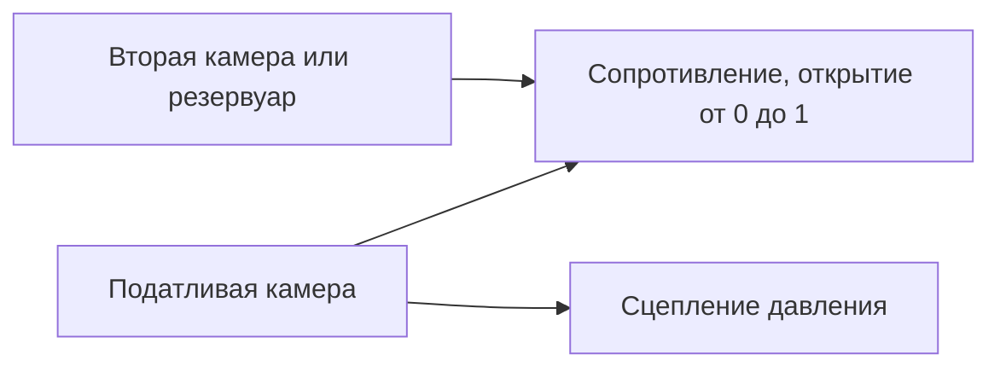

# Гидравлический поток и сцепления давления

[English](HYDRAULIC_NETWORK.md) · [简体中文](HYDRAULIC_NETWORK.zh-CN.md) · [Français](HYDRAULIC_NETWORK.fr.md) · **Русский** · [日本語](HYDRAULIC_NETWORK.ja.md) · [한국어](HYDRAULIC_NETWORK.ko.md) · [Deutsch](HYDRAULIC_NETWORK.de.md) · [Español](HYDRAULIC_NETWORK.es.md) · [Italiano](HYDRAULIC_NETWORK.it.md) · [Português](HYDRAULIC_NETWORK.pt-BR.md)

Управляемая гидравлическая область подаёт давление из решённой сети потока на сцепления переключения и блокировку. Она поддерживает податливые камеры, линейные сопротивления, регуляризованные турбулентные сопротивления, явные резервуары давления и фрикционные сцепления давления. Гидравлическое состояние и журналы участвуют в тех же внутренних интервалах сцепления, полном пакетном откате, ветках и наблюдаемом контракте, что и силовой агрегат со сгоранием.



## Запас давления и объём

У узла `hydraulic` положительный `storage` C в `m3_pa` и неотрицательное начальное избыточное давление в Pa или bar. Все гидравлические давления используют одну и ту же фиксированную опору бака. Подразумеваемых атмосферного давления, свойства жидкости, утечки или параметра OEM нет.

```text
stored reference-volume inventory = C * p
stored elastic pressure energy    = C * p^2 / 2
C * dp/dt                         = sum(incoming Q)
```

C — явная постоянная эффективная податливость. Знакомый предел камеры малого сжатия — `C = V / bulk_modulus`; у податливого исполнительного механизма или линии может быть дополнительный эффективный запас. Power! отслеживает запас опорного объёма, а не полную массу жидкости переменной плотности и не зависящее от температуры уравнение состояния. Отрицательное конечное избыточное давление вне этой модели и отвергает весь пакет; оно никогда не зажимается молча в модель кавитации. Кавитация по абсолютному давлению, захваченный газ и калиброванное поведение жидкости и мембраны остаются открытыми. [Разделители с газовой опорой](GAS_PISTON.ru.md) и [движущиеся гидравлические поршни](HYDRAULIC_PISTON.ru.md) — явные расширения.

Основа сжимаемости описана в [MathWorks Constant Volume Chamber (IL)](https://www.mathworks.com/help/simscape/ref/constantvolumechamberil.html). Его общая модель жидкости шире, чем сведение Power! к постоянной податливости. Значения свойств жидкости по умолчанию и код реализации не копировались.

## Сопротивления, работа источников и теплота

Оба компонента сопротивления соединяют гидравлический `node_a` либо с другим гидравлическим `node_b`, либо с явным резервуаром, когда B опущен или равен нулю. Тогда должно быть задано избыточное давление резервуара. `initial_input` — явная доля открытия в `[0,1]`; необязательный входной канал ею управляет. Нулевое открытие герметично закрывает путь. Утечка должна быть другим явным путём или ненулевым открытием. Необязательный тепловой `heat_node` принимает потерю давления; без стока потеря входит во внешний журнал отвода теплоты.

Для `d = pA - pB` положительный Q течёт от A к B:

```text
hydraulic_resistance: Q = opening * G * d
hydraulic_orifice:    Q = opening * K * d / (d^2 + transition_pressure^2)^(1/4)
restriction loss:     Q * d >= 0
reservoir work:       reservoir_pressure * reference_volume_entering_network
```

G использует `m3_s_pa`, то есть m³/(s·Pa). K использует `m3_s_sqrt_pa`, то есть m³/(s·sqrt(Pa)). Давление перехода отверстия должно быть положительным и имеет явные единицы давления. Оно регуляризует ламинарный предел, держит производную потока конечной при нулевом перепаде и приближается к знаковому течению по квадратному корню при большом перепаде. Коэффициенты могут быть нулём. Power! вычисляет знаменатель масштабированной арифметикой, чтобы не возводить в квадрат огромные давления.

Гладкая форма сопротивления следует пределу большого отверстия, постоянной плотности и отсутствия восстановления давления, описанному в [MathWorks Local Restriction (IL)](https://www.mathworks.com/help/simscape/ref/localrestrictionil.html). K задаётся напрямую; Power! не выдумывает плотность, вязкость, число Рейнольдса или измерения площади. Идентификация по геометрии и свойствам остаётся будущей работой.

Фиксированные резервуары — внешние границы мощности. Их работа учитывается и в `hydraulic_work`, и в глобальной `source_work`; это не смоделированный двигатель или электрический насос. Насос от вала в итоге должен обменивать равные механическую и гидравлическую работы, а работа электрического насоса должна включать электрическую цепь и нагрузку управления.

## Сцепление давления

`hydraulic_clutch` использует существующий ограниченный решатель связей и событий Кулона, с вращательными портами A и B (или опорным тормозом), знаковым отношением и необязательным тепловым стоком. Ему нужны явный гидравлический `pressure_node`, площадь поршня, сила предварительного поджатия, эффективный радиус, коэффициенты статического и скользящего трения и 1–128 поверхностей трения. Прямого входа замыкания нет. Требуемые размерности — площадь, сила и длина; трение и число поверхностей безразмерны. Статическое трение должно быть не меньше скользящего, оба неотрицательны.

```text
normal_force      = max(piston_area * gauge_pressure - preload_force, 0)
static_capacity   = static_friction  * surfaces * effective_radius * normal_force
sliding_capacity  = sliding_friction * surfaces * effective_radius * normal_force
```

Это сведение привода давлением с жёстким контактом. Гидравлический узел несёт явную эффективную податливость, а закон сцепления выводит нормальную силу без немоделируемой задержки команды давления. Он не реализует свободное заполнение, движущиеся нажимные диски, рычаги выключения, инерцию поршня, износ, центробежное давление масла или температурное падение момента. Эти эффекты нуждаются в дополнительных сохраняющих компонентах и измерениях. Ёмкость трения, зависящая от давления, описана в [MathWorks Disc Friction Clutch](https://www.mathworks.com/help/sdl/ref/discfrictionclutch.html); объявленное сведение Power! и пределы решателя — независимые проектные решения.

## Контракт интеграции и транзакций

Ограниченное решение неявной средней точки продвигает все давления камер и потоки сопротивлений вместе. Оно допускает 24 итерации Ньютона и 16 попыток линейного поиска с делением пополам. Допуск остатка давления — `2e-7 + 64*epsilon*(abs(midpoint)+abs(old)) Pa`. Аналитическая производная потока строит якобиан сети. После сходимости парные переносы по рёбрам вместе обновляют состояния камер и журнал опорного объёма. Фактические старое и новое давления средней точки определяют потерю работы давления, совпадающую с изменением запасённой квадратичной энергии. Отрицательная принятая потеря сопротивления или конечное избыточное давление отвергает интервал.

Ёмкости сцепления используют те же давления средней точки интервала. Внутренние попытки захвата повторяют гидравлическое решение на полных пробных копиях состояния; отвергнутые попытки не оставляют истории объёма, работы источников или теплоты. Пересечение давлением порога предварительного поджатия использует приближение ёмкости интервала, поэтому уточнение шага нужно вблизи замыкания и размыкания. Претензии на точное непрерывное время порога нет. Существующие пределы событий и связей сцепления, шестерён, газа и сгорания по-прежнему действуют.

Средние поток и мощность сопротивления взвешиваются по принятым внутренним интервалам и делятся на полный тик. Накопленная теплота использует компенсированное суммирование. Каждый гидравлический узел добавляет одно логическое состояние; каждое сопротивление добавляет три состояния истории. Существующие пределы 32 узлов, 64 компонентов и 64 состояний остаются. Все гидравлические истории копируются и хешируются; неудачные или отменённые пакеты не фиксируют изменений. Успешные шаги, включая захват сцепления, не выделяют управляемой памяти после прогрева.

При `numerical_failure` уменьшите `step_ns` и проверьте податливость, коэффициенты сопротивления, масштабы давления и геометрию сцепления. Неявная средняя точка не гарантирует положительное давление при произвольных размерах шага. Компилятор проверяет размерности и топологию; он не может гарантировать, что каждая будущая команда и шаг останутся численно допустимыми.

## Наблюдаемый и документный контракт

| Объект | Поля | Смысл |
|---|---|---|
| Гидравлический узел | `pressure`, `volume`, `internal_energy` | Избыточное давление, запас опорного объёма C·p, упругая энергия C·p²/2 |
| Сопротивление | `volume_flow`, `heat_flow`, `fluid_heat` | Средний за последний тик поток A→B, средняя мощность потери давления, накопленная потеря |
| Сцепление давления | Существующие поля сцепления; `clamp_force`, `static_capacity`, `sliding_capacity` | Текущие сила и ёмкости, выведенные из давления, плюс принятая история трения |
| Глобально | `hydraulic_volume_in`, `hydraulic_volume_residual`, `hydraulic_work` | Знаковый перенос запаса резервуара, изменение запаса минус перенос, работа давления резервуара |

Средние поток и мощность начинаются с нуля. Смена входов клапана не переписывает средние предыдущего тика и не изменяет мгновенно запасённое давление. Остаток работы источников, теплоты и полной энергии включает гидравлическую сеть рядом с механической, электрической и газовой энергией. Успешно выполненный эксперимент всё ещё может провалить KPI; калибровка остаётся `unverified`.

JSON, фабрики Core, CLI и MCP используют те же определения. Актив v10 сохраняет коэффициенты потока, давления резервуаров, соединения порта давления и геометрию привода; подлинные фикстуры v1–v9 сохраняют прежние отпечатки и повтор. Гидравлические модели добавляют тег отпечатка 11 и объявляют `compliant_hydraulic_powertrain`. Модели без гидравлики сохраняют прежнее поведение решателя и отпечатки.

## Лаборатория и численные свидетельства

Запросите пример MCP `fired-hydraulic` или выполните:

```sh
dotnet src/Power.Cli/bin/Release/net10.0/Power.Cli.dll assets/labs/fired-hydraulic.power.json --output artifacts/reports/fired-hydraulic.json
```

Три камеры 2e-12 m³/Pa и шесть явных турбулентных путей клапанов ведут сцепление солнца с короной, тормоз короны и блокировку гидротрансформатора. Давление питания — 1 MPa избыточных, слив — нуль. Расписания клапанов включают явный промежуток слива и заполнения при каждом переключении; это расписание эксперимента, а не ECU/TCU. Динамика насоса не выводится из фиксированного резервуара питания. Давление растёт и спадает от потока, а не следует команде клапана мгновенно.

Лаборатория 0.8 s использует тики 50,000 ns и точно повторяет все 89 границ через переносимые активы и MCP. Её отпечаток — `01b69cb3abe52211`, конечный хеш состояния — `46a01d103e6159d3`. Конечная скорость коленвала и турбины — 70.94321138 rad/s, скорость нагрузки — 6.75649632 rad/s. Резервуар даёт 8 J гидравлической работы; конечный остаток полной энергии — около `1.09e-9 J`, остаток опорного объёма — около `-1.08e-18 m³`. Все параметры остаются синтетическими и непроверенными.

Тесты покрывают аналитическую зарядку RC и выравнивание в замкнутой сети, точные тождества работы и теплоты, отдельно интегрированный турбулентный переходный процесс RK4, сходимость давления и импульса сцепления второго порядка, предварительное поджатие, захват и размыкание, маршрутизацию теплоты, транзакционный отказ и отмену, ветки и захват без выделений. Переносимые тесты отвергают неверные и отсутствующие физические данные, включая давление резервуара, при допустимых дайджестах. Эксперимент со сгоранием проверяет задержки давления, полные журналы теплоты и объёма и повтор граница за границей. Герметизация всех путей клапанов сохраняет начальные давления и не даёт командованной блокировке появиться без потока.

Studio включает схематичные гидравлические камеры, пути резервуара и клапанов и соединения сцепления давления. Подготовленные тесты импорта и Play всё ещё требуют закреплённый Unity Editor. Ни эти сборки, ни синтетическая лаборатория не завершают топологию DCT/AT, аппаратуру насоса и регулятора, управление, поведение двигателя, калиброванные образцы автомобиля или настольный выпуск.

## Последующее питание от вала

[Приращение насоса и предохранения](HYDRAULIC_PUMP.ru.md) добавляет путь питания от коленвала и совместное решение давления и вала. Лаборатория фиксированного резервуара этого документа остаётся неизменной регрессионной точкой. Потери и управление насоса, золотник регулятора и динамика поршня исполнительного механизма остаются отдельной незавершённой работой.
