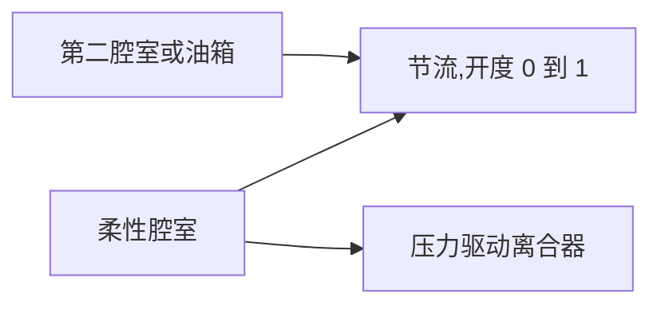

# 液压流动与压力驱动离合器

[English](HYDRAULIC_NETWORK.md) · **简体中文** · [Français](HYDRAULIC_NETWORK.fr.md) · [Русский](HYDRAULIC_NETWORK.ru.md) · [日本語](HYDRAULIC_NETWORK.ja.md) · [한국어](HYDRAULIC_NETWORK.ko.md) · [Deutsch](HYDRAULIC_NETWORK.de.md) · [Español](HYDRAULIC_NETWORK.es.md) · [Italiano](HYDRAULIC_NETWORK.it.md) · [Português](HYDRAULIC_NETWORK.pt-BR.md)

托管液压域把已求解流动网络的压力供给换挡离合器和锁止。它支持柔性腔室、线性节流、正则化湍流节流、显式压力油箱和压力驱动的摩擦离合器。液压状态和账本与点火动力总成一样,参与相同的内部离合器区间、完整批次回滚、分支和可观测契约。



## 压力储存与范围

`hydraulic` 节点有正的 `storage` C,单位 `m3_pa`,以及非负的初始表压,单位 Pa 或 bar。所有液压压力使用同一个固定油箱参考。不推断大气压力、流体物性、泄漏或 OEM 参数。

```text
stored reference-volume inventory = C * p
stored elastic pressure energy    = C * p^2 / 2
C * dp/dt                         = sum(incoming Q)
```

C 是显式的恒定有效柔度。熟悉的小压缩腔室极限是 `C = V / bulk_modulus`;柔性执行器/管路可以有额外的有效储存。Power! 跟踪参考容积存量,而不是完整的变密度液体质量或随温度变化的状态方程。最终表压为负超出本模型,并拒绝完整批次;它从不被悄悄钳位进气蚀模型。绝对压力气蚀、夹带气体、标定的流体/气囊行为仍然开放。[气体支承隔膜](GAS_PISTON.zh-CN.md)和[运动液压活塞](HYDRAULIC_PISTON.zh-CN.md)是显式扩展。

可压缩性基础记录在 [MathWorks Constant Volume Chamber (IL)](https://www.mathworks.com/help/simscape/ref/constantvolumechamberil.html)。其一般液体模型比 Power! 的恒定柔度简化更宽。没有复制流体物性默认值或实现代码。

## 节流、源功与热

两种节流组件都把液压 `node_a` 接到另一个液压 `node_b`,或在 B 省略/为零时接到显式油箱。此时必须指定油箱表压。`initial_input` 是 `[0,1]` 内的显式开度比例;可选输入通道控制它。零开度精确封死该路径。泄漏必须是另一条显式路径,或非零开度。可选热 `heat_node` 接收压力损失;没有汇时,损失进入外部排热账本。

对 `d = pA - pB`,正的 Q 从 A 流向 B:

```text
hydraulic_resistance: Q = opening * G * d
hydraulic_orifice:    Q = opening * K * d / (d^2 + transition_pressure^2)^(1/4)
restriction loss:     Q * d >= 0
reservoir work:       reservoir_pressure * reference_volume_entering_network
```

G 使用 `m3_s_pa`,即 m³/(s·Pa)。K 使用 `m3_s_sqrt_pa`,即 m³/(s·sqrt(Pa))。孔口过渡压力必须为正,并有显式压力单位。它正则化层流极限,使流量导数在压差为零时保持有限,并在大压差下趋近有符号的平方根流量。系数可以为零。Power! 用缩放运算计算分母,以避免对很大的压力求平方。

这一光滑节流形式遵循 [MathWorks Local Restriction (IL)](https://www.mathworks.com/help/simscape/ref/localrestrictionil.html)所记录的大端口、定密度、无压力恢复极限。K 直接给出;Power! 不编造密度、黏度、雷诺数或面积测量。基于几何/物性的辨识仍是以后的工作。

固定油箱是外部功率边界。它们的功同时计入 `hydraulic_work` 和全局 `source_work`;它不是被建模的发动机/电动泵。轴驱动泵最终必须交换相等的机械功与液压功,电动泵运行必须包含电路和控制负载。

## 压力离合器

`hydraulic_clutch` 使用现有的有界库仑约束/事件求解器,带转动 A/B 端口(或接地制动)、有符号速比和可选热汇。它需要显式液压 `pressure_node`、活塞面积、预载力、有效半径、静/滑摩擦系数,以及 1–128 个摩擦面。它没有直接的接合输入。所需量纲是面积、力和长度;摩擦和面数无量纲。静摩擦必须至少等于滑摩擦,二者都非负。

```text
normal_force      = max(piston_area * gauge_pressure - preload_force, 0)
static_capacity   = static_friction  * surfaces * effective_radius * normal_force
sliding_capacity  = sliding_friction * surfaces * effective_radius * normal_force
```

这是刚性接触的压力驱动简化。液压节点携带显式有效柔度,离合器定律导出法向力,没有未建模的压力指令滞后。它不实现自由充油、运动压盘、分离杠杆、活塞惯量、磨损、离心油压或温度衰减。这些效应需要额外的守恒组件和测量。压力相关的摩擦容量记述于 [MathWorks Disc Friction Clutch](https://www.mathworks.com/help/sdl/ref/discfrictionclutch.html);Power! 声明的简化和求解器限制是独立的设计决定。

## 积分与事务契约

有界隐式中点求解一起推进全部腔室压力和节流流量。它允许 24 次牛顿迭代和 16 次折半线搜索尝试。压力残差容差为 `2e-7 + 64*epsilon*(abs(midpoint)+abs(old)) Pa`。解析流量导数构成网络雅可比。收敛之后,成对的边传输一起更新腔室状态和参考容积账本。实际的旧/新中点压力决定压力功损失,与所储存的二次能量变化一致。被接受的节流损失为负,或最终表压为负,都会拒绝该区间。

离合器容量使用这些相同的区间中点压力。内部捕获尝试在完整的试探状态副本上重复液压求解;被拒绝的尝试不留下容积、源功或热历史。压力越过预载阈值时使用区间容量近似,因此在接合和释放附近需要细化时间步。不声称精确的连续阈值定时。现有的离合器事件/约束、齿轮、气体和燃烧限制仍然适用。

平均节流流量和功率在被接受的内部区间上加权,再除以完整节拍。累计热量使用补偿求和。每个液压节点增加一个逻辑状态;每个节流增加三个历史状态。现有的 32 节点、64 组件和 64 状态限制保持不变。全部液压历史都被复制并哈希;失败或取消的批次不提交任何更改。成功的步进,包括离合器捕获,在预热之后不分配托管内存。

遇到 `numerical_failure` 时,减小 `step_ns`,并检查柔度、节流系数、压力尺度和离合器几何。隐式中点并不保证在任意步长下压力为正。编译器检查量纲和拓扑;它不能保证每一个未来的指令/时间步在数值上仍然可接受。

## 可观测与文档契约

| 对象 | 字段 | 含义 |
|---|---|---|
| 液压节点 | `pressure`、`volume`、`internal_energy` | 表压、C·p 参考容积存量、C·p²/2 弹性能 |
| 节流 | `volume_flow`、`heat_flow`、`fluid_heat` | 上一节拍的平均流量 A→B、平均压力损失功率、累计损失 |
| 压力离合器 | 现有离合器字段;`clamp_force`、`static_capacity`、`sliding_capacity` | 当前由压力导出的力/容量,加上已接受的摩擦历史 |
| 全局 | `hydraulic_volume_in`、`hydraulic_volume_residual`、`hydraulic_work` | 有符号油箱存量转移、存量变化减去转移、油箱压力功 |

平均流量/功率从零开始。改变阀门输入不改写上一节拍的平均值,也不瞬时改变所储存的压力。源功、热和总能量残差把液压网络与机械、电气和气体能量放在一起。成功执行的实验仍可能未通过 KPI;标定仍为 `unverified`。

JSON、Core 工厂、CLI 和 MCP 使用同一套定义。资产 v10 保留流量系数、油箱压力、压力端口连接和执行器几何;真实的 v1–v9 夹具保留更早的指纹/回放。液压模型增加指纹标签 11,并通告 `compliant_hydraulic_powertrain`。不含液压的模型保持其先前的求解器行为和指纹。

## 实验室与数值证据

请求 MCP 示例 `fired-hydraulic`,或运行:

```sh
dotnet src/Power.Cli/bin/Release/net10.0/Power.Cli.dll assets/labs/fired-hydraulic.power.json --output artifacts/reports/fired-hydraulic.json
```

三个 2e-12 m³/Pa 腔室和六条显式湍流阀门路径操作太阳轮/齿圈离合器、齿圈制动和变矩器锁止。供油压力为 1 MPa 表压,排油为零。阀门时序在每次换挡中包含显式的释放/充油间隙;这是实验时序,不是 ECU/TCU。不从固定供油油箱推断泵动力学。压力由流动上升和衰减,而不是瞬时跟随阀门指令。

这个 0.8 s 实验室使用 50,000 ns 节拍,并经可移植资产和 MCP 精确回放全部 89 个边界。其指纹为 `01b69cb3abe52211`,最终状态哈希为 `46a01d103e6159d3`。最终曲轴/涡轮转速为 70.94321138 rad/s,负载转速为 6.75649632 rad/s。油箱供给 8 J 液压功;最终总能量残差约为 `1.09e-9 J`,参考容积残差约为 `-1.08e-18 m³`。全部参数仍是合成的,且为 `unverified`。

测试覆盖解析 RC 充电和封闭网络均衡、精确的功/热恒等式、分开积分的 RK4 湍流瞬态、二阶压力和离合器冲量收敛、预载、捕获/释放、热路径、事务性失败/取消、分支和零分配捕获。可移植测试拒绝畸形和缺失的物理数据,包括油箱压力,并具有有效摘要。点火实验核验压力延迟、完整的热与容积账本,以及逐边界回放。封死全部阀门路径会保持初始压力,并防止没有流动时出现受指令的锁止。

Studio 包含示意液压腔室、油箱/阀门路径和压力离合器连接。已准备的导入/Play 测试仍需要锁定的 Unity 编辑器。这些程序集或一个合成实验室都没有完成 DCT/AT 拓扑、泵/调节器硬件、控制、发动机行为、标定车辆样本或桌面发布。

## 随后的轴驱动供油

[泵/泄压增量](HYDRAULIC_PUMP.zh-CN.md)增加曲轴驱动的供油路径和联合压力/轴求解。本文的固定油箱实验室仍是不变的回归检查点。泵损失/控制、调节滑阀和执行活塞动力学仍是分开的未完成工作。
