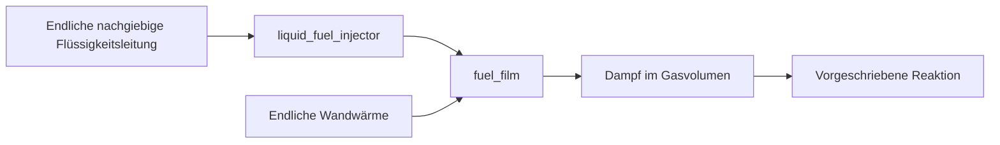

# Endliche Flüssigkeitsleitung, Zykluseinspritzung und Filmnachschub

[English](LIQUID_FUEL_INJECTION.md) · [简体中文](LIQUID_FUEL_INJECTION.zh-CN.md) · [Français](LIQUID_FUEL_INJECTION.fr.md) · [Русский](LIQUID_FUEL_INJECTION.ru.md) · [日本語](LIQUID_FUEL_INJECTION.ja.md) · [한국어](LIQUID_FUEL_INJECTION.ko.md) · **Deutsch** · [Español](LIQUID_FUEL_INJECTION.es.md) · [Italiano](LIQUID_FUEL_INJECTION.it.md) · [Português](LIQUID_FUEL_INJECTION.pt-BR.md)

`liquid_fuel_injector` fördert Flüssigkeit aus einer endlichen nachgiebigen Leitung in einen
getrennten [Kraftstofffilm](FUEL_FILM.de.md). Ein Vorwärts-Kurbelfenster verriegelt eine angeforderte
Masse je Zyklus. Tatsächlicher Empfängerdruck, Düsengeometrie, verbleibendes Leitungsinventar
und Druckenergie bestimmen die Förderung. Der Film heizt und
verdampft die Flüssigkeit anschließend; die bestehende vorgeschriebene Reaktion verbraucht nur Dampf.

Das verbindet Förderung, Phasenwechsel und Reaktion und hält jedes Inventar
und jeden Energietransfer beobachtbar. Es ist ein Forschungsmodell mit konstanter Dichte und Nachgiebigkeit.
Pumpe und Nachfüllung der Leitung, gemessene Eigenschaften, verfeinerte magnetische und elektronische Ansteuerung,
Spray und Mitreißen, Kavitation, Zündung und ECU sowie kalibrierte Benzinhardware
bleiben erforderliche Arbeit auf dem Weg zum vollständigen Antriebsstrangziel.



## Gleichungen von Leitung und Düse

Die Leitung hat eine konstante Flüssigkeitsdichte `rho`, eine positive Nachgiebigkeit `C` in m3/Pa,
eine Anfangsmasse `m0` und einen absoluten Anfangsdruck `P0`. Ihr Referenzvolumen beim Druck null
muss nichtnegativ sein:

```text
V_reference = m0 / rho - C P0
m_rail = m0 - total_delivered_mass
P_rail = P0 - total_delivered_mass / (rho C)
E_pressure = C P_rail^2 / 2
```

Das erklärt die Nachgiebigkeitsreferenz explizit beim absoluten Druck null;
es schließt weder auf einen umgebenden Stützdruck noch auf ein Kennfeld des Kompressionsmoduls oder eine Leitungspumpe.
Das endliche nachgiebige Volumen gehört zum gelieferten Satz der Forschungsparameter.
Die Druckenergie gehört zur Bilanz der gespeicherten Energie, getrennt vom kalorischen
und chemischen Inventar. Die Quellflüssigkeit bleibt auf ihrer gelieferten Temperatur;
ihre kalorische Energie geht mit der geförderten Flüssigkeit, und es gibt in diesem Inkrement keine Leitungsheizung
und kein temperaturabhängiges Eigenschaftskennfeld.

Bei Vorwärtsöffnung verwendet die einseitige quasistationäre Düse:

```text
mass_rate = Cd A sqrt(2 rho (P_rail - P_receiver))
```

Der Strom ist null, wenn der Leitungsdruck nicht größer als der Empfängerdruck ist.
Dichte und Druck haben explizite Einheiten. Diese Druck-/Geschwindigkeitsbeziehung beruht
auf der inkompressiblen Energiereduktion in
[der Bernoulli-Herleitung der NASA](https://www1.grc.nasa.gov/beginners-guide-to-aeronautics/bernoullis-equation/).
`Cd` ist ein gelieferter positiver Koeffizient nicht größer als eins; er belegt kein
gemessenes Düsenverhalten und löst Impuls, Nadelbewegung oder Kavitation nicht auf.

Bei festem Empfängerdruck innerhalb eines Einspritzteilschritts hat die Druckhöhe eine
analytische Lösung. Sei `r0 = sqrt(P_rail - P_receiver)`:

```text
r1 = max(0, r0 - Cd A h / (C sqrt(2 rho)))
available_mass = rho C (r0^2 - r1^2)
```

Die angenommene Masse ist durch diesen verfügbaren Betrag, das verbleibende Zykluskontingent und
das verbleibende Quellinventar begrenzt. Das Gesetz löst die Erschöpfung der Druckhöhe auf, ohne
negative Druckhöhe zuzulassen oder Kraftstoff zu erfinden. Die Annahme der angeforderten Dosis ist von der
tatsächlichen Förderung getrennt; unzureichender Druck kann ein Kontingent ungefüllt lassen.

## Fühlbare, chemische und Druckenergie

Der empfangende Film bestimmt die verträgliche kalorische Flüssigkeitsreferenz:
`u_supply = c_liquid T_supply + e_offset`. Seine Temperatur muss positiv sein und
nicht größer als die erklärte Sättigungstemperatur des Films. Eingespritzte Masse addiert
`delta_m * u_supply` zur thermischen Filmenergie und überträgt dasselbe chemische
Inventar intern. Sie geht nicht in externe Kraftstoff- oder Enthalpiebilanzen ein und reagiert nicht
vor der Verdampfung.

Für das geförderte Flüssigkeitsvolumen `delta_V = delta_m / rho` ist die angenommene Arbeit:

```text
W_rail = (P_before - delta_V / (2 C)) delta_V
W_receiver = P_receiver delta_V
Q_nozzle = W_rail - W_receiver
```

`W_rail` ist genau die Abnahme der gespeicherten Druckenergie der Leitung. Nichtnegative
Düsenwärme geht in die endliche thermische Wand des Films. Die Druckarbeit der Leitung ist intern
und wird nicht noch einmal als externe Quellenarbeit gezählt.

Der bestehende Filmvertrag vernachlässigt das Flüssigkeitsverdrängungsvolumen in der Gasgeometrie.
Entsprechend exportiert dieser Injektor `W_receiver` über eine explizite
Grenze der Empfänger-Druckarbeit. Die globale Quellenarbeit erhält `-W_receiver`; Gasvolumen
und Kurbelarbeit werden nicht stillschweigend erhöht. Das ist eine erklärte Reduktion der Schnittstelle,
kein Nachweis für aufgelöste Tropfenverdrängung oder Sprayimpuls.
Eine künftige Gaskopplung mit endlichem Flüssigkeitsvolumen muss diese Grenze durch tatsächliche
Geometrie und Druckarbeit in einem getrennt verifizierten Vertrag ersetzen.

Kalorische, Druck- und chemische Energie bleiben verschieden. Die Notwendigkeit, Druckarbeit
neben der inneren Energie zu behalten, folgt der Beziehung `h = u + p/rho`, erklärt in
[Modelicas Dokumentation inkompressibler Medien](https://doc.modelica.org/Modelica%204.0.0/Resources/helpWSM/Modelica/Modelica.Media.Incompressible.html).
Die volle Bilanz von Leitung, Film, Gas und Thermik gleicht die exportierte Arbeit aus, ohne
Phasenwärme, Düsendissipation oder Druckenergie als Reaktionswärme des Kraftstoffs zu behandeln.

## Definitions- und Zeitvertrag

| Daten | Anforderung |
|---|---|
| `node_a` | Verfolgter Gasempfänger, der zum Zielfilm gehört |
| `film_component` | Bestehende Komponente `fuel_film` an diesem Empfänger |
| `crank_node` | Rotierende Zeitreferenz; ein Kurbelzylinder verwendet seine eigene Kurbel |
| `cycle_angle`, `start_angle`, `duration_angle` | Explizite Winkel; Zyklus von 360/720 Grad und begrenzte positive Dauer |
| `maximum_dose`, `initial_input` | Positives Maximum und nichtnegative angeforderte kg je Zyklus |
| `initial_mass` | Positives anfängliches Leitungsinventar in kg |
| `supply_temperature` | Flüssigkeit in K im Intervall `(0,film_saturation]` |
| `liquid_density` | Positive kg/m3, JSON-Einheit `kg_m3` |
| `initial_pressure` | Positiver absoluter Druck in Pa/bar |
| `pressure_compliance` | Positive m3/Pa, JSON-Einheit `m3_pa` |
| `area`, `discharge_coefficient` | Positive m2/mm2 und Koeffizient in `(0,1]` |

Alle Größen sind erforderlich. Der Injektor hat eine Dosiseingabe in `kg`, kein `node_b` und
keine unabhängige Wärmesenke; Düsenwärme geht in die Wand seines Zielfilms. Unbeteiligte
Parameter, falsche Einheiten, Domänen oder Filmzugehörigkeit, überhitzte Zufuhr, unmögliches
Referenzvolumen und nicht unterstützte Zustandskapazität werden mit Objekt-/Felddiagnosen abgelehnt. Core-Clients verwenden `LiquidFuelMeter`, `LiquidFuelInjectorDefinition`
und das unabhängige Gesetz `CompliantLiquidRail`.

Das gemeinsame [Dosisprofil](FUEL_METERING.de.md) verriegelt einen Befehl einmal in jedem beobachteten
Vorwärtsfenster. Änderungen mitten im Fenster gelten für einen späteren Zyklus. Umkehr schließt den Strom
und kann ein bereits beobachtetes Kontingent nicht erneut vergeben. Der Weg je mechanischem Intervall ist
durch `min(0.25 rad,duration/8)` begrenzt, und Zyklusordnungszahlen bleiben darstellbar.
Fensterendpunkte verwenden Abtastung auf festem Tick und brauchen eine getrennte Ereignisverfeinerung.

## Integration und Transaktionen

Das Intervall verwendet die Halbschritte Einspritzung / Film / Gas / Mechanik-und-Reaktion / Gas / Film /
Einspritzung. Die Durchläufe von Injektor und Film kehren in der zweiten Hälfte die Reihenfolge um.
Düsenwärme ändert die endliche Filmwand während dieser Teilschritte; die Verdampfung zahlt
ihr Wärmebudget von dieser Wand. Unabhängige gleichzeitige Integration gewöhnlicher Differentialgleichungen prüft
glatte Verfeinerung zweiter Ordnung für Leitung, Film, Gas und die Transfers von Druck und Wärme.
Andere Gas-Wand- und thermische Quellen behalten die bestehende Genauigkeitsgrenze der expliziten Wand.
Ereignisse und Erschöpfung erben keinen einheitlichen Anspruch zweiter Ordnung.

Jeder Injektor ergänzt neun Einträge zum begrenzten gemeldeten Zustandsbudget: die bestehenden
sechs Einträge für Kontingent und Förderung und drei kumulative Historien von Druck und Wärme. Quellmasse
und Druck leiten sich aus der kompensierten Gesamtförderung ab. Alle Kompensation, Zyklusordnungszahlen,
gehaltene Ziele und mittleren Ströme werden mit der Simulation kopiert, gehasht und zurückgerollt,
einschließlich spekulativer Kupplungsintervalle. Aktive Förderung und Momentaufnahmen nach dem Aufwärmen
allokieren keinen verwalteten Speicher. Abbruch, später Fehler, abgelehnte Schreibvorgänge und
unabhängige Verzweigungen erhalten die vollständigen physikalischen und Reglerhistorien.

## Kanäle und portable Assets

IDs und Einheiten über Validierung oder Sitzungserzeugung auffinden. Ausgaben des Injektors sind:

- Verbleibende Quell-`mass`, absoluter `pressure`, gelieferte `temperature` und flüssiges `volume`.
- `internal_energy` für kalorische Energie der Quelle plus Druckenergie; `chemical_energy` getrennt.
- Fenster-`opening`, mittlerer `mass_flow` des letzten Ticks, verriegelte `requested_fuel_dose`,
  `delivered_fuel_dose` und kumulative `total_fuel_delivered`.
- `source_work` für freigesetzte Druckarbeit der Leitung, `hydraulic_work` für exportierte
  Empfänger-Druckarbeit und `fluid_heat` für Düsendissipation.

Diese Komponentenfelder haben andere Bedeutungen als die globale externe Quellenarbeit.
Globale Kanäle für Masse, Kraftstoff und chemische Energie schließen die verbleibende flüssige Quelle,
den Film und die gewöhnlichen Inventare von Gas und Reaktion ein.

Asset v19 schreibt je Flüssigeinspritzer einen typisierten Leitungs-/Steuerzeitdatensatz von 120 Byte, dazu
seinen bestehenden Düsendatensatz von 36 Byte. Der Encoder und die behaltenen Leser für v1-v18 prüfen
begrenzte Anzahlen und Länge, Digest, vollständige typisierte Abdeckung, Einheiten, Zugehörigkeit und gefälschte
Herabstufungen. Ein authentisches Film-Fixture v18 behält seinen Fingerabdruck und das aufgewertete
Replay derselben Laufzeit. Siehe [ASSET_FORMAT.de.md](ASSET_FORMAT.de.md).

## Laboratorium und Abnahme

`liquid-injected-cylinder` beginnt mit einem trockenen Film und einer endlichen unter Druck stehenden Quelle.
Getrennte Luftzufuhr, Zyklus-Dosisanforderungen, wandbegrenzte Dampfverfügbarkeit und
vorgeschriebene Reaktion treiben dasselbe Kurbel- und Lastmodell wie andere Laboratorien. JSON,
CLI, portable Assets und der tatsächliche MCP-Server teilen seine Definitionen und Replay-
Grenzen. Alle Parameter bleiben `unverified`.

Analytischer Druckabbau und Arbeit, Dosis, Umkehr und Erschöpfung, unabhängige gekoppelte
Verfeinerung, vollständige Bilanzen von Quelle, Film, Konstituenten und Energie, aktive Allokationsgrenzen
und Rollback spekulativer Kupplungen werden geprüft. [VALIDATION.de.md](VALIDATION.de.md)
hält die beobachteten Ergebnisse fest. Vorbereitete Unity-Ansichten von Leitung und Düse sowie Lebenszyklusprüfungen
verlangen weiterhin tatsächlichen Nachweis für Editor, Play und Player. Nachfüllung und Pumpen der Leitung, Nadeldynamik,
aufgelöstes Spray und Verdrängung, Zündung und ECU, vollständiges Getriebe und Regelung sowie gemessene
Antriebsstränge bleiben unfertig.

## Erweiterung um die physische Nadel

Die optionale Nadeldefinition verbindet die Förderung mit dem tatsächlichen translatorischen Hub.
Ein [Solenoid, elastische Anschläge und ein abgetasteter Treiber](NEEDLE_ACTUATION.de.md) liefern diese
Bewegung nun. In diesem Modus ist die angeforderte Dosis ein Reglerziel; sie begrenzt den physischen
Strom während Schließverzug, Abprall oder Umkehr nicht. Der ideale kontingentbegrenzte Pfad bleibt
getrennt und unverändert. Verfeinertes magnetisches, Treiber- und Sprayverhalten sowie die Kalibrierung
bleiben offen.
