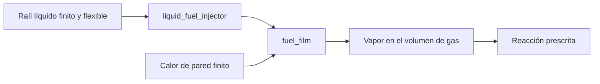

# Raíl líquido finito, inyección por ciclo y reposición de película

[English](LIQUID_FUEL_INJECTION.md) · [简体中文](LIQUID_FUEL_INJECTION.zh-CN.md) · [Français](LIQUID_FUEL_INJECTION.fr.md) · [Русский](LIQUID_FUEL_INJECTION.ru.md) · [日本語](LIQUID_FUEL_INJECTION.ja.md) · [한국어](LIQUID_FUEL_INJECTION.ko.md) · [Deutsch](LIQUID_FUEL_INJECTION.de.md) · **Español** · [Italiano](LIQUID_FUEL_INJECTION.it.md) · [Português](LIQUID_FUEL_INJECTION.pt-BR.md)

`liquid_fuel_injector` entrega líquido desde un raíl flexible finito a una
[película de combustible](FUEL_FILM.es.md) aparte. Una ventana de cigüeñal hacia adelante enclava una masa
solicitada por ciclo. La presión real del receptor, la geometría de la tobera, el inventario restante
del raíl y la energía de presión determinan la entrega. La película calienta después y
evapora el líquido; la reacción prescrita existente solo consume vapor.

Esto conecta la entrega, el cambio de fase y la reacción, y mantiene observable cada inventario
y cada transferencia de energía. Es un modelo de investigación de densidad y flexibilidad constantes. La alimentación opcional por bomba usa una frontera externa explícita de materia/calor. Agotamiento, eficiencia/regulación de bomba, pérdidas de línea, cavitación, propiedades dependientes de presión y spray de volumen finito siguen abiertos. Parámetros `unverified`; no se acredita calibración OEM ni aceptación real Unity Editor/Play/Player/IL2CPP.



## Ecuaciones del raíl y de la tobera

El raíl tiene densidad líquida constante `rho`, flexibilidad positiva `C` en m3/Pa,
masa inicial `m0` y presión absoluta inicial `P0`. Su volumen de referencia a presión
nula debe ser no negativo:

Sin alimentación por bomba, el raíl sigue estas ecuaciones y conserva la temperatura suministrada.

```text
V_reference = m0 / rho - C P0
m_rail = m0 - total_delivered_mass
P_rail = P0 - total_delivered_mass / (rho C)
E_pressure = C P_rail^2 / 2
```

Esto declara de forma explícita la referencia de flexibilidad a presión absoluta nula;
no infiere una presión de respaldo ambiente, un mapa de módulo de compresibilidad ni una bomba de raíl.
El volumen flexible finito forma parte del conjunto de parámetros de investigación suministrado.
La energía de presión pertenece al libro de energía almacenada, aparte del inventario
calórico y químico. El líquido de la fuente permanece a la temperatura suministrada;
su energía calórica sale con el líquido entregado y en este incremento no hay calentamiento del raíl
ni un mapa de propiedades dependiente de la temperatura.

En la apertura hacia adelante, la tobera cuasiestacionaria unidireccional usa:

```text
mass_rate = Cd A sqrt(2 rho (P_rail - P_receiver))
```

El flujo es cero cuando la presión del raíl no es mayor que la presión del receptor.
La densidad y la presión tienen unidades explícitas. Esta relación de presión y velocidad se
basa en la reducción de energía incompresible descrita por
[la derivación de Bernoulli de la NASA](https://www1.grc.nasa.gov/beginners-guide-to-aeronautics/bernoullis-equation/).
`Cd` es un coeficiente positivo suministrado no mayor que uno; no establece
un comportamiento medido de la tobera ni resuelve la cantidad de movimiento, el movimiento de la aguja ni la cavitación.

Para una presión de receptor fija dentro de un subpaso de inyección, la carga de presión tiene una
solución analítica. Sea `r0 = sqrt(P_rail - P_receiver)`:

```text
r1 = max(0, r0 - Cd A h / (C sqrt(2 rho)))
available_mass = rho C (r0^2 - r1^2)
```

La masa aceptada está acotada por esa cantidad disponible, la cuota restante del ciclo y
el inventario restante de la fuente. La ley resuelve el agotamiento de la carga de presión sin permitir
una carga de presión negativa ni inventar combustible. Aceptar la dosis solicitada es distinto de
la entrega real; una presión insuficiente puede dejar una cuota sin llenar.

## Energía sensible, química y de presión

La película receptora determina la referencia calórica líquida compatible:
`u_supply = c_liquid T_supply + e_offset`. Su temperatura debe ser positiva y
no mayor que la temperatura de saturación declarada de la película. La masa inyectada añade
`delta_m * u_supply` a la energía térmica de la película y transfiere el mismo inventario
químico de forma interna. No entra en los libros externos de combustible o de entalpía ni reacciona
antes de la evaporación.

Para un volumen de líquido entregado `delta_V = delta_m / rho`, el trabajo aceptado es:

```text
W_rail = (P_before - delta_V / (2 C)) delta_V
W_receiver = P_receiver delta_V
Q_nozzle = W_rail - W_receiver
```

`W_rail` es igual a la disminución exacta de la energía de presión almacenada del raíl. El calor
no negativo de la tobera entra en la pared térmica finita de la película. El trabajo de presión del raíl es interno
y no se cuenta de nuevo como trabajo de fuente externo.

El contrato de película existente desprecia el volumen de desplazamiento líquido en la geometría
del gas. En consecuencia, este inyector exporta `W_receiver` a través de una frontera explícita
de trabajo de presión del receptor. El trabajo de fuente global recibe `-W_receiver`; el volumen
de gas y el trabajo del cigüeñal no se aumentan en silencio. Es una reducción de interfaz
declarada, no evidencia de un desplazamiento de gotas resuelto ni de la cantidad de movimiento de la pulverización.
Un acoplamiento futuro de gas con volumen líquido finito debe sustituir esta frontera por la geometría
y el trabajo de presión reales, en un contrato verificado por separado.

La energía calórica, la de presión y la química permanecen distintas. La necesidad de conservar el trabajo de presión
junto a la energía interna sigue la relación `h = u + p/rho` explicada en
[la documentación de medios incompresibles de Modelica](https://doc.modelica.org/Modelica%204.0.0/Resources/helpWSM/Modelica/Modelica.Media.Incompressible.html).
El libro completo de raíl, película, gas y térmica equilibra el trabajo exportado, sin tratar
el calor de fase, la disipación de la tobera ni la energía de presión como calor de reacción del combustible.

## Contrato de definición y de temporización

| Dato | Requisito |
|---|---|
| `node_a` | Receptor de gas rastreado que pertenece a la película de destino |
| `film_component` | Componente `fuel_film` existente en ese receptor |
| `crank_node` | Referencia rotacional de temporización; un cilindro de cigüeñal usa su propio cigüeñal |
| `cycle_angle`, `start_angle`, `duration_angle` | Ángulos explícitos; ciclo de 360/720 grados y duración positiva acotada |
| `maximum_dose`, `initial_input` | Máximo positivo y kg solicitados no negativos por ciclo |
| `initial_mass` | Inventario inicial positivo del raíl, en kg |
| `supply_temperature` | K del líquido en `(0,film_saturation]` |
| `liquid_density` | kg/m3 positivos, unidad JSON `kg_m3` |
| `initial_pressure` | Pa/bar absolutos positivos |
| `pressure_compliance` | m3/Pa positivos, unidad JSON `m3_pa` |
| `area`, `discharge_coefficient` | m2/mm2 positivos y coeficiente en `(0,1]` |

Todas las cantidades son obligatorias. El inyector tiene una entrada de dosis en `kg`, no tiene `node_b` ni
sumidero de calor independiente; el calor de la tobera entra en la pared de su película de destino. Los parámetros
no relacionados, las unidades, los dominios o la propiedad de la película incorrectos, un suministro sobrecalentado, un volumen
de referencia imposible y una capacidad de estado no admitida se rechazan con diagnósticos de objeto y campo.
Los clientes de Core usan `LiquidFuelMeter`, `LiquidFuelInjectorDefinition`
y la ley independiente `CompliantLiquidRail`.

El [perfil de dosis](FUEL_METERING.es.md) compartido enclava un comando una vez en cada ventana
hacia adelante observada. Los cambios a mitad de ventana se aplican a un ciclo posterior. La inversión cierra el flujo
y no puede reemitir una cuota ya observada. El recorrido por intervalo mecánico está
acotado por `min(0.25 rad,duration/8)` y los ordinales de ciclo siguen siendo representables.
Los extremos de la ventana usan un muestreo de tick fijo y necesitan un refinamiento de eventos aparte.

## Integración y transacciones

El intervalo usa medios pasos de inyección / película / gas / mecánica y reacción / gas / película /
inyección. Los barridos del inyector y de la película invierten el orden en el segundo medio.
El calor de la tobera cambia la pared finita de la película durante estos subpasos; la evaporación paga
su presupuesto de calor desde esa pared. Una integración simultánea e independiente de EDO verifica
el refinamiento suave de segundo orden para el raíl, la película, el gas y las transferencias de presión y de calor.
Otras fuentes de pared de gas y térmicas conservan el límite de precisión existente de la pared explícita.
Los eventos y el agotamiento no heredan una afirmación uniforme de segundo orden.

Cada inyector añade nueve entradas al presupuesto de estado informado y acotado: las seis
entradas existentes de cuota y de entrega, y tres historiales acumulados de presión y de calor. La masa
y la presión de la fuente se derivan de la entrega total compensada. Toda la compensación, los ordinales
de ciclo, los objetivos enclavados y los flujos medios se copian, se hashean y se revierten con la simulación,
incluidos los intervalos especulativos de embrague. La entrega activa en caliente y las instantáneas
no asignan memoria administrada. La cancelación, el fallo tardío, las escrituras rechazadas y
las bifurcaciones independientes conservan los historiales físicos y de controlador completos.

## Canales y assets portátiles

Descubre los identificadores y las unidades mediante la validación o la creación de la sesión. Las salidas del inyector son:

- `mass` restante de la fuente, `pressure` absoluta, `temperature` suministrada y `volume` líquido.
- `internal_energy` para la energía calórica de la fuente más la de presión; `chemical_energy` por separado.
- `opening` de la ventana, `mass_flow` medio del último tick, `requested_fuel_dose` enclavada,
  `delivered_fuel_dose` y `total_fuel_delivered` acumulado.
- `source_work` para el trabajo de presión del raíl liberado, `hydraulic_work` para el trabajo de presión
  del receptor exportado y `fluid_heat` para la disipación de la tobera.

Estos campos de componente tienen significados distintos del trabajo de fuente externo global.
Los canales globales de masa, de combustible y de energía química incluyen la fuente líquida restante,
la película y los inventarios normales de gas y de reacción.

El asset v19 escribe un registro tipado de raíl y temporización de 120 bytes por inyector líquido, además
de su registro de tobera existente de 36 bytes. El codificador y los lectores v1-v18 conservados comprueban
cuentas y longitud acotadas, el resumen, la cobertura tipada completa, las unidades, la propiedad y las degradaciones
falsificadas. Un fixture auténtico de película v18 conserva su huella y la repetición
actualizada en el mismo runtime. Consulta [ASSET_FORMAT.es.md](ASSET_FORMAT.es.md).

## Laboratorio y aceptación

`liquid-injected-cylinder` empieza con una película seca y una fuente presurizada finita.
La admisión de aire aparte, las solicitudes de dosis por ciclo, la disponibilidad de vapor limitada por la pared y
la reacción prescrita accionan el mismo modelo de cigüeñal y carga que los demás laboratorios. JSON,
la CLI, los assets portátiles y el servidor MCP real comparten sus definiciones y sus límites
de repetición. Todos los parámetros siguen siendo `unverified`.

Trabajo de eje, presión y almacenamiento térmico mezclado tienen pruebas de conservación y ODE independientes; la aceptación Unity real sigue pendiente. [VALIDATION.es.md](VALIDATION.es.md) La fuente es una frontera externa explícita, no un tanque finito modelado. Agotamiento, eficiencia/regulación de bomba, pérdidas de línea, cavitación, propiedades dependientes de presión y spray de volumen finito siguen abiertos. Parámetros `unverified`; no se acredita calibración OEM ni aceptación real Unity Editor/Play/Player/IL2CPP.

## Extensión de aguja física

La definición opcional de aguja conecta la entrega con la elevación de traslación real.
Un [solenoide, topes elásticos y un controlador muestreado](NEEDLE_ACTUATION.es.md) aportan ahora ese
movimiento. En este modo, la dosis solicitada es un objetivo del controlador; no limita el flujo físico
durante el retardo de cierre, el rebote ni la inversión. El camino ideal limitado por cuota permanece
aparte y sin cambios. El comportamiento magnético, de controlador y de pulverización refinado, y la calibración,
siguen abiertos.

## Raíl de combustible líquido alimentado por bomba

`liquid_rail_feed` asocia un inyector líquido con una bomba de desplazamiento existente y una frontera explícita de materia/calor. El nodo de salida hidráulica debe coincidir con la compliancia y presión absoluta inicial del raíl. Bomba e inyector poseen ese nodo; otras rutas fluidas no contabilizadas se rechazan.

v26 conserva enlaces y temperatura de fuente y lee v1-v25. Intercambio analítico eje/presión, refinamiento ODE simultáneo independiente, mezcla térmica, balances masa/combustible/energía/volumen, retorno y rollback completo tienen verificaciones separadas.

La fuente es una frontera externa explícita, no un tanque finito modelado. Agotamiento, eficiencia/regulación de bomba, pérdidas de línea, cavitación, propiedades dependientes de presión y spray de volumen finito siguen abiertos. Parámetros `unverified`; no se acredita calibración OEM ni aceptación real Unity Editor/Play/Player/IL2CPP.

[PUMP_FED_FUEL.es.md](PUMP_FED_FUEL.es.md)
