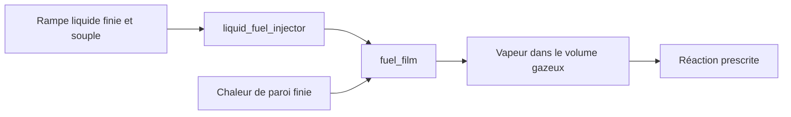

# Rampe liquide finie, injection par cycle et réalimentation du film

[English](LIQUID_FUEL_INJECTION.md) · [简体中文](LIQUID_FUEL_INJECTION.zh-CN.md) · **Français** · [Русский](LIQUID_FUEL_INJECTION.ru.md) · [日本語](LIQUID_FUEL_INJECTION.ja.md) · [한국어](LIQUID_FUEL_INJECTION.ko.md) · [Deutsch](LIQUID_FUEL_INJECTION.de.md) · [Español](LIQUID_FUEL_INJECTION.es.md) · [Italiano](LIQUID_FUEL_INJECTION.it.md) · [Português](LIQUID_FUEL_INJECTION.pt-BR.md)

`liquid_fuel_injector` livre du liquide depuis une rampe finie et souple vers un
[film de carburant](FUEL_FILM.fr.md) distinct. Une fenêtre de vilebrequin en marche avant verrouille une masse
demandée par cycle. La pression réelle du récepteur, la géométrie de buse, l'inventaire de rampe
restant et l'énergie de pression déterminent la livraison. Le film chauffe ensuite et
évapore le liquide ; la réaction prescrite existante ne consomme que la vapeur.

Cela relie la livraison, le changement de phase et la réaction, tout en gardant chaque inventaire
et transfert d'énergie observable. C'est un modèle de recherche à masse volumique et compliance
constantes. L'alimentation facultative par pompe utilise une frontière externe explicite de matière/chaleur. Capacité géométrique, évent/espace gazeux/ballottement, cavitation, remplissage/efficacité/régulation mesurés et spray résolu restent ouverts. Paramètres `unverified` ; Unity Editor/Play/Player/IL2CPP réel et calibration OEM restent non vérifiés.



## Équations de rampe et de buse

La rampe a une masse volumique liquide constante `rho`, une compliance positive `C` en m3/Pa,
une masse initiale `m0` et une pression absolue initiale `P0`. Son volume de référence
à pression nulle doit être non négatif :

Sans alimentation par pompe, la rampe suit ces équations et conserve sa température fournie.

```text
V_reference = m0 / rho - C P0
m_rail = m0 - total_delivered_mass
P_rail = P0 - total_delivered_mass / (rho C)
E_pressure = C P_rail^2 / 2
```

Cela déclare explicitement la référence de compliance à pression absolue nulle ;
cela n'infère ni une contre-pression ambiante, ni une carte de module d'élasticité volumique, ni une pompe de rampe.
Le volume fini et souple fait partie du jeu de paramètres de recherche fourni.
L'énergie de pression appartient au bilan d'énergie stockée, distincte de l'inventaire
calorique et chimique. Le liquide source reste à sa température fournie ;
son énergie calorique part avec le liquide livré, et il n'y a ni chauffage de rampe
ni carte de propriétés dépendantes de la température dans cet incrément.

À l'ouverture avant, la buse quasi stationnaire unidirectionnelle utilise :

```text
mass_rate = Cd A sqrt(2 rho (P_rail - P_receiver))
```

Le débit est nul lorsque la pression de rampe n'est pas supérieure à la pression du récepteur.
La masse volumique et la pression ont des unités explicites. Cette relation pression/vitesse est
fondée sur la réduction d'énergie incompressible décrite par
[la dérivation de Bernoulli de la NASA](https://www1.grc.nasa.gov/beginners-guide-to-aeronautics/bernoullis-equation/).
`Cd` est un coefficient positif fourni, au plus égal à un ; il n'établit pas
un comportement de buse mesuré et ne résout ni la quantité de mouvement, ni le mouvement d'aiguille, ni la cavitation.

Pour une pression de récepteur fixe dans un sous-pas d'injection, la charge de pression a une
solution analytique. Soit `r0 = sqrt(P_rail - P_receiver)` :

```text
r1 = max(0, r0 - Cd A h / (C sqrt(2 rho)))
available_mass = rho C (r0^2 - r1^2)
```

La masse acceptée est bornée par cette quantité disponible, le quota de cycle restant et
l'inventaire source restant. La loi résout l'épuisement de charge sans autoriser
une charge négative ni inventer du carburant. L'acceptation de la dose demandée est distincte de
la livraison réelle ; une pression insuffisante peut laisser un quota incomplet.

## Énergie sensible, chimique et de pression

Le film récepteur détermine la référence calorique liquide compatible :
`u_supply = c_liquid T_supply + e_offset`. Sa température doit être positive et
au plus égale à la température de saturation déclarée du film. La masse injectée ajoute
`delta_m * u_supply` à l'énergie thermique du film et transfère le même inventaire chimique
en interne. Elle n'entre pas dans les bilans externes de carburant ou d'enthalpie et ne réagit pas
avant l'évaporation.

Pour un volume de liquide livré `delta_V = delta_m / rho`, le travail accepté est :

```text
W_rail = (P_before - delta_V / (2 C)) delta_V
W_receiver = P_receiver delta_V
Q_nozzle = W_rail - W_receiver
```

`W_rail` égale la diminution exacte de l'énergie de pression de rampe stockée. La chaleur
de buse non négative entre dans la paroi thermique finie du film. Le travail de pression de rampe est interne
et n'est pas recompté comme travail de source externe.

Le contrat de film existant néglige le volume de déplacement liquide dans la géométrie
gazeuse. En conséquence, cet injecteur exporte `W_receiver` par une frontière explicite
de travail de pression du récepteur. Le travail de source global reçoit `-W_receiver` ; le volume
gazeux et le travail de vilebrequin ne sont pas augmentés en silence. C'est une réduction d'interface
déclarée, pas une preuve de déplacement de gouttelettes résolu ni de quantité de mouvement de pulvérisation.
Un futur couplage gazeux à volume liquide fini devra remplacer cette frontière par la
géométrie et le travail de pression réels, dans un contrat vérifié séparément.

L'énergie calorique, l'énergie de pression et l'énergie chimique restent distinctes. La nécessité de conserver le travail de
pression à côté de l'énergie interne suit la relation `h = u + p/rho` expliquée dans
[la documentation des milieux incompressibles de Modelica](https://doc.modelica.org/Modelica%204.0.0/Resources/helpWSM/Modelica/Modelica.Media.Incompressible.html).
Le bilan complet rampe/film/gaz/thermique équilibre le travail exporté, sans traiter
la chaleur de phase, la dissipation de buse ou l'énergie de pression comme chaleur de réaction du carburant.

## Contrat de définition et de calage

| Donnée | Exigence |
|---|---|
| `node_a` | Récepteur gazeux suivi appartenant au film cible |
| `film_component` | Composant `fuel_film` existant sur ce récepteur |
| `crank_node` | Référence de calage en rotation ; un cylindre à vilebrequin utilise son propre vilebrequin |
| `cycle_angle`, `start_angle`, `duration_angle` | Angles explicites ; cycle de 360/720 degrés et durée positive bornée |
| `maximum_dose`, `initial_input` | Maximum positif et kg demandés non négatifs par cycle |
| `initial_mass` | Inventaire initial positif de rampe, en kg |
| `supply_temperature` | K de liquide dans `(0,film_saturation]` |
| `liquid_density` | kg/m3 positifs, unité JSON `kg_m3` |
| `initial_pressure` | Pa/bar absolus positifs |
| `pressure_compliance` | m3/Pa positifs, unité JSON `m3_pa` |
| `area`, `discharge_coefficient` | m2/mm2 positifs et coefficient dans `(0,1]` |

Toutes les quantités sont requises. L'injecteur a une entrée de dose en `kg`, pas de `node_b` et
pas de puits de chaleur indépendant ; la chaleur de buse entre dans la paroi du film cible. Les paramètres
sans rapport, les unités, domaines ou propriétés de film incorrects, une alimentation surchauffée, un volume de
référence impossible et une capacité d'état non prise en charge sont rejetés avec des diagnostics d'objet et de champ.
Les clients du cœur utilisent `LiquidFuelMeter`, `LiquidFuelInjectorDefinition`
et la loi indépendante `CompliantLiquidRail`.

Le [profil de dose](FUEL_METERING.fr.md) partagé verrouille une commande une fois dans chaque fenêtre
avant observée. Les changements en milieu de fenêtre s'appliquent à un cycle ultérieur. L'inversion ferme l'écoulement
et ne peut pas réémettre un quota déjà observé. Le parcours par intervalle mécanique est
borné par `min(0.25 rad,duration/8)` et les ordinaux de cycle restent représentables.
Les extrémités de fenêtre utilisent un échantillonnage à tick fixe et exigent un raffinement d'événements distinct.

## Intégration et transactions

L'intervalle utilise des demi-pas injection / film / gaz / mécanique et réaction / gaz / film /
injection. Les balayages d'injecteur et de film inversent l'ordre sur la seconde moitié.
La chaleur de buse modifie la paroi finie du film pendant ces sous-pas ; l'évaporation paie
son budget de chaleur depuis cette paroi. L'intégration d'EDO simultanées indépendantes vérifie
un raffinement lisse du second ordre pour la rampe, le film, le gaz et les transferts de pression et de chaleur.
Les autres sources gaz-paroi et thermiques conservent la limite de précision de paroi explicite
existante. Les événements et l'épuisement n'héritent pas d'une revendication uniforme de second ordre.

Chaque injecteur ajoute neuf entrées au budget d'état déclaré et borné : les six
entrées existantes de quota et de livraison, et trois historiques cumulés de pression et de chaleur. La masse
et la pression source dérivent de la livraison totale compensée. Toutes les compensations, les ordinaux de cycle,
les cibles maintenues et les débits moyens se copient, se hachent et font l'objet d'un rollback avec la simulation,
y compris les intervalles d'embrayage spéculatifs. La livraison active à chaud et les instantanés
n'allouent pas de mémoire managée. L'annulation, l'échec tardif, les écritures rejetées et
les dérivations indépendantes préservent les historiques physiques et de contrôleur complets.

## Canaux et assets portables

Découvrez les identifiants et les unités par la validation ou la création de session. Les sorties d'injecteur sont :

- Masse source restante `mass`, pression absolue `pressure`, température fournie `temperature` et volume liquide `volume`.
- `internal_energy` pour l'énergie calorique source plus l'énergie de pression ; `chemical_energy` séparément.
- Ouverture de fenêtre `opening`, `mass_flow` moyen du dernier tick, `requested_fuel_dose` verrouillée,
  `delivered_fuel_dose` et `total_fuel_delivered` cumulé.
- `source_work` pour le travail de pression de rampe libéré, `hydraulic_work` pour le travail de
  pression de récepteur exporté, et `fluid_heat` pour la dissipation de buse.

Ces champs de composant ont des sens distincts du travail de source externe global.
Les canaux globaux de masse, de carburant et d'énergie chimique incluent la source liquide restante,
le film et les inventaires gazeux et de réaction ordinaires.

L'asset v19 écrit un enregistrement de rampe et de calage typé de 120 octets par injecteur liquide, plus
son enregistrement de buse existant de 36 octets. L'encodeur et les lecteurs v1-v18 conservés contrôlent
les comptes et longueurs bornés, le condensé, la couverture typée complète, les unités, la propriété et les
rétrogradations falsifiées. Une fixture de film v18 authentique conserve son empreinte et son
rejeu mis à niveau au même runtime. Voir [ASSET_FORMAT.fr.md](ASSET_FORMAT.fr.md).

## Laboratoire et acceptation

`liquid-injected-cylinder` commence avec un film sec et une source pressurisée finie.
L'admission d'air séparée, les demandes de dose par cycle, la disponibilité de vapeur limitée par la paroi et
la réaction prescrite entraînent le même modèle vilebrequin/charge que les autres laboratoires. Le JSON,
la CLI, les assets portables et le serveur MCP réel partagent ses définitions et ses bornes
de rejeu. Tous les paramètres restent `unverified`.

Travail d'arbre, pression et stockage calorique mélangé ont des contrôles de conservation et ODE indépendants ; l'acceptation Unity réelle reste en attente. [VALIDATION.fr.md](VALIDATION.fr.md) Capacité géométrique, évent/espace gazeux/ballottement, cavitation, remplissage/efficacité/régulation mesurés et spray résolu restent ouverts. Paramètres `unverified` ; Unity Editor/Play/Player/IL2CPP réel et calibration OEM restent non vérifiés.

## Extension d'aiguille physique

La définition d'aiguille optionnelle relie la livraison à la levée translationnelle réelle.
Un [solénoïde, des butées élastiques et un pilote échantillonné](NEEDLE_ACTUATION.fr.md) fournissent maintenant ce
mouvement. Dans ce mode, la dose demandée est une cible de contrôleur ; elle ne plafonne pas le débit physique
pendant le retard de fermeture, le rebond ou l'inversion. Le chemin idéal limité par quota reste
distinct et inchangé. Le comportement magnétique, de pilote et de pulvérisation affiné, ainsi que la calibration,
restent ouverts.

## Rampe de carburant liquide alimentée par pompe

`liquid_rail_feed` associe un injecteur liquide à une pompe volumétrique existante et à une frontière matière/thermique explicite. Le nœud de sortie hydraulique doit correspondre à la compliance et à la pression absolue initiale de la rampe. Pompe et injecteur possèdent ce nœud ; les autres chemins fluides non suivis sont rejetés.

Le format v27 conserve les liens et la température source et lit v1-v26. Échange analytique arbre/pression, raffinement ODE simultané indépendant, mélange calorique, bilans masse/carburant/énergie/volume, retour inverse et rollback complet ont des contrôles séparés.

Capacité géométrique, évent/espace gazeux/ballottement, cavitation, remplissage/efficacité/régulation mesurés et spray résolu restent ouverts. Paramètres `unverified` ; Unity Editor/Play/Player/IL2CPP réel et calibration OEM restent non vérifiés.

[PUMP_FED_FUEL.fr.md](PUMP_FED_FUEL.fr.md)
