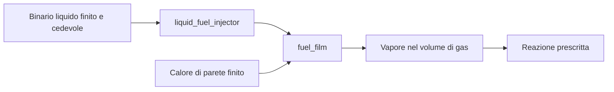

# Binario liquido finito, iniezione per ciclo e reintegro del film

[English](LIQUID_FUEL_INJECTION.md) · [简体中文](LIQUID_FUEL_INJECTION.zh-CN.md) · [Français](LIQUID_FUEL_INJECTION.fr.md) · [Русский](LIQUID_FUEL_INJECTION.ru.md) · [日本語](LIQUID_FUEL_INJECTION.ja.md) · [한국어](LIQUID_FUEL_INJECTION.ko.md) · [Deutsch](LIQUID_FUEL_INJECTION.de.md) · [Español](LIQUID_FUEL_INJECTION.es.md) · **Italiano** · [Português](LIQUID_FUEL_INJECTION.pt-BR.md)

`liquid_fuel_injector` eroga liquido da un binario finito e cedevole in un
[film di carburante](FUEL_FILM.it.md) separato. Una finestra di manovella in avanti aggancia una massa
richiesta per ciclo. Pressione effettiva del ricevitore, geometria dell'ugello, inventario
restante del binario ed energia di pressione determinano l'erogazione. Il film poi riscalda ed
evapora il liquido; la reazione prescritta esistente consuma solo il vapore.

Questo collega erogazione, cambiamento di fase e reazione mantenendo osservabili ogni inventario
e ogni trasferimento di energia. È un modello di ricerca a densità/cedevolezza costanti. L'alimentazione opzionale da pompa usa un confine esterno esplicito di materia/calore. Capacità geometrica, ventilazione/spazio gas/oscillazione, cavitazione, riempimento/efficienza/regolazione misurati e spray risolto restano aperti. Parametri `unverified`; Unity Editor/Play/Player/IL2CPP reale e calibrazione OEM non sono verificati.



## Equazioni di binario e ugello

Il binario ha densità liquida costante `rho`, cedevolezza positiva `C` in m3/Pa,
massa iniziale `m0` e pressione assoluta iniziale `P0`. Il suo volume di riferimento a pressione
nulla deve essere non negativo:

Senza alimentazione da pompa, il rail segue queste equazioni e mantiene la temperatura fornita.

```text
V_reference = m0 / rho - C P0
m_rail = m0 - total_delivered_mass
P_rail = P0 - total_delivered_mass / (rho C)
E_pressure = C P_rail^2 / 2
```

Questo dichiara in modo esplicito il riferimento di cedevolezza a pressione assoluta nulla;
non deduce una contropressione ambiente, una mappa di modulo di comprimibilità o una pompa del binario.
Il volume finito e cedevole fa parte dell'insieme di parametri di ricerca fornito.
L'energia di pressione appartiene al registro di energia immagazzinata, separata dall'inventario
calorico e chimico. Il liquido di sorgente resta alla temperatura fornita;
la sua energia calorica esce col liquido erogato e in questo incremento non ci sono riscaldamento del binario
né una mappa di proprietà dipendente dalla temperatura.

All'apertura in avanti, l'ugello quasi stazionario unidirezionale usa:

```text
mass_rate = Cd A sqrt(2 rho (P_rail - P_receiver))
```

Il flusso è nullo quando la pressione del binario non è maggiore della pressione del ricevitore.
Densità e pressione hanno unità esplicite. Questa relazione pressione/velocità si basa
sulla riduzione energetica incomprimibile descritta dalla
[derivazione di Bernoulli della NASA](https://www1.grc.nasa.gov/beginners-guide-to-aeronautics/bernoullis-equation/).
`Cd` è un coefficiente positivo fornito non maggiore di uno; non stabilisce
il comportamento misurato dell'ugello né risolve quantità di moto, moto dell'ago o cavitazione.

Per pressione del ricevitore fissa dentro un sottopasso di iniezione, il carico di pressione ha una
soluzione analitica. Sia `r0 = sqrt(P_rail - P_receiver)`:

```text
r1 = max(0, r0 - Cd A h / (C sqrt(2 rho)))
available_mass = rho C (r0^2 - r1^2)
```

La massa accettata è limitata da quella quantità disponibile, dalla quota di ciclo restante e
dall'inventario di sorgente restante. La legge risolve l'esaurimento del carico senza permettere
carico negativo o inventare carburante. L'accettazione della dose richiesta è separata dall'erogazione
effettiva; una pressione inadeguata può lasciare una quota non riempita.

## Energia sensibile, chimica e di pressione

Il film ricevente determina il riferimento calorico liquido compatibile:
`u_supply = c_liquid T_supply + e_offset`. La sua temperatura deve essere positiva e
non superiore alla temperatura di saturazione dichiarata del film. La massa iniettata aggiunge
`delta_m * u_supply` all'energia termica del film e trasferisce lo stesso inventario chimico
internamente. Non entra nei registri esterni di carburante/entalpia e non reagisce
prima dell'evaporazione.

Per il volume di liquido erogato `delta_V = delta_m / rho`, il lavoro accettato è:

```text
W_rail = (P_before - delta_V / (2 C)) delta_V
W_receiver = P_receiver delta_V
Q_nozzle = W_rail - W_receiver
```

`W_rail` è uguale alla diminuzione esatta dell'energia di pressione immagazzinata del binario. Il calore
non negativo dell'ugello entra nella parete termica finita del film. Il lavoro di pressione del binario è interno
e non è contato di nuovo come lavoro di sorgente esterno.

Il contratto del film esistente trascura il volume di spostamento del liquido nella geometria
del gas. Di conseguenza, questo iniettore esporta `W_receiver` attraverso un confine esplicito
di lavoro di pressione del ricevitore. Il lavoro di sorgente globale riceve `-W_receiver`; volume
del gas e lavoro all'albero a gomiti non sono aumentati in silenzio. È una riduzione di interfaccia
dichiarata, non evidenza di spostamento risolto delle gocce o di quantità di moto dello spruzzo.
Un futuro accoppiamento gas a volume liquido finito deve sostituire questo confine con geometria
e lavoro di pressione effettivi in un contratto verificato separatamente.

Energia calorica, di pressione e chimica restano distinte. La necessità di conservare il lavoro di pressione
accanto all'energia interna segue la relazione `h = u + p/rho` spiegata nella
[documentazione dei mezzi incomprimibili di Modelica](https://doc.modelica.org/Modelica%204.0.0/Resources/helpWSM/Modelica/Modelica.Media.Incompressible.html).
Il registro completo binario/film/gas/termico bilancia il lavoro esportato, senza trattare
il calore di fase, la dissipazione dell'ugello o l'energia di pressione come calore di reazione del carburante.

## Contratto di definizione e fasatura

| Dato | Requisito |
|---|---|
| `node_a` | Ricevitore gas tracciato appartenente al film di destinazione |
| `film_component` | Componente `fuel_film` esistente su quel ricevitore |
| `crank_node` | Riferimento di fasatura rotazionale; un cilindro a manovella usa il proprio albero a gomiti |
| `cycle_angle`, `start_angle`, `duration_angle` | Angoli espliciti; ciclo di 360/720 gradi e durata positiva limitata |
| `maximum_dose`, `initial_input` | Massimo positivo e kg richiesti non negativi per ciclo |
| `initial_mass` | Inventario iniziale positivo del binario in kg |
| `supply_temperature` | K del liquido in `(0,film_saturation]` |
| `liquid_density` | kg/m3 positivi, unità JSON `kg_m3` |
| `initial_pressure` | Pa/bar assoluti positivi |
| `pressure_compliance` | m3/Pa positivi, unità JSON `m3_pa` |
| `area`, `discharge_coefficient` | m2/mm2 positivi e coefficiente in `(0,1]` |

Tutte le quantità sono richieste. L'iniettore ha un input di dose in `kg`, nessun `node_b` e
nessun pozzo di calore indipendente; il calore dell'ugello entra nella parete del film di destinazione. Parametri
non correlati, unità/domini/proprietà del film errati, alimentazione surriscaldata, volume di
riferimento impossibile e capacità di stato non supportata sono rifiutati con diagnostica oggetto/campo.
I client Core usano `LiquidFuelMeter`, `LiquidFuelInjectorDefinition`
e la legge indipendente `CompliantLiquidRail`.

Il [profilo di dose](FUEL_METERING.it.md) condiviso aggancia un comando una volta in ogni finestra
in avanti osservata. I cambiamenti a metà finestra si applicano a un ciclo successivo. L'inversione chiude il flusso
e non può riemettere una quota già osservata. L'escursione per intervallo meccanico è
limitata da `min(0.25 rad,duration/8)` e gli ordinali di ciclo restano rappresentabili.
Gli estremi della finestra usano il campionamento a tick fisso e hanno bisogno di un raffinamento separato degli eventi.

## Integrazione e transazioni

L'intervallo usa mezzi passi iniezione / film / gas / meccanica e reazione / gas / film /
iniezione. Le passate di iniettore e film invertono l'ordine nel secondo mezzo.
Il calore dell'ugello cambia la parete finita del film durante questi sottopassi; l'evaporazione paga
il suo bilancio di calore da quella parete. L'integrazione ODE simultanea indipendente verifica
il raffinamento liscio del secondo ordine per binario, film, gas e trasferimenti di pressione/calore.
Altre sorgenti gas-parete e termiche conservano il limite di accuratezza esistente della parete esplicita.
Eventi ed esaurimento non ereditano un'affermazione uniforme di secondo ordine.

Ogni iniettore aggiunge nove voci al budget di stato riportato e limitato: le sei voci esistenti
di quota/erogazione e tre storie cumulative di pressione/calore. Massa e pressione di sorgente
si ricavano dall'erogazione totale compensata. Tutta la compensazione, gli ordinali di ciclo,
gli obiettivi tenuti e i flussi medi si copiano/sottopongono a hash/eseguono il rollback con la simulazione,
inclusi gli intervalli di frizione speculativi. L'iniezione attiva a caldo e gli snapshot
non allocano memoria gestita. Annullamento, fallimento tardivo, scritture rifiutate e
ramificazioni indipendenti preservano le storie fisiche e di controllore complete.

## Canali e asset portatili

Scopri ID e unità attraverso la validazione o la creazione della sessione. Le uscite dell'iniettore sono:

- `mass` di sorgente restante, `pressure` assoluta, `temperature` fornita e `volume` liquido.
- `internal_energy` per l'energia calorica di sorgente più l'energia di pressione; `chemical_energy` separatamente.
- `opening` della finestra, `mass_flow` medio dell'ultimo tick, `requested_fuel_dose` agganciata,
  `delivered_fuel_dose` e `total_fuel_delivered` cumulativo.
- `source_work` per il lavoro di pressione del binario rilasciato, `hydraulic_work` per il lavoro di pressione
  del ricevitore esportato e `fluid_heat` per la dissipazione dell'ugello.

Questi campi di componente hanno significati distinti dal lavoro di sorgente esterno globale.
I canali globali di massa, carburante ed energia chimica includono la sorgente liquida restante,
il film e gli inventari ordinari di gas/reazione.

L'asset v19 scrive un record tipizzato di binario/fasatura da 120 byte per iniettore liquido, più
il suo record di ugello esistente da 36 byte. L'encoder e i lettori v1-v18 conservati controllano
conteggi/lunghezza limitati, digest, copertura tipizzata completa, unità, proprietà e declassamenti
contraffatti. Una fixture autentica di film v18 conserva la sua impronta e il replay aggiornato
nello stesso runtime. Vedi [ASSET_FORMAT.it.md](ASSET_FORMAT.it.md).

## Laboratorio e accettazione

`liquid-injected-cylinder` parte con un film asciutto e una sorgente pressurizzata finita.
Ammissione d'aria separata, richieste di dose per ciclo, disponibilità di vapore limitata dalla parete e
reazione prescritta azionano lo stesso modello albero/carico degli altri laboratori. JSON,
CLI, asset portatili e il server MCP reale condividono le sue definizioni e i confini
di replay. Tutti i parametri restano `unverified`.

Lavoro d'albero, pressione e stoccaggio termico miscelato hanno controlli di conservazione e ODE indipendenti; l'accettazione Unity reale resta aperta. [VALIDATION.it.md](VALIDATION.it.md) Capacità geometrica, ventilazione/spazio gas/oscillazione, cavitazione, riempimento/efficienza/regolazione misurati e spray risolto restano aperti. Parametri `unverified`; Unity Editor/Play/Player/IL2CPP reale e calibrazione OEM non sono verificati.

## Estensione dell'ago fisico

La definizione opzionale dell'ago collega l'erogazione all'alzata traslazionale effettiva.
Un [solenoide, arresti elastici e driver campionato](NEEDLE_ACTUATION.it.md) forniscono ora quel
moto. In questa modalità la dose richiesta è un obiettivo del controllore; non limita il flusso fisico
durante il ritardo di chiusura, il rimbalzo o l'inversione. Il percorso ideale limitato dalla quota resta
separato e invariato. Comportamento magnetico/driver/spruzzo raffinato e calibrazione
restano aperti.

## Rail di combustibile liquido alimentato da pompa

`liquid_rail_feed` associa un iniettore liquido a una pompa volumetrica esistente e a un confine esplicito di materia/calore. Il nodo di uscita idraulica deve corrispondere alla cedevolezza e alla pressione assoluta iniziale del rail. Pompa e iniettore possiedono questo nodo; altri percorsi fluidi non contabilizzati sono rifiutati.

v27 conserva collegamenti e temperatura sorgente e legge v1-v26. Scambio analitico albero/pressione, raffinamento ODE simultaneo indipendente, miscelazione termica, bilanci massa/combustibile/energia/volume, ritorno e rollback completo hanno verifiche separate.

Capacità geometrica, ventilazione/spazio gas/oscillazione, cavitazione, riempimento/efficienza/regolazione misurati e spray risolto restano aperti. Parametri `unverified`; Unity Editor/Play/Player/IL2CPP reale e calibrazione OEM non sono verificati.

[PUMP_FED_FUEL.it.md](PUMP_FED_FUEL.it.md)
