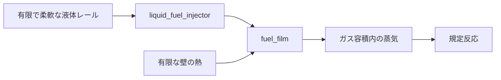

# 有限液体レール、サイクル噴射とフィルム補給

[English](LIQUID_FUEL_INJECTION.md) · [简体中文](LIQUID_FUEL_INJECTION.zh-CN.md) · [Français](LIQUID_FUEL_INJECTION.fr.md) · [Русский](LIQUID_FUEL_INJECTION.ru.md) · **日本語** · [한국어](LIQUID_FUEL_INJECTION.ko.md) · [Deutsch](LIQUID_FUEL_INJECTION.de.md) · [Español](LIQUID_FUEL_INJECTION.es.md) · [Italiano](LIQUID_FUEL_INJECTION.it.md) · [Português](LIQUID_FUEL_INJECTION.pt-BR.md)

`liquid_fuel_injector` は、有限で柔軟なレールから、別の[燃料フィルム](FUEL_FILM.ja.md)へ液体を供給します。前進クランクのウィンドウは、サイクルあたり要求された質量をラッチします。実際の受け側圧力、ノズル幾何、残るレール在庫、圧力エネルギーが供給を決めます。フィルムは続いて液体を加熱して蒸発させます。既存の規定反応が消費するのは蒸気だけです。

これは、供給、相変化、反応をつなぎつつ、各在庫とエネルギー輸送を観測可能なままにします。一定密度/コンプライアンスの研究モデルです。レールのポンプ/補給、実測の物性、精密化した磁気/電子駆動、噴霧/エントレインメント、キャビテーション、点火/ECU、キャリブレーション済みのガソリンハードウェアは、完全なパワートレイン目標へ向けて必要な作業のままです。



## レールとノズルの方程式

レールは、一定の液体密度 `rho`、m3/Pa の正のコンプライアンス `C`、初期質量 `m0`、初期絶対圧力 `P0` を持ちます。圧力ゼロの基準容積は非負でなければなりません。

```text
V_reference = m0 / rho - C P0
m_rail = m0 - total_delivered_mass
P_rail = P0 - total_delivered_mass / (rho C)
E_pressure = C P_rail^2 / 2
```

これは、コンプライアンスの基準を絶対圧力ゼロで明示的に宣言します。周囲の背後圧力、体積弾性率マップ、レールポンプは推論しません。有限で柔軟な容積は、供給された研究パラメーター集合の一部です。圧力エネルギーは貯蔵エネルギーの台帳に属し、熱量的な在庫および化学在庫とは別です。源の液体は供給された温度のままです。その熱量エネルギーは供給された液体とともに去り、このインクリメントにレール加熱や温度依存の物性マップはありません。

前進で開いているとき、一方向の準定常ノズルは次を使います。

```text
mass_rate = Cd A sqrt(2 rho (P_rail - P_receiver))
```

レール圧力が受け側圧力以下のとき、流量はゼロです。密度と圧力には明示的な単位があります。この圧力/速度の関係は、[NASA のベルヌーイの導出](https://www1.grc.nasa.gov/beginners-guide-to-aeronautics/bernoullis-equation/)が述べる非圧縮性エネルギーの簡約に基づきます。`Cd` は 1 以下の、供給された正の係数です。実測のノズル挙動を確立せず、運動量、ニードル運動、キャビテーションも解きません。

一つの噴射サブステップの中で受け側圧力が固定なら、圧力ヘッドには解析解があります。`r0 = sqrt(P_rail - P_receiver)` とします。

```text
r1 = max(0, r0 - Cd A h / (C sqrt(2 rho)))
available_mass = rho C (r0^2 - r1^2)
```

受理される質量は、その利用可能量、残るサイクル割当、残る源在庫で制限されます。この法則は、負のヘッドを許さず、燃料を作り出さずに、ヘッドの枯渇を解きます。要求ドーズの受理は、実際の供給とは別です。圧力が不足すると、割当は満たされないままになり得ます。

## 顕熱、化学エネルギー、圧力エネルギー

受け側のフィルムが、互換な液体の熱量基準を決めます。`u_supply = c_liquid T_supply + e_offset` です。その温度は正で、フィルムの宣言された飽和温度以下でなければなりません。噴射された質量は、フィルムの熱エネルギーに `delta_m * u_supply` を加え、同じ化学在庫を内部で移します。外部の燃料/エンタルピー台帳には入らず、蒸発の前に反応しません。

供給された液体体積 `delta_V = delta_m / rho` について、受理される仕事は次のとおりです。

```text
W_rail = (P_before - delta_V / (2 C)) delta_V
W_receiver = P_receiver delta_V
Q_nozzle = W_rail - W_receiver
```

`W_rail` は、蓄えられたレール圧力エネルギーの減少に正確に等しくなります。非負のノズル熱は、フィルムの有限な熱壁に入ります。レールの圧力仕事は内部であり、外部源仕事として再び数えられません。

既存のフィルム契約は、ガス幾何の中の液体排除体積を無視します。したがってこのインジェクターは、明示的な受け側圧力仕事の境界を通して `W_receiver` を送り出します。大域の源仕事は `-W_receiver` を受け取ります。ガス容積とクランク仕事は、黙って増やされません。これは宣言されたインターフェースの簡約であり、解像された液滴排除や噴霧運動量のエビデンスではありません。将来の、有限な液体体積を持つガス結合は、別に検証された契約の中で、この境界を実際の幾何と圧力仕事に置き換えなければなりません。

熱量、圧力、化学のエネルギーは別のままです。内部エネルギーと並べて圧力仕事を保つ必要は、[Modelica の非圧縮性媒体ドキュメント](https://doc.modelica.org/Modelica%204.0.0/Resources/helpWSM/Modelica/Modelica.Media.Incompressible.html)が説明する `h = u + p/rho` の関係に従います。レール/フィルム/ガス/熱の完全な台帳は、送り出された仕事をバランスし、相熱、ノズル散逸、圧力エネルギーを燃料の反応熱としては扱いません。

## 定義とタイミングの契約

| データ | 要件 |
|---|---|
| `node_a` | 対象フィルムに属する、追跡されたガス受け側 |
| `film_component` | その受け側にある既存の `fuel_film` コンポーネント |
| `crank_node` | 回転タイミングの参照。クランク気筒は自身のクランクを使う |
| `cycle_angle`、`start_angle`、`duration_angle` | 明示的な角度。360/720 度のサイクルと、有界な正の継続 |
| `maximum_dose`、`initial_input` | 正の上限と、サイクルあたり非負の要求 kg |
| `initial_mass` | 正の初期レール在庫、kg |
| `supply_temperature` | `(0,film_saturation]` の液体の K |
| `liquid_density` | 正の kg/m3。JSON 単位 `kg_m3` |
| `initial_pressure` | 正の絶対 Pa/bar |
| `pressure_compliance` | 正の m3/Pa。JSON 単位 `m3_pa` |
| `area`、`discharge_coefficient` | 正の m2/mm2 と、`(0,1]` の係数 |

すべての量は必須です。インジェクターは `kg` のドーズ入力を持ち、`node_b` も独立したヒートシンクもありません。ノズル熱は対象フィルムの壁に入ります。無関係なパラメーター、誤った単位/領域/フィルム所有、過熱した供給、不可能な基準容積、サポートされない状態容量は、オブジェクト/フィールドの診断とともに拒否されます。Core クライアントは `LiquidFuelMeter`、`LiquidFuelInjectorDefinition`、独立した `CompliantLiquidRail` 則を使います。

共有の[ドーズプロファイル](FUEL_METERING.ja.md)は、観測された各前進ウィンドウで指令を一度ラッチします。ウィンドウ途中の変更は、後のサイクルに適用されます。逆転は流れを閉じ、すでに観測された割当を再発行できません。機械区間あたりの移動は `min(0.25 rad,duration/8)` で制限され、サイクル序数は表現可能なままです。ウィンドウ端点は固定ティックのサンプリングを使い、別のイベント細分化を必要とします。

## 積分とトランザクション

区間は、噴射 / フィルム / ガス / 機構と反応 / ガス / フィルム / 噴射の半ステップを使います。インジェクターとフィルムの走査は、後半で順序を逆にします。ノズル熱はこれらのサブステップの間に有限なフィルム壁を変えます。蒸発はその壁から熱予算を支払います。独立した同時 ODE 積分が、レール、フィルム、ガス、圧力/熱の輸送について、2 次の滑らかな細分化を検証します。他のガス壁面と熱源は、既存の明示的壁の精度限界を保ちます。イベントと枯渇は、一様な 2 次という主張を引き継ぎません。

各インジェクターは、有界な報告状態予算にエントリを九つ加えます。既存の割当/供給の六つと、累積の圧力/熱履歴の三つです。源の質量と圧力は、補償された総供給から導出されます。すべての補償、サイクル序数、保持された目標、平均流量は、投機的なクラッチ区間を含め、シミュレーションとともにコピー、ハッシュ、ロールバックされます。ウォームアップ後のアクティブな供給とスナップショットは、マネージドメモリを割り当てません。キャンセル、遅い失敗、拒否された書き込み、独立した分岐は、物理と制御器の完全な履歴を保持します。

## チャンネルと移植可能アセット

ID と単位は、検証またはセッション作成を通して発見してください。インジェクターの出力は次のとおりです。

- 残る源の `mass`、絶対 `pressure`、供給された `temperature`、液体 `volume`。
- 源の熱量エネルギーと圧力エネルギーを合わせた `internal_energy`。`chemical_energy` は別。
- ウィンドウの `opening`、直前ティックの平均 `mass_flow`、ラッチされた `requested_fuel_dose`、`delivered_fuel_dose`、累積の `total_fuel_delivered`。
- 放出されたレール圧力仕事の `source_work`、送り出された受け側圧力仕事の `hydraulic_work`、ノズル散逸の `fluid_heat`。

これらのコンポーネントフィールドは、大域の外部源仕事とは意味が異なります。大域の質量、燃料、化学エネルギーのチャンネルは、残る液体源、フィルム、通常のガス/反応の在庫を含みます。

アセット v19 は、液体インジェクターごとに型付きの 120 バイトのレール/タイミングレコードを一つ書き、既存の 36 バイトのノズルレコードも書きます。エンコーダーと保持された v1-v18 リーダーは、有界な個数/長さ、ダイジェスト、完全な型付き被覆、単位、所有、偽造されたダウングレードを検査します。本物の v18 フィルムフィクスチャは、フィンガープリントと、同じランタイムでのアップグレードされたリプレイを保ちます。[ASSET_FORMAT.ja.md](ASSET_FORMAT.ja.md) を参照してください。

## ラボラトリーと受理

`liquid-injected-cylinder` は、乾いたフィルムと有限な加圧源から始まります。別の空気導入、サイクルドーズ要求、壁で制限された蒸気の利用可能性、規定反応が、他のラボラトリーと同じクランク/負荷モデルを駆動します。JSON、CLI、移植可能アセット、実際の MCP サーバーは、その定義とリプレイ境界を共有します。すべてのパラメーターは `unverified` のままです。

解析的な圧力減衰と仕事、ドーズ/逆転/枯渇、独立した連成細分化、源/フィルム/成分/エネルギーの完全な台帳、アクティブ時の割り当て境界、投機的クラッチのロールバックが検査されます。[VALIDATION.ja.md](VALIDATION.ja.md) が観測された結果を記録します。用意された Unity のレール/ノズル表示とライフサイクルテストは、なお実際のエディター/Play/Player のエビデンスを必要とします。レールの補給/ポンプ、ニードル動力学、解像された噴霧/排除、点火/ECU、完全なトランスミッション/制御、実測のパワートレインは未完了のままです。

## 物理ニードルの拡張

任意のニードル定義は、供給を実際の並進リフトへ接続します。[ソレノイド、弾性ストッパ、サンプリングドライバー](NEEDLE_ACTUATION.ja.md)が、その運動を供給するようになりました。このモードでは、要求ドーズは制御器の目標です。閉じ遅れ、反発、逆転の間、物理的な流れに上限を掛けません。理想的な、割当で制限された経路は別のまま、変わりません。精密化した磁気/ドライバー/噴霧の挙動とキャリブレーションは、未解決のままです。
