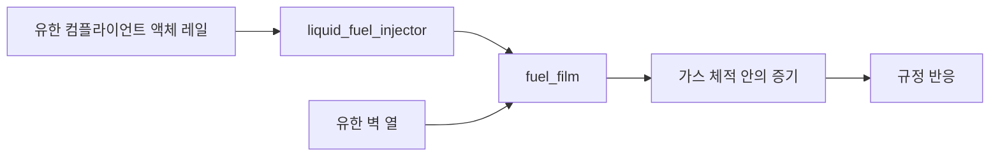

# 유한 액체 레일, 사이클 분사, 필름 보충

[English](LIQUID_FUEL_INJECTION.md) · [简体中文](LIQUID_FUEL_INJECTION.zh-CN.md) · [Français](LIQUID_FUEL_INJECTION.fr.md) · [Русский](LIQUID_FUEL_INJECTION.ru.md) · [日本語](LIQUID_FUEL_INJECTION.ja.md) · **한국어** · [Deutsch](LIQUID_FUEL_INJECTION.de.md) · [Español](LIQUID_FUEL_INJECTION.es.md) · [Italiano](LIQUID_FUEL_INJECTION.it.md) · [Português](LIQUID_FUEL_INJECTION.pt-BR.md)

`liquid_fuel_injector`는 유한 컴플라이언트 레일의 액체를 별도의 [연료 필름](FUEL_FILM.ko.md)으로 공급합니다. 전진 크랭크 창이 사이클마다 요청 질량을 래치합니다. 실제 수신기 압력, 노즐 기하, 남은 레일 재고, 압력 에너지가 공급을 정합니다. 그다음 필름이 액체를 가열하고 증발시킵니다. 기존의 규정 반응은 증기만 소비합니다.

이것은 공급, 상변화, 반응을 연결하면서 각 재고와 에너지 전달을 관측할 수 있게 둡니다. 일정 밀도/컴플라이언스 연구 모델입니다. 선택적 펌프 공급은 명시적 외부 물질/열 경계를 사용합니다. 기하학적 용량, 통기/기체 공간/슬로싱, 캐비테이션, 실측 충액/효율/조압과 분해 분무는 미완성입니다. 매개변수는 `unverified`이며 실제 Unity Editor/Play/Player/IL2CPP와 OEM 보정은 미검증입니다.



## 레일과 노즐 방정식

레일은 일정한 액체 밀도 `rho`, m3/Pa의 양의 컴플라이언스 `C`, 초기 질량 `m0`, 초기 절대 압력 `P0`를 가집니다. 영압 기준 체적은 음이 아니어야 합니다.

펌프 공급이 없으면 레일은 다음 방정식을 따르고 지정된 공급 온도를 유지합니다.

```text
V_reference = m0 / rho - C P0
m_rail = m0 - total_delivered_mass
P_rail = P0 - total_delivered_mass / (rho C)
E_pressure = C P_rail^2 / 2
```

이것은 컴플라이언스 기준을 절대 압력 0에서 명시합니다. 주변 배면 압력, 체적 탄성 계수 맵, 레일 펌프를 추론하지 않습니다. 유한 컴플라이언트 체적은 제공된 연구 매개변수 집합의 일부입니다. 압력 에너지는 열량 재고 및 화학 재고와 분리되어, 저장 에너지 장부에 속합니다. 공급 액체는 제공된 온도에 머뭅니다. 그 열량 에너지는 공급된 액체와 함께 떠나며, 이 증분에는 레일 가열이나 온도 의존 물성 맵이 없습니다.

전진 개방에서 단방향 준정상 노즐은 다음을 씁니다.

```text
mass_rate = Cd A sqrt(2 rho (P_rail - P_receiver))
```

레일 압력이 수신기 압력보다 크지 않으면 흐름은 0입니다. 밀도와 압력에는 명시적 단위가 있습니다. 이 압력/속도 관계는 [NASA의 베르누이 유도](https://www1.grc.nasa.gov/beginners-guide-to-aeronautics/bernoullis-equation/)가 설명하는 비압축성 에너지 축소에 기반합니다. `Cd`는 1 이하인, 제공된 양의 계수입니다. 실측 노즐 거동을 확립하거나, 운동량, 니들 운동, 캐비테이션을 분해하지는 않습니다.

한 분사 서브스텝 안에서 수신기 압력이 고정이면, 압력 수두에는 해석해가 있습니다. `r0 = sqrt(P_rail - P_receiver)`라 하면:

```text
r1 = max(0, r0 - Cd A h / (C sqrt(2 rho)))
available_mass = rho C (r0^2 - r1^2)
```

수용되는 질량은 그 가용량, 남은 사이클 할당량, 남은 공급원 재고로 유계됩니다. 법칙은 음의 수두를 허용하거나 연료를 만들어 내지 않고 수두 소진을 풉니다. 요청 도즈의 수용은 실제 공급과 별개입니다. 압력이 부족하면 할당량이 채워지지 않은 채 남을 수 있습니다.

## 현열, 화학 에너지, 압력 에너지

받는 필름이 호환되는 액체 열량 기준을 정합니다. `u_supply = c_liquid T_supply + e_offset`입니다. 그 온도는 양수여야 하고, 필름이 선언한 포화 온도를 넘으면 안 됩니다. 분사된 질량은 필름 열 에너지에 `delta_m * u_supply`를 더하고, 같은 화학 재고를 내부로 옮깁니다. 외부 연료/엔탈피 장부에 들어가지 않으며, 증발 전에 반응하지 않습니다.

공급된 액체 체적 `delta_V = delta_m / rho`에 대해, 수용된 일은 다음과 같습니다.

```text
W_rail = (P_before - delta_V / (2 C)) delta_V
W_receiver = P_receiver delta_V
Q_nozzle = W_rail - W_receiver
```

`W_rail`은 저장된 레일 압력 에너지의 감소와 정확히 같습니다. 음이 아닌 노즐 열은 필름의 유한 열 벽으로 들어갑니다. 레일 압력 일은 내부 일이며, 외부 원천 일로 다시 세지 않습니다.

기존의 필름 계약은 가스 기하에서 액체 변위 체적을 무시합니다. 그에 맞추어, 이 인젝터는 명시적 수신기 압력 일 경계를 통해 `W_receiver`를 내보냅니다. 전역 원천 일은 `-W_receiver`를 받습니다. 가스 체적과 크랭크 일은 조용히 늘지 않습니다. 이것은 선언된 인터페이스 축소이지, 분해된 액적 변위나 분무 운동량의 증거가 아닙니다. 미래의 유한 액체 체적 가스 결합은, 따로 검증된 계약에서 이 경계를 실제 기하와 압력 일로 바꿔야 합니다.

열량 에너지, 압력 에너지, 화학 에너지는 서로 구분됩니다. 내부 에너지와 함께 압력 일을 남겨야 하는 이유는, [Modelica의 비압축성 매질 문서](https://doc.modelica.org/Modelica%204.0.0/Resources/helpWSM/Modelica/Modelica.Media.Incompressible.html)가 설명하는 `h = u + p/rho` 관계를 따릅니다. 전체 레일/필름/가스/열 장부는 내보낸 일을 맞추며, 상 열, 노즐 소산, 압력 에너지를 연료 반응 열로 다루지 않습니다.

## 정의와 타이밍 계약

| 데이터 | 요건 |
|---|---|
| `node_a` | 대상 필름에 속한, 추적되는 가스 수신기 |
| `film_component` | 그 수신기의 기존 `fuel_film` 컴포넌트 |
| `crank_node` | 회전 타이밍 기준. 크랭크 실린더는 자기 크랭크를 씁니다 |
| `cycle_angle`, `start_angle`, `duration_angle` | 명시적 각. 360/720도 사이클과 유계된 양의 지속 |
| `maximum_dose`, `initial_input` | 양의 최댓값과, 사이클당 음이 아닌 요청 kg |
| `initial_mass` | 양의 초기 레일 재고, kg |
| `supply_temperature` | `(0,film_saturation]`의 액체 K |
| `liquid_density` | 양의 kg/m3, JSON 단위 `kg_m3` |
| `initial_pressure` | 양의 절대 Pa/bar |
| `pressure_compliance` | 양의 m3/Pa, JSON 단위 `m3_pa` |
| `area`, `discharge_coefficient` | 양의 m2/mm2와 `(0,1]`의 계수 |

모든 양은 필수입니다. 인젝터에는 `kg` 도즈 입력이 있고, `node_b`와 독립 열 싱크는 없습니다. 노즐 열은 대상 필름 벽으로 들어갑니다. 관련 없는 매개변수, 잘못된 단위/도메인/필름 소유, 과열된 공급, 불가능한 기준 체적, 지원되지 않는 상태 용량은 객체/필드 진단과 함께 거부됩니다. Core 클라이언트는 `LiquidFuelMeter`, `LiquidFuelInjectorDefinition`, 독립 `CompliantLiquidRail` 법칙을 씁니다.

공유 [도즈 프로파일](FUEL_METERING.ko.md)은 관측된 전진 창마다 명령을 한 번 래치합니다. 창 중간의 변경은 나중 사이클에 적용됩니다. 역전은 흐름을 닫고, 이미 관측된 할당량을 다시 발행할 수 없습니다. 기계 구간당 이동은 `min(0.25 rad,duration/8)`로 유계되고, 사이클 순번은 표현 가능한 상태로 남습니다. 창 끝점은 고정 틱 샘플링을 쓰며, 별도의 이벤트 세분화가 필요합니다.

## 적분과 트랜잭션

구간은 분사 / 필름 / 가스 / 기계·반응 / 가스 / 필름 / 분사 반 스텝을 씁니다. 인젝터와 필름 스윕은 후반에서 순서가 뒤집힙니다. 노즐 열은 이 서브스텝 동안 유한 필름 벽을 바꿉니다. 증발은 그 벽에서 열 예산을 지불합니다. 독립적인 동시 ODE 적분이 레일, 필름, 가스, 압력/열 전달에 대해 매끄러운 2차 세분화를 확인합니다. 다른 가스-벽과 열원은 기존의 명시적 벽 정확성 한계를 유지합니다. 이벤트와 고갈은 균일한 2차라는 주장을 물려받지 않습니다.

각 인젝터는 유계된 보고 상태 예산에 항목 아홉을 더합니다. 기존의 할당량/공급 항목 여섯과, 누적 압력/열 이력 셋입니다. 공급원 질량과 압력은 보정된 총 공급에서 유도됩니다. 모든 보정, 사이클 순번, 유지된 목표, 평균 흐름은 투기적 클러치 구간을 포함해 시뮬레이션과 함께 복사/해시/롤백됩니다. 워밍업된 활성 공급과 스냅샷은 관리 메모리를 할당하지 않습니다. 취소, 늦은 실패, 거부된 쓰기, 독립 분기는 완전한 물리 이력과 제어기 이력을 보존합니다.

## 채널과 이식 가능한 자산

ID와 단위는 검증/세션 생성으로 탐색하세요. 인젝터 출력은 다음과 같습니다.

- 남은 공급원 `mass`, 절대 `pressure`, 공급 `temperature`, 액체 `volume`.
- 공급원 열량과 압력 에너지를 합친 `internal_energy`. `chemical_energy`는 별도.
- 창 `opening`, 마지막 틱의 평균 `mass_flow`, 래치된 `requested_fuel_dose`, `delivered_fuel_dose`, 누적 `total_fuel_delivered`.
- 방출된 레일 압력 일의 `source_work`, 내보낸 수신기 압력 일의 `hydraulic_work`, 노즐 소산의 `fluid_heat`.

이 컴포넌트 필드는 전역 외부 원천 일과 의미가 다릅니다. 전역 질량, 연료, 화학 에너지 채널에는 남은 액체 공급원, 필름, 통상적인 가스/반응 재고가 포함됩니다.

자산 v19는 액체 인젝터마다 형식이 있는 120바이트 레일/타이밍 기록 하나와, 기존의 36바이트 노즐 기록을 씁니다. 인코더와 유지된 v1-v18 판독기는 유계 개수/길이, 다이제스트, 완전한 형식 지정 적용 범위, 단위, 소유, 위조된 다운그레이드를 검사합니다. 진본 v18 필름 픽스처는 지문과, 같은 런타임의 업그레이드된 리플레이를 유지합니다. [ASSET_FORMAT.ko.md](ASSET_FORMAT.ko.md)를 참고하세요.

## 실험실과 수용

`liquid-injected-cylinder`는 마른 필름과 유한한 가압 공급원에서 시작합니다. 별도의 공기 유입, 사이클 도즈 요청, 벽이 제한하는 증기 가용성, 규정 반응이 다른 실험실과 같은 크랭크/부하 모델을 구동합니다. JSON, CLI, 이식 가능한 자산, 실제 MCP 서버가 그 정의와 리플레이 경계를 공유합니다. 모든 매개변수는 `unverified`로 남습니다.

펌프 축 일, 레일 압력과 혼합 열 저장에는 보존 및 독립 ODE 검사가 있으며 실제 Unity 검증은 미완성입니다. [VALIDATION.ko.md](VALIDATION.ko.md) 기하학적 용량, 통기/기체 공간/슬로싱, 캐비테이션, 실측 충액/효율/조압과 분해 분무는 미완성입니다. 매개변수는 `unverified`이며 실제 Unity Editor/Play/Player/IL2CPP와 OEM 보정은 미검증입니다.

## 물리적 니들 확장

선택적 니들 정의는 공급을 실제 병진 양정에 연결합니다. [솔레노이드, 탄성 스토퍼, 샘플링 드라이버](NEEDLE_ACTUATION.ko.md)가 이제 그 운동을 공급합니다. 이 모드에서 요청 도즈는 제어기 목표입니다. 닫힘 지체, 반발, 역전 동안 물리적 흐름에 상한을 두지 않습니다. 이상적인 할당량 제한 경로는 별도로, 변하지 않고 남습니다. 정밀화된 자기/드라이버/분무 동작과 교정은 아직 열려 있습니다.

## 펌프 공급 액체 연료 레일

`liquid_rail_feed`는 액체 인젝터를 기존 용적 펌프와 명시적인 물질/열 경계에 연결합니다. 유압 출구 노드는 레일 컴플라이언스와 초기 절대압에 일치해야 합니다. 펌프와 인젝터가 이 압력 노드를 소유하고 다른 미추적 유체 경로는 거부됩니다.

v27은 공급 연결과 원천 온도를 저장하고 v1-v26를 읽습니다. 축/압력 해석 교환, 독립 동시 ODE 세분화, 열 혼합, 질량/연료/에너지/체적 원장, 역류와 완전 rollback을 각각 확인합니다.

기하학적 용량, 통기/기체 공간/슬로싱, 캐비테이션, 실측 충액/효율/조압과 분해 분무는 미완성입니다. 매개변수는 `unverified`이며 실제 Unity Editor/Play/Player/IL2CPP와 OEM 보정은 미검증입니다.

[PUMP_FED_FUEL.ko.md](PUMP_FED_FUEL.ko.md)
