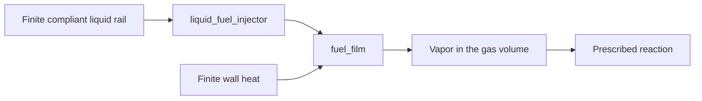

# Finite liquid rail, cycle injection and film replenishment

**English** · [简体中文](LIQUID_FUEL_INJECTION.zh-CN.md) · [Français](LIQUID_FUEL_INJECTION.fr.md) · [Русский](LIQUID_FUEL_INJECTION.ru.md) · [日本語](LIQUID_FUEL_INJECTION.ja.md) · [한국어](LIQUID_FUEL_INJECTION.ko.md) · [Deutsch](LIQUID_FUEL_INJECTION.de.md) · [Español](LIQUID_FUEL_INJECTION.es.md) · [Italiano](LIQUID_FUEL_INJECTION.it.md) · [Português](LIQUID_FUEL_INJECTION.pt-BR.md)

`liquid_fuel_injector` delivers liquid from a finite compliant rail into a
separate [fuel film](FUEL_FILM.md). A forward crank window latches a requested
mass per cycle. Actual receiver pressure, nozzle geometry, remaining rail
inventory and pressure energy determine delivery. The film then heats and
evaporates liquid; the existing prescribed reaction consumes vapor only.

This connects delivery, phase change and reaction while keeping each inventory
and energy transfer observable. It is a constant-density/compliance research
model. Rail pump/refill, measured properties, refined magnetic/electronic actuation,
spray/entrainment, cavitation, ignition/ECU and calibrated gasoline hardware
remain required work toward the full powertrain objective.



## Rail and nozzle equations

The rail has constant liquid density `rho`, positive compliance `C` in m3/Pa,
initial mass `m0` and initial absolute pressure `P0`. Its zero-pressure reference
volume must be nonnegative:

```text
V_reference = m0 / rho - C P0
m_rail = m0 - total_delivered_mass
P_rail = P0 - total_delivered_mass / (rho C)
E_pressure = C P_rail^2 / 2
```

This declares the compliance reference explicitly at zero absolute pressure;
it doesn't infer ambient backing pressure, a bulk-modulus map or a rail pump.
The finite compliant volume is part of the supplied research parameter set.
Pressure energy belongs to the stored-energy ledger, separate from caloric
and chemical inventory. The source liquid remains at its supplied temperature;
its caloric energy leaves with the delivered liquid and there is no rail heating
or temperature-dependent property map in this increment.

At forward opening, the one-way quasi-steady nozzle uses:

```text
mass_rate = Cd A sqrt(2 rho (P_rail - P_receiver))
```

Flow is zero when rail pressure is no greater than the receiver pressure.
Density and pressure have explicit units. This pressure/velocity relation is
based on the incompressible energy reduction described by
[NASA's Bernoulli derivation](https://www1.grc.nasa.gov/beginners-guide-to-aeronautics/bernoullis-equation/).
`Cd` is a supplied positive coefficient no greater than one; it doesn't establish
measured nozzle behavior or resolve momentum, needle motion or cavitation.

For fixed receiver pressure within one injection substep, pressure head has an
analytic solution. Let `r0 = sqrt(P_rail - P_receiver)`:

```text
r1 = max(0, r0 - Cd A h / (C sqrt(2 rho)))
available_mass = rho C (r0^2 - r1^2)
```

The accepted mass is bounded by that available amount, remaining cycle quota and
remaining source inventory. The law resolves head exhaustion without allowing
negative head or inventing fuel. Requested dose acceptance is separate from
actual delivery; inadequate pressure can leave a quota unfilled.

## Sensible, chemical and pressure energy

The receiving film determines the compatible liquid caloric reference:
`u_supply = c_liquid T_supply + e_offset`. Its temperature must be positive and
no greater than the film's declared saturation temperature. Injected mass adds
`delta_m * u_supply` to film thermal energy and transfers the same chemical
inventory internally. It doesn't enter external fuel/enthalpy ledgers or react
before evaporation.

For delivered liquid volume `delta_V = delta_m / rho`, accepted work is:

```text
W_rail = (P_before - delta_V / (2 C)) delta_V
W_receiver = P_receiver delta_V
Q_nozzle = W_rail - W_receiver
```

`W_rail` equals the exact decrease of stored rail pressure energy. Nonnegative
nozzle heat enters the film's finite thermal wall. Rail pressure work is internal
and isn't counted again as external source work.

The existing film contract neglects liquid displacement volume in the gas
geometry. Accordingly, this injector exports `W_receiver` through an explicit
receiver pressure-work boundary. Global source work receives `-W_receiver`; gas
volume and crank work aren't silently increased. This is a declared interface
reduction, not evidence for resolved droplet displacement or spray momentum.
A future finite-liquid-volume gas coupling must replace this boundary with actual
geometry and pressure work in a separately verified contract.

Caloric, pressure and chemical energy remain distinct. The need to retain pressure
work alongside internal energy follows the `h = u + p/rho` relation explained in
[Modelica's incompressible-media documentation](https://doc.modelica.org/Modelica%204.0.0/Resources/helpWSM/Modelica/Modelica.Media.Incompressible.html).
The full rail/film/gas/thermal ledger balances the exported work, without treating
phase heat, nozzle dissipation or pressure energy as fuel reaction heat.

## Definition and timing contract

| Data | Requirement |
|---|---|
| `node_a` | Tracked gas receiver belonging to the target film |
| `film_component` | Existing `fuel_film` component at that receiver |
| `crank_node` | Rotational timing reference; a crank cylinder uses its own crank |
| `cycle_angle`, `start_angle`, `duration_angle` | Explicit angles; 360/720-degree cycle and bounded positive duration |
| `maximum_dose`, `initial_input` | Positive maximum and nonnegative requested kg per cycle |
| `initial_mass` | Positive initial rail inventory in kg |
| `supply_temperature` | Liquid K in `(0,film_saturation]` |
| `liquid_density` | Positive kg/m3, JSON unit `kg_m3` |
| `initial_pressure` | Positive absolute Pa/bar |
| `pressure_compliance` | Positive m3/Pa, JSON unit `m3_pa` |
| `area`, `discharge_coefficient` | Positive m2/mm2 and coefficient in `(0,1]` |

All quantities are required. The injector has a `kg` dose input, no `node_b` and
no independent heat sink; nozzle heat enters its target film wall. Unrelated
parameters, wrong units/domains/film ownership, superheated supply, impossible
reference volume and unsupported state capacity are rejected with object/field
diagnostics. Core clients use `LiquidFuelMeter`, `LiquidFuelInjectorDefinition`
and the independent `CompliantLiquidRail` law.

The shared [dose profile](FUEL_METERING.md) latches a command once in each observed
forward window. Mid-window changes apply to a later cycle. Reversal closes flow
and can't reissue an already observed quota. Travel per mechanical interval is
bounded by `min(0.25 rad,duration/8)` and cycle ordinals remain representable.
Window endpoints use fixed-tick sampling and need separate event refinement.

## Integration and transactions

The interval uses injection / film / gas / mechanics-and-reaction / gas / film /
injection half-steps. Injector and film sweeps reverse order on the second half.
Nozzle heat changes the finite film wall during these substeps; evaporation pays
its heat budget from that wall. Independent simultaneous ODE integration verifies
second-order smooth refinement for the rail, film, gas and pressure/heat transfers.
Other gas-wall and thermal sources retain the existing explicit-wall accuracy
limit. Events and starvation don't inherit a uniform second-order claim.

Each injector adds nine entries to the bounded reported state budget: the existing
six quota/delivery entries and three cumulative pressure/heat histories. Source
mass and pressure derive from compensated total delivery. All compensation, cycle
ordinals, held targets and mean flows copy/hash/rollback with the simulation,
including speculative clutch intervals. Warm active delivery and snapshots
allocate no managed memory. Cancellation, late failure, rejected writes and
independent forks preserve complete physical and controller histories.

## Channels and portable assets

Discover IDs and units through validation/session creation. Injector outputs are:

- Remaining source `mass`, absolute `pressure`, supplied `temperature` and liquid `volume`.
- `internal_energy` for source caloric plus pressure energy; `chemical_energy` separately.
- Window `opening`, last-tick mean `mass_flow`, latched `requested_fuel_dose`,
  `delivered_fuel_dose` and cumulative `total_fuel_delivered`.
- `source_work` for released rail pressure work, `hydraulic_work` for exported
  receiver pressure work, and `fluid_heat` for nozzle dissipation.

These component fields have distinct meanings from global external source work.
Global mass, fuel and chemical-energy channels include the remaining liquid source,
the film and the normal gas/reaction inventories.

Asset v19 writes one typed 120-byte rail/timing record per liquid injector, plus
its existing 36-byte nozzle record. The encoder and retained v1-v18 readers check
bounded counts/length, digest, complete typed coverage, units, ownership and forged
downgrades. An authentic v18 film fixture retains its fingerprint and same-runtime
upgraded replay. See [ASSET_FORMAT.md](ASSET_FORMAT.md).

## Laboratory and acceptance

`liquid-injected-cylinder` starts with a dry film and a finite pressurized source.
Separate air admission, cycle dose requests, wall-limited vapor availability and
prescribed reaction drive the same crank/load model as other laboratories. JSON,
CLI, portable assets and the actual MCP server share its definitions and replay
boundaries. All parameters remain `unverified`.

Analytic pressure decay and work, dose/reversal/starvation, independent coupled
refinement, complete source/film/constituent/energy ledgers, active allocation
bounds and speculative clutch rollback are checked. [VALIDATION.md](VALIDATION.md)
records the observed results. Prepared Unity rail/nozzle views and lifecycle tests
still require actual Editor/Play/Player evidence. Rail refill/pumps, needle dynamics,
resolved spray/displacement, ignition/ECU, complete transmission/control and measured
powertrains remain unfinished.

## Physical needle extension

The optional needle definition connects delivery to actual translational lift.
A [solenoid, elastic stops and sampled driver](NEEDLE_ACTUATION.md) now supply that
motion. In this mode requested dose is a controller target; it does not cap physical
flow during closing lag, rebound or reversal. The ideal quota-limited path remains
separate and unchanged. Refined magnetic/driver/spray behavior and calibration
remain open.
