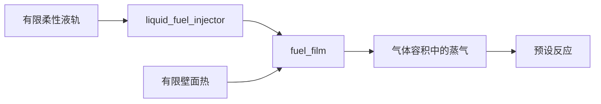

# 有限液轨、循环喷射与油膜补充

[English](LIQUID_FUEL_INJECTION.md) · **简体中文** · [Français](LIQUID_FUEL_INJECTION.fr.md) · [Русский](LIQUID_FUEL_INJECTION.ru.md) · [日本語](LIQUID_FUEL_INJECTION.ja.md) · [한국어](LIQUID_FUEL_INJECTION.ko.md) · [Deutsch](LIQUID_FUEL_INJECTION.de.md) · [Español](LIQUID_FUEL_INJECTION.es.md) · [Italiano](LIQUID_FUEL_INJECTION.it.md) · [Português](LIQUID_FUEL_INJECTION.pt-BR.md)

`liquid_fuel_injector` 把液体从有限柔性液轨送入单独的[油膜](FUEL_FILM.zh-CN.md)。正向曲轴窗口每个循环锁存一份请求质量。实际接收侧压力、喷嘴几何、剩余轨内存量与压力能决定供给。油膜随后加热并蒸发液体;既有的预设反应只消耗蒸气。

这把供给、相变与反应连接起来,同时使每项存量与能量转移都可观测。它是定密度/柔度的研究模型。油轨泵/回充、实测物性、更精细的电磁/电子驱动、喷雾/卷吸、空化、点火/ECU 以及标定的汽油硬件,仍是通向完整动力总成目标所必需的工作。



## 油轨与喷嘴方程

液轨具有恒定液体密度 `rho`、正的柔度 `C`(单位 m3/Pa)、初始质量 `m0` 与初始绝对压力 `P0`。其零压参考容积必须非负:

```text
V_reference = m0 / rho - C P0
m_rail = m0 - total_delivered_mass
P_rail = P0 - total_delivered_mass / (rho C)
E_pressure = C P_rail^2 / 2
```

这把柔度参考显式声明在绝对压力为零处;它不推断环境背压、体积模量图谱或油轨泵。有限柔性容积属于所提供的研究参数集。压力能属于储存能量账本,与量热存量和化学存量分开。源液体保持在所给定的温度;其量热能随供给的液体离开。本增量中没有油轨加热,也没有随温度变化的物性图谱。

正向开启时,单向准稳态喷嘴使用:

```text
mass_rate = Cd A sqrt(2 rho (P_rail - P_receiver))
```

当轨压不高于接收侧压力时,流量为零。密度与压力具有显式单位。这一压力/速度关系基于 [NASA 的 Bernoulli 推导](https://www1.grc.nasa.gov/beginners-guide-to-aeronautics/bernoullis-equation/)中所述的不可压能量简化。`Cd` 是给定的正系数,且不大于 1;它并不确立实测喷嘴行为,也不分辨动量、针阀运动或空化。

在一个喷射子步内接收侧压力固定时,压头有解析解。设 `r0 = sqrt(P_rail - P_receiver)`:

```text
r1 = max(0, r0 - Cd A h / (C sqrt(2 rho)))
available_mass = rho C (r0^2 - r1^2)
```

接受的质量受该可用量、剩余循环配额与剩余源存量的限制。该定律解出压头耗尽,既不允许负压头,也不凭空产生燃油。请求剂量的接受与实际供给是分开的;压力不足可以留下未充满的配额。

## 显热、化学能与压力能

接收油膜确定相容的液体量热参考:`u_supply = c_liquid T_supply + e_offset`。其温度必须为正,且不高于油膜所声明的饱和温度。喷入质量把 `delta_m * u_supply` 加入油膜热能,并在内部转移同样的化学存量。它不进入外部燃油/焓账本,也不在蒸发之前反应。

对于供给的液体容积 `delta_V = delta_m / rho`,接受的功为:

```text
W_rail = (P_before - delta_V / (2 C)) delta_V
W_receiver = P_receiver delta_V
Q_nozzle = W_rail - W_receiver
```

`W_rail` 恰好等于所储存轨压力能的减少。非负的喷嘴热进入油膜的有限热壁。轨压力功是内部的,不会再作为外部源功计一次。

既有油膜契约在气体几何中忽略液体排开容积。因此,该喷油器通过显式的接收侧压力功边界导出 `W_receiver`。全局源功收到 `-W_receiver`;气体容积与曲轴功不会被悄然增大。这是已声明的接口简化,不是已分辨液滴排开或喷雾动量的证据。将来的有限液体容积气体耦合,必须在另行验证的契约中用实际几何与压力功替换这一边界。

量热能、压力能与化学能保持区分。在内能之外保留压力功的需要,遵循 [Modelica 的不可压介质文档](https://doc.modelica.org/Modelica%204.0.0/Resources/helpWSM/Modelica/Modelica.Media.Incompressible.html)所说明的 `h = u + p/rho` 关系。完整的油轨/油膜/气体/热账本平衡所导出的功,并不把相变热、喷嘴耗散或压力能当作燃油反应热。

## 定义与定时契约

| 数据 | 要求 |
|---|---|
| `node_a` | 属于目标油膜的被追踪气体接收端 |
| `film_component` | 该接收端上已有的 `fuel_film` 部件 |
| `crank_node` | 转动定时参考;曲轴气缸使用它自己的曲轴 |
| `cycle_angle`、`start_angle`、`duration_angle` | 显式角度;360/720 度循环,以及有界的正持续角 |
| `maximum_dose`、`initial_input` | 正的上限,以及非负的每循环请求 kg |
| `initial_mass` | 正的初始轨内存量,单位 kg |
| `supply_temperature` | 液体温度 K,位于 `(0,film_saturation]` |
| `liquid_density` | 正的 kg/m3,JSON 单位 `kg_m3` |
| `initial_pressure` | 正的绝对压力,Pa/bar |
| `pressure_compliance` | 正的 m3/Pa,JSON 单位 `m3_pa` |
| `area`、`discharge_coefficient` | 正的 m2/mm2,以及 `(0,1]` 内的系数 |

全部量都是必需的。喷油器具有 `kg` 剂量输入,没有 `node_b`,也没有独立热汇;喷嘴热进入其目标油膜壁。无关参数、错误的单位/域/油膜归属、过热供给、不可能的参考容积以及不受支持的状态容量,都会以对象/字段诊断被拒绝。Core 客户端使用 `LiquidFuelMeter`、`LiquidFuelInjectorDefinition` 以及独立的 `CompliantLiquidRail` 定律。

共享的[剂量曲线](FUEL_METERING.zh-CN.md)在每个已观测的正向窗口内把指令锁存一次。窗口中途的变化作用于稍后的循环。反转会关闭流动,并且不能重新发放已经观测过的配额。每个机械区间的转角以 `min(0.25 rad,duration/8)` 为界,循环序号保持可表示。窗口端点使用固定节拍采样,并需要单独的事件细化。

## 积分与事务

该区间使用喷射 / 油膜 / 气体 / 机械与反应 / 气体 / 油膜 / 喷射半步。喷油器与油膜的扫描在后半段顺序相反。喷嘴热在这些子步期间改变有限油膜壁;蒸发从该壁支付其热量预算。独立的联立 ODE 积分验证油轨、油膜、气体以及压力/热转移的二阶光滑细化。其他气壁与热源保留既有的显式壁面精度极限。事件与存量耗尽并不继承一致的二阶声称。

每个喷油器向有界的被报告状态预算增加九项:既有的六项配额/供给,以及三项累积压力/热历史。源质量与压力由补偿后的总供给导出。全部补偿、循环序号、保持的目标与平均流都随仿真复制/哈希/回滚,包括推测离合器区间。预热后的活动供给与快照不分配托管内存。取消、后期失败、被拒绝的写入与独立分支保留完整的物理历史和控制器历史。

## 通道与可移植资产

通过校验或创建会话发现 ID 与单位。喷油器输出为:

- 剩余源 `mass`、绝对 `pressure`、供给 `temperature` 与液体 `volume`。
- `internal_energy` 为源的量热能加压能;`chemical_energy` 单独列出。
- 窗口 `opening`、上一节拍平均 `mass_flow`、锁存的 `requested_fuel_dose`、`delivered_fuel_dose` 与累积 `total_fuel_delivered`。
- `source_work` 为释放的轨压力功,`hydraulic_work` 为导出的接收侧压力功,`fluid_heat` 为喷嘴耗散。

这些部件字段的含义不同于全局外部源功。全局质量、燃油与化学能通道包含剩余液体源、油膜以及正常的气体/反应存量。

资产 v19 为每个液体喷油器写入一条带类型的 120 字节油轨/定时记录,外加既有的 36 字节喷嘴记录。编码器与保留的 v1-v18 读取器检查有界计数/长度、摘要、完整的带类型覆盖、单位、归属与伪造降级。一份真实的 v18 油膜夹具保留其指纹与同一运行时的升级回放。参见 [ASSET_FORMAT.md](ASSET_FORMAT.zh-CN.md)。

## 实验室与验收

`liquid-injected-cylinder` 从干燥油膜与有限带压源开始。单独进气、循环剂量请求、受壁面限制的蒸气可用量与预设反应,驱动与其他实验室相同的曲轴/负载模型。JSON、CLI、可移植资产与真实的 MCP 服务器共享其定义与回放边界。全部参数仍为 `unverified`。

解析压力衰减与功、剂量/反转/存量耗尽、独立耦合细化、完整的源/油膜/组分/能量账本、活动分配界限以及推测离合器回滚都会检查。[VALIDATION.md](VALIDATION.zh-CN.md)记载观测到的结果。已准备的 Unity 油轨/喷嘴视图与生命周期测试仍需要真实的 Editor/Play/Player 证据。油轨回充/泵、针阀动力学、已分辨的喷雾/排开、点火/ECU、完整的变速器/控制以及实测动力总成仍未完成。

## 物理针阀扩展

可选的针阀定义把供给连接到实际的平动升程。[电磁铁、弹性止挡与采样驱动器](NEEDLE_ACTUATION.zh-CN.md)现在提供该运动。在此模式下,请求剂量是控制器目标;它不在关闭滞后、回弹或反转期间限制物理流量。理想的配额限制路径仍然分开且不变。更精细的电磁/驱动器/喷雾行为与标定仍未完成。
