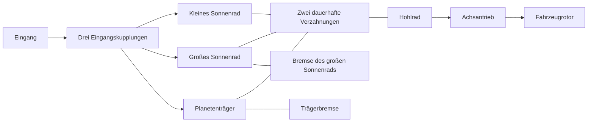

# Ravigneaux-Forschungsgetriebe

[English](RAVIGNEAUX_TRANSMISSION.md) · [简体中文](RAVIGNEAUX_TRANSMISSION.zh-CN.md) · [Français](RAVIGNEAUX_TRANSMISSION.fr.md) · [Русский](RAVIGNEAUX_TRANSMISSION.ru.md) · [日本語](RAVIGNEAUX_TRANSMISSION.ja.md) · [한국어](RAVIGNEAUX_TRANSMISSION.ko.md) · **Deutsch** · [Español](RAVIGNEAUX_TRANSMISSION.es.md) · [Italiano](RAVIGNEAUX_TRANSMISSION.it.md) · [Português](RAVIGNEAUX_TRANSMISSION.pt-BR.md)

Power! setzt vier Vorwärtsbereiche, Neutral und Rückwärts aus gewöhnlichen Definitionen von Zahnrad, Rotor und Kupplung zusammen. Ein großes Sonnenrad, ein kleines Sonnenrad, ein Hohlrad und ein Planetenträger bilden zwei dauerhafte Verzahnungsbindungen. Drei Eingangskupplungen und zwei Bremsen wählen einen Pfad; das Hohlrad treibt einen getrennten Achsantrieb und einen Fahrzeugrotor. Ein Wandler und seine parallele Überbrückung bleiben äußere Komponenten mit eigenen Wärmeverläufen. Die [Option aufgelöster Planeten](RESOLVED_PLANETS.de.md) ersetzt die beiden verdichteten Gliedbindungen durch vier tatsächliche Verzahnungen und ergänzt absolute Eigendrehung und Bahnträgheit.

Die Strukturreferenz ist die [Beschreibung des Doppelsonnen-Ravigneaux](https://www.mathworks.com/help/sdl/ref/ravigneauxgear.html). Die [Viergang-Reibbelegung](https://www.mathworks.com/help/sdl/ref/4speedravigneaux.html) liefert eine getrennte Referenz für die Bereichsuntersetzungen unten. Gleichungen, Baugruppe und Prüfungen von Power! sind unabhängig implementiert; kein Herstellerquelltext, keine Modelldateien und keine Pakete sind enthalten. Diese allgemeine Forschungsanordnung belegt nicht die Topologie oder kalibrierte Eigenschaften von PSA AT8/AL4.



## Physikalischer Vertrag

Sei `kL = NR/NL`, `kS = NR/NS`, mit `kS > kL > 1`. Winkelgeschwindigkeit und Winkelinkremente gehorchen:

```text
large sun + kL ring - (1+kL) carrier = 0
small sun - kS ring + (kS-1) carrier = 0
```

Die erste ist ein Einzelritzelzweig. Die zweite ist der Doppelritzelzweig, der die relative Drehrichtung zwischen Sonnenrad und Hohlrad erhält. Reaktionen sind proportional zu jeder vollständigen Bindungszeile, sodass ihre summierte Anschlussleistung verschwindet. Normierte unveränderliche Zeilen gehen in die bestehende gekoppelte Lösung ein; sie schreiben die Abtriebsdrehzahl nicht unabhängig von Drehmoment oder Trägheit vor. Anfangsdrehzahlen müssen beide Bindungen erfüllen. Die Anfangsphase bleibt beobachtbar und erhalten.

| Bereich | Eingangsverbindungen | Festgehaltenes Glied | Untersetzung Eingang/Hohlrad |
|---|---|---|---:|
| 1 | Kleines Sonnenrad | Planetenträger | `kS` |
| 2 | Kleines Sonnenrad | Großes Sonnenrad | `(kL+kS)/(1+kL)` |
| 3 | Planetenträger und kleines Sonnenrad | Keines | `1` |
| 4 | Planetenträger | Großes Sonnenrad | `kL/(1+kL)` |
| Rückwärts | Großes Sonnenrad | Planetenträger | `-kL` |
| Neutral | Keine | Keines | Freier Eingang |

Das sind stationäre Pfadbeziehungen, nachdem die erforderlichen Elemente physikalisch verriegelt haben. Ein Befehl allein stellt keinen gewählten Bereich her. Während Aufnahme und Übergabe erlaubt endliche Kapazität Schlupf, überträgt Drehmoment und erzeugt Wärme. Gestellbremsen tragen Reaktionsmoment bei Gestelldrehzahl null; innere Reibungswärme stammt vom tatsächlich gleitenden Glied. Die Forschungskonvention des Achsantriebs nutzt ein positives Eingangs-/Ausgangsverhältnis ausdrücklich.

`RavigneauxTransmissionAssembly` nimmt SI-Trägheiten der Glieder, Haft- und Gleitmomentkapazitäten, Zähneverhältnisse und die Achsuntersetzung. `RavigneauxPorts` bindet stabile IDs und fünf verschiedene Eingriffskanäle. `CreateGraph` liefert unveränderliche Sammlungen aus vier inneren Rotoren und acht Komponenten. Der Aufrufer stellt Eingang, Fahrzeug und optionale Wärmeanschlüsse bereit. `RangeCommands` liefert die erklärte Reibbelegung, ohne hydraulische Ansteuerung oder Schaltregelung zu behaupten.

## Gemeinsame Experimente und Nachweis

- `ravigneaux-transmission` schreibt Vorwärtshochschaltungen und Rückschaltungen durch alle vier Pfade mit ausdrücklicher Reibungswärme vor.
- `fired-ravigneaux-converter` verbindet den vormischenden Motor, vier vorzeichenbehaftete Wandlerkennfelder, die Überbrückung, den zusammengesetzten Graphen und einen erklärten Fahrzeugrotor von 1 kg m2. Das andere Experiment mit Drehmomentquelle von 10 kg m2 ist ein unabhängiger Lastfall.

Beide nutzen dieselben Verträge für JSON, CLI, MCP und portable Assets. Sechs Gruppen zu Kernphysik und Transaktion vergleichen eine getrennt abgeleitete freie 2x2-Massenmatrix, rückgespiegelte Trägheiten, Rückwärtsvorzeichen, Bremsreaktionen, Aufnahmeimpuls und -wärme und das Rollback des vollständigen Zustands. Eine belastete Overdrive-Prüfung über 20 Sekunden hält strenge Phasengrenzen durch kompensierte Koordinatenakkumulation; der Korrekturzustand wird kopiert, gehasht und mit dem vollständigen Modell zurückgerollt. Portable Prüfungen erhalten vollständige Planetenträger und Reaktionen, weisen fehlerhafte Datensätze und gefälschte Herabstufungen zurück und spielen eine authentische v22-Fixture nach. Gemeinsame Verfeinerung von Motor und Wandler und jede Berichtsgrenze haben getrennte Prüfungen. `dotnet run --file tools/Build.cs -- verify` ausführen; aufgezeichnete Ergebnisse und Digests gehören in [VALIDATION.de.md](VALIDATION.de.md).

## Verbleibender Umfang

Alle Parameter bleiben `unverified`. Die Reduktion auf vier Glieder löst Eigendrehung und Bahnträgheit der Planeten nicht auf; der ausdrückliche [aufgelöste Pfad](RESOLVED_PLANETS.de.md) liefert diese Energien. Detaillierte Zahngeometrie bleibt außerhalb beider Pfade. Verzahnungsverluste, Schmierung, temperaturabhängige Eigenschaften, gemessene Ventilkörper-Führung sowie AT-Regelung und Drehmomentabstimmung der ECU brauchen weitere erhaltende Komponenten und gemessene Nachweise. Die reduzierten Experimente nutzen vorgeschriebene Eingriffe; die [hydraulische Option](AT_HYDRAULIC_ACTUATION.de.md) liefert tatsächliche Kolbenansteuerung. Der Wandler bleibt quasistationär mit synthetischen Kennfeldern.

Vorbereitete Studio-Prüfungen für Import und Wiedergabe enthalten den Anschluss des Doppelritzel-Planetenträgers. Tatsächliche Abnahme von Editor, Play, Rendering und Player/IL2CPP bleiben getrennte Stufen. Die vollständigen Beispielgrenzen von EA211 DJS + DQ200 und PSA EC5 + AT8 sowie fehlende OEM-Messungen bleiben in `assets/samples` intakt.
