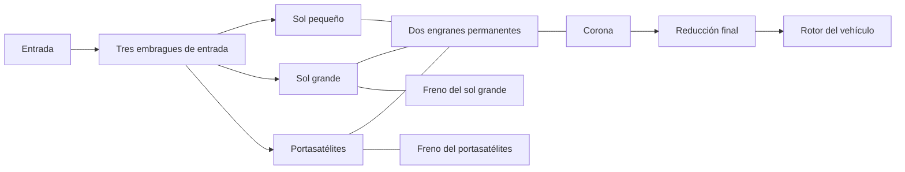

# Transmisión de investigación Ravigneaux

[English](RAVIGNEAUX_TRANSMISSION.md) · [简体中文](RAVIGNEAUX_TRANSMISSION.zh-CN.md) · [Français](RAVIGNEAUX_TRANSMISSION.fr.md) · [Русский](RAVIGNEAUX_TRANSMISSION.ru.md) · [日本語](RAVIGNEAUX_TRANSMISSION.ja.md) · [한국어](RAVIGNEAUX_TRANSMISSION.ko.md) · [Deutsch](RAVIGNEAUX_TRANSMISSION.de.md) · **Español** · [Italiano](RAVIGNEAUX_TRANSMISSION.it.md) · [Português](RAVIGNEAUX_TRANSMISSION.pt-BR.md)

Power! ensambla cuatro rangos adelante, el punto muerto y la marcha atrás a partir de definiciones ordinarias de engranaje, rotor y embrague. Un sol grande, un sol pequeño, la corona y el portasatélites forman dos restricciones permanentes de engrane. Tres embragues de entrada y dos frenos seleccionan un camino; la corona acciona una reducción final aparte y el rotor del vehículo. Un convertidor y su bloqueo paralelo siguen siendo componentes externos, con sus propios historiales de calor. La [opción de planetarios resueltos](RESOLVED_PLANETS.es.md) sustituye las dos restricciones condensadas de miembros por cuatro engranes reales y añade el giro absoluto y la inercia orbital.

La referencia estructural es la [descripción Ravigneaux de doble sol](https://www.mathworks.com/help/sdl/ref/ravigneauxgear.html). El [programa de fricción de cuatro marchas](https://www.mathworks.com/help/sdl/ref/4speedravigneaux.html) aporta una referencia aparte para las reducciones de rango de abajo. Las ecuaciones, el ensamblado y las comprobaciones de Power! están implementados de forma independiente; no se incluye código de proveedor, archivos de modelo ni paquetes. Esta disposición genérica de investigación no establece la topología PSA AT8/AL4 ni propiedades calibradas.



## Contrato físico

Sean `kL = NR/NL`, `kS = NR/NS`, con `kS > kL > 1`. La velocidad angular y los incrementos de ángulo obedecen:

```text
large sun + kL ring - (1+kL) carrier = 0
small sun - kS ring + (kS-1) carrier = 0
```

La primera es una rama de satélite simple. La segunda es la rama de satélite doble, que preserva el sentido de rotación relativo entre el sol y la corona. Las reacciones son proporcionales a cada fila completa de restricción, así que su potencia de puerto sumada se anula. Las filas inmutables normalizadas entran en la resolución acoplada existente; no imponen la velocidad de salida con independencia del par o de la inercia. Las velocidades iniciales deben satisfacer ambas restricciones. La fase inicial sigue siendo observable y se conserva.

| Rango | Conexiones de entrada | Miembro a masa | Reducción entrada/corona |
|---|---|---|---:|
| 1 | Sol pequeño | Portasatélites | `kS` |
| 2 | Sol pequeño | Sol grande | `(kL+kS)/(1+kL)` |
| 3 | Portasatélites y sol pequeño | Ninguno | `1` |
| 4 | Portasatélites | Sol grande | `kL/(1+kL)` |
| Marcha atrás | Sol grande | Portasatélites | `-kL` |
| Punto muerto | Ninguna | Ninguno | Entrada no restringida |

Son relaciones de camino estacionario después de que los elementos exigidos se bloquean físicamente. Una consigna por sí sola no establece un rango seleccionado. Durante la captura y la entrega, la capacidad finita permite deslizamiento, transfiere par y genera calor. Los frenos a masa llevan par de reacción a velocidad de masa nula; el calor de fricción interno proviene del miembro que realmente desliza. La convención de investigación de la reducción final usa de forma explícita una relación positiva de entrada/salida.

`RavigneauxTransmissionAssembly` toma inercias de los miembros en el SI, capacidades de par estático y deslizante, relaciones de dientes y la reducción final. `RavigneauxPorts` enlaza ID estables y cinco canales de acoplamiento distintos. `CreateGraph` devuelve colecciones inmutables de cuatro rotores internos y ocho componentes. El llamador aporta los puertos de entrada, del vehículo y el térmico opcional. `RangeCommands` devuelve el programa de fricción declarado, sin afirmar actuación hidráulica ni control del cambio.

## Experimentos compartidos y evidencia

- `ravigneaux-transmission` prescribe subidas y bajadas adelante a través de los cuatro caminos, con calor de fricción explícito.
- `fired-ravigneaux-converter` conecta el motor premmezclado, cuatro mapas de convertidor con signo, el bloqueo, el grafo compuesto y un rotor de vehículo declarado de 1 kg m2. El experimento distinto de fuente de par de 10 kg m2 es un caso de carga independiente.

Ambos usan los mismos contratos de JSON, CLI, MCP y de asset portátil. Seis grupos de física de Core y de transacción comparan una matriz de masa libre 2x2 derivada por separado, inercias reflejadas, signos de marcha atrás, reacciones de freno, impulso y calor de captura, y la reversión del estado completo. Una comprobación de sobremarcha de 20 segundos bajo carga conserva límites estrictos de fase mediante la acumulación compensada de coordenadas; el estado de corrección se copia, se hashea y se revierte con el modelo completo. Las pruebas portátiles conservan portasatélites y reacciones completos, rechazan registros mal formados y degradaciones falsificadas, y repiten un fixture auténtico v22. El refinamiento combinado de motor y convertidor, y cada límite del informe, tienen comprobaciones aparte. Ejecuta `dotnet run --file tools/Build.cs -- verify`; los resultados registrados y los resúmenes pertenecen a [VALIDATION.es.md](VALIDATION.es.md).

## Alcance restante

Todos los parámetros siguen siendo `unverified`. La reducción de cuatro miembros no resuelve la inercia de giro ni de órbita de los satélites; el [camino resuelto](RESOLVED_PLANETS.es.md) explícito aporta esas energías. La geometría detallada del diente queda fuera de ambos caminos. Las pérdidas de engrane, la lubricación, las propiedades dependientes de la temperatura, el encaminamiento medido del cuerpo de válvulas, el control de la AT y la coordinación de par de la ECU necesitan más componentes conservativos y evidencia medida. Los experimentos reducidos usan acoplamientos prescritos; la [opción hidráulica](AT_HYDRAULIC_ACTUATION.es.md) aporta la actuación real por pistón. El convertidor sigue siendo cuasiestacionario, con mapas sintéticos.

Las pruebas preparadas de importación y de reproducción de Studio incluyen el puerto del portasatélites de satélite doble. La aceptación real de Editor, Play Mode, renderizado y Player/IL2CPP siguen siendo puertas aparte. Los límites completos de las muestras EA211 DJS + DQ200 y PSA EC5 + AT8, y las mediciones OEM que faltan, permanecen intactos en `assets/samples`.
