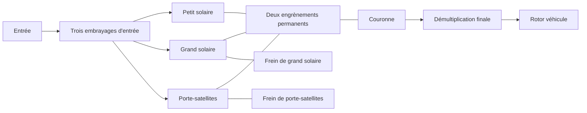

# Transmission de recherche Ravigneaux

[English](RAVIGNEAUX_TRANSMISSION.md) · [简体中文](RAVIGNEAUX_TRANSMISSION.zh-CN.md) · **Français** · [Русский](RAVIGNEAUX_TRANSMISSION.ru.md) · [日本語](RAVIGNEAUX_TRANSMISSION.ja.md) · [한국어](RAVIGNEAUX_TRANSMISSION.ko.md) · [Deutsch](RAVIGNEAUX_TRANSMISSION.de.md) · [Español](RAVIGNEAUX_TRANSMISSION.es.md) · [Italiano](RAVIGNEAUX_TRANSMISSION.it.md) · [Português](RAVIGNEAUX_TRANSMISSION.pt-BR.md)

Power! assemble quatre plages avant, le point mort et la marche arrière à partir de définitions ordinaires d'engrenage, de rotor et d'embrayage. Un grand solaire, un petit solaire, une couronne et un porte-satellites forment deux contraintes d'engrènement permanentes. Trois embrayages d'entrée et deux freins sélectionnent un chemin ; la couronne entraîne une démultiplication finale distincte et un rotor véhicule. Un convertisseur et son verrouillage parallèle restent des composants externes, avec leurs propres historiques de chaleur. L'[option de planétaires résolus](RESOLVED_PLANETS.fr.md) remplace les deux contraintes d'éléments condensées par quatre engrènements réels et ajoute la rotation propre absolue et l'inertie orbitale.

La référence structurelle est la [description Ravigneaux à double solaire](https://www.mathworks.com/help/sdl/ref/ravigneauxgear.html). Le [calendrier de friction à quatre rapports](https://www.mathworks.com/help/sdl/ref/4speedravigneaux.html) fournit une référence séparée pour les réductions de plage ci-dessous. Les équations, l'assemblage et les contrôles de Power! sont implémentés de façon indépendante ; aucun code, fichier de modèle ou paquet d'éditeur n'est inclus. Cet arrangement de recherche générique n'établit pas la topologie PSA AT8/AL4 ni des propriétés calibrées.



## Contrat physique

Soit `kL = NR/NL`, `kS = NR/NS`, avec `kS > kL > 1`. Les incréments de vitesse angulaire et d'angle obéissent à :

```text
large sun + kL ring - (1+kL) carrier = 0
small sun - kS ring + (kS-1) carrier = 0
```

La première est une branche à simple satellite. La seconde est la branche à double satellite, qui conserve le sens de rotation relatif entre le solaire et la couronne. Les réactions sont proportionnelles à chaque ligne de contrainte complète, donc leur puissance de port sommée s'annule. Des lignes immuables normalisées entrent dans la résolution couplée existante ; elles n'imposent pas la vitesse de sortie indépendamment du couple ou de l'inertie. Les vitesses initiales doivent satisfaire les deux contraintes. La phase initiale reste observable et conservée.

| Plage | Connexions d'entrée | Élément au bâti | Réduction entrée/couronne |
|---|---|---|---:|
| 1 | Petit solaire | Porte-satellites | `kS` |
| 2 | Petit solaire | Grand solaire | `(kL+kS)/(1+kL)` |
| 3 | Porte-satellites et petit solaire | Aucun | `1` |
| 4 | Porte-satellites | Grand solaire | `kL/(1+kL)` |
| Marche arrière | Grand solaire | Porte-satellites | `-kL` |
| Point mort | Aucun | Aucun | Entrée non contrainte |

Ce sont des relations de chemin stationnaires après le verrouillage physique des éléments requis. Une commande seule n'établit pas une plage sélectionnée. Pendant la capture et la passation, une capacité finie permet le glissement, transfère du couple et produit de la chaleur. Les freins au bâti portent un couple de réaction à vitesse de bâti nulle ; la chaleur de frottement interne vient de l'élément qui glisse réellement. La convention de recherche de la démultiplication finale utilise explicitement un rapport entrée/sortie positif.

`RavigneauxTransmissionAssembly` prend les inerties SI des éléments, les capacités de couple statique et glissant, les rapports de dents et la réduction finale. `RavigneauxPorts` lie des ID stables et cinq canaux d'engagement distincts. `CreateGraph` renvoie des collections immuables de quatre rotors internes et de huit composants. L'appelant fournit l'entrée, le véhicule et des ports thermiques optionnels. `RangeCommands` renvoie le calendrier de friction déclaré, sans revendiquer un actionnement hydraulique ni un contrôle de passage.

## Expériences partagées et preuves

- `ravigneaux-transmission` prescrit des montées et des descentes avant à travers les quatre chemins, avec une chaleur de frottement explicite.
- `fired-ravigneaux-converter` relie le moteur à combustion prémélangée, quatre cartes de convertisseur signées, le verrouillage, le graphe composé et un rotor véhicule déclaré de 1 kg m2. L'expérience distincte à source de couple de 10 kg m2 est un cas de charge indépendant.

Les deux utilisent les mêmes contrats JSON, CLI, MCP et d'asset portable. Six groupes de physique du cœur et de transaction comparent une matrice de masse libre 2x2 dérivée séparément, les inerties ramenées, les signes de marche arrière, les réactions de frein, l'impulsion et la chaleur de capture, et le rollback d'état complet. Un contrôle de surmultiplication en charge de 20 secondes conserve des limites de phase strictes grâce à l'accumulation de coordonnées compensée ; l'état de correction est copié, haché et soumis au rollback avec le modèle complet. Les tests portables conservent les porte-satellites et les réactions dans leur intégralité, rejettent les enregistrements mal formés et les rétrogradations forgées, et rejouent un scénario authentique v22. Le raffinement combiné moteur/convertisseur et chaque borne de rapport ont des contrôles séparés. Exécutez `dotnet run --file tools/Build.cs -- verify` ; les résultats et condensés enregistrés appartiennent à [VALIDATION.fr.md](VALIDATION.fr.md).

## Périmètre restant

Tous les paramètres restent `unverified`. La réduction à quatre éléments ne résout pas l'inertie de rotation propre et d'orbite des satellites ; le [chemin résolu](RESOLVED_PLANETS.fr.md) explicite fournit ces énergies. La géométrie détaillée des dents reste hors des deux chemins. Les pertes d'engrènement, la lubrification, les propriétés dépendantes de la température, le routage mesuré du bloc hydraulique, le contrôle AT et la coordination de couple ECU exigent d'autres composants conservatifs et des preuves mesurées. Les expériences réduites utilisent des engagements prescrits ; l'[option hydraulique](AT_HYDRAULIC_ACTUATION.fr.md) fournit un actionnement réel par piston. Le convertisseur reste quasi stationnaire, avec des cartes synthétiques.

Les tests d'import et de lecture Studio préparés incluent le port de porte-satellites à double satellite. L'acceptation réelle Editor/Play/rendu et Player/IL2CPP reste des portes séparées. Les frontières complètes des échantillons EA211 DJS + DQ200 et PSA EC5 + AT8, ainsi que les mesures OEM manquantes, restent intactes dans `assets/samples`.
