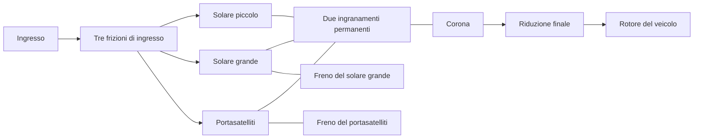

# Trasmissione di ricerca Ravigneaux

[English](RAVIGNEAUX_TRANSMISSION.md) · [简体中文](RAVIGNEAUX_TRANSMISSION.zh-CN.md) · [Français](RAVIGNEAUX_TRANSMISSION.fr.md) · [Русский](RAVIGNEAUX_TRANSMISSION.ru.md) · [日本語](RAVIGNEAUX_TRANSMISSION.ja.md) · [한국어](RAVIGNEAUX_TRANSMISSION.ko.md) · [Deutsch](RAVIGNEAUX_TRANSMISSION.de.md) · [Español](RAVIGNEAUX_TRANSMISSION.es.md) · **Italiano** · [Português](RAVIGNEAUX_TRANSMISSION.pt-BR.md)

Power! assembla quattro gamme in avanti, la folle e la retromarcia da definizioni ordinarie di ingranaggio, rotore e frizione. Un solare grande, un solare piccolo, la corona e il portasatelliti formano due vincoli di ingranamento permanenti. Tre frizioni di ingresso e due freni selezionano un percorso; la corona comanda una riduzione finale separata e il rotore del veicolo. Un convertitore e il suo blocco parallelo restano componenti esterni, con le proprie storie di calore. L'[opzione a satelliti risolti](RESOLVED_PLANETS.it.md) sostituisce i due vincoli di membro condensati con quattro ingranamenti reali e aggiunge rotazione assoluta e inerzia orbitale.

Il riferimento strutturale è la [descrizione Ravigneaux a doppio solare](https://www.mathworks.com/help/sdl/ref/ravigneauxgear.html). La [programmazione di attrito a quattro velocità](https://www.mathworks.com/help/sdl/ref/4speedravigneaux.html) fornisce un riferimento separato per le riduzioni di gamma qui sotto. Equazioni, assemblaggio e controlli di Power! sono implementati in modo indipendente; non sono inclusi codice, file di modello o pacchetti del fornitore. Questa disposizione generica di ricerca non stabilisce la topologia PSA AT8/AL4 né proprietà calibrate.



## Contratto fisico

Siano `kL = NR/NL`, `kS = NR/NS`, con `kS > kL > 1`. Velocità angolare e incrementi di angolo obbediscono a:

```text
large sun + kL ring - (1+kL) carrier = 0
small sun - kS ring + (kS-1) carrier = 0
```

La prima è un ramo a pignone singolo. La seconda è il ramo a doppio pignone, che conserva la direzione di rotazione relativa fra solare e corona. Le reazioni sono proporzionali a ogni riga di vincolo completa, quindi la loro potenza di porta sommata si annulla. Righe immutabili normalizzate entrano nella risoluzione accoppiata esistente; non impongono la velocità di uscita in modo indipendente da coppia o inerzia. Le velocità iniziali devono soddisfare entrambi i vincoli. La fase iniziale resta osservabile e conservata.

| Gamma | Collegamenti di ingresso | Membro a massa | Riduzione ingresso/corona |
|---|---|---|---:|
| 1 | Solare piccolo | Portasatelliti | `kS` |
| 2 | Solare piccolo | Solare grande | `(kL+kS)/(1+kL)` |
| 3 | Portasatelliti e solare piccolo | Nessuno | `1` |
| 4 | Portasatelliti | Solare grande | `kL/(1+kL)` |
| Retromarcia | Solare grande | Portasatelliti | `-kL` |
| Folle | Nessuno | Nessuno | Ingresso non vincolato |

Queste sono relazioni di percorso a regime, dopo che gli elementi richiesti si bloccano fisicamente. Un comando da solo non stabilisce una gamma selezionata. Durante cattura e passaggio, la capacità finita permette lo slittamento, trasferisce coppia e genera calore. I freni a massa portano coppia di reazione a velocità di massa nulla; il calore di attrito interno viene dal membro che striscia davvero. La convenzione di ricerca della riduzione finale usa in modo esplicito un rapporto ingresso/uscita positivo.

`RavigneauxTransmissionAssembly` riceve inerzie SI dei membri, capacità di coppia statica e strisciante, rapporti dei denti e riduzione finale. `RavigneauxPorts` lega ID stabili e cinque canali di innesto distinti. `CreateGraph` restituisce collezioni immutabili di quattro rotori interni e otto componenti. Il chiamante fornisce le porte di ingresso, veicolo e termica facoltativa. `RangeCommands` restituisce la programmazione di attrito dichiarata, senza pretendere azionamento idraulico o controllo del cambio.

## Esperimenti condivisi ed evidenze

- `ravigneaux-transmission` prescrive passaggi in salita e in discesa in avanti attraverso tutti e quattro i percorsi, con calore di attrito esplicito.
- `fired-ravigneaux-converter` collega il motore a combustione premiscelata, quattro mappe con segno del convertitore, il blocco, il grafo composto e un rotore del veicolo dichiarato di 1 kg m2. L'esperimento diverso a sorgente di coppia da 10 kg m2 è un caso di carico indipendente.

Entrambi usano gli stessi contratti JSON, CLI, MCP e di asset portabile. Sei gruppi di fisica di Core e di transazione confrontano una matrice di massa libera 2x2 derivata a parte, le inerzie riflesse, i segni di retromarcia, le reazioni dei freni, impulso e calore di cattura e il rollback dello stato completo. Un controllo di overdrive sotto carico di 20 secondi conserva limiti di fase rigorosi attraverso l'accumulo compensato delle coordinate; lo stato di correzione si copia, si sottopone a hash e torna indietro con il modello completo. I test portabili conservano portasatelliti e reazioni completi, rifiutano record malformati e declassamenti contraffatti, e rieseguono un fixture autentico v22. L'affinamento combinato di motore e convertitore e ogni limite del report hanno controlli separati. Esegui `dotnet run --file tools/Build.cs -- verify`; esiti e digest registrati appartengono a [VALIDATION.md](VALIDATION.it.md).

## Ambito restante

Tutti i parametri restano `unverified`. La riduzione a quattro membri non risolve l'inerzia di rotazione e di orbita dei satelliti; il [percorso risolto](RESOLVED_PLANETS.it.md) esplicito fornisce quelle energie. La geometria dettagliata dei denti resta fuori da entrambi i percorsi. Perdite di ingranamento, lubrificazione, proprietà dipendenti dalla temperatura, instradamento misurato del corpo valvole, controllo AT e coordinamento di coppia della ECU richiedono altri componenti conservativi ed evidenza misurata. Gli esperimenti ridotti usano innesti prescritti; l'[opzione idraulica](AT_HYDRAULIC_ACTUATION.it.md) fornisce l'azionamento reale a stantuffo. Il convertitore resta quasi stazionario, con mappe sintetiche.

I test preparati di importazione e riproduzione in Studio includono la porta del portasatelliti a doppio pignone. L'accettazione reale di Editor, Play, rendering e Player/IL2CPP resta un cancello separato. I confini completi dei campioni EA211 DJS + DQ200 e PSA EC5 + AT8 e le misure OEM mancanti restano intatti in `assets/samples`.
