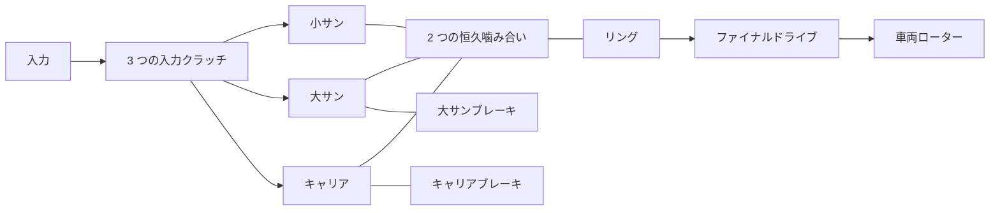

# Ravigneaux 研究用トランスミッション

[English](RAVIGNEAUX_TRANSMISSION.md) · [简体中文](RAVIGNEAUX_TRANSMISSION.zh-CN.md) · [Français](RAVIGNEAUX_TRANSMISSION.fr.md) · [Русский](RAVIGNEAUX_TRANSMISSION.ru.md) · **日本語** · [한국어](RAVIGNEAUX_TRANSMISSION.ko.md) · [Deutsch](RAVIGNEAUX_TRANSMISSION.de.md) · [Español](RAVIGNEAUX_TRANSMISSION.es.md) · [Italiano](RAVIGNEAUX_TRANSMISSION.it.md) · [Português](RAVIGNEAUX_TRANSMISSION.pt-BR.md)

Power! は、4 つの前進レンジ、ニュートラル、リバースを、通常の歯車、ローター、クラッチの定義から組み立てます。大サン、小サン、リング、キャリアが 2 つの恒久噛み合い拘束を作ります。3 つの入力クラッチと 2 つのブレーキが経路を選びます。リングは別のファイナルドライブと車両ローターを駆動します。コンバーターとその並列ロックアップは、独自の熱履歴を持つ外部コンポーネントのままです。[分解遊星の選択肢](RESOLVED_PLANETS.ja.md)は、2 つの縮約された部材拘束を 4 つの実際の噛み合いに置き換え、絶対自転と軌道慣性を加えます。

構造上の参考文献は、[デュアルサンの Ravigneaux の説明](https://www.mathworks.com/help/sdl/ref/ravigneauxgear.html)です。[4 速の摩擦スケジュール](https://www.mathworks.com/help/sdl/ref/4speedravigneaux.html)は、以下のレンジ減速に対する別の参考文献です。Power! の方程式、組み立て、検査は独立に実装されています。ベンダーのコード、モデルファイル、パッケージは含まれません。この汎用の研究配置は、PSA AT8/AL4 のトポロジーやキャリブレーション済み特性を確立しません。



## 物理契約

`kL = NR/NL`、`kS = NR/NS` とし、`kS > kL > 1` とします。角速度と角度増分は次に従います。

```text
large sun + kL ring - (1+kL) carrier = 0
small sun - kS ring + (kS-1) carrier = 0
```

1 つ目はシングルピニオン分枝です。2 つ目はダブルピニオン分枝で、サンとリングの間の相対回転の向きを保ちます。反力は各完全な拘束行に比例するので、合計したポート動力は消えます。正規化された不変の行は既存の連成求解に入ります。トルクや慣性と独立に出力速度を課すことはしません。初期速度は両方の拘束を満たさなければなりません。初期位相は観測可能で、保存されます。

| レンジ | 入力の接続 | 接地される部材 | 入力/リング減速 |
|---|---|---|---:|
| 1 | 小サン | キャリア | `kS` |
| 2 | 小サン | 大サン | `(kL+kS)/(1+kL)` |
| 3 | キャリアと小サン | なし | `1` |
| 4 | キャリア | 大サン | `kL/(1+kL)` |
| リバース | 大サン | キャリア | `-kL` |
| ニュートラル | なし | なし | 拘束されない入力 |

これらは、必要な要素が物理的にロックしたあとの定常経路の関係です。指令だけでは選ばれたレンジは確立しません。捕捉と引き継ぎの間、有限容量は滑りを許し、トルクを伝え、熱を生成します。接地ブレーキは、接地速度零で反力トルクを担います。内部の摩擦熱は、実際に滑っている部材から来ます。研究用のファイナルドライブの規約は、正の入力/出力比を明示的に使います。

`RavigneauxTransmissionAssembly` は、SI の部材慣性、静止/滑りトルク容量、歯数比、最終減速を取ります。`RavigneauxPorts` は安定した ID と 5 つの別々の係合チャンネルを束縛します。`CreateGraph` は、4 つの内部ローターと 8 つのコンポーネントの不変コレクションを返します。呼び出し側は入力、車両、任意の熱ポートを提供します。`RangeCommands` は宣言された摩擦スケジュールを返し、油圧駆動や変速制御を主張しません。

## 共有実験とエビデンス

- `ravigneaux-transmission` は、明示的な摩擦熱とともに、4 つの経路すべてを通る前進の昇段と降段を規定します。
- `fired-ravigneaux-converter` は、予混合エンジン、4 つの符号付きコンバーターマップ、ロックアップ、複合グラフ、宣言された 1 kg m2 の車両ローターをつなぎます。別の 10 kg m2 のトルク源実験は、独立した負荷ケースです。

どちらも同じ JSON、CLI、MCP、移植可能アセットの契約を使います。6 つのコア物理およびトランザクショングループが、別に導出した 2×2 の自由質量行列、換算慣性、リバースの符号、ブレーキ反力、捕捉の力積/熱、全状態ロールバックを比べます。負荷のある 20 秒のオーバードライブ検査は、補償された座標の累積を通じて厳密な位相限界を保ちます。補正状態は、完全なモデルとともにコピー、ハッシュ、ロールバックされます。移植可能テストは完全なキャリアと反力を保ち、不正なレコードと偽造されたダウングレードを拒否し、真正な v22 フィクスチャをリプレイします。エンジン/コンバーターを組み合わせた細分化と、すべてのレポート境界には別の検査があります。`dotnet run --file tools/Build.cs -- verify` を実行してください。記録された結果とダイジェストは [VALIDATION.ja.md](VALIDATION.ja.md) に属します。

## 残る範囲

パラメーターはすべて `unverified` のままです。4 部材の縮約は遊星の自転/軌道慣性を分解しません。明示的な[分解経路](RESOLVED_PLANETS.ja.md)がそれらのエネルギーを供給します。詳細な歯の幾何は両方の経路の外です。噛み合い損失、潤滑、温度依存の物性、実測のバルブボディ経路、AT 制御と ECU のトルク協調には、さらなる保存的コンポーネントと実測エビデンスが必要です。縮約実験は規定された係合を使います。[油圧の選択肢](AT_HYDRAULIC_ACTUATION.ja.md)が実際のピストン駆動を提供します。コンバーターは、合成マップを持つ準定常のままです。

用意された Studio のインポート/再生テストは、ダブルピニオンのキャリアポートを含みます。実際のエディター/Play/レンダリングと Player/IL2CPP の受理は、別の関門のままです。完全な EA211 DJS + DQ200 と PSA EC5 + AT8 のサンプル境界と、欠けている OEM 計測は、`assets/samples` にそのまま残っています。
