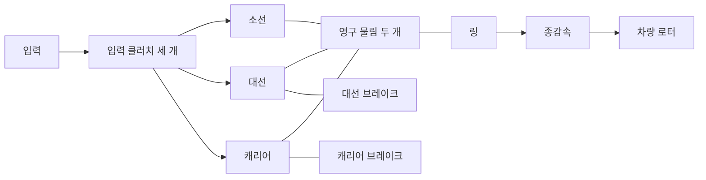

# Ravigneaux 연구 변속기

[English](RAVIGNEAUX_TRANSMISSION.md) · [简体中文](RAVIGNEAUX_TRANSMISSION.zh-CN.md) · [Français](RAVIGNEAUX_TRANSMISSION.fr.md) · [Русский](RAVIGNEAUX_TRANSMISSION.ru.md) · [日本語](RAVIGNEAUX_TRANSMISSION.ja.md) · **한국어** · [Deutsch](RAVIGNEAUX_TRANSMISSION.de.md) · [Español](RAVIGNEAUX_TRANSMISSION.es.md) · [Italiano](RAVIGNEAUX_TRANSMISSION.it.md) · [Português](RAVIGNEAUX_TRANSMISSION.pt-BR.md)

Power!는 보통의 기어, 로터, 클러치 정의로 네 개의 전진 레인지, 중립, 후진을 조립합니다. 대선, 소선, 링, 캐리어가 두 개의 영구 물림 제약을 이룹니다. 입력 클러치 세 개와 브레이크 두 개가 경로를 고릅니다. 링은 별도의 종감속과 차량 로터를 구동합니다. 컨버터와 그 병렬 록업은 자체 열 이력을 가진 외부 컴포넌트로 남습니다. [분해 유성 옵션](RESOLVED_PLANETS.ko.md)은 응축된 부재 제약 두 개를 실제 물림 네 개로 바꾸고, 절대 자전과 궤도 관성을 더합니다.

구조 참고는 [듀얼 선 Ravigneaux 설명](https://www.mathworks.com/help/sdl/ref/ravigneauxgear.html)입니다. [4단 마찰 스케줄](https://www.mathworks.com/help/sdl/ref/4speedravigneaux.html)은 아래 레인지 감속에 대한 별도 참고를 제공합니다. Power!의 방정식, 조립, 검사는 독립적으로 구현되었습니다. 벤더 코드, 모델 파일, 패키지는 포함되지 않습니다. 이 일반적인 연구 배치는 PSA AT8/AL4 토폴로지나 교정된 물성을 세우지 않습니다.



## 물리 계약

`kL = NR/NL`, `kS = NR/NS`이고 `kS > kL > 1`입니다. 각속도와 각 증분은 다음을 따릅니다.

```text
large sun + kL ring - (1+kL) carrier = 0
small sun - kS ring + (kS-1) carrier = 0
```

첫 번째는 단일 피니언 가지입니다. 두 번째는 이중 피니언 가지이며, 선과 링 사이의 상대 회전 방향을 유지합니다. 반력은 각 완전한 제약 행에 비례하므로, 합산 포트 동력은 0입니다. 정규화된 불변 행은 기존 결합 풀이에 들어가며, 토크나 관성과 무관하게 출력 속도를 부과하지 않습니다. 초기 속도는 두 제약을 모두 만족해야 합니다. 초기 위상은 관측 가능하고 보존됩니다.

| 레인지 | 입력 연결 | 접지된 부재 | 입력/링 감속비 |
|---|---|---|---:|
| 1 | 소선 | 캐리어 | `kS` |
| 2 | 소선 | 대선 | `(kL+kS)/(1+kL)` |
| 3 | 캐리어와 소선 | 없음 | `1` |
| 4 | 캐리어 | 대선 | `kL/(1+kL)` |
| 후진 | 대선 | 캐리어 | `-kL` |
| 중립 | 없음 | 없음 | 제약되지 않은 입력 |

이것은 필요한 요소가 물리적으로 잠긴 뒤의 정상 경로 관계입니다. 명령만으로 선택된 레인지가 성립하지는 않습니다. 포획과 인계 동안 유한 용량은 슬립을 허용하고, 토크를 전달하며, 열을 냅니다. 접지 브레이크는 접지 속도가 0인 상태에서 반력 토크를 받습니다. 내부 마찰열은 실제로 슬립하는 부재에서 나옵니다. 연구용 종감속 규약은 양의 입력/출력 비를 명시적으로 씁니다.

`RavigneauxTransmissionAssembly`는 SI 부재 관성, 정지/슬립 토크 용량, 잇수 비, 종감속을 받습니다. `RavigneauxPorts`는 안정 ID와 서로 다른 체결 채널 다섯 개를 묶습니다. `CreateGraph`는 내부 로터 네 개와 컴포넌트 여덟 개의 불변 컬렉션을 반환합니다. 호출자가 입력, 차량, 선택적 열 포트를 제공합니다. `RangeCommands`는 선언된 마찰 스케줄을 반환하며, 유압 구동이나 변속 제어를 주장하지 않습니다.

## 공유 실험과 증거

- `ravigneaux-transmission`은 명시적 마찰열과 함께 네 경로 전부의 전진 상단 변속과 하단 변속을 예정합니다.
- `fired-ravigneaux-converter`는 예혼합 엔진, 부호 있는 컨버터 맵 네 개, 록업, 복합 그래프, 선언된 1 kg m2 차량 로터를 연결합니다. 10 kg m2 토크원 실험은 독립된 부하 경우입니다.

둘 다 같은 JSON, CLI, MCP, 이식 가능한 자산 계약을 씁니다. 코어 물리 및 트랜잭션 그룹 여섯 개가 따로 유도한 2x2 자유 질량 행렬, 반사 관성, 후진 부호, 브레이크 반력, 포획 임펄스/열, 전체 상태 롤백을 비교합니다. 부하가 걸린 20초 오버드라이브 검사는 보정된 좌표 누적을 통해 엄격한 위상 한계를 유지합니다. 보정 상태는 완전한 모델과 함께 복사되고, 해시되고, 롤백됩니다. 이식 가능 검사는 캐리어와 반력 전체를 보존하고, 잘못된 레코드와 위조된 다운그레이드를 거부하며, 진본 v22 픽스처를 리플레이합니다. 결합된 엔진/컨버터 세밀화와 모든 보고서 경계에는 별도 검사가 있습니다. `dotnet run --file tools/Build.cs -- verify`를 실행하세요. 기록된 결과와 다이제스트는 [VALIDATION.ko.md](VALIDATION.ko.md)에 속합니다.

## 남은 범위

모든 매개변수는 `unverified`로 남습니다. 네 부재 축소는 유성 자전/궤도 관성을 분해하지 않습니다. 명시적 [분해 경로](RESOLVED_PLANETS.ko.md)가 그 에너지를 공급합니다. 상세한 이 형상은 두 경로 밖에 있습니다. 물림 손실, 윤활, 온도 의존 물성, 측정된 밸브 바디 경로, AT 제어와 ECU 토크 협조에는 추가적인 보존 컴포넌트와 측정 증거가 필요합니다. 축소 실험은 예정된 체결을 씁니다. [유압 옵션](AT_HYDRAULIC_ACTUATION.ko.md)이 실제 피스톤 구동을 제공합니다. 컨버터는 합성 맵을 가진 준정상으로 남습니다.

준비된 Studio 가져오기/재생 검사에는 이중 피니언 캐리어 포트가 포함됩니다. 실제 편집기/Play/렌더링과 Player/IL2CPP 수용은 별도 관문입니다. 완전한 EA211 DJS + DQ200 및 PSA EC5 + AT8 샘플 경계와 누락된 OEM 측정은 `assets/samples`에 그대로 남아 있습니다.
