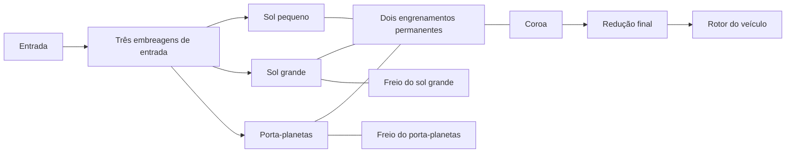

# Transmissão Ravigneaux de pesquisa

[English](RAVIGNEAUX_TRANSMISSION.md) · [简体中文](RAVIGNEAUX_TRANSMISSION.zh-CN.md) · [Français](RAVIGNEAUX_TRANSMISSION.fr.md) · [Русский](RAVIGNEAUX_TRANSMISSION.ru.md) · [日本語](RAVIGNEAUX_TRANSMISSION.ja.md) · [한국어](RAVIGNEAUX_TRANSMISSION.ko.md) · [Deutsch](RAVIGNEAUX_TRANSMISSION.de.md) · [Español](RAVIGNEAUX_TRANSMISSION.es.md) · [Italiano](RAVIGNEAUX_TRANSMISSION.it.md) · **Português**

O Power! monta quatro faixas à frente, ponto morto e ré a partir de definições ordinárias de engrenagem, rotor e embreagem. Um sol grande, um sol pequeno, a coroa e o porta-planetas formam duas restrições permanentes de engrenamento. Três embreagens de entrada e dois freios selecionam um caminho; a coroa aciona uma redução final separada e o rotor do veículo. Um conversor e a trava paralela continuam componentes externos, com os próprios históricos de calor. A [opção de planetas resolvidos](RESOLVED_PLANETS.pt-BR.md) substitui as duas restrições condensadas de membro por quatro engrenamentos reais e acrescenta giro absoluto e inércia orbital.

A referência estrutural é a [descrição Ravigneaux de sol duplo](https://www.mathworks.com/help/sdl/ref/ravigneauxgear.html). O [cronograma de atrito de quatro marchas](https://www.mathworks.com/help/sdl/ref/4speedravigneaux.html) fornece uma referência separada para as reduções de faixa abaixo. As equações, a montagem e as verificações do Power! são implementadas de forma independente; nenhum código, arquivo de modelo ou pacote de fornecedor é incluído. Esse arranjo genérico de pesquisa não estabelece a topologia PSA AT8/AL4 nem propriedades calibradas.



## Contrato físico

Sejam `kL = NR/NL`, `kS = NR/NS`, com `kS > kL > 1`. A velocidade angular e os incrementos de ângulo obedecem a:

```text
large sun + kL ring - (1+kL) carrier = 0
small sun - kS ring + (kS-1) carrier = 0
```

A primeira é um ramo de pinhão simples. A segunda é o ramo de pinhão duplo, que preserva o sentido relativo de rotação entre sol e coroa. As reações são proporcionais a cada linha completa de restrição, então a potência de porta somada se anula. Linhas imutáveis normalizadas entram na solução acoplada existente; elas não impõem a velocidade de saída independentemente do torque ou da inércia. As velocidades iniciais precisam satisfazer as duas restrições. A fase inicial permanece observável e conservada.

| Faixa | Ligações de entrada | Membro fixado ao solo | Redução entrada/coroa |
|---|---|---|---:|
| 1 | Sol pequeno | Porta-planetas | `kS` |
| 2 | Sol pequeno | Sol grande | `(kL+kS)/(1+kL)` |
| 3 | Porta-planetas e sol pequeno | Nenhum | `1` |
| 4 | Porta-planetas | Sol grande | `kL/(1+kL)` |
| Ré | Sol grande | Porta-planetas | `-kL` |
| Ponto morto | Nenhuma | Nenhum | Entrada irrestrita |

Essas são relações de caminho em regime, depois que os elementos exigidos travam fisicamente. Um comando sozinho não estabelece uma faixa selecionada. Durante a captura e a entrega, a capacidade finita permite deslizamento, transfere torque e gera calor. Freios ao solo carregam torque de reação em velocidade de solo nula; o calor de atrito interno vem do membro que de fato desliza. A convenção de pesquisa da redução final usa uma relação positiva entrada/saída de forma explícita.

`RavigneauxTransmissionAssembly` recebe inércias dos membros no SI, capacidades de torque estática/de deslizamento, relações de dentes e a redução final. `RavigneauxPorts` liga IDs estáveis e cinco canais de engate distintos. `CreateGraph` devolve coleções imutáveis de quatro rotores internos e oito componentes. Quem chama fornece as portas de entrada, de veículo e térmica opcional. `RangeCommands` devolve o cronograma de atrito declarado, sem reivindicar acionamento hidráulico nem controle de troca.

## Experimentos compartilhados e evidência

- `ravigneaux-transmission` prescreve subidas e descidas à frente por todos os quatro caminhos, com calor de atrito explícito.
- `fired-ravigneaux-converter` liga o motor premisturado, quatro mapas de conversor com sinal, a trava, o grafo composto e um rotor de veículo declarado de 1 kg m2. O experimento diferente de fonte de torque de 10 kg m2 é um caso de carga independente.

Os dois usam os mesmos contratos de JSON, CLI, MCP e asset portátil. Seis grupos de física do núcleo e de transação comparam uma matriz de massa livre 2x2 derivada à parte, inércias refletidas, sinais de ré, reações de freio, impulso/calor de captura e rollback do estado completo. Uma verificação carregada de 20 segundos em sobremarcha conserva limites estritos de fase através do acúmulo compensado de coordenadas; o estado de correção é copiado, hasheado e revertido com o modelo completo. Os testes portáteis preservam porta-planetas e reações completos, rejeitam registros malformados e rebaixamentos forjados, e reproduzem uma fixture autêntica v22. O refinamento combinado motor/conversor e cada fronteira de relatório têm verificações separadas. Execute `dotnet run --file tools/Build.cs -- verify`; os desfechos registrados e os digests pertencem a [VALIDATION.pt-BR.md](VALIDATION.pt-BR.md).

## Escopo restante

Todos os parâmetros permanecem `unverified`. A redução de quatro membros não resolve a inércia de giro/órbita dos planetas; o [caminho resolvido](RESOLVED_PLANETS.pt-BR.md) explícito fornece essas energias. A geometria detalhada de dente fica fora dos dois caminhos. Perdas de engrenamento, lubrificação, propriedades dependentes da temperatura, roteamento medido do corpo de válvulas e controle AT e coordenação de torque da ECU precisam de mais componentes conservativos e de evidência medida. Os experimentos reduzidos usam engates prescritos; a [opção hidráulica](AT_HYDRAULIC_ACTUATION.pt-BR.md) fornece acionamento real por pistão. O conversor continua quase estacionário, com mapas sintéticos.

Os testes preparados de importação/reprodução do Studio incluem a porta do porta-planetas de pinhão duplo. A aceitação real de Editor/Play/renderização e de Player/IL2CPP continua em etapas separadas. Os limites completos das amostras EA211 DJS + DQ200 e PSA EC5 + AT8 e as medições OEM ausentes permanecem intactos em `assets/samples`.
