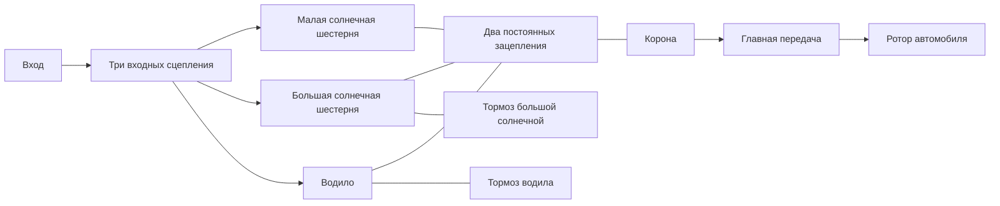

# Исследовательская трансмиссия Ravigneaux

[English](RAVIGNEAUX_TRANSMISSION.md) · [简体中文](RAVIGNEAUX_TRANSMISSION.zh-CN.md) · [Français](RAVIGNEAUX_TRANSMISSION.fr.md) · **Русский** · [日本語](RAVIGNEAUX_TRANSMISSION.ja.md) · [한국어](RAVIGNEAUX_TRANSMISSION.ko.md) · [Deutsch](RAVIGNEAUX_TRANSMISSION.de.md) · [Español](RAVIGNEAUX_TRANSMISSION.es.md) · [Italiano](RAVIGNEAUX_TRANSMISSION.it.md) · [Português](RAVIGNEAUX_TRANSMISSION.pt-BR.md)

Power! собирает четыре передних диапазона, нейтраль и задний ход из обычных определений шестерён, роторов и сцеплений. Большая солнечная шестерня, малая солнечная шестерня, корона и водило образуют две постоянные связи зацепления. Три входных сцепления и два тормоза выбирают путь; корона приводит отдельную главную передачу и ротор автомобиля. Гидротрансформатор и его параллельная блокировка остаются внешними компонентами со своими историями теплоты. [Разрешённый вариант сателлитов](RESOLVED_PLANETS.ru.md) заменяет две свёрнутые связи звеньев четырьмя фактическими зацеплениями и добавляет абсолютное собственное вращение и орбитальную инерцию.

Структурный источник — [описание Ravigneaux с двумя солнцами](https://www.mathworks.com/help/sdl/ref/ravigneauxgear.html). [Расписание трения четырёх ступеней](https://www.mathworks.com/help/sdl/ref/4speedravigneaux.html) даёт отдельный источник для понижений диапазонов ниже. Уравнения, сборка и проверки Power! реализованы независимо; код поставщика, файлы моделей и пакеты не включены. Это общее исследовательское расположение не устанавливает топологию PSA AT8/AL4 или калиброванные свойства.



## Физический контракт

Пусть `kL = NR/NL`, `kS = NR/NS`, причём `kS > kL > 1`. Угловая скорость и приращения угла подчиняются:

```text
large sun + kL ring - (1+kL) carrier = 0
small sun - kS ring + (kS-1) carrier = 0
```

Первое — односателлитная ветвь. Второе — двухсателлитная ветвь, которая сохраняет относительное направление вращения между солнцем и короной. Реакции пропорциональны каждой полной строке связи, поэтому их суммарная мощность портов обращается в нуль. Нормированные неизменяемые строки входят в существующее связанное решение; они не навязывают выходную скорость независимо от момента или инерции. Начальные скорости должны удовлетворять обеим связям. Начальная фаза остаётся наблюдаемой и сохраняемой.

| Диапазон | Входные соединения | Заторможенное звено | Понижение вход/корона |
|---|---|---|---:|
| 1 | Малая солнечная | Водило | `kS` |
| 2 | Малая солнечная | Большая солнечная | `(kL+kS)/(1+kL)` |
| 3 | Водило и малая солнечная | Нет | `1` |
| 4 | Водило | Большая солнечная | `kL/(1+kL)` |
| Задний ход | Большая солнечная | Водило | `-kL` |
| Нейтраль | Нет | Нет | Вход не ограничен |

Это установившиеся соотношения пути после того, как требуемые элементы физически блокируются. Одна команда не устанавливает выбранный диапазон. Во время захвата и передачи тяги конечная ёмкость допускает проскальзывание, передаёт момент и выделяет теплоту. Опорные тормоза несут реактивный момент при нулевой скорости земли; внутренняя теплота трения приходит от фактически скользящего звена. Исследовательское соглашение главной передачи явно использует положительное отношение входа к выходу.

`RavigneauxTransmissionAssembly` принимает инерции звеньев в СИ, статические и скользящие моментные ёмкости, отношения чисел зубьев и понижение главной передачи. `RavigneauxPorts` связывает устойчивые ID и пять различных каналов замыкания. `CreateGraph` возвращает неизменяемые коллекции из четырёх внутренних роторов и восьми компонентов. Вызывающий задаёт вход, автомобиль и необязательные тепловые порты. `RangeCommands` возвращает объявленное расписание трения, не претендуя на гидравлический привод или управление переключением.

## Общие эксперименты и свидетельства

- `ravigneaux-transmission` предписывает передние переключения вверх и вниз через все четыре пути с явной теплотой трения.
- `fired-ravigneaux-converter` соединяет двигатель с предварительно смешанным сгоранием, четыре знаковые карты гидротрансформатора, блокировку, составной граф и объявленный ротор автомобиля 1 kg m2. Отдельный эксперимент источника момента 10 kg m2 — независимый случай нагрузки.

Оба используют те же контракты JSON, CLI, MCP и переносимого актива. Шесть групп физики Core и транзакций сравнивают отдельно выведенную свободную матрицу масс 2x2, приведённые инерции, знаки заднего хода, реакции тормозов, импульс и теплоту захвата и откат полного состояния. Проверка повышающей передачи под нагрузкой в течение 20 секунд удерживает строгие пределы фазы через компенсированное накопление координат; состояние поправки копируется, хешируется и откатывается вместе с полной моделью. Переносимые тесты сохраняют полные водила и реакции, отвергают неверные записи и поддельные понижения версии и повторяют подлинную фикстуру v22. Уточнение сочетания двигателя и гидротрансформатора и каждая граница отчёта имеют отдельные проверки. Выполните `dotnet run --file tools/Build.cs -- verify`; записанные исходы и дайджесты принадлежат [VALIDATION.ru.md](VALIDATION.ru.md).

## Оставшийся объём

Все параметры остаются `unverified`. Сведение к четырём звеньям не разрешает инерцию собственного вращения и орбиты сателлитов; явный [разрешённый путь](RESOLVED_PLANETS.ru.md) даёт эти энергии. Подробная геометрия зуба остаётся вне обоих путей. Потери зацепления, смазка, свойства, зависящие от температуры, измеренная разводка гидроблока, управление AT и согласование момента ECU нуждаются в дальнейших сохраняющих компонентах и измеренных свидетельствах. Сведённые эксперименты используют предписанные замыкания; [гидравлический вариант](AT_HYDRAULIC_ACTUATION.ru.md) даёт фактический поршневой привод. Гидротрансформатор остаётся квазистационарным с синтетическими картами.

Подготовленные тесты импорта и воспроизведения Studio включают порт водила двухсателлитной ветви. Фактическая приёмка Editor/Play/рендеринга и Player/IL2CPP остаётся отдельными воротами. Полные границы образцов EA211 DJS + DQ200 и PSA EC5 + AT8 и отсутствующие измерения OEM остаются нетронутыми в `assets/samples`.
