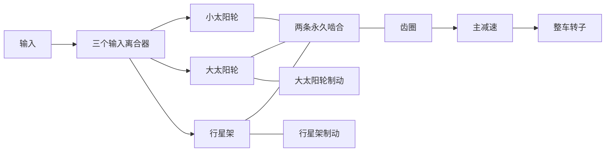

# Ravigneaux 研究变速器

[English](RAVIGNEAUX_TRANSMISSION.md) · **简体中文** · [Français](RAVIGNEAUX_TRANSMISSION.fr.md) · [Русский](RAVIGNEAUX_TRANSMISSION.ru.md) · [日本語](RAVIGNEAUX_TRANSMISSION.ja.md) · [한국어](RAVIGNEAUX_TRANSMISSION.ko.md) · [Deutsch](RAVIGNEAUX_TRANSMISSION.de.md) · [Español](RAVIGNEAUX_TRANSMISSION.es.md) · [Italiano](RAVIGNEAUX_TRANSMISSION.it.md) · [Português](RAVIGNEAUX_TRANSMISSION.pt-BR.md)

Power! 用普通的齿轮、转子和离合器定义装配四个前进挡域、空挡和倒挡。大太阳轮、小太阳轮、齿圈和行星架形成两条永久啮合约束。三个输入离合器和两个制动器选择路径;齿圈驱动分开的主减速和整车转子。变矩器及其并联锁止仍是外部组件,有自己的热历史。[分解行星选项](RESOLVED_PLANETS.zh-CN.md)用四个实际啮合替换这两条浓缩的构件约束,并加入绝对自转和轨道惯量。

结构参考是[双太阳轮 Ravigneaux 说明](https://www.mathworks.com/help/sdl/ref/ravigneauxgear.html)。[四速摩擦时序](https://www.mathworks.com/help/sdl/ref/4speedravigneaux.html)为下面的挡域减速比提供分开的参考。Power! 的方程、装配和检查独立实现;不包含供应商代码、模型文件或包。这一通用研究布置不确立 PSA AT8/AL4 拓扑或标定属性。



## 物理契约

令 `kL = NR/NL`、`kS = NR/NS`,且 `kS > kL > 1`。角速度与角度增量服从:

```text
large sun + kL ring - (1+kL) carrier = 0
small sun - kS ring + (kS-1) carrier = 0
```

第一条是单行星轮分支。第二条是双行星轮分支,它保持太阳轮与齿圈之间的相对转动方向。反作用与每一条完整约束行成比例,因此它们的端口功率之和为零。归一化的不可变行进入现有耦合求解;它们不独立于扭矩或惯量来施加输出速度。初始速度必须满足两条约束。初始相位保持可观测且守恒。

| 挡域 | 输入连接 | 接地构件 | 输入/齿圈减速比 |
|---|---|---|---:|
| 1 | 小太阳轮 | 行星架 | `kS` |
| 2 | 小太阳轮 | 大太阳轮 | `(kL+kS)/(1+kL)` |
| 3 | 行星架与小太阳轮 | 无 | `1` |
| 4 | 行星架 | 大太阳轮 | `kL/(1+kL)` |
| 倒挡 | 大太阳轮 | 行星架 | `-kL` |
| 空挡 | 无 | 无 | 输入不受约束 |

这些是所需元件物理锁止之后的稳态路径关系。仅有指令并不确立所选挡域。捕获和交接期间,有限容量允许滑差、传递扭矩并产生热。接地制动器在地面速度为零时承受反作用扭矩;内部摩擦热来自实际滑摩的构件。研究用主减速约定显式使用正的输入/输出速比。

`RavigneauxTransmissionAssembly` 接受 SI 构件惯量、静态/滑摩扭矩容量、齿数比和主减速比。`RavigneauxPorts` 绑定稳定 ID 和五个不同的接合通道。`CreateGraph` 返回四个内部转子和八个组件的不可变集合。调用方提供输入、整车和可选热端口。`RangeCommands` 返回声明的摩擦时序,不声称液压驱动或换挡控制。

## 共享实验与证据

- `ravigneaux-transmission` 以显式摩擦热给定通过全部四条路径的前进升挡和降挡。
- `fired-ravigneaux-converter` 连接预混发动机、四张有符号变矩器图谱、锁止、复合图和一个声明的 1 kg m2 整车转子。另一个 10 kg m2 扭矩源实验是独立载荷情形。

二者使用相同的 JSON、CLI、MCP 和可移植资产契约。六组核心物理与事务把分开推导的 2x2 自由质量矩阵、折算惯量、倒挡符号、制动反作用、捕获冲量/热和全状态回滚放在一起比较。带载 20 秒超速检查通过补偿坐标累加保持严格相位极限;修正状态与完整模型一起复制、哈希和回滚。可移植测试完整保留行星架与反作用,拒绝畸形记录和伪造降级,并回放一份真实的 v22 夹具。组合的发动机/变矩器细化和每一个报告边界有分开的检查。运行 `dotnet run --file tools/Build.cs -- verify`;记录的结果和摘要属于 [VALIDATION.md](VALIDATION.zh-CN.md)。

## 剩余范围

全部参数仍为 `unverified`。四构件简化不解析行星轮自转/轨道惯量;显式的[分解路径](RESOLVED_PLANETS.zh-CN.md)提供这些能量。详细轮齿几何不在两条路径之内。啮合损失、润滑、随温度变化的物性、实测阀体路由,以及 AT 控制与 ECU 扭矩协调,需要进一步的守恒组件和实测证据。简化实验使用给定接合;[液压选项](AT_HYDRAULIC_ACTUATION.zh-CN.md)提供实际的活塞驱动。变矩器仍是准稳态的,图谱为合成值。

已准备的 Studio 导入/回放测试包含双行星轮行星架端口。实际的编辑器/Play/渲染以及 Player/IL2CPP 验收仍是分开的关卡。完整的 EA211 DJS + DQ200 与 PSA EC5 + AT8 样本边界,以及缺失的 OEM 测量,仍完整保留在 `assets/samples`。
