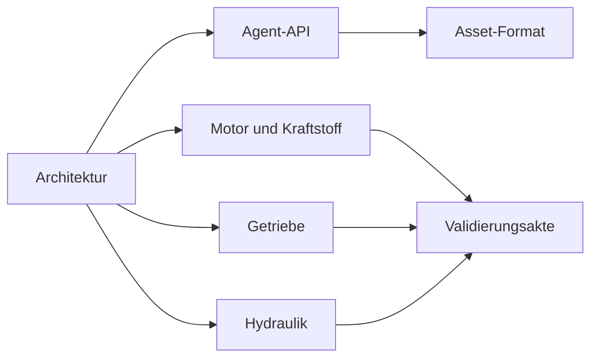

# Dokumentation

[English](README.md) · [简体中文](README.zh-CN.md) · [Français](README.fr.md) · [Русский](README.ru.md) · [日本語](README.ja.md) · [한국어](README.ko.md) · **Deutsch** · [Español](README.es.md) · [Italiano](README.it.md) · [Português](README.pt-BR.md)

Englisch ist die Quelle dieser Seiten. Jede Datei hat dieselben neun Übersetzungen wie die Projekt-README: `zh-CN`, `fr`, `ru`, `ja`, `ko`, `de`, `es`, `it` und `pt-BR`. Eine Übersetzung liegt neben ihrer englischen Datei als `NAME.<locale>.md`. Bezeichner, Zahlen, Einheiten, Daten, Pfade und Nachweiswerte sind in jeder Sprache gleich.

## Projekt

| Dokument | Worum es geht |
|---|---|
| [Architektur](ARCHITECTURE.de.md) | Assemblies, Abhängigkeiten und wie ein Modell kompiliert wird |
| [Fahrplan](ROADMAP.de.md) | Das Antriebsstrangziel und die noch erforderliche Arbeit |
| [Entwicklungsstand](DEVELOPMENT_STATUS.de.md) | Was umgesetzt ist und welche Abnahme noch offen ist |
| [Validierungsakte](VALIDATION.de.md) | Datierte Prüfpunkte, Zählungen und Nachweisdateien |
| [Notizen zur Motorfortsetzung](NEXT_ENGINE_STEP.de.md) | Der nächste Motorschritt, getrennt von Vollständigkeitsbehauptungen |

## Schnittstellen

| Dokument | Worum es geht |
|---|---|
| [Agent-API](AGENT_API.de.md) | MCP-Werkzeuge, Revisionen, Fehler und die Operationsfolge |
| [Asset-Format](ASSET_FORMAT.de.md) | `.powerasset` v24 und die Leser für v1 bis v23 |
| [Native Zig-Grenze](NATIVE_ZIG.de.md) | Die archivierten Zig-Prototypen und das versionierte ABI |

## Motor und Kraftstoff

| Dokument | Worum es geht |
|---|---|
| [Abgeschlossener Zylinder](SEALED_CYLINDER.de.md) | Adiabatische Kompression und Expansion mit Kurbeldruckarbeit |
| [Gaswechsel](GAS_EXCHANGE.de.md) | Idealgaszustand, endliche Masse und Energie, kompressible Drossel |
| [Gasnetz](GAS_NETWORK.de.md) | Kompilierte Gasvolumina, Drosseln, Reservoire und Wandwärme |
| [Bewegter Zylinder](MOVING_CYLINDER.de.md) | Eine Gaskammer, deren Volumen der Schubkurbel folgt |
| [Ventilsteuerzeiten](VALVE_TIMING.de.md) | Kurbelzeitgesteuerte Öffnungsprofile über 360° und 720° |
| [Vormischverbrennung](PREMIXED_COMBUSTION.de.md) | Vorgeschriebene Wiebe-Verbrennung mit Kraftstoff-, Luft- und Produktbilanz |
| [Kraftstoffdosierung](FUEL_METERING.de.md) | Endliche gasförmige Leitung und zyklusdosierte Zufuhr |
| [Kraftstofffilm](FUEL_FILM.de.md) | Endlicher Flüssigkeitsvorrat, von der Wand bezahlte Verdampfung, reine Dampfreaktion |
| [Flüssigeinspritzung](LIQUID_FUEL_INJECTION.de.md) | Endliche nachgiebige Flüssigkeitsleitung, die einen Film speist |
| [Nadelansteuerung](NEEDLE_ACTUATION.de.md) | Positionsabhängiges Solenoid, Nadelmasse, Schließverzögerung und Abprall |
| [Schließvorhersage](CLOSURE_PREDICTION.de.md) | Begrenztes Strecken-Replay, das die Spannungsabschaltung plant |

## Getriebe

| Dokument | Worum es geht |
|---|---|
| [Kupplungsphysik](CLUTCH_PHYSICS.de.md) | Das unveränderliche Trockenkupplungsgesetz und die exakte Paarreferenz |
| [Kupplungsnetz](CLUTCH_NETWORK.de.md) | Gekoppelte Kupplungskomponente, Kapazitäten, Wärme und Ereignisse |
| [Ideale Zahnräder](IDEAL_GEARS.de.md) | Zahnrad- und Planetenreferenzen bei konstanter Last |
| [Zahnradnetz](GEAR_NETWORK.de.md) | Gekoppelte ideale Zahnräder und Planetenbedingungen |
| [Wandler](CONVERTER_NETWORK.de.md) | Quasistationärer Drehmomentwandler und Überbrückung |
| [Doppelkupplungsgetriebe](DUAL_CLUTCH_TRANSMISSION.de.md) | Sieben Vorwärtspfade, Rückwärtsgang und drei Achsantriebe |
| [DCT-Regelung](DCT_CONTROL.de.md) | Abgetastete Synchronisation und gestaffelte Antriebsübergabe |
| [Ravigneaux-Getriebe](RAVIGNEAUX_TRANSMISSION.de.md) | Vier Vorwärtsbereiche, Neutral, Rückwärtsgang und ein Wandlerexperiment |
| [Aufgelöste Planeten](RESOLVED_PLANETS.de.md) | Planetendrehung und Bahnträgheit im Ravigneaux-Graphen |
| [AT-Ansteuerung](AT_HYDRAULIC_ACTUATION.de.md) | Pumpengespeiste Kolben für die fünf Bereichselemente und die Überbrückung |

## Hydraulik

| Dokument | Worum es geht |
|---|---|
| [Hydrauliknetz](HYDRAULIC_NETWORK.de.md) | Nachgiebige Volumina, Drosseln und druckbetätigte Kupplungen |
| [Pumpe](HYDRAULIC_PUMP.de.md) | Verdrängerpumpe, Leckage, viskoser Schlepp, Druckbegrenzung und elektrischer Antrieb |
| [Kolben](HYDRAULIC_PISTON.de.md) | Translatorische Masse, Kammer, Feder und Kontaktkupplung |
| [Schieber](HYDRAULIC_SPOOL.de.md) | Vom Kolbenweg dosierter Schieber, ohne Öffnungsbefehl |
| [Gasakkumulator](GAS_PISTON.de.md) | Eine Gaskammer auf derselben Masse wie ein Hydraulikkolben |
