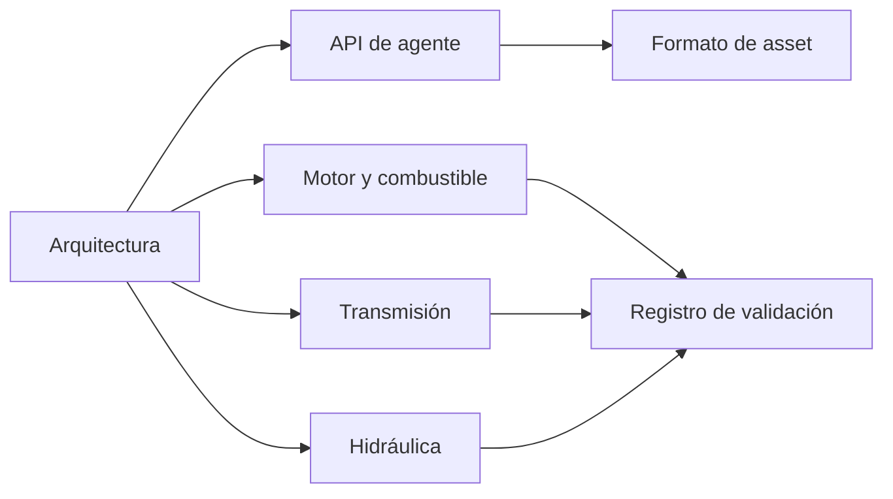

# Documentación

[English](README.md) · [简体中文](README.zh-CN.md) · [Français](README.fr.md) · [Русский](README.ru.md) · [日本語](README.ja.md) · [한국어](README.ko.md) · [Deutsch](README.de.md) · **Español** · [Italiano](README.it.md) · [Português](README.pt-BR.md)

El inglés es la fuente de estas páginas. Cada archivo tiene las mismas nueve traducciones que el README del proyecto: `zh-CN`, `fr`, `ru`, `ja`, `ko`, `de`, `es`, `it` y `pt-BR`. Una traducción está al lado de su archivo en inglés como `NAME.<locale>.md`. Los identificadores, los números, las unidades, las fechas, las rutas y los valores de evidencia son los mismos en todos los idiomas.

## Proyecto

| Documento | Qué es |
|---|---|
| [Arquitectura](ARCHITECTURE.es.md) | Ensamblados, dependencias y cómo se compila un modelo |
| [Hoja de ruta](ROADMAP.es.md) | El objetivo del grupo motopropulsor y el trabajo que aún falta |
| [Estado de desarrollo](DEVELOPMENT_STATUS.es.md) | Qué está implementado y qué aceptación sigue pendiente |
| [Registro de validación](VALIDATION.es.md) | Puntos de control fechados, recuentos y archivos de evidencia |
| [Notas de reanudación del motor](NEXT_ENGINE_STEP.es.md) | El siguiente incremento del motor, separado de las afirmaciones de compleción |

## Interfaces

| Documento | Qué es |
|---|---|
| [API de agente](AGENT_API.es.md) | Herramientas MCP, revisiones, errores y la secuencia de operación |
| [Formato de asset](ASSET_FORMAT.es.md) | `.powerasset` v29 y los lectores de v1 a v28 |
| [Frontera Zig nativa](NATIVE_ZIG.es.md) | Los prototipos Zig archivados y el ABI versionado |

## Motor y combustible

| Documento | Qué es |
|---|---|
| [Cilindro cerrado](SEALED_CYLINDER.es.md) | Compresión y expansión adiabáticas con trabajo de presión del cigüeñal |
| [Intercambio de gas](GAS_EXCHANGE.es.md) | Estado de gas ideal, masa y energía finitas, orificio compresible |
| [Red de gas](GAS_NETWORK.es.md) | Volúmenes de gas compilados, restricciones, depósitos y calor de pared |
| [Cilindro móvil](MOVING_CYLINDER.es.md) | Una cámara de gas cuyo volumen sigue la biela-manivela |
| [Distribución](VALVE_TIMING.es.md) | Perfiles de apertura de 360° y 720° temporizados por cigüeñal |
| [Combustión premmezclada](PREMIXED_COMBUSTION.es.md) | Quemado de Wiebe prescrito con contabilidad de combustible, aire y productos |
| [Dosificación de combustible](FUEL_METERING.es.md) | Raíl gaseoso finito y admisión de dosis por ciclo |
| [Película de combustible](FUEL_FILM.es.md) | Inventario líquido finito, evaporación pagada por la pared, reacción solo de vapor |
| [Inyección líquida](LIQUID_FUEL_INJECTION.es.md) | Raíl líquido flexible y finito que alimenta una película |
| [Accionamiento de aguja](NEEDLE_ACTUATION.es.md) | Solenoide dependiente de la posición, masa de la aguja, retardo de cierre y rebote |
| [Predicción de cierre](CLOSURE_PREDICTION.es.md) | Repetición acotada de la planta que planifica la retirada de voltaje |
| [Geometría del tanque y espacio gaseoso finito](TANK_HEADSPACE.es.md) | Capacidad rígida, trabajo del gas finito y venteo explícito |

## Transmisión

| Documento | Qué es |
|---|---|
| [Física de embrague](CLUTCH_PHYSICS.es.md) | La ley inmutable del embrague en seco y la referencia del par exacto |
| [Red de embragues](CLUTCH_NETWORK.es.md) | Componente de embrague acoplado, capacidades, calor y eventos |
| [Engranajes ideales](IDEAL_GEARS.es.md) | Referencias de engranaje y planetario de carga constante |
| [Red de engranajes](GEAR_NETWORK.es.md) | Engranajes ideales acoplados y restricciones planetarias |
| [Convertidor](CONVERTER_NETWORK.es.md) | Convertidor de par cuasiestacionario y bloqueo |
| [Transmisión de doble embrague](DUAL_CLUTCH_TRANSMISSION.es.md) | Siete caminos adelante, marcha atrás y tres transmisiones finales |
| [Control DCT](DCT_CONTROL.es.md) | Sincronización muestreada y entrega de tracción escalonada |
| [Transmisión Ravigneaux](RAVIGNEAUX_TRANSMISSION.es.md) | Cuatro rangos adelante, punto muerto, marcha atrás y un experimento de convertidor |
| [Planetarios resueltos](RESOLVED_PLANETS.es.md) | Giro de satélite e inercia orbital en el grafo Ravigneaux |
| [Actuación AT](AT_HYDRAULIC_ACTUATION.es.md) | Pistones alimentados por bomba para los cinco elementos de rango y el bloqueo |

## Hidráulica

| Documento | Qué es |
|---|---|
| [Red hidráulica](HYDRAULIC_NETWORK.es.md) | Volúmenes flexibles, restricciones y embragues accionados por presión |
| [Bomba](HYDRAULIC_PUMP.es.md) | Bomba de cilindrada, fugas, arrastre viscoso, alivio y accionamiento eléctrico |
| [Pistón](HYDRAULIC_PISTON.es.md) | Masa de traslación, cámara, resorte y embrague de contacto |
| [Corredera](HYDRAULIC_SPOOL.es.md) | Corredera dosificada por la posición del pistón, sin comando de apertura |
| [Acumulador de gas](GAS_PISTON.es.md) | Una cámara de gas sobre la misma masa que un pistón hidráulico |
