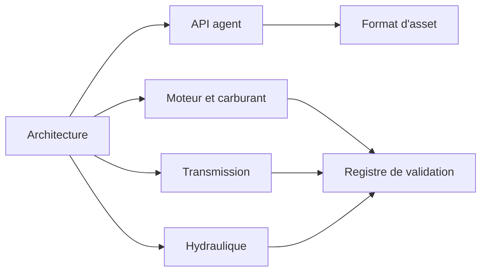

# Documentation

[English](README.md) · [简体中文](README.zh-CN.md) · **Français** · [Русский](README.ru.md) · [日本語](README.ja.md) · [한국어](README.ko.md) · [Deutsch](README.de.md) · [Español](README.es.md) · [Italiano](README.it.md) · [Português](README.pt-BR.md)

L'anglais est la source de ces pages. Chaque fichier a les mêmes neuf traductions que le README du projet : `zh-CN`, `fr`, `ru`, `ja`, `ko`, `de`, `es`, `it` et `pt-BR`. Une traduction se trouve à côté de son fichier anglais sous `NAME.<locale>.md`. Les identifiants, les nombres, les unités, les dates, les chemins et les valeurs de preuve sont identiques dans chaque langue.

## Projet

| Document | De quoi il s'agit |
|---|---|
| [Architecture](ARCHITECTURE.fr.md) | Assemblys, dépendances et compilation d'un modèle |
| [Feuille de route](ROADMAP.fr.md) | L'objectif de groupe motopropulseur et le travail encore requis |
| [État du développement](DEVELOPMENT_STATUS.fr.md) | Ce qui est implémenté, et quelle acceptation reste ouverte |
| [Registre de validation](VALIDATION.fr.md) | Points de contrôle datés, comptes et fichiers de preuve |
| [Notes de reprise moteur](NEXT_ENGINE_STEP.fr.md) | Le prochain incrément moteur, tenu à l'écart des affirmations d'achèvement |

## Interfaces

| Document | De quoi il s'agit |
|---|---|
| [API agent](AGENT_API.fr.md) | Outils MCP, révisions, erreurs et la séquence d'opérations |
| [Format d'asset](ASSET_FORMAT.fr.md) | `.powerasset` v29 et les lecteurs de v1 à v28 |
| [Frontière Zig native](NATIVE_ZIG.fr.md) | Les prototypes Zig archivés et l'ABI versionnée |

## Moteur et carburant

| Document | De quoi il s'agit |
|---|---|
| [Cylindre fermé](SEALED_CYLINDER.fr.md) | Compression et détente adiabatiques avec travail de pression au vilebrequin |
| [Échange gazeux](GAS_EXCHANGE.fr.md) | État de gaz parfait, masse et énergie finies, orifice compressible |
| [Réseau gazeux](GAS_NETWORK.fr.md) | Volumes gazeux compilés, restrictions, réservoirs et chaleur de paroi |
| [Cylindre mobile](MOVING_CYLINDER.fr.md) | Une chambre à gaz dont le volume suit le système bielle-manivelle |
| [Calage des soupapes](VALVE_TIMING.fr.md) | Profils d'ouverture calés sur le vilebrequin à 360° et 720° |
| [Combustion prémélangée](PREMIXED_COMBUSTION.fr.md) | Combustion de Wiebe prescrite avec bilan carburant, air et produits |
| [Dosage carburant](FUEL_METERING.fr.md) | Rampe gazeuse finie et admission dosée par cycle |
| [Film carburant](FUEL_FILM.fr.md) | Inventaire liquide fini, évaporation payée par la paroi, réaction vapeur seule |
| [Injection liquide](LIQUID_FUEL_INJECTION.fr.md) | Rampe liquide finie et souple alimentant un film |
| [Actionnement d'aiguille](NEEDLE_ACTUATION.fr.md) | Solénoïde dépendant de la position, masse d'aiguille, retard de fermeture et rebond |
| [Prédiction de fermeture](CLOSURE_PREDICTION.fr.md) | Rejeu plant borné qui planifie la coupure de tension |
| [Géométrie du réservoir et espace gazeux fini](TANK_HEADSPACE.fr.md) | Capacité rigide, travail du gaz fini et ventilation explicite |

## Transmission

| Document | De quoi il s'agit |
|---|---|
| [Physique d'embrayage](CLUTCH_PHYSICS.fr.md) | La loi immuable d'embrayage sec et la référence de paire exacte |
| [Réseau d'embrayages](CLUTCH_NETWORK.fr.md) | Composant d'embrayage couplé, capacités, chaleur et événements |
| [Engrenages idéaux](IDEAL_GEARS.fr.md) | Références d'engrenage et de planétaire à charge constante |
| [Réseau d'engrenages](GEAR_NETWORK.fr.md) | Engrenages idéaux couplés et contraintes planétaires |
| [Convertisseur](CONVERTER_NETWORK.fr.md) | Convertisseur de couple quasi stationnaire et verrouillage |
| [Transmission double embrayage](DUAL_CLUTCH_TRANSMISSION.fr.md) | Sept chemins avant, marche arrière et trois démultiplications finales |
| [Contrôle DCT](DCT_CONTROL.fr.md) | Synchronisation échantillonnée et passation de couple étagée |
| [Transmission Ravigneaux](RAVIGNEAUX_TRANSMISSION.fr.md) | Quatre plages avant, point mort, marche arrière et une expérience de convertisseur |
| [Planétaires résolus](RESOLVED_PLANETS.fr.md) | Rotation des planétaires et inertie orbitale sur le graphe Ravigneaux |
| [Actionnement AT](AT_HYDRAULIC_ACTUATION.fr.md) | Pistons alimentés par pompe pour les cinq éléments de plage et le verrouillage |

## Hydraulique

| Document | De quoi il s'agit |
|---|---|
| [Réseau hydraulique](HYDRAULIC_NETWORK.fr.md) | Volumes souples, restrictions et embrayages commandés par pression |
| [Pompe](HYDRAULIC_PUMP.fr.md) | Pompe à cylindrée, fuites, traînée visqueuse, décharge et entraînement électrique |
| [Piston](HYDRAULIC_PISTON.fr.md) | Masse en translation, chambre, ressort et embrayage par contact |
| [Coulisseau](HYDRAULIC_SPOOL.fr.md) | Coulisseau dosé par la position du piston, sans commande d'ouverture |
| [Accumulateur à gaz](GAS_PISTON.fr.md) | Une chambre à gaz sur la même masse qu'un piston hydraulique |
