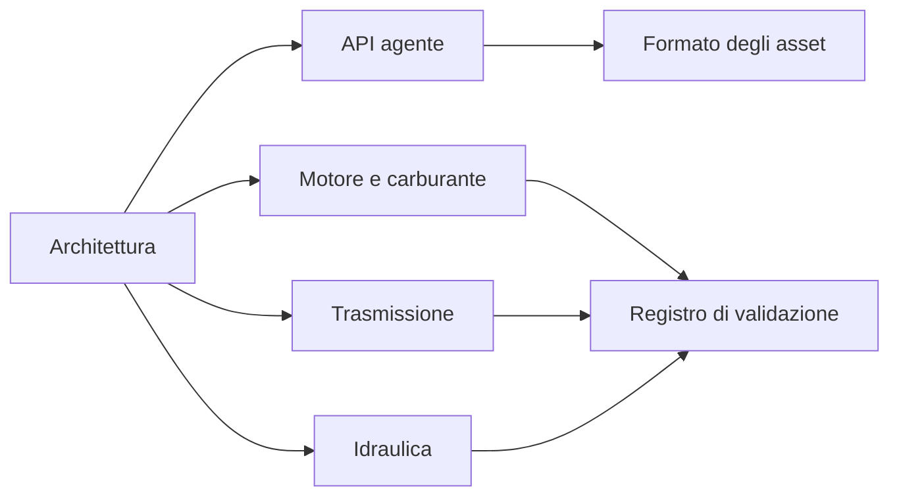

# Documentazione

[English](README.md) · [简体中文](README.zh-CN.md) · [Français](README.fr.md) · [Русский](README.ru.md) · [日本語](README.ja.md) · [한국어](README.ko.md) · [Deutsch](README.de.md) · [Español](README.es.md) · **Italiano** · [Português](README.pt-BR.md)

L'inglese è la fonte di queste pagine. Ogni file ha le stesse nove traduzioni del README del progetto: `zh-CN`, `fr`, `ru`, `ja`, `ko`, `de`, `es`, `it` e `pt-BR`. Una traduzione sta accanto al file inglese come `NAME.<locale>.md`. Identificatori, numeri, unità, date, percorsi e valori di evidenza sono gli stessi in ogni lingua.

## Progetto

| Documento | Che cos'è |
|---|---|
| [Architettura](ARCHITECTURE.it.md) | Assembly, dipendenze e come si compila un modello |
| [Tabella di marcia](ROADMAP.it.md) | L'obiettivo del gruppo motopropulsore e il lavoro ancora necessario |
| [Stato di sviluppo](DEVELOPMENT_STATUS.it.md) | Che cosa è implementato e quale accettazione è ancora aperta |
| [Registro di validazione](VALIDATION.it.md) | Punti di controllo datati, conteggi e file di evidenza |
| [Note sulla ripresa del motore](NEXT_ENGINE_STEP.it.md) | Il prossimo incremento del motore, tenuto separato dalle affermazioni di completamento |

## Interfacce

| Documento | Che cos'è |
|---|---|
| [API agente](AGENT_API.it.md) | Strumenti MCP, revisioni, errori e la sequenza delle operazioni |
| [Formato degli asset](ASSET_FORMAT.it.md) | `.powerasset` v24 e i lettori da v1 a v23 |
| [Confine Zig nativo](NATIVE_ZIG.it.md) | I prototipi Zig archiviati e l'ABI versionata |

## Motore e carburante

| Documento | Che cos'è |
|---|---|
| [Cilindro chiuso](SEALED_CYLINDER.it.md) | Compressione ed espansione adiabatiche con lavoro di pressione all'albero a gomiti |
| [Scambio gas](GAS_EXCHANGE.it.md) | Stato di gas ideale, massa ed energia finite, orifizio comprimibile |
| [Rete gas](GAS_NETWORK.it.md) | Volumi di gas compilati, restrizioni, serbatoi e calore di parete |
| [Cilindro mobile](MOVING_CYLINDER.it.md) | Una camera a gas il cui volume segue la biella-manovella |
| [Fasatura valvole](VALVE_TIMING.it.md) | Profili di apertura a 360° e 720° fasati sull'albero a gomiti |
| [Combustione premiscelata](PREMIXED_COMBUSTION.it.md) | Combustione di Wiebe prescritta con contabilità di carburante, aria e prodotti |
| [Dosatura carburante](FUEL_METERING.it.md) | Binario gassoso finito e ammissione della dose per ciclo |
| [Film carburante](FUEL_FILM.it.md) | Inventario liquido finito, evaporazione pagata dalla parete, reazione solo del vapore |
| [Iniezione liquida](LIQUID_FUEL_INJECTION.it.md) | Binario liquido finito e cedevole che alimenta un film |
| [Azionamento ago](NEEDLE_ACTUATION.it.md) | Solenoide dipendente dalla posizione, massa dell'ago, ritardo di chiusura e rimbalzo |
| [Predizione di chiusura](CLOSURE_PREDICTION.it.md) | Replay limitato dell'impianto che pianifica la rimozione della tensione |

## Trasmissione

| Documento | Che cos'è |
|---|---|
| [Fisica della frizione](CLUTCH_PHYSICS.it.md) | La legge immutabile della frizione a secco e il riferimento della coppia esatta |
| [Rete frizioni](CLUTCH_NETWORK.it.md) | Componente di frizione accoppiata, capacità, calore ed eventi |
| [Ingranaggi ideali](IDEAL_GEARS.it.md) | Riferimenti di ingranaggi e planetari a carico costante |
| [Rete ingranaggi](GEAR_NETWORK.it.md) | Ingranaggi ideali accoppiati e vincoli planetari |
| [Convertitore](CONVERTER_NETWORK.it.md) | Convertitore di coppia quasi stazionario e blocco |
| [Trasmissione a doppia frizione](DUAL_CLUTCH_TRANSMISSION.it.md) | Sette percorsi avanti, retromarcia e tre riduzioni finali |
| [Controllo DCT](DCT_CONTROL.it.md) | Sincronizzazione campionata e passaggio di trazione graduale |
| [Trasmissione Ravigneaux](RAVIGNEAUX_TRANSMISSION.it.md) | Quattro gamme avanti, folle, retromarcia e un esperimento con convertitore |
| [Planetari risolti](RESOLVED_PLANETS.it.md) | Rotazione dei satelliti e inerzia orbitale sul grafo Ravigneaux |
| [Azionamento AT](AT_HYDRAULIC_ACTUATION.it.md) | Stantuffi alimentati dalla pompa per i cinque elementi di gamma e il blocco |

## Idraulica

| Documento | Che cos'è |
|---|---|
| [Rete idraulica](HYDRAULIC_NETWORK.it.md) | Volumi cedevoli, restrizioni e frizioni azionate dalla pressione |
| [Pompa](HYDRAULIC_PUMP.it.md) | Pompa volumetrica, trafilamento, trascinamento viscoso, scarico e azionamento elettrico |
| [Stantuffo](HYDRAULIC_PISTON.it.md) | Massa traslazionale, camera, molla e frizione a contatto |
| [Cursore](HYDRAULIC_SPOOL.it.md) | Cursore dosato dalla posizione dello stantuffo, senza comando di apertura |
| [Accumulatore a gas](GAS_PISTON.it.md) | Una camera a gas sulla stessa massa di uno stantuffo idraulico |
