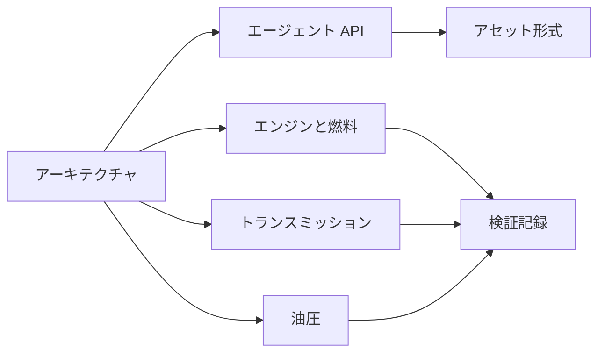

# ドキュメント

[English](README.md) · [简体中文](README.zh-CN.md) · [Français](README.fr.md) · [Русский](README.ru.md) · **日本語** · [한국어](README.ko.md) · [Deutsch](README.de.md) · [Español](README.es.md) · [Italiano](README.it.md) · [Português](README.pt-BR.md)

これらのページの原文は英語です。各ファイルには、プロジェクト README と同じ九つの翻訳があります。`zh-CN`、`fr`、`ru`、`ja`、`ko`、`de`、`es`、`it`、`pt-BR` です。翻訳は英語ファイルの隣に `NAME.<locale>.md` として置きます。識別子、数値、単位、日付、パス、エビデンスの値は、どの言語でも同じです。

## プロジェクト

| ドキュメント | 内容 |
|---|---|
| [アーキテクチャ](ARCHITECTURE.ja.md) | アセンブリ、依存関係、モデルのコンパイル方法 |
| [ロードマップ](ROADMAP.ja.md) | パワートレインの目標と、まだ必要な作業 |
| [開発ステータス](DEVELOPMENT_STATUS.ja.md) | 実装済みのものと、まだ開いている受け入れ |
| [検証記録](VALIDATION.ja.md) | 日付付きチェックポイント、件数、エビデンスファイル |
| [エンジン再開ノート](NEXT_ENGINE_STEP.ja.md) | 次のエンジン増分。完成の主張とは分けて置く |

## インターフェース

| ドキュメント | 内容 |
|---|---|
| [エージェント API](AGENT_API.ja.md) | MCP ツール、リビジョン、エラー、操作シーケンス |
| [アセット形式](ASSET_FORMAT.ja.md) | `.powerasset` v24 と、v1 から v23 までのリーダー |
| [ネイティブ Zig 境界](NATIVE_ZIG.ja.md) | 保管された Zig プロトタイプと、バージョン付き ABI |

## エンジンと燃料

| ドキュメント | 内容 |
|---|---|
| [密閉気筒](SEALED_CYLINDER.ja.md) | クランク圧力仕事を伴う断熱圧縮と膨張 |
| [ガス交換](GAS_EXCHANGE.ja.md) | 理想気体の状態、有限の質量とエネルギー、圧縮性オリフィス |
| [ガスネットワーク](GAS_NETWORK.ja.md) | コンパイル済みのガス容積、絞り、リザーバー、壁面熱 |
| [可動気筒](MOVING_CYLINDER.ja.md) | 容積がスライダークランクに従うガス室 |
| [バルブタイミング](VALVE_TIMING.ja.md) | クランク同期の 360° と 720° の開弁プロファイル |
| [予混合燃焼](PREMIXED_COMBUSTION.ja.md) | 燃料・空気・生成物の収支を伴う規定 Wiebe 燃焼 |
| [燃料計量](FUEL_METERING.ja.md) | 有限の気体レールと、サイクルドーズの導入 |
| [燃料フィルム](FUEL_FILM.ja.md) | 有限な液体在庫、壁面支払い蒸発、蒸気のみの反応 |
| [液体噴射](LIQUID_FUEL_INJECTION.ja.md) | フィルムへ供給する、有限で柔軟な液体レール |
| [ニードル駆動](NEEDLE_ACTUATION.ja.md) | 位置依存ソレノイド、ニードル質量、閉じ遅れ、反発 |
| [クロージャ予測](CLOSURE_PREDICTION.ja.md) | 電圧除去を計画する、有界なプラントリプレイ |

## トランスミッション

| ドキュメント | 内容 |
|---|---|
| [クラッチ物理](CLUTCH_PHYSICS.ja.md) | 不変のドライクラッチ則と、厳密なペア参照 |
| [クラッチネットワーク](CLUTCH_NETWORK.ja.md) | 連成クラッチコンポーネント、容量、熱、イベント |
| [理想歯車](IDEAL_GEARS.ja.md) | 一定負荷の歯車と遊星の参照 |
| [歯車ネットワーク](GEAR_NETWORK.ja.md) | 連成した理想歯車と遊星拘束 |
| [コンバーター](CONVERTER_NETWORK.ja.md) | 準定常トルクコンバーターとロックアップ |
| [デュアルクラッチトランスミッション](DUAL_CLUTCH_TRANSMISSION.ja.md) | 7 つの前進経路、リバース、3 つのファイナルドライブ |
| [DCT 制御](DCT_CONTROL.ja.md) | サンプリング同期と、段階的な駆動引き継ぎ |
| [Ravigneaux トランスミッション](RAVIGNEAUX_TRANSMISSION.ja.md) | 4 つの前進レンジ、ニュートラル、リバース、コンバーター実験 |
| [分解遊星](RESOLVED_PLANETS.ja.md) | Ravigneaux グラフ上の遊星自転と軌道慣性 |
| [AT 駆動](AT_HYDRAULIC_ACTUATION.ja.md) | 5 つのレンジ要素とロックアップへの、ポンプ供給ピストン |

## 油圧

| ドキュメント | 内容 |
|---|---|
| [油圧ネットワーク](HYDRAULIC_NETWORK.ja.md) | 柔軟な容積、絞り、圧力で作動するクラッチ |
| [ポンプ](HYDRAULIC_PUMP.ja.md) | 容積式ポンプ、漏れ、粘性抵抗、リリーフ、電気駆動 |
| [ピストン](HYDRAULIC_PISTON.ja.md) | 並進質量、室、ばね、接触クラッチ |
| [スプール](HYDRAULIC_SPOOL.ja.md) | ピストン位置で計量され、開度指令を持たないスプール |
| [ガスアキュムレーター](GAS_PISTON.ja.md) | 油圧ピストンと同じ質量上にあるガス室 |
