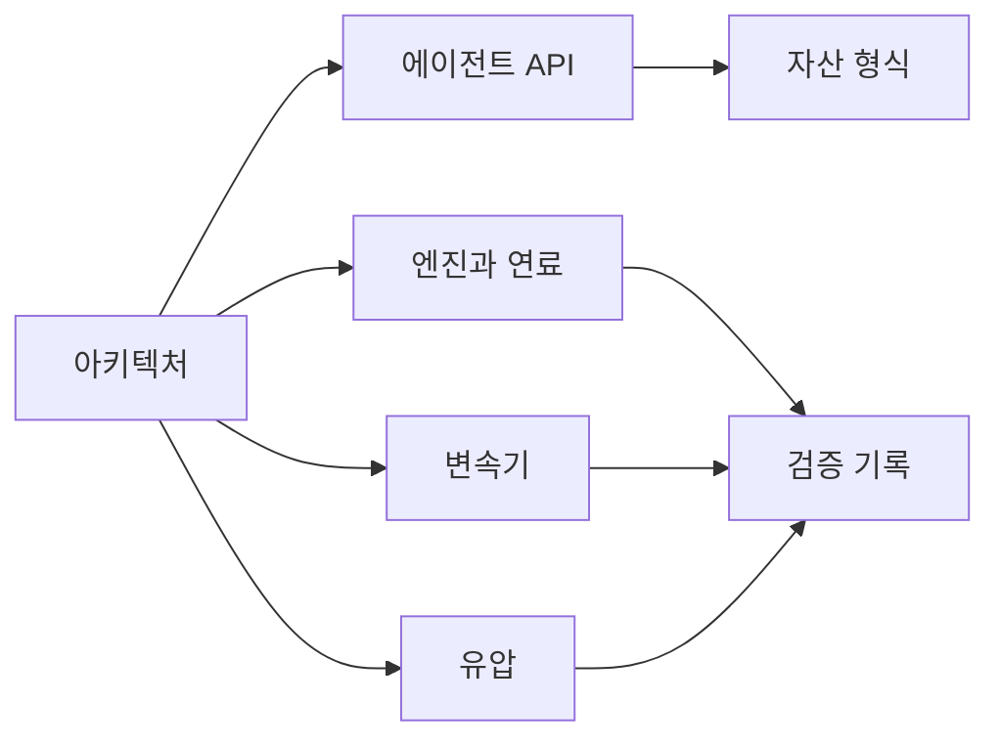

# 문서

[English](README.md) · [简体中文](README.zh-CN.md) · [Français](README.fr.md) · [Русский](README.ru.md) · [日本語](README.ja.md) · **한국어** · [Deutsch](README.de.md) · [Español](README.es.md) · [Italiano](README.it.md) · [Português](README.pt-BR.md)

이 페이지의 원문은 영어입니다. 각 파일은 프로젝트 README와 같은 아홉 개 번역을 갖습니다. `zh-CN`, `fr`, `ru`, `ja`, `ko`, `de`, `es`, `it`, `pt-BR`입니다. 번역은 영어 파일 옆에 `NAME.<locale>.md`로 있습니다. 식별자, 숫자, 단위, 날짜, 경로, 증거 값은 모든 언어에서 같습니다.

## 프로젝트

| 문서 | 내용 |
|---|---|
| [아키텍처](ARCHITECTURE.ko.md) | 어셈블리, 의존성, 모델이 컴파일되는 방식 |
| [로드맵](ROADMAP.ko.md) | 파워트레인 목표와 아직 필요한 작업 |
| [개발 상태](DEVELOPMENT_STATUS.ko.md) | 구현된 것과 아직 열린 수용 |
| [검증 기록](VALIDATION.ko.md) | 날짜가 있는 체크포인트, 개수, 증거 파일 |
| [엔진 재개 노트](NEXT_ENGINE_STEP.ko.md) | 다음 엔진 증분. 완료 주장과는 따로 둡니다 |

## 인터페이스

| 문서 | 내용 |
|---|---|
| [에이전트 API](AGENT_API.ko.md) | MCP 도구, 개정, 오류, 작업 순서 |
| [자산 형식](ASSET_FORMAT.ko.md) | `.powerasset` v24와 v1부터 v23까지의 판독기 |
| [네이티브 Zig 경계](NATIVE_ZIG.ko.md) | 보관된 Zig 프로토타입과 버전이 있는 ABI |

## 엔진과 연료

| 문서 | 내용 |
|---|---|
| [밀폐 실린더](SEALED_CYLINDER.ko.md) | 크랭크 압력 일을 포함한 단열 압축과 팽창 |
| [가스 교환](GAS_EXCHANGE.ko.md) | 이상 기체 상태, 유한 질량과 에너지, 압축성 오리피스 |
| [가스 네트워크](GAS_NETWORK.ko.md) | 컴파일된 가스 체적, 유동 제한, 저장소, 벽 열 |
| [가동 실린더](MOVING_CYLINDER.ko.md) | 체적이 슬라이더-크랭크를 따르는 가스 챔버 |
| [밸브 타이밍](VALVE_TIMING.ko.md) | 크랭크 기준 360°와 720° 개방 프로파일 |
| [예혼합 연소](PREMIXED_COMBUSTION.ko.md) | 연료, 공기, 생성물 수지를 갖춘 규정 Wiebe 연소 |
| [연료 계량](FUEL_METERING.ko.md) | 유한 기체 레일과 사이클 도즈 유입 |
| [연료 필름](FUEL_FILM.ko.md) | 유한 액체 재고, 벽 부담 증발, 증기 전용 반응 |
| [액체 분사](LIQUID_FUEL_INJECTION.ko.md) | 필름에 공급하는 유한 컴플라이언트 액체 레일 |
| [니들 구동](NEEDLE_ACTUATION.ko.md) | 위치 의존 솔레노이드, 니들 질량, 닫힘 지연과 반발 |
| [폐쇄 예측](CLOSURE_PREDICTION.ko.md) | 전압 제거를 계획하는 유계 플랜트 리플레이 |

## 변속기

| 문서 | 내용 |
|---|---|
| [클러치 물리](CLUTCH_PHYSICS.ko.md) | 불변 드라이 클러치 법칙과 정확한 쌍 기준 |
| [클러치 네트워크](CLUTCH_NETWORK.ko.md) | 결합 클러치 컴포넌트, 용량, 열, 이벤트 |
| [이상 기어](IDEAL_GEARS.ko.md) | 일정 부하의 기어와 유성 기준 |
| [기어 네트워크](GEAR_NETWORK.ko.md) | 결합된 이상 기어와 유성 제약 |
| [컨버터](CONVERTER_NETWORK.ko.md) | 준정상 토크 컨버터와 록업 |
| [듀얼 클러치 변속기](DUAL_CLUTCH_TRANSMISSION.ko.md) | 일곱 전진 경로, 후진, 세 개의 종감속 |
| [DCT 제어](DCT_CONTROL.ko.md) | 샘플링 동기화와 단계적 구동 인계 |
| [Ravigneaux 변속기](RAVIGNEAUX_TRANSMISSION.ko.md) | 네 전진 레인지, 중립, 후진, 컨버터 실험 |
| [분해 유성](RESOLVED_PLANETS.ko.md) | Ravigneaux 그래프의 유성 자전과 궤도 관성 |
| [AT 구동](AT_HYDRAULIC_ACTUATION.ko.md) | 다섯 레인지 요소와 록업을 위한 펌프 공급 피스톤 |

## 유압

| 문서 | 내용 |
|---|---|
| [유압 네트워크](HYDRAULIC_NETWORK.ko.md) | 컴플라이언트 체적, 유동 제한, 압력 작동 클러치 |
| [펌프](HYDRAULIC_PUMP.ko.md) | 용적 펌프, 누출, 점성 항력, 릴리프, 전기 구동 |
| [피스톤](HYDRAULIC_PISTON.ko.md) | 병진 질량, 챔버, 스프링, 접촉 클러치 |
| [스풀](HYDRAULIC_SPOOL.ko.md) | 피스톤 위치로 계량되며 개방 명령이 없는 스풀 |
| [가스 어큐뮬레이터](GAS_PISTON.ko.md) | 유압 피스톤과 같은 질량 위의 가스 챔버 |
