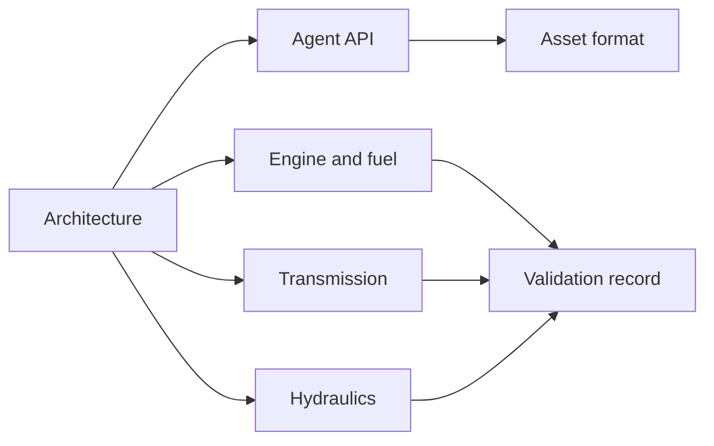

# Documentation

**English** · [简体中文](README.zh-CN.md) · [Français](README.fr.md) · [Русский](README.ru.md) · [日本語](README.ja.md) · [한국어](README.ko.md) · [Deutsch](README.de.md) · [Español](README.es.md) · [Italiano](README.it.md) · [Português](README.pt-BR.md)

English is the source for these pages. Each file has the same nine translations as the project README: `zh-CN`, `fr`, `ru`, `ja`, `ko`, `de`, `es`, `it` and `pt-BR`. A translation sits beside its English file as `NAME.<locale>.md`. Identifiers, numbers, units, dates, paths and evidence values are the same in every language.

## Project

| Document | What it is |
|---|---|
| [Architecture](ARCHITECTURE.md) | Assemblies, dependencies and how a model is compiled |
| [Roadmap](ROADMAP.md) | The powertrain objective and the work still required |
| [Development status](DEVELOPMENT_STATUS.md) | What is implemented, and what acceptance is still open |
| [Validation record](VALIDATION.md) | Dated checkpoints, counts and evidence files |
| [Engine resume notes](NEXT_ENGINE_STEP.md) | The next engine increment, kept apart from completion claims |

## Interfaces

| Document | What it is |
|---|---|
| [Agent API](AGENT_API.md) | MCP tools, revisions, errors and the operation sequence |
| [Asset format](ASSET_FORMAT.md) | `.powerasset` v24 and the readers for v1 through v23 |
| [Native Zig boundary](NATIVE_ZIG.md) | The archived Zig prototypes and the versioned ABI |

## Engine and fuel

| Document | What it is |
|---|---|
| [Sealed cylinder](SEALED_CYLINDER.md) | Adiabatic compression and expansion with crank pressure work |
| [Gas exchange](GAS_EXCHANGE.md) | Ideal-gas state, finite mass and energy, compressible orifice |
| [Gas network](GAS_NETWORK.md) | Compiled gas volumes, restrictions, reservoirs and wall heat |
| [Moving cylinder](MOVING_CYLINDER.md) | A gas chamber whose volume follows the slider-crank |
| [Valve timing](VALVE_TIMING.md) | Crank-timed 360° and 720° opening profiles |
| [Premixed combustion](PREMIXED_COMBUSTION.md) | Prescribed Wiebe burn with fuel, air and product accounting |
| [Fuel metering](FUEL_METERING.md) | Finite gaseous rail and cycle-dose admission |
| [Fuel film](FUEL_FILM.md) | Finite liquid inventory, wall-paid evaporation, vapor-only reaction |
| [Liquid injection](LIQUID_FUEL_INJECTION.md) | Finite compliant liquid rail feeding a film |
| [Needle actuation](NEEDLE_ACTUATION.md) | Position-dependent solenoid, needle mass, closing delay and rebound |
| [Closure prediction](CLOSURE_PREDICTION.md) | Bounded plant replay that schedules voltage removal |

## Transmission

| Document | What it is |
|---|---|
| [Clutch physics](CLUTCH_PHYSICS.md) | The immutable dry-clutch law and the exact pair reference |
| [Clutch network](CLUTCH_NETWORK.md) | Coupled clutch component, capacities, heat and events |
| [Ideal gears](IDEAL_GEARS.md) | Constant-load gear and planetary references |
| [Gear network](GEAR_NETWORK.md) | Coupled ideal gears and planetary constraints |
| [Converter](CONVERTER_NETWORK.md) | Quasi-steady torque converter and lockup |
| [Dual-clutch transmission](DUAL_CLUTCH_TRANSMISSION.md) | Seven forward paths, reverse and three final drives |
| [DCT control](DCT_CONTROL.md) | Sampled synchronization and staged drive handoff |
| [Ravigneaux transmission](RAVIGNEAUX_TRANSMISSION.md) | Four forward ranges, neutral, reverse and a converter experiment |
| [Resolved planets](RESOLVED_PLANETS.md) | Planet spin and orbital inertia on the Ravigneaux graph |
| [AT actuation](AT_HYDRAULIC_ACTUATION.md) | Pump-fed pistons for the five range elements and lockup |

## Hydraulics

| Document | What it is |
|---|---|
| [Hydraulic network](HYDRAULIC_NETWORK.md) | Compliant volumes, restrictions and pressure-operated clutches |
| [Pump](HYDRAULIC_PUMP.md) | Displacement pump, leakage, viscous drag, relief and electric drive |
| [Piston](HYDRAULIC_PISTON.md) | Translational mass, chamber, spring and contact clutch |
| [Spool](HYDRAULIC_SPOOL.md) | Spool metered by piston position, with no opening command |
| [Gas accumulator](GAS_PISTON.md) | A gas chamber on the same mass as a hydraulic piston |
