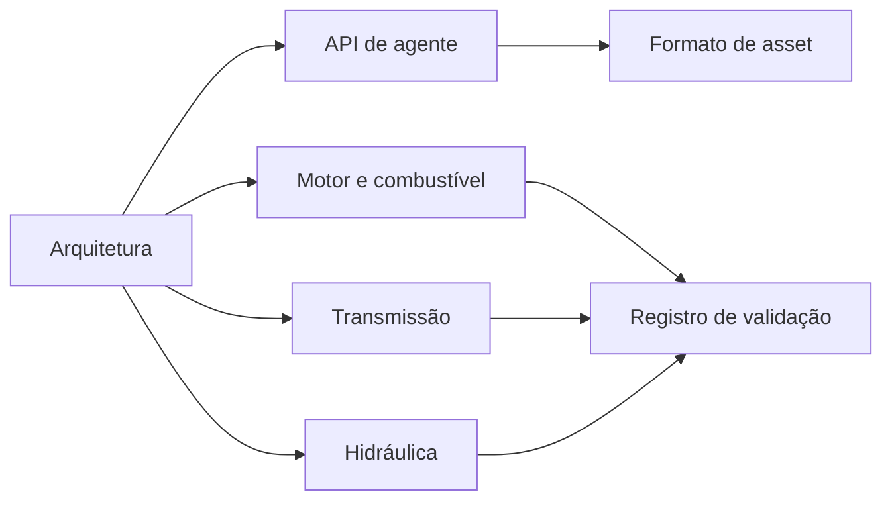

# Documentação

[English](README.md) · [简体中文](README.zh-CN.md) · [Français](README.fr.md) · [Русский](README.ru.md) · [日本語](README.ja.md) · [한국어](README.ko.md) · [Deutsch](README.de.md) · [Español](README.es.md) · [Italiano](README.it.md) · **Português**

O inglês é a fonte destas páginas. Cada arquivo tem as mesmas nove traduções do README do projeto: `zh-CN`, `fr`, `ru`, `ja`, `ko`, `de`, `es`, `it` e `pt-BR`. Uma tradução fica ao lado do arquivo em inglês como `NAME.<locale>.md`. Identificadores, números, unidades, datas, caminhos e valores de evidência são os mesmos em cada idioma.

## Projeto

| Documento | O que é |
|---|---|
| [Arquitetura](ARCHITECTURE.pt-BR.md) | Assemblies, dependências e como um modelo é compilado |
| [Roteiro](ROADMAP.pt-BR.md) | O objetivo de powertrain e o trabalho que ainda falta |
| [Estado de desenvolvimento](DEVELOPMENT_STATUS.pt-BR.md) | O que está implementado e qual aceitação ainda está aberta |
| [Registro de validação](VALIDATION.pt-BR.md) | Pontos de controle datados, contagens e arquivos de evidência |
| [Notas de retomada do motor](NEXT_ENGINE_STEP.pt-BR.md) | O próximo incremento do motor, separado das afirmações de conclusão |

## Interfaces

| Documento | O que é |
|---|---|
| [API de agente](AGENT_API.pt-BR.md) | Ferramentas MCP, revisões, erros e a sequência de operação |
| [Formato de asset](ASSET_FORMAT.pt-BR.md) | `.powerasset` v24 e os leitores de v1 a v23 |
| [Fronteira Zig nativa](NATIVE_ZIG.pt-BR.md) | Os protótipos Zig arquivados e o ABI versionado |

## Motor e combustível

| Documento | O que é |
|---|---|
| [Cilindro fechado](SEALED_CYLINDER.pt-BR.md) | Compressão e expansão adiabáticas com trabalho de pressão no virabrequim |
| [Troca de gás](GAS_EXCHANGE.pt-BR.md) | Estado de gás ideal, massa e energia finitas, orifício compressível |
| [Rede de gás](GAS_NETWORK.pt-BR.md) | Volumes de gás compilados, restrições, reservatórios e calor de parede |
| [Cilindro móvel](MOVING_CYLINDER.pt-BR.md) | Uma câmara de gás cujo volume segue a biela-manivela |
| [Comando de válvulas](VALVE_TIMING.pt-BR.md) | Perfis de abertura a 360° e 720° cronometrados pelo virabrequim |
| [Combustão premisturada](PREMIXED_COMBUSTION.pt-BR.md) | Queima de Wiebe prescrita com balanço de combustível, ar e produtos |
| [Medição de combustível](FUEL_METERING.pt-BR.md) | Trilho gasoso finito e admissão de dose por ciclo |
| [Filme de combustível](FUEL_FILM.pt-BR.md) | Inventário líquido finito, evaporação paga pela parede, reação apenas do vapor |
| [Injeção líquida](LIQUID_FUEL_INJECTION.pt-BR.md) | Trilho líquido finito e flexível que alimenta um filme |
| [Acionamento da agulha](NEEDLE_ACTUATION.pt-BR.md) | Solenoide dependente da posição, massa da agulha, atraso de fechamento e ricochete |
| [Predição de fechamento](CLOSURE_PREDICTION.pt-BR.md) | Replay limitado da planta que agenda a remoção da tensão |

## Transmissão

| Documento | O que é |
|---|---|
| [Física da embreagem](CLUTCH_PHYSICS.pt-BR.md) | A lei imutável da embreagem a seco e a referência do par exato |
| [Rede de embreagens](CLUTCH_NETWORK.pt-BR.md) | Componente de embreagem acoplado, capacidades, calor e eventos |
| [Engrenagens ideais](IDEAL_GEARS.pt-BR.md) | Referências de engrenagem e planetária com carga constante |
| [Rede de engrenagens](GEAR_NETWORK.pt-BR.md) | Engrenagens ideais acopladas e restrições planetárias |
| [Conversor](CONVERTER_NETWORK.pt-BR.md) | Conversor de torque quase estacionário e trava |
| [Transmissão de embreagem dupla](DUAL_CLUTCH_TRANSMISSION.pt-BR.md) | Sete caminhos à frente, ré e três reduções finais |
| [Controle DCT](DCT_CONTROL.pt-BR.md) | Sincronização amostrada e entrega escalonada de tração |
| [Transmissão Ravigneaux](RAVIGNEAUX_TRANSMISSION.pt-BR.md) | Quatro faixas à frente, ponto morto, ré e um experimento de conversor |
| [Planetárias resolvidas](RESOLVED_PLANETS.pt-BR.md) | Giro dos planetas e inércia orbital no grafo Ravigneaux |
| [Acionamento AT](AT_HYDRAULIC_ACTUATION.pt-BR.md) | Pistões alimentados pela bomba para os cinco elementos de faixa e a trava |

## Hidráulica

| Documento | O que é |
|---|---|
| [Rede hidráulica](HYDRAULIC_NETWORK.pt-BR.md) | Volumes flexíveis, restrições e embreagens acionadas por pressão |
| [Bomba](HYDRAULIC_PUMP.pt-BR.md) | Bomba de cilindrada, vazamento, arrasto viscoso, alívio e acionamento elétrico |
| [Pistão](HYDRAULIC_PISTON.pt-BR.md) | Massa translacional, câmara, mola e embreagem de contato |
| [Carretel](HYDRAULIC_SPOOL.pt-BR.md) | Carretel dosado pela posição do pistão, sem comando de abertura |
| [Acumulador de gás](GAS_PISTON.pt-BR.md) | Uma câmara de gás na mesma massa de um pistão hidráulico |
