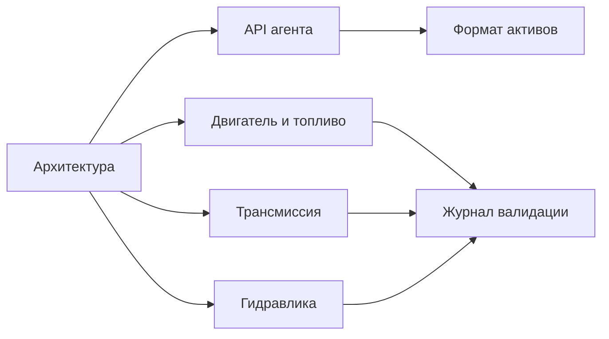

# Документация

[English](README.md) · [简体中文](README.zh-CN.md) · [Français](README.fr.md) · **Русский** · [日本語](README.ja.md) · [한국어](README.ko.md) · [Deutsch](README.de.md) · [Español](README.es.md) · [Italiano](README.it.md) · [Português](README.pt-BR.md)

Английский — исходный язык этих страниц. У каждого файла те же девять переводов, что и у README проекта: `zh-CN`, `fr`, `ru`, `ja`, `ko`, `de`, `es`, `it` и `pt-BR`. Перевод лежит рядом с английским файлом как `NAME.<locale>.md`. Идентификаторы, числа, единицы, даты, пути и значения свидетельств во всех языках одни и те же.

## Проект

| Документ | Что это |
|---|---|
| [Архитектура](ARCHITECTURE.ru.md) | Сборки, зависимости и то, как компилируется модель |
| [Дорожная карта](ROADMAP.ru.md) | Цель по силовому агрегату и работа, которая ещё нужна |
| [Статус разработки](DEVELOPMENT_STATUS.ru.md) | Что реализовано и какая приёмка ещё открыта |
| [Журнал валидации](VALIDATION.ru.md) | Датированные контрольные точки, счётчики и файлы свидетельств |
| [Заметки о возобновлении работ по двигателю](NEXT_ENGINE_STEP.ru.md) | Следующий шаг по двигателю, отдельно от заявлений о завершённости |

## Интерфейсы

| Документ | Что это |
|---|---|
| [API агента](AGENT_API.ru.md) | Инструменты MCP, ревизии, ошибки и последовательность операций |
| [Формат активов](ASSET_FORMAT.ru.md) | `.powerasset` v24 и читатели для v1–v23 |
| [Граница нативного Zig](NATIVE_ZIG.ru.md) | Архивные прототипы на Zig и версионируемый ABI |

## Двигатель и топливо

| Документ | Что это |
|---|---|
| [Закрытый цилиндр](SEALED_CYLINDER.ru.md) | Адиабатическое сжатие и расширение с работой давления на коленвале |
| [Газообмен](GAS_EXCHANGE.ru.md) | Состояние идеального газа, конечные масса и энергия, сжимаемое отверстие |
| [Газовая сеть](GAS_NETWORK.ru.md) | Скомпилированные газовые объёмы, сужения, резервуары и теплота стенки |
| [Подвижный цилиндр](MOVING_CYLINDER.ru.md) | Газовая камера, объём которой следует кривошипно-шатунному механизму |
| [Фазы клапанов](VALVE_TIMING.ru.md) | Профили открытия 360° и 720° по углу коленвала |
| [Premixed-сгорание](PREMIXED_COMBUSTION.ru.md) | Предписанное выгорание Вибе с учётом топлива, воздуха и продуктов |
| [Дозирование топлива](FUEL_METERING.ru.md) | Конечная газовая рейка и подача дозы за цикл |
| [Топливная плёнка](FUEL_FILM.ru.md) | Конечный запас жидкости, оплаченное стенкой испарение, реакция только пара |
| [Жидкостный впрыск](LIQUID_FUEL_INJECTION.ru.md) | Конечная податливая жидкостная рейка, питающая плёнку |
| [Привод иглы](NEEDLE_ACTUATION.ru.md) | Соленоид, зависящий от положения, масса иглы, задержка закрытия и отскок |
| [Предсказание закрытия](CLOSURE_PREDICTION.ru.md) | Ограниченный повтор объекта, который планирует снятие напряжения |

## Трансмиссия

| Документ | Что это |
|---|---|
| [Физика сцепления](CLUTCH_PHYSICS.ru.md) | Неизменяемый закон сухого сцепления и эталон точной пары |
| [Сеть сцеплений](CLUTCH_NETWORK.ru.md) | Связанный компонент сцепления, ёмкости, теплота и события |
| [Идеальные шестерни](IDEAL_GEARS.ru.md) | Эталоны шестерни и планетарного ряда при постоянной нагрузке |
| [Зубчатая сеть](GEAR_NETWORK.ru.md) | Связанные идеальные шестерни и планетарные ограничения |
| [Гидротрансформатор](CONVERTER_NETWORK.ru.md) | Квазистационарный гидротрансформатор и блокировка |
| [Трансмиссия с двумя сцеплениями](DUAL_CLUTCH_TRANSMISSION.ru.md) | Семь передних путей, задний ход и три главные передачи |
| [Управление DCT](DCT_CONTROL.ru.md) | Дискретная синхронизация и поэтапная передача тяги |
| [Трансмиссия Ravigneaux](RAVIGNEAUX_TRANSMISSION.ru.md) | Четыре передних диапазона, нейтраль, задний ход и эксперимент с гидротрансформатором |
| [Разрешённые планетарные ряды](RESOLVED_PLANETS.ru.md) | Собственное вращение сателлитов и орбитальная инерция на графе Ravigneaux |
| [Привод AT](AT_HYDRAULIC_ACTUATION.ru.md) | Поршни от насоса для пяти элементов диапазона и блокировки |

## Гидравлика

| Документ | Что это |
|---|---|
| [Гидравлическая сеть](HYDRAULIC_NETWORK.ru.md) | Податливые объёмы, сужения и сцепления, управляемые давлением |
| [Насос](HYDRAULIC_PUMP.ru.md) | Объёмный насос, утечки, вязкое сопротивление, предохранительный клапан и электрический привод |
| [Поршень](HYDRAULIC_PISTON.ru.md) | Поступательная масса, камера, пружина и контактное сцепление |
| [Золотник](HYDRAULIC_SPOOL.ru.md) | Золотник, дозируемый положением поршня, без команды открытия |
| [Газовый аккумулятор](GAS_PISTON.ru.md) | Газовая камера на той же массе, что и гидравлический поршень |
