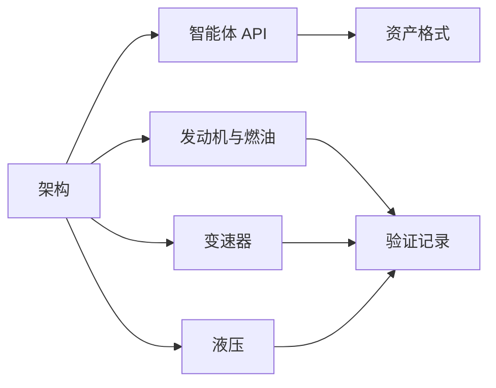

# 文档

[English](README.md) · **简体中文** · [Français](README.fr.md) · [Русский](README.ru.md) · [日本語](README.ja.md) · [한국어](README.ko.md) · [Deutsch](README.de.md) · [Español](README.es.md) · [Italiano](README.it.md) · [Português](README.pt-BR.md)

这些页面以英文为源。每个文件都有与项目 README 相同的九种翻译:`zh-CN`、`fr`、`ru`、`ja`、`ko`、`de`、`es`、`it` 与 `pt-BR`。译文与英文文件并排放置,文件名为 `NAME.<locale>.md`。标识符、数字、单位、日期、路径与证据值在各种语言中相同。

## 项目

| 文档 | 内容 |
|---|---|
| [架构](ARCHITECTURE.zh-CN.md) | 程序集、依赖,以及模型如何编译 |
| [路线图](ROADMAP.zh-CN.md) | 动力总成目标,以及仍需完成的工作 |
| [开发状态](DEVELOPMENT_STATUS.zh-CN.md) | 已实现的内容,以及仍待验收的部分 |
| [验证记录](VALIDATION.zh-CN.md) | 注明日期的检查点、计数与证据文件 |
| [发动机恢复笔记](NEXT_ENGINE_STEP.zh-CN.md) | 下一项发动机增量,与完成声明分开存放 |

## 接口

| 文档 | 内容 |
|---|---|
| [智能体 API](AGENT_API.zh-CN.md) | MCP 工具、修订号、错误与操作序列 |
| [资产格式](ASSET_FORMAT.zh-CN.md) | `.powerasset` v29,以及 v1 至 v28 的读取器 |
| [原生 Zig 边界](NATIVE_ZIG.zh-CN.md) | 归档的 Zig 原型与带版本的 ABI |

## 发动机与燃油

| 文档 | 内容 |
|---|---|
| [封闭气缸](SEALED_CYLINDER.zh-CN.md) | 带曲轴压力功的绝热压缩与膨胀 |
| [换气](GAS_EXCHANGE.zh-CN.md) | 理想气体状态、有限质量与能量、可压缩孔口 |
| [气体网络](GAS_NETWORK.zh-CN.md) | 编译后的气体容积、节流、储气库与壁面传热 |
| [运动气缸](MOVING_CYLINDER.zh-CN.md) | 容积随滑块—曲柄变化的气室 |
| [气门定时](VALVE_TIMING.zh-CN.md) | 按曲轴定时的 360° 与 720° 开启曲线 |
| [预混燃烧](PREMIXED_COMBUSTION.zh-CN.md) | 带燃油、空气与产物记账的预设 Wiebe 燃烧 |
| [燃油计量](FUEL_METERING.zh-CN.md) | 有限气体油轨与按循环剂量供入 |
| [油膜](FUEL_FILM.zh-CN.md) | 有限液体存量、壁面支付蒸发、仅蒸气反应 |
| [低压喷射](LIQUID_FUEL_INJECTION.zh-CN.md) | 为油膜供油的有限柔性液轨 |
| [针阀驱动](NEEDLE_ACTUATION.zh-CN.md) | 位置相关电磁铁、针阀质量、关闭延迟与回弹 |
| [闭合预测](CLOSURE_PREDICTION.zh-CN.md) | 安排断电时刻的有界对象回放 |
| [油箱几何与有限气相空间](TANK_HEADSPACE.zh-CN.md) | 刚性油箱容量、有限气体压力功与显式通气 |

## 变速器

| 文档 | 内容 |
|---|---|
| [离合器物理](CLUTCH_PHYSICS.zh-CN.md) | 不可变干式离合器定律与精确配对参考 |
| [离合器网络](CLUTCH_NETWORK.zh-CN.md) | 耦合离合器元件、容量、热量与事件 |
| [理想齿轮](IDEAL_GEARS.zh-CN.md) | 恒定载荷的齿轮与行星参考 |
| [齿轮网络](GEAR_NETWORK.zh-CN.md) | 耦合的理想齿轮与行星约束 |
| [变矩器](CONVERTER_NETWORK.zh-CN.md) | 准稳态液力变矩器与锁止 |
| [双离合变速器](DUAL_CLUTCH_TRANSMISSION.zh-CN.md) | 七条前进路径、倒挡与三个主减速器 |
| [DCT 控制](DCT_CONTROL.zh-CN.md) | 采样同步与分阶段动力交接 |
| [Ravigneaux 变速器](RAVIGNEAUX_TRANSMISSION.zh-CN.md) | 四个前进挡域、空挡、倒挡与变矩器实验 |
| [分解行星](RESOLVED_PLANETS.zh-CN.md) | Ravigneaux 图上的行星自转与轨道惯量 |
| [AT 驱动](AT_HYDRAULIC_ACTUATION.zh-CN.md) | 为五个挡域元件与锁止供能的泵驱动活塞 |

## 液压

| 文档 | 内容 |
|---|---|
| [液压网络](HYDRAULIC_NETWORK.zh-CN.md) | 柔性容积、节流与压力驱动离合器 |
| [泵](HYDRAULIC_PUMP.zh-CN.md) | 容积泵、泄漏、黏性阻力、泄压与电驱动 |
| [活塞](HYDRAULIC_PISTON.zh-CN.md) | 平动质量、腔室、弹簧与接触离合器 |
| [滑阀](HYDRAULIC_SPOOL.zh-CN.md) | 由活塞位置计量的滑阀,没有开度指令 |
| [气体蓄能器](GAS_PISTON.zh-CN.md) | 与液压活塞共用同一质量的气室 |
