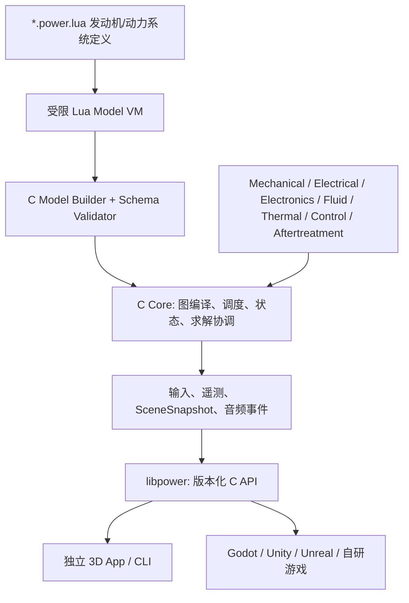
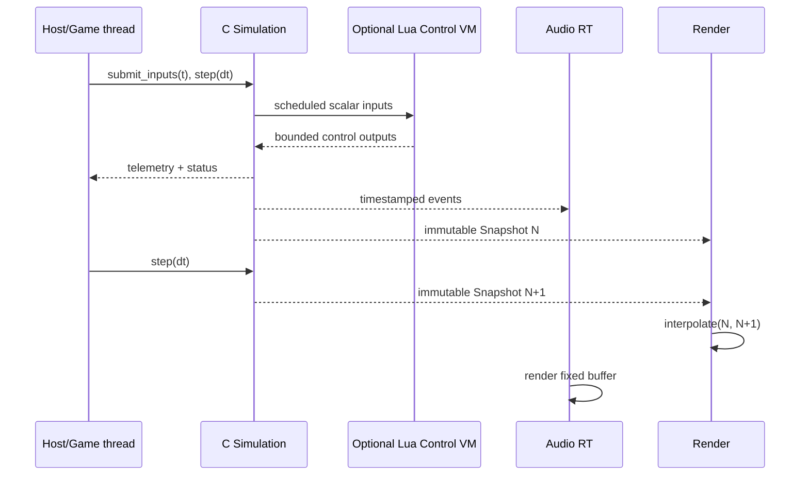

> Historical native design record. C-era paths and build instructions refer to commit `c342d4c`; see [the native README](../README.md) for the current Zig implementation.

# Power! 目标架构：C 核心 + Lua 定义层

状态：目标架构；2026-09-07 已落地公开模型 IR、线性电—机械—热图编译/求解和通用 SDK backend。已实现范围与面向未来模型的扩展决策见 [模型运行时](https://github.com/Water-Run/Power/blob/c342d4c05c9d0b14cae0ce1a85e3f2100dfd7bb3/legacy/native/docs/MODEL_RUNTIME.md)，其余现状见 [开发状态](https://github.com/Water-Run/Power/blob/c342d4c05c9d0b14cae0ce1a85e3f2100dfd7bb3/legacy/native/docs/DEVELOPMENT_STATUS.md)。本文中的通用非线性图、Lua、3D/音频仍为目标设计。
目标：完整重写、ISO C23、Lua 5.5、Linux-first、headless-first、3D reference app、可嵌入游戏

## 0. 命名边界

产品展示名为 **Power!**；C、Lua、库、文件和 Issue 使用不含感叹号的稳定技术标识。完整映射见 [项目命名约定](https://github.com/Water-Run/Power/blob/c342d4c05c9d0b14cae0ce1a85e3f2100dfd7bb3/legacy/native/docs/NAMING.md)。当前没有已发布兼容面，因此旧工作名及其标识不进入实现。

## 1. 重写边界

Power! 只参考经典 `engine-sim` 的产品思想：参数化发动机、实时机械响应、物理事件驱动声音和结构可视化。它不移植旧 C++ 类、不追求旧脚本/数值逐项兼容，也不继承旧主循环。旧 `.mr` 最多作为独立转换工具的输入，转换结果必须经过新 schema 校验。

新实现分工明确：

- **ISO C23（ISO/IEC 9899:2024）**：状态、求解器、组件图、3D、音频、资产编译、C API 和实时调度。
- **Lua 5.5**：发动机/动力系统的声明式定义，必要时承载有频率上限的高层控制；不实现缸压、气流、电机、电池等数值内循环。
- **宿主游戏**：拥有游戏时钟、世界车辆物理和最终渲染/空间音频；通过纯 C API 使用 Power!。

## 2. 架构原则

1. **Lua 构建模型，C 执行模型。** Lua 返回描述对象，C 验证并编译成连续内存中的不可变拓扑；稳态步进不遍历 Lua table。
2. **物理核心不认识窗口、GPU、音频设备或具体游戏引擎。** 同一模型可在 CLI、测试、独立 3D 应用和游戏插件中运行。
3. **拓扑优先于车型枚举。** BEV、REV、串/并联 HEV、PHEV 是组件图的合法组合，不是五套模拟器。
4. **守恒端口和控制信号分开。** 扭矩/角速度、电压/电流、温度/热流等交换能量；控制端口只能发命令和观测。ECU、传感器和执行器消耗的真实电能通过低压电气端口建模，不能藏在信号线上。
5. **解析/降阶模型负责仿真，3D 网格负责表达。** 活塞姿态由曲柄连杆状态推导，不让通用 3D 碰撞引擎决定气缸压力。
6. **精度必须有声明、有数据、有误差。** “比原版更好”由守恒、收敛和测量验证证明，不由画面复杂度推断。
7. **实时线程有固定上限。** warm-up 后，物理和音频热路径不做无界分配、不拿无界锁、不调用 Lua、不做文件 I/O。
8. **公开 C 边界长期稳定。** 内部结构可以重写；宿主只看到版本化函数表、普通布局结构和不透明句柄。
9. **系统支持意味着动态仿真，不是存在一个名字。** 每个宣称支持的系统都要有状态、时序或守恒关系、单位化参数、边界/故障行为和验证 KPI；只有网格、声音、动画或脚本切换的对象必须标为展示占位。
10. **应用打包与模型沙箱分层。** LuaInstaller 可封装可信 Lua CLI/工具壳和同 ABI 的 `power_native`，但用户 `.power.lua` 仍只在 `libpower` 私有受限 VM 中运行；游戏 SDK 不依赖 LuaInstaller executable。详见 [发行设计](https://github.com/Water-Run/Power/blob/c342d4c05c9d0b14cae0ce1a85e3f2100dfd7bb3/legacy/native/docs/PACKAGING.md)。
11. **模型作者与运行时解耦。** 人、GPT-6 或后续模型通过同一带单位 IR、编译诊断和验证场景提交候选。可变的模型服务用于开发与分析；仿真部署的是经过验证、带版本和适用范围的资产/组件。

## 3. 总体分层



模型 VM 在加载完成后即可销毁。若资产声明了 Lua 高层控制器，它运行在另一个受限 Control VM，以显式任务频率读取/写入标量端口；实时 `Game` 档可以完全禁用运行时 Lua。

## 4. 建议仓库布局

```text
include/power/             # 唯一公开 C 头；不暴露 Lua/SDL/渲染类型
src/core/                  # arena、ID、图、调度、事件、快照、诊断
src/math/                  # 小型确定性向量/矩阵/稀疏求解基础
src/models/mechanical/
src/models/ice/
src/models/electrical/
src/models/fluids/         # 进排气、燃油、润滑与冷却流体网络
src/models/electronics/    # 低压供电、传感器、执行器与通信总线
src/models/aftertreatment/ # 催化器、过滤器与尾气组分
src/models/thermal/
src/models/vehicle/
src/models/control/
src/lua/                   # 私有 Lua VM、绑定、沙箱、模型 builder
src/audio/                 # DSP、阶次/模态/波导、设备无关 PCM
src/render/                # 独立应用的 SDL_GPU 参考渲染器
src/platform/              # SDL3 窗口/输入/音频，仅 app 使用
src/sdk/                   # 动态/静态库导出和 ABI 版本协商
apps/studio/               # 3D 编辑/检查应用
apps/cli/                  # headless、benchmark、离线导出
plugins/godot/
plugins/unity/
plugins/unreal/
assets/stdlib/             # 官方 Lua 定义库、材料和示例
tests/                     # unit、scenario、ABI、fuzz、golden
tools/                     # shader、资产编译、旧格式转换、打包
third_party/               # 固定版本与许可证清单
```

构建使用 CMake + Ninja，C 实现以最新已发布的 ISO C23 为基线。配置必须等价于 `CMAKE_C_STANDARD 23`、`C_STANDARD_REQUIRED ON`、`C_EXTENSIONS OFF`，GCC/Clang 构建显式使用 `-std=c23`；仍在开发中的 C2y 不作为产品基线。标准依据为 [ISO/IEC 9899:2024](https://www.iso.org/standard/82075.html)。

GCC 和 Clang 都是 Linux CI 必测编译器。初始最低版本为 GCC 14 与 Clang 18，因为二者提供正式的 `-std=c23` 模式；CI 还必须有当前稳定版本。Clang 官方仍把部分 C23 项目标为未完成，因此核心只采用两套编译器共同通过的 C23 语言/库特性，并为 C23 库函数做 configure feature probe，不用 `gnu23` 扩展。参考：[GCC C 标准说明](https://gcc.gnu.org/onlinedocs/gcc/Standards.html)、[Clang C 状态](https://clang.llvm.org/c_status.html)。

公开 SDK 头以 C23 编译和定义，但刻意限制为稳定的跨语言 ABI 子集，并用 C++17 及更新版本做包含测试：固定宽度整数、显式大小/对齐契约、`struct_size`、函数表和不透明句柄。公开布局不使用 `_BitInt`、位域、VLA、编译器向量类型、`long double` 或尺寸由实现决定的枚举。这样内部可以采用最新 C 规范，又不会把新语言特性变成游戏宿主的 ABI 风险。核心库不链接 SDL3，`power_studio` 才链接窗口、GPU 和设备音频。

## 5. Lua 版本与嵌入策略

### 5.1 版本

语言版本采用 Lua 5.5，vendoring 基线固定为官方 Lua 5.5.1。它是 2026-08-27 时的当前稳定修订；源码包 `lua-5.5.1.tar.gz` 的官方 SHA-256 为 `1c4b4068d67061f2a2231ad2b5422e77acea1487ea9890f6320af614f4373dce`。官方说明同一 `x.y` 的补丁修订 ABI 兼容、不同 `x.y` 则不兼容，因此项目必须固定精确源码并在包清单记录版本与 hash：[Lua 版本历史](https://www.lua.org/versions.html)、[Lua 下载与校验值](https://www.lua.org/ftp/)。

- 只分发 Lua 源定义，不接受预编译 bytecode；避免 VM 小版本/构建选项和不可信字节码问题。
- `manifest.lua_api = "1.0"` 表示 Power! DSL 版本，而不是直接等同 Lua 版本。
- 定义标准库先避免依赖 5.5 独占语法，未来更换 Lua 版本时由 DSL 兼容测试决定。
- LuaJIT 不是基线：定义阶段不需要 JIT，且不能为了脚本速度让 5.1 方言和平台差异进入资产格式。

Lua 是可嵌入的 C 库，并允许宿主注册 C 函数，正适合建立领域 DSL：[Lua 5.5 手册](https://www.lua.org/manual/5.5/manual.html)。其许可为宽松 MIT 风格许可：[Lua license](https://www.lua.org/license.html)。

### 5.2 私有 VM 与符号隔离

- 每次模型加载创建独立 `lua_State`，使用 Power! 自定义 allocator 记录并限制总内存。
- 动态库默认隐藏所有符号，只导出 `pwr_get_api`；内置 Lua 符号通过可见性脚本隐藏，静态集成模式提供前缀化构建，避免与宿主已有 Lua 冲突。
- 公共头不包含 `lua.h`，C API 不接受/返回 `lua_State*`。宿主可通过 VFS callback 从内存提供 Lua 源。
- Lua 错误始终通过 protected call 回到 C，转换为带文件、行、组件路径的 `pwr_result`；不允许 `longjmp` 穿越公开 API 边界。

### 5.3 沙箱

Model VM 只装载 `base` 的安全子集、`table`、`string`、`math`、`utf8` 和只读 `power` 模块：

- 默认不开放 `io`、`os`、`debug`、原生 `package.loadlib`、网络、进程和任意文件路径。
- 自定义 `require` 只解析当前包和显式依赖，通过规范化虚拟路径阻止 `..` 逃逸和循环依赖炸弹。
- C allocator 限制字节数；C 侧 instruction hook 限制指令数/递归；宿主可取消加载。
- 覆盖/移除 `math.random`，定义必须使用带 seed 的 `pwr.random`；构建结果记录 seed。
- 所有返回 table 有深度、条目、字符串、组件和曲线采样上限。
- chunk 只以 text mode 加载；导入包的 hash、许可和 DSL 版本进入模型指纹。

Lua 官方 C API提供自定义 state/allocator、环境和 debug hook；这些能力用于宿主侧限额，`debug` 库本身不会暴露给脚本。

## 6. Lua 发动机定义 DSL

### 6.1 设计目标

- 读起来像工程装配，不像调用 C 指针 API。
- 所有物理量带单位，错误在加载时定位。
- 定义可以组合、参数化、循环生成气缸，但最终只返回数据描述。
- 构造函数返回不可变 descriptor userdata；Lua 不能拿到运行中 C 对象地址。
- 发动机可独立发布，也可被完整动力系统定义 `require`。

### 6.2 示例草案

```lua
local pwr = require("power")
local u = pwr.units

local bore = 86 * u.mm
local stroke = 86 * u.mm

return pwr.engine {
    id = "org.example.i4_2l",
    name = "Example 2.0L I4",

    material = "power.material.cast_iron_g3000",
    crankshaft = pwr.crankshaft {
        stroke = stroke,
        mass = 14.2 * u.kg,
        flywheel_inertia = 0.18 * u.kg_m2,
        firing_order = { 1, 3, 4, 2 },
    },

    banks = {
        pwr.cylinder_bank {
            angle = 0 * u.deg,
            bore = bore,
            cylinders = 4,
            head = require("heads.example_dohc16"),
            piston = require("parts.example_piston"),
            rod = require("parts.example_rod"),
        },
    },

    combustion = pwr.spark_ignition {
        fuel = require("fuels.gasoline_e10"),
        compression_ratio = 10.5,
        ignition_map = require("maps.example_ignition"),
    },

    thermal = pwr.cooling_circuit {
        coolant = "power.fluid.water_glycol_50",
        thermostat = 88 * u.degC,
    },
}
```

`86` 单独作为长度会被拒绝；`86 * u.mm` 生成带量纲的 descriptor。编译器检查排量、压缩比、几何干涉、气缸索引、发火顺序、端口域、材料字段和曲线范围，并把所有量转换为 SI。

### 6.3 完整动力系统

发动机定义只是可复用部件。车辆包再组合：

```lua
local pwr = require("power")

return pwr.powertrain {
    components = {
        ice = require("engines.example_i4"),
        exhaust = require("exhaust.example_i4_twc"),
        generator = require("motors.example_p2"),
        battery = require("batteries.example_20kwh"),
        traction = require("motors.example_traction"),
        aux_battery = require("electrical.example_12v"),
        ecu = require("controls.example_engine_ecu"),
        vcu = require("controls.example_rev_vcu"),
        vehicle_bus = pwr.can_bus { bitrate = 500000 },
    },
    connections = {
        pwr.connect("ice.shaft", "generator.shaft"),
        pwr.connect("ice.exhaust", "exhaust.inlet"),
        pwr.connect("generator.dc", "battery.dc", "traction.dc"),
        pwr.connect("traction.shaft", "final_drive.input"),
        pwr.connect("aux_battery.dc", "ecu.power", "vcu.power"),
        pwr.connect("ice.crank_sensor.signal", "ecu.crank_speed"),
        pwr.connect("ecu.throttle_command", "ice.throttle.command"),
        pwr.connect("ecu.can", "vcu.can", "vehicle_bus.nodes"),
    },
}
```

这种图能明确表示 REV 没有发动机到车轮的机械直连，也能用相同部件组成并联或功率分流 HEV。气体连接本身双向传递流量、焓和背压；ECU 必须通过传感器、执行器与供电端口闭环，不能借 Lua 回调直接写曲轴扭矩或缸压。实际 DSL 会为多端电气节点和总线节点提供专用 builder，上例只展示域边界而非冻结语法。

### 6.4 热重载

热重载在新的 Model VM 中完整构建、验证、编译 shadow graph；只有成功后才在仿真同步点交换。参数兼容时按稳定 ID迁移状态；拓扑改变或状态不兼容时明确冷启动。旧 VM/graph 在没有读者后释放，失败定义绝不破坏正在运行的模型。

## 7. C 侧内存、对象与错误模型

- 加载阶段使用 builder arena；图编译后生成只读 model arena 和定长 runtime state arena。
- 组件以 32/64 位 generation handle 引用，不保存会因数组扩容失效的裸指针。
- 热路径的临时量来自每实例 scratch arena；容量不足返回可诊断错误，不临时 `malloc`。
- 插件边界所有结构以 `abi_version + struct_size` 开头；字符串为指针 + 长度的 UTF-8 view。
- 所有公开函数返回 `pwr_result`；详细错误写入每 context 的有界错误栈，绝不使用全局 `errno` 表达模型错误。
- C 实现启用严格 warning、UBSan/ASan、静态分析、fuzz；整数大小和序列化端序显式定义。

## 8. 多领域组件图

### 8.1 端口

| 域 | 努力量 / 流量 | 典型组件 |
|---|---|---|
| 旋转机械 | 扭矩 / 角速度 | 曲轴、柔性轴、离合、齿轮、行星排、差速器、转子、测功机 |
| 平动机械 | 力 / 速度 | 车身纵向质量、轮胎、制动器、路坡 |
| DC/AC 电气 | 电压 / 电流 | 电芯、母线、电容、逆变器、DC/DC、充电器、电机绕组 |
| 热 | 温度 / 热流 | 电芯、冷板、缸体、机油、冷却液、环境、换热器 |
| 气体 | 压力/焓/组分 / 质量流 | 气缸、进气歧管、阀、管路、涡轮、排气和后处理 |
| 液体 | 压力/焓 / 质量流 | 燃油、机油、冷却回路 |
| 控制 | 带单位、采样时间和有效性的值/事件，不守恒 | 传感器、执行器命令、ECU、VCU、BMS、驾驶员、故障注入 |
| 通信 | 带时间戳、优先级和载荷的帧，不守恒 | CAN/CAN FD/LIN 抽象总线、网关、诊断节点 |

每条连接在加载时检查域、单位、方向和多重驱动。控制值显式携带采样时刻、有效/陈旧状态和质量标志；通信帧经过确定性的仲裁、排队和超时模型。图编译器把拓扑转换成连续状态块、离散任务、代数环、稀疏系统、事件源和跨速率同步点。组件类型以 C vtable-like 函数表注册，但内置组件在编译后按类型分组为 SoA 批处理，避免逐组件虚调用成为热路径瓶颈。

### 8.2 单位与数值表示

- Lua 定义层使用 quantity userdata，内部统一 SI。
- C 公共 API 的标量均为 SI，并在字段名/文档中注明；实现用 `double`，场景快照可降为 `float`。
- 组件 descriptor 在构建时做量纲和范围检查；运行态不携带昂贵字符串单位。
- `NaN`、无穷、负体积、越界 SOC 等转成结构化诊断；钳制、降级或停止行为写入回放记录。

## 9. 求解与多速率调度

核心使用确定性的多速率固定基准时钟，Analysis 档允许局部自适应积分；子域只在明确同步点交换能量。

以下是 Phase 0 原型要校准的初始范围：

| 子域 | Interactive 初始策略 | 备注 |
|---|---|---|
| 曲轴/轴系 | 0.05–0.5 ms，半隐式或能量一致积分 | 解析曲柄机构 + 可选扭转自由度；不解 3D 碰撞 |
| ICE 燃烧 | 以曲轴角推进，燃烧区间约 0.25–1° CA | 低转速时增加时间上限 |
| 进排气 | 0D 容积网络；高档可切 1D 有限体积管段 | 监控质量/能量残差 |
| 平均值逆变器/电机 | 0.05–0.5 ms | PWM 开关级模型只在 Analysis/局部运行 |
| 电池 ECM/BMS | 1–10 ms | SOC、极化、限流与故障 |
| 热网络 | 10–100 ms，必要时局部隐式 | 降额/沸腾事件立即同步 |
| 传感器/执行器 | 0.1–20 ms，按设备独立采样 | 含带宽、延迟、量化、速率限制、饱和与故障 |
| C 控制任务 | 每任务 0.05–100 ms | 确定性优先级和 deadline；高频闭环不调用 Lua |
| Lua 监督控制 | 10 ms 或更慢 | 只用于有预算的高层策略，可在 `Game` 档禁用 |
| 车载通信 | 事件驱动或位时间聚合 | 消息级仲裁、延迟、丢帧和 bus-off；不在 MVP 解收发器波形 |
| 音频 | 48 或 96 kHz | 音频背压不得改变物理时间 |
| 3D/UI | 宿主帧率 | 在物理快照间插值 |

代数环有固定迭代上限并报告收敛。v0 保持单仿真线程和固定求和顺序；并行只在 benchmark 证明必要后加入，并规定稳定分区与归约顺序。

## 10. 三个精度档

| 档位 | 用途 | 模型取舍 | Lua 运行策略 |
|---|---|---|---|
| `Game` | 多车辆、玩法反馈、插件默认 | 查表/平均值 ICE，效率图电机，简化电池/热/尾气；保留关键控制状态机、延迟和故障 | 加载后销毁 Model VM；运行期控制用 C |
| `Interactive` | 独立 3D 模拟器、测功机 | 曲轴角燃烧、0D/可选 1D 进排气、热催化器与组分、传感器/执行器动态、消息级总线、扭转轴、2-RC 电池、dq/高分辨率图 | 可选低频 Lua 监督控制 VM，严格内存/指令预算 |
| `Analysis` | 离线验证、参数辨识 | 更细 1D 管段/步长、可替换后处理动力学、详细损耗/老化、开关或电路局部模型、可替换求解器 | 允许工具 Lua，不保证硬实时 |

资产声明最低档位和缺失参数。每个已编译模型导出逐子系统能力清单：`simulated`、`reduced`、`placeholder` 或 `unsupported`，并附模型版本与验证证据 ID。缺数据时输出“降级模型 + 不确定度”，不能静默补出伪精确默认值；宿主请求的最低能力不满足时，加载失败或在宿主显式允许后降级。

## 11. 动力系统覆盖

### 11.1 ICE

- 解析曲柄滑块/主副连杆机构，质量、惯量、配重和可选曲轴扭转段。
- 空气滤清器、节气门/增压器、中冷器、歧管、气门、气缸、排气歧管、涡轮/旁通、后处理、消声器和尾管组成可分档的 0D/1D 气体网络。
- 火花点火先采用可校准燃烧速率模型；燃油供给、喷油、点火、增压和 EGR 均通过有动态的执行器与 ECU 控制连接，不能直接改写“理想目标值”。
- 热网络至少含气体、缸盖/缸体、活塞、机油、冷却液、排气部件和环境；润滑回路影响摩擦、轴承损失、间隙和热量搬运。
- MVP 提供汽油机三元催化器的降阶动态模型；柴油/压燃、DPF/SCR、爆震和更细化学机理在相应数据与验证就绪后进入正式支持。

### 11.2 BEV

- OCV-SOC-温度曲线、1/2-RC 电芯、包拓扑、SOC/SOH、库仑效率和热网络。
- BMS 接触器/预充、监控、功率限值和故障状态。
- 平均值逆变器、损耗图；电机 map 与可选 dq 动态、弱磁和热降额。
- DC/DC、附件、减速器、差速器和混合再生制动。

### 11.3 REV / REEV

本文 `REV` 指 range-extended electric vehicle：

`燃料 → ICE → 发电机 → DC 链路/电池 → 牵引逆变器 → 电机 → 车轮`

发动机不直接连接驱动轮；有机械直驱路径时按复合/并联 HEV 建模。控制覆盖恒功率、效率岛、SOC 滞环、NVH 和热限制。

### 11.4 HEV / PHEV

- HEV：串联、并联和行星排功率分流；启停、扭矩填补、再生、换挡协调和 SOC 维持。
- PHEV：在明确 HEV 拓扑上增加充电口、OBC、充电损耗/限制和较大可用电量，分别验证 charge-depleting 与 charge-sustaining；不是只改电池容量。

### 11.4a 首批 ICE 整机传动分支

首批命名样例不是两个孤立发动机，而是共享 `power.complete_powertrain.v1` 边界的两套前横置前驱完整动力总成：

- **EA211 DJS + DQ200**：曲轴/DMF 后分成 K1 奇数挡和 K2 偶数/R 两条干式离合支路，包含预选、离合器滑摩/热、选挡与机电液压、TCU—ECU 扭矩交接、主减速器、差速器和半轴。无供体齿比时模型加载必须失败或显式使用 `synthetic` 测试资产，不能静默给出“常见 DQ200”值。
- **PSA EC5 + AT8 4AT**：曲轴/驱动盘后进入液力变矩器和锁止支路，再进入四挡行星/摩擦元件、液压泵/阀体、ATF 热回路、主减速器、差速器和半轴。`AT8` 是四前进挡 BVA 型号，不是八挡 EAT8；AL4 谱系资料只能确定有证据桥接的家族接口，不能替代 AT8 供体齿比和标定。

两分支都必须把传动反扭矩反馈到曲轴、把损耗写入热账本、把泵/阀/TCU/传感器写入 12 V 与控制时序，并接收宿主轮速/道路反力。无换挡瞬态的理想齿比开关只允许作为 L1 对照，不算完整动力总成模拟。

### 11.5 电子控制、低压供电与车载通信

- ECU、TCU、VCU、BMS、电机控制器和 OBC 是具有独立采样周期、优先级、状态、deadline、上电/复位和故障模式的离散组件，不是宿主每帧直接写扭矩的快捷入口。
- 控制库提供查表、状态机、滤波、PI/PID、限幅/斜率、滞环、前馈和基础观测器；高频闭环编译为 C 控制图，Lua 负责声明、标定数据和可选低频监督策略。
- 传感器建模采样保持、带宽/一阶或二阶响应、量化、噪声、偏置、饱和、延迟、漂移、掉线和合理性状态；执行器建模死区、迟滞、速率/行程限制、驱动电流、热状态、卡滞和失效位置。
- 12/24/48 V 低压电网为控制器、传感器、泵、风扇和继电器供电；关键负载计入电能与热账本，可模拟起动压降、欠压复位、休眠/唤醒和熔断/断路。
- CAN/CAN FD/LIN 首先采用确定的消息级模型：周期/事件报文、仲裁、带宽、队列、网关、传输延迟、超时、丢帧与 bus-off。位级收发器、电磁兼容和 OEM 固件二进制执行不属于 MVP，后续通过 SIL/FMI/硬件接口扩展。
- “控制正确”由闭环跟踪、稳定性、超调/整定时间、deadline miss、故障降级和跨控制器协同场景验证；不以控制动画或预录状态序列代替。

### 11.6 排气、声学与后处理

- 气缸排气门至尾管是连续的气体与热网络。组件至少保存压力、质量、温度/内能和可配置组分；连接计算双向质量流、焓流与压降，涡轮从同一流场交换轴功和热量。
- 汽油基线组分至少区分惰性气体、`O2`、未燃燃料/HC、`CO`、`CO2`、`H2O` 和 `NOx`；模型必须核算总质量、元素或声明的伪组分质量与能量残差。柴油扩展再加入烟炱、`NH3` 等所需状态。
- 管路、歧管、涡轮壳、催化器、过滤器、消声器和环境具有热容、换热与辐射边界；背压会反馈泵气功和缸内残余气体，不允许排气只单向产生声音。
- `Game` 档使用标定的集中容积、延迟和转化率图；`Interactive` 档支持 0D 网络与局部 1D 波动、催化器储氧/温度和 light-off；`Analysis` 档允许更细 1D 管段与可替换降阶反应动力学。
- 声音激励由排气阀事件、压力波和尾管边界派生，但 DSP 只消费带时间戳的副本；音频队列或设备状态不能反向改变气体解。
- 尾管质量流、温度、背压、组分质量流、累计排放、催化器转化率与 light-off 时间都进入验证。未经过法规工况与合规流程时，输出只能称为仿真估计，不能宣称排放认证结果。

### 11.7 “达到仿真级别”的共同门槛

一个子系统只有同时满足以下条件，才可在支持矩阵中标为 `simulated`：

1. 明确系统边界、输入输出、连续/离散状态和时间尺度；
2. 给出方程、守恒关系或可追踪的因果降阶模型，并说明适用范围；
3. 参数具有单位、来源、有效范围和缺失/越界策略；
4. 与其它域双向耦合，例如排气背压影响发动机、控制器负载影响低压电网；
5. 具有解析/台架/公开数据对照、收敛检查、故障场景和可复现 KPI。

首版的系统完整性清单至少覆盖：机械轴系，进气/燃油/燃烧，排气/后处理，润滑/冷却/热，低压电气/电子控制/通信，高压电池/逆变器/电机，传动/制动/整车负载。只完成网格、PBR、声音、仪表或理想指令接口的项目一律标为 `visual-only` 或 `placeholder`，不能计入仿真覆盖率。

## 12. 材料：工程属性与视觉外观分开

### `EngineeringMaterial`

- 密度、弹性模量、泊松比、强度与 S-N 疲劳。
- 比热、导热、热膨胀、工作温限和表面换热。
- 摩擦、磨损、润滑和表面处理。
- 电阻率、磁性/磁损、永磁体退磁，以及模型需要的电池材料参数。
- 属性可为温度/应变率/频率曲线，并记录单位、来源、范围和不确定度。

工程材料影响质量/惯量、热、电、磁、间隙和降额。实时档使用降阶应力/疲劳；完整 FEA/CFD 通过离线导出或外部协同，不塞入 v0 热循环。

### `RenderMaterial`

3D 外观采用 [glTF 2.0 metallic-roughness PBR](https://registry.khronos.org/glTF/specs/2.0/glTF-2.0.html) 作为交换基线。视觉“铝”不会自动成为某牌号工程铝；Lua/资产必须显式连接 `engineering_material` 与网格材质。温度、油膜、积碳和磨损是运行时图层。

## 13. 3D 与音频

### 13.1 参考 3D 应用

- C 侧参数化生成曲轴、连杆、活塞、凸轮、齿轮、转子/定子、电池模组和管路基础网格；艺术资产通过 glTF 导入。
- 仿真发布不可变 `pwr_scene_snapshot`：时间、稳定 part ID、姿态和热/压力/流量/应力标量；前端插值，不读取求解器内部内存。
- 支持正常、剖切、爆炸、透明壳体，以及温度/压力/流向/功率损耗叠加。
- LOD 只影响表达，不影响动力学。

独立应用首选 SDL3 的 C API：SDL_GPU 提供现代 3D/compute 抽象，Linux 使用 Vulkan 后端，shader 通过 SDL_shadercross 离线构建；官方说明见 [SDL_GPU](https://wiki.libsdl.org/SDL3/CategoryGPU)。若 P0 原型发现 PBR/编辑器维护成本不合适，可替换 `src/render`，核心/SDK/Lua DSL 不受影响。

### 13.2 声音

- ICE：缸压变化、进排气阀/管路波、点火/喷油、机械冲击。
- 电驱：电磁阶次、调制边带、轴承和齿轮啮合。
- 模型向有界 SPSC 队列写带时间戳事件；C DSP 重采样、阶次/模态合成、波导/延迟、传递函数和卷积，输出多空间声源。
- 独立应用通过 SDL3 `SDL_AudioStream` 做设备格式转换和拉/推流；该接口是 SDL3 音频核心并支持分块重采样：[SDL_AudioStream](https://wiki.libsdl.org/SDL3/SDL_AudioStream)。
- 游戏插件默认让宿主拉 PCM 或消费声源事件；音频回调无分配、无阻塞锁，且不能反向改变物理步数。

## 14. 资产包

建议 `.powerpkg`：

```text
manifest.toml          # ID、版本、Lua DSL、依赖、许可、hash
main.power.lua         # 返回 engine 或 powertrain descriptor
modules/**/*.lua       # 只经受限 require 加载
materials/*.lua        # 工程材料；同样编译为 C descriptor
scene/*.gltf|*.glb     # 网格和 PBR
audio/*                # 有明确许可的 IR/测量数据
```

- Lua 是唯一主要作者格式，不再同时维护 JSON 动力系统 schema；C builder 的结构规则就是权威 schema，工具可导出规范化 JSON 供 diff/缓存/外部工具使用。
- 包分为 `definition` 与可选 `trusted-native-plugin`；普通 Mod 不含可执行 `.so`。
- 编译缓存以 Lua 源、依赖、DSL 版本、C build model ABI 和平台无关参数共同 hash；缓存不是可交换 Lua bytecode。
- 旧 `.mr` 转换在独立工具进程运行，输出 Lua 源和未映射项报告；不作为兼容承诺。

## 15. 游戏嵌入 C API

`libpower.so` 和 `libpower.a` 共享一份 ISO C23 公开头，并持续做 C++17+ 包含测试。动态库只公开：

```c
pwr_result pwr_get_api(
    uint32_t requested_version,
    const pwr_host_api *host,
    pwr_api *out_api);
```

其余调用通过 `pwr_api` 函数表完成：

- 所有公开结构以 `abi_version + struct_size` 开头；新增尾字段保持兼容。
- context/model/instance/snapshot 使用不透明 generation handle，不暴露内部 C struct 或 Lua state。
- 宿主提供 allocator、logger、VFS 和可选 job callback；所有权和线程归属写入字段契约。
- 宿主提交输入并调用 `step(dt)`；核心内部固定子步推进并报告实际消费时间、诊断和 backlog。
- 输入、遥测、scene snapshot 和音频事件均批量交换，避免 O(部件数) 跨边界调用。
- API 可查询逐子系统精度档、能力状态、参数来源和验证证据 ID；插件不能把 `placeholder` 当作正式仿真支持展示。
- v0 不共享 GPU handle；Godot/Unity/Unreal 用自身材质/网格消费 scene snapshot。
- 动态卸载前必须销毁所有句柄；API 提供 live-object 统计和泄漏诊断。

首批适配：

| 宿主 | 方式 | v0 范围 |
|---|---|---|
| Godot 4 | GDExtension 薄包装 | 生命周期、输入、遥测、PCM/声源事件、scene snapshot |
| Unity | C# P/Invoke + Native Plugin | 同上 |
| Unreal | C++ Module 链接 C API | 同上 |
| 自研引擎 | C 头 + `.so/.a` | 完整 headless API |

Godot 的 GDExtension 本身使用 C 函数与原生共享库通信，适合做薄适配：[官方说明](https://docs.godotengine.org/en/stable/tutorials/scripting/gdextension/what_is_gdextension.html)。

## 16. 原生模型插件与 Lua 定义不是同一边界

Lua 定义组合内置组件；受信任原生插件用于新增求解组件。原生插件沿用版本化 C 函数表，必须声明端口、状态/临时内存大小、步进上限、线程/确定性能力，不能访问内部 arena。普通 Mod 默认不能加载任意 `.so`。

FMI 3.0 Co-Simulation 可作为后续导出层，与 Modelica/台架工具协同；它用标准 C API 和模型描述交换动态模型，并允许 FMU 携带求解器：[FMI 3.0](https://fmi-standard.org/docs/3.0/#_overview)。它不替代游戏帧级 API。

## 17. Linux 一级支持

| 项目 | Tier 1 | 后续 |
|---|---|---|
| 编译 | GCC 14+ 与 Clang 18+，ISO C23、`-std=c23`、CMake/Ninja，`x86_64-linux-gnu` | `aarch64-linux-gnu` Tier 2；musl 待插件/音频依赖明确 |
| 图形 | SDL_GPU Vulkan，Mesa/AMD/NVIDIA；无 GPU 时 headless | 其它 SDL_GPU 后端随平台扩展 |
| 窗口 | SDL3 Wayland/X11 | 嵌入时无窗口依赖 |
| 音频 | SDL3 AudioStream；PipeWire/ALSA 路径由 SDL 处理；Null 后端 CI | 专业 JACK 路径按需求评估 |
| 诊断 | ASan、UBSan、LSan、Valgrind、clang-tidy、fuzz | TSan 用于快照/音频队列专项 |
| 分发 | 可移植 tar + 调试符号；冻结 glibc 基线 | Flatpak/AppImage 后续 |
| CI | configure/build/test、C/C++ ABI smoke、Lua sandbox、headless benchmark、Vulkan software smoke | 多 GPU/音频实机矩阵 |

核心和 SDK 默认不链接窗口/GPU；服务器或游戏专服只加载 headless 库。

## 18. 线程和时间所有权



- v0 由宿主线程同步调用仿真，最容易回放；异步 worker 是可选模式。
- Lua Control VM 只在仿真线程的计划点运行，不并发访问 C 状态；超预算按定义策略停用或保持上次输出。
- 音频用有界 SPSC 队列，渲染持有只读双/三缓冲快照。
- 资产加载、Lua 编译、shader 编译和热重载构建在 worker 完成，帧边界提交。

## 19. 尚待 Phase 0 决策

1. 新项目许可证，以及 Power! 的商标/混淆检查和公开发布坐标。
2. Lua DSL v1 的单位语法、错误格式、包依赖和稳定 ID。
3. 是否完全 vendor Lua 5.5.1，或同时支持宿主注入兼容 Lua；默认建议前者。
4. SDL_GPU 参考前端能否在 2 周 spike 内满足基础 PBR、剖切和 Linux 帧预算。
5. 首个基准车型/动力总成与可合法使用的数据。
6. `Game/Interactive/Analysis` 的硬件、误差、电子控制与排气模型预算。
7. ICE 首版只做汽油火花点火，还是同时承担柴油。
8. Godot、Unity、Unreal 中首个正式适配器的排序。
