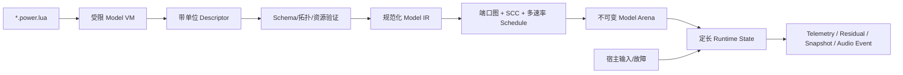

> Historical native design record. C-era paths and build instructions refer to commit `c342d4c`; see [the native README](../README.md) for the current Zig implementation.

# Power! 首阶段实现方案

状态：P0/P1 首阶段设计记录；2026-09-07 已加入共享模型 IR、线性图求解与 JSON 实验，当前执行契约见 [模型运行时](https://github.com/Water-Run/Power/blob/c342d4c05c9d0b14cae0ce1a85e3f2100dfd7bb3/legacy/native/docs/MODEL_RUNTIME.md)，全项目现状见 [开发状态](https://github.com/Water-Run/Power/blob/c342d4c05c9d0b14cae0ce1a85e3f2100dfd7bb3/legacy/native/docs/DEVELOPMENT_STATUS.md)。
依赖：[命名约定](https://github.com/Water-Run/Power/blob/c342d4c05c9d0b14cae0ce1a85e3f2100dfd7bb3/legacy/native/docs/NAMING.md)、[目标架构](https://github.com/Water-Run/Power/blob/c342d4c05c9d0b14cae0ce1a85e3f2100dfd7bb3/legacy/native/docs/ARCHITECTURE.md)、[验证计划](https://github.com/Water-Run/Power/blob/c342d4c05c9d0b14cae0ce1a85e3f2100dfd7bb3/legacy/native/docs/VALIDATION.md)、[路线图](https://github.com/Water-Run/Power/blob/c342d4c05c9d0b14cae0ce1a85e3f2100dfd7bb3/legacy/native/docs/ROADMAP.md)

## 1. 实现结论

先实现一个 headless、确定性、可回放的多领域内核，再接 3D 和设备音频。受控轴系与守恒排气网已经形成第一版 C23 组件和测试；通用 SI 发动机、DCT7 与液力 4AT 骨架也已开始用于整机耦合。P0/P1 不直接堆出“整车大全”，而是让所有新增系统共享同一组件图、调度器、账本、诊断和 C ABI：

1. **Controlled Shaft Lab**：低压供电、转速/电流传感器、离散控制任务、消息延迟、逆变器、电机、柔性轴、测功负载和热节点；用于证明电子控制确实闭环作用于物理系统。
2. **Exhaust Flow Lab**：脉动气源、歧管/管段、节流或涡轮负载、热催化器、消声容积和尾管边界；用于证明质量、组分和能量守恒、背压反馈、light-off 与声学事件来自同一动态状态。

两条切片通过退出门槛后，BEV 复用第一条扩展电池/VCU/BMS，ICE 复用第二条接入曲轴角燃烧与 ECU；当前两个 ICE 整机分支分别验证 DQ200 型双干式离合拓扑和 AT8 型液力四挡拓扑。REV/HEV/PHEV 只组合已验证组件，不另建旁路模拟器。

## 2. 编译流水线



Lua VM 在 `Model Arena` 生成后销毁。运行时控制图、气体网络和求解器只读规范化 IR，不保存 Lua 指针；相同源、依赖、版本和 seed 必须生成相同模型指纹。

## 3. 首批仓库与构建目标

```text
include/power/power.h       # 唯一公开入口
src/core/                   # arena、ID、graph、schedule、event、diagnostic
src/models/electrical/      # DC/LV source、bus、inverter
src/models/electronics/     # sensor、actuator、controller、message bus
src/models/mechanical/      # inertia、shaft、gear、dyno
src/models/fluids/          # volume、junction、restriction、pipe boundary
src/models/aftertreatment/  # catalyst thermal/species model
src/models/thermal/         # thermal mass/resistance/environment
src/lua/                    # VM、units、descriptor、VFS、sandbox
src/sdk/                    # pwr_get_api 与 ABI 函数表
apps/cli/                   # validate、run、replay、benchmark
tests/unit/
tests/scenario/
tests/abi/
tests/fuzz/
```

初始 CMake 目标为内部静态库 `power_core`、`power_lua`、`power_models`，公开 `power_sdk`，以及 `power_cli` 和测试目标。`power_core`/`power_sdk` 不链接 SDL、窗口、GPU 或设备音频；参考前端只消费公开快照和事件。

## 4. 统一组件契约

每个组件类型都提供固定上限的描述与执行契约：

- descriptor 校验、端口声明、状态/临时内存大小和初始化；
- 连续状态导数或离散 `tick`，以及事件定位/提交函数；
- 能量、质量、组分、电荷等账本贡献和数值残差；
- 有界诊断、遥测字段和快照投影；
- 支持的精度档、参数来源、有效范围和越界策略。

图编译阶段验证端口域与单位，求强连通分量，形成固定顺序的连续求解组和离散任务表，并一次性分配 model/state/scratch arena。热路径不查字符串、不遍历 Lua table、不临时分配。

## 5. 时间与执行顺序

使用整数 tick 表示基准时间，所有周期任务声明为 tick 的整数倍；拒绝无法表示或超过预算的周期。一个同步点的固定顺序为：

1. 锁存宿主输入与到期故障事件；
2. 更新到期传感器采样并投递通信帧；
3. 完成总线仲裁/超时，运行到期 C 控制任务；
4. 锁存执行器命令，推进电气、机械、气体和热子步；
5. 迭代有固定上限的代数环，提交离散事件；
6. 汇总守恒残差、诊断、遥测和时间戳输出。

同一时间戳事件使用稳定组件 ID 和事件序号排序。`Game`/`Interactive` 采用固定步与固定迭代上限；`Analysis` 可局部自适应，但必须记录接受/拒绝步以供回放分析。

### 初始求解器选择

- 轴系先用半隐式 Euler，并对自由转子、弹簧阻尼轴和理想齿轮提供封闭解/能量测试；需要更高阶方法时保持组件状态与求解器接口分离。
- 平均值逆变器/电机将电压、电流、扭矩和损耗写入同一子步；图编译器把代数环归为 SCC，v0 只接受可由有界阻尼 Newton/固定点迭代求解的环，超出能力的拓扑在加载时拒绝。
- 0D 气体以各组分质量和总内能为守恒状态，采用可压缩孔口/喷嘴通量和确定性子步；首选 SSP-RK2 加 CFL/正性限制。壁面热节点用隐式 Euler，催化反应用局部有界隐式步或验证过的转化率图，避免反应刚性拖垮整个图。
- 控制任务在连续求解组之外按采样时刻执行，命令在下一执行器锁存点生效；除非组件显式声明并通过 SCC 检查，不允许零延迟的信号代数环。
- 所有跨域功率、焓流和反应热使用与状态推进一致的积分权重计账。任何钳制/正性修正都作为显式 ledger adjustment 和诊断输出，不能悄悄“修好”残差。

## 6. Controlled Shaft Lab

最小拓扑为：

```text
24 V source -> ECU/sensors
driver command -> ECU -> message/actuator delay -> averaged inverter -> motor -> flexible shaft -> dyno
                                      |                     |
                                  current/RPM sensors    loss -> thermal nodes
```

第一版控制器只需标定表、斜率限制、PI 电流/转速环和状态机，但必须真实按采样周期运行。传感器包含采样保持、延迟、量化和可注入偏置/掉线；执行路径包含饱和、速率限制和欠压复位。验收场景包括扭矩阶跃、负载扰动、传感器偏置、报文超时和低压 brownout，检查闭环 KPI、机械/电/热能量账本和确定性回放。

## 7. Exhaust Flow Lab

最小拓扑为：

```text
pulsating source -> manifold volume -> restriction/turbine -> heated catalyst -> muffler volume -> tailpipe
          ^                |
          +---- backpressure feedback
```

初版使用理想气体混合物、集中容积和可压缩孔口流；每个容积保存总质量、内能与组分质量。催化器保存基体温度、储氧或等效反应状态，使用有来源的转化率图或降阶动力学；管壁/催化器向热网络交换能量。验收场景包括稳态流量、压力脉冲传播、冷启动 light-off、富/稀切换、尾管堵塞和热浸，检查质量/组分/能量残差、步长收敛、背压变化和累计尾管排放。

这一切片先用受控边界源隔离求解风险；接入 ICE 后，边界源由气缸排气门状态替换，接口和验证账本保持不变。

## 8. 最小公开 API

动态库只导出 `pwr_get_api`。v0 函数表至少覆盖：context 创建/销毁、从宿主 VFS 加载模型、创建/销毁实例、提交批量输入与故障、推进时间、读取诊断/遥测、获取/释放不可变快照、录制/回放和能力查询。

公开结构均含版本与 `struct_size`，实例/模型/快照使用 generation handle。宿主不能取得内部组件指针，也不能从回调重入仿真；所有线程归属和数据有效期写入头文件契约。

## 9. 建议提交顺序

| 顺序 | Issue | 可独立验收的结果 |
|---:|---|---|
| 1 | `PWR-001` | 命名检查、C23 CMake、GCC/Clang CI、sanitizer 和测试骨架 |
| 2 | `PWR-010/015` | Lua units/descriptor、VFS 沙箱和规范化模型指纹 |
| 3 | `PWR-020` | 类型端口、稳定 ID、图验证、SCC 与预分配 runtime state |
| 4 | `PWR-025` | 传感器/执行器、固定周期 C 控制任务和消息级总线 |
| 5 | `PWR-030` | 电机—轴—负载连续求解与电/机械/热账本 |
| 6 | `PWR-035` | 气体容积/孔口/组分/热催化器与排气账本 |
| 7 | `PWR-040` | 确定性事件、快照、录制/回放与 golden scenarios |
| 8 | `PWR-050` | C ABI 生命周期、C/C++ host、fuzz 与 10 万步长稳测试 |
| 9 | `PWR-060/070` | 只读 3D 快照与设备无关音频事件，证明不影响物理 hash |

不要在 1–8 未形成 headless 验收闭环前冻结编辑器 UI 或大规模资产格式；视觉层可以并行做可丢弃 spike，但不能成为模型接口的所有者。

## 10. P1 退出条件

- 两条切片均由 `.power.lua` 加载，销毁 Model VM 后可继续运行；GCC/Clang、ASan/UBSan 和 headless CI 通过。
- Controlled Shaft Lab 的命令跟踪、故障降级、deadline/超时和电—机械—热账本有可复现报告。
- Exhaust Flow Lab 的压力/温度/流量、light-off、组分/累计排放和质量—能量账本有收敛测试；堵塞会通过背压改变上游功耗。
- 相同构建、输入、seed 和调度配置逐步 hash 相同；暂停渲染、禁用音频或改变宿主 FPS 不改变物理结果。
- 所有已标为 `simulated` 的组件满足 [共同门槛](https://github.com/Water-Run/Power/blob/c342d4c05c9d0b14cae0ce1a85e3f2100dfd7bb3/legacy/native/docs/ARCHITECTURE.md#117-达到仿真级别的共同门槛)；其余组件在能力查询与 UI 中明确显示为 `placeholder` 或 `unsupported`。
