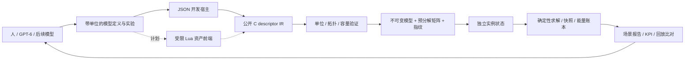

> Historical native design record. C-era paths and build instructions refer to commit `c342d4c`; see [the native README](../README.md) for the current Zig implementation.

# 可组合模型运行时与面向未来模型的开发架构

日期：2026-09-07；实现版本：0.2.0；C ABI：1（追加函数表）；模型 IR：1。

## 1. 本轮架构决策

Power! 的开发中心从“为每台实验台写一套执行器”推进到“模型定义 → 编译 → 共享模型 → 实例 → 可验证实验”。新的 SDK 实例注册表管理生命周期、并发占用和宿主调用；具体物理通过内部 backend 接口执行。Controlled Shaft Lab 已迁入独立 backend；原有发动机、排气、DCT/4AT 原型继续作为后续移植的参考与回归基线。

GPT-6 与后续基础模型可以帮助提出方程、编写组件内核、生成拓扑、设计实验和分析误差。架构为这类工作提供稳定的输入与反馈：带单位的描述数据、编译错误的对象/字段定位、机器可读通道、确定性场景和能量残差。基础模型服务的更新不改变仿真的运行环境；候选物理模型通过验证后，以版本化资产或受测试的 C 实现进入运行时。

这里没有把某个基础模型名称、推理能力或测试通过等同于实车标定。当前新 IR 的所有实例都公开标为 `linear_lumped / unverified`，调用方不能通过改名提升可信等级。



## 2. 已实现的物理范围

| 对象 | 参数 / 状态 | 耦合约定 |
|---|---|---|
| 旋转节点 | 惯量、初始角度、初始角速度 | 每个节点是独立有限惯量 |
| 热节点 | 热容、初始绝对温度 | 存储损耗转入的热量 |
| 柔性传动轴 | 刚度、阻尼、静止扭角、有符号传动比 | 连接两个旋转节点，或连接机械地 |
| 直流电机支路 | 电阻、电感、单一电机常数、初始电流、输入电压 | 电流与转速在同一方程组求解；铜耗进入热节点或外界 |
| 扭矩源 | 初始输入和宿主通道 | 正值做功、负值吸收功；按实际轴速记账 |
| 热连接 | 热导、可选环境温度 | 连接两个热节点，或与固定温度环境交换热量 |

电机是理想电压边界供电的 RL 支路，尚无通用电压节点/Kirchhoff 电网、电池、逆变器开关或 dq 电机。柔性传动比表达弹性耦合，不是刚性齿轮或离合器接触约束。转动惯量和热容都必须为正；刚度、阻尼、电阻、热导必须非负；电感必须为正。可以有孤立储能节点、多条连接及闭合机械/热网络。

实现容量为每模型 32 个节点、64 个部件、64 个总状态；一个旋转节点计两个状态，一个热节点计一个状态，一个电机支路另计一个电流状态。模型上限 64、实例上限 256。编译超限有稳定错误码，求解器不会在步进中扩容。

## 3. 求解与守恒契约

对每条柔性轴定义：

```text
twist = theta_a - ratio * theta_b - rest_angle
slip  = omega_a - ratio * omega_b
tau_a = -stiffness * twist - damping * slip
tau_b = -ratio * tau_a
loss  = damping * slip^2
```

机械地的角度和角速度恒为零；接地连接的 `ratio` 必须是 1。负传动比用于反向旋转，端口功率仍遵守同一符号约定。

对直流电机支路：

```text
L * di/dt = voltage - R * i - k * omega
torque    = k * i
copper_loss = R * i^2
```

扭矩常数与反电动势常数共用同一个 SI 参数 `k`，确保机电功率交换相消。当前参数不随温度改变，因此热反馈到电阻、磁链或限扭属于未来模型扩展。

旋转角度、角速度和电流统一组成 `x' = A x + f`。采用隐式中点：

```text
(I - h/2 * A) * x_mid = x_old + h/2 * f
x_new = 2 * x_mid - x_old
```

矩阵只在编译阶段按稳定顺序组装并做带行尺度的部分主元 LU 分解；实例共享只读因子。源功和阻尼/电阻损耗使用同一个中点状态计算，避免各部件使用不同时刻速度或电流造成接口能量差。无源、无阻尼、二次储能系统的中点守恒性质见 Hairer 的 [Long-time energy conservation of numerical integrators](https://archive-ouverte.unige.ch/unige:12115)，§1.2.1；本项目独立实现并用解析解验证，没有复制参考代码。

热网络用后向 Euler 接收这一步的损耗能量，环境热流也用步末温度计算。这使正热容、非负热导和正温度边界下的被动热网络保持正温度。**机电部分二阶，热部分一阶**；整体不能宣称统一二阶。较大步长即便稳定，仍可能有明显的相位/瞬态误差。

统一账本：

```text
source_work = 累计电压 * 中点电流 * h + 扭矩源 * 中点角速度 * h
heat_rejected = 未路由的机械/铜损 + 向环境传出的热量
stored_energy_change = 动能 + 弹性势能 + 磁能 + 热节点能量的变化
energy_residual = source_work - heat_rejected - stored_energy_change
```

再生发电让 `source_work` 减少，环境加热让 `heat_rejected` 减少。热节点之间的交换和机电转换是内部流，不重复计入外部账本。累计功与热量使用补偿求和；残差如实报告，没有速度投影或数值修正项来强行归零。双精度舍入和求解误差仍然存在。

## 4. 数据、编译与生命周期

公开定义见 [`include/power/model.h`](https://github.com/Water-Run/Power/blob/c342d4c05c9d0b14cae0ce1a85e3f2100dfd7bb3/legacy/native/include/power/model.h)。`pwr_model_desc` 包含 ABI/结构大小、IR 版本、固定整数纳秒步长、节点数组和部件数组。

- 参数使用 `pwr_quantity`。已支持 SI 单位，并在对应量纲上接受 rpm/deg；编译后以及所有宿主输入/输出使用 SI。
- ID 在节点和部件之间全局唯一且非零；0 专用于机械地、热环境和整个模型的账本。
- 编译器拒绝重复 ID、跨域/悬空/自连接、重复输入通道、非法单位/范围、未知 schema/kind、容量超限与非有限离散系统。
- 成功后不借用 descriptor 数组或字符串。节点和部件按稳定 ID 排序，按规范化字段逐项计算 FNV-1a 指纹，不哈希结构填充或指针。
- 指纹包含 IR/求解器版本、步长、拓扑、归一化参数、初始状态和初始输入。`+0/-0` 统一处理；单位转换后的浮点结果必须相同才能有相同指纹。FNV 是复现标识，不是密码学签名。
- context、model、instance 句柄含类型标签和 generation，误传其他类型或使用已销毁句柄会失败。
- 模型持有 context；实例持有模型和 context。还有实例时销毁模型返回 `IN_USE`；模型仍在时销毁 context 也返回 `IN_USE`。
- 新图实例提交输入以整个 frame 为事务；重复更新同一通道会被拒绝。每次多 tick `step` 也以整个调用为事务，非有限数值或时间溢出时保留原有状态。旧 Controlled Shaft backend 仍使用原来的调度器失败语义。
- 状态哈希包括模型指纹、时间、全部动态状态、待生效输入及账本/补偿状态；同构建与平台的相同轨迹可比对。跨编译器不承诺位级相等。

求解热循环没有堆分配、文件/网络 I/O、Lua 调用或用户回调。SDK 入口保留短时注册表锁，同实例并发调用返回 `BUSY`；目前没有宣称硬实时调度保证。

## 5. 公共 ABI 与通道发现

`pwr_get_api` 仍是唯一导出符号。ABI v1 的旧字段位置保留，新字段追加到函数表末尾。使用扩展前，宿主检查运行时函数表的 `struct_size` 和能力位。

```text
context_create
  -> model_compile(desc, diagnostic)
  -> model_get_info / model_get_channels
  -> instance_create_from_model
  -> instance_submit_inputs / instance_step / instance_read_snapshot
  -> instance_destroy
  -> model_destroy
  -> context_destroy
```

`model_get_channels` 支持先查询所需容量，再把带方向、单位、对象 ID、量名的描述复制到调用方缓冲区；缓冲区不足时不部分覆盖。快照也使用调用方内存。输入通道由定义者指定，高位必须为零；输出通道用 `PWR_MODEL_CHANNEL(object_id, field)` 生成，高位为一，避免混用。对象 0 的四个输出为整图能量账本。

可执行 C/C++ 宿主示例在 [`examples/model_host.c`](https://github.com/Water-Run/Power/blob/c342d4c05c9d0b14cae0ce1a85e3f2100dfd7bb3/legacy/native/examples/model_host.c)，构建为 `power_model_host`。[`tests/test_model_sdk.c`](https://github.com/Water-Run/Power/blob/c342d4c05c9d0b14cae0ce1a85e3f2100dfd7bb3/legacy/native/tests/test_model_sdk.c) 另覆盖 descriptor 离开作用域后运行、多实例共享、通道查询、销毁顺序、类型误用、容量失败和旧 ABI 函数表兼容。

## 6. JSON 实验入口

[`tools/model_lab.py`](https://github.com/Water-Run/Power/blob/c342d4c05c9d0b14cae0ce1a85e3f2100dfd7bb3/legacy/native/tools/model_lab.py) 是只使用 Python 标准库和公开 C ABI 的离线开发宿主。示例为 [`assets/labs/electrothermal.power.json`](https://github.com/Water-Run/Power/blob/c342d4c05c9d0b14cae0ce1a85e3f2100dfd7bb3/legacy/native/assets/labs/electrothermal.power.json)。

```bash
cmake -S . -B build -DCMAKE_BUILD_TYPE=Debug
cmake --build build --parallel
ctest --test-dir build --output-on-failure
./build/power_model_host
python3 tools/model_lab.py assets/labs/electrothermal.power.json \
  --library build/libpower.so --output build/electrothermal-report.json
```

JSON 顶层字段为 `schema`（`power.model.v1`）、`step_ns`、`nodes`、`components`、`experiment`，可选 `description`。物理字段与 C descriptor 对应；quantity 写作 `{"value": 0.2, "unit": "kg_m2"}`。旋转节点的初始角度必须显式声明；热节点可以省略 position。部件的 `parameters` 使用具名字段；扭矩源无 parameters，内部热连接省略环境温度。

`experiment` 声明整型 `duration_ns`、`sample_every_ns`、可选有序 `events` 和最终输出 `checks`。事件通过通道/值数组在确定的 tick 边界生效；单位均为 SI。同一边界先提交事件，再记录快照，因此哈希包含新输入。最终时间必须晚于最后一个事件。

工具拒绝未知字段、重复 JSON key、NaN/Infinity、溢出整数、未对齐事件、重复通道和不存在的检查对象。开发宿主还有 1 MiB 文件、1000 万 tick、1 万采样间隔及 1 万事件上限。它不解释可执行表达式，不加载资产提供的本地扩展。

报告包括运行库版本/SHA-256、平台、模型指纹/状态数、通道表、采样状态、最终 KPI 和回放比较。通道 ID 与 hash 用字符串表示，避免 JavaScript 的 53 位整数精度限制。每个实验创建两个独立实例，分别以最多 100 万与 257 tick 批量步进，比较所有采样/事件边界的完整快照；**没有保存每一个 tick 的轨迹，也不是可恢复任意中间状态的 checkpoint 文件**。

退出码：0 表示检查与回放均通过，1 表示输入/编译/执行错误，2 表示报告生成成功但 KPI 或回放失败。没有 `checks` 时只验证执行与采样回放；候选自己声明的范围不构成独立物理标定证据。

## 7. 已建立的验证

- 恒扭矩惯量的角度、速度和功对照解析解。
- 谐振子的二阶步长收敛和 10 万步储能守恒。
- 正/负传动比下的广义角动量、机械损失向热节点转移。
- RL 支路阶跃电流解析解。
- 两热容平衡、环境冷却的一阶收敛与能量账本。
- 电—机械—热整图驱动、再生电流和回收功。
- 拓扑顺序归一化、单位转换、输入参与状态哈希、不同批量步进的回放一致性。
- 非法 schema/单位/拓扑/参数/容量、输入事务、数值失败回滚、时间溢出和快照缓冲区保护。
- 模型/实例生命周期、ABI 旧前缀兼容、单一导出符号以及真实 JSON→C ABI 实验。

这些是数学、实现和场景证据，尚无实测电机或供体标定数据。完整 ICE/BEV/HEV 的支持范围仍以 [开发状态](https://github.com/Water-Run/Power/blob/c342d4c05c9d0b14cae0ce1a85e3f2100dfd7bb3/legacy/native/docs/DEVELOPMENT_STATUS.md) 为准。

## 8. 下一步扩展顺序

1. **资产前端与证据。** 把受限 Lua builder 编译到同一 IR；加入每个参数的来源、适用区间、不确定度、数据集 hash 和独立验证集。JSON 开发宿主保持可批处理。
2. **非线性方程与求解分组。** 以 `residual(t, x, xdot, algebraic, inputs)`、Jacobian、守恒量和离散事件为组件契约，识别强耦合组，加入有界 Newton/稀疏求解及失败诊断。不要把温度相关电阻、接触摩擦或气流简单塞入当前固定 A 矩阵。
3. **逐项提升物理模型。** 先电池/DC 网络与受采样控制的电驱，再逐缸曲轴角燃烧、气体交换与排气压力，随后离合器、液压和热保护。每次增加方程，同时增加解析/极限工况、守恒、收敛和独立数据测试。
4. **验证后的降阶与宿主产品化。** 更高精度离线模型可生成有误差包络、适用范围和回退策略的实时降阶模型；再把稳定快照/事件交给 3D、声音与游戏插件。

更强的基础模型可以并行提出更多候选（由使用者的开发流程安排）；运行时不依赖某个供应商的命名、上下文长度、调用价格或未来发布节奏。继续开发的验收依据是可执行证据与用户需要的物理行为。
