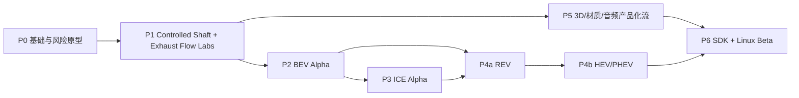

> Historical native design record. C-era paths and build instructions refer to commit `c342d4c`; see [the native README](../README.md) for the current Zig implementation.

# Power! 基础路线图

状态：2026-09-07 可组合模型运行时里程碑已实现；P0/P1 其余门槛继续推进。
下方人周估算保留为历史规划参考。后续结合 GPT-6 与未来模型的开发能力，按可执行验收门槛推进，不由估算周数或模型名称推断完成度。

当前可执行进度：C23/CMake、固定步调度、公开 ABI、Controlled Shaft、Exhaust Flow、通用 SI 发动机、DCT7 与液力 4AT 组件已有测试；另已完成带单位模型 IR、线性电—机械—热图、共享模型/实例和 JSON 采样回放。Lua、非线性多域图、整机公开实例、供体标定、3D/音频仍未完成。详见 [开发状态](https://github.com/Water-Run/Power/blob/c342d4c05c9d0b14cae0ce1a85e3f2100dfd7bb3/legacy/native/docs/DEVELOPMENT_STATUS.md)。首批 ICE 集成目标固定为 [EA211 DJS + DQ200](https://github.com/Water-Run/Power/blob/c342d4c05c9d0b14cae0ce1a85e3f2100dfd7bb3/legacy/native/assets/samples/ea211_djs_dq200/README.md) 和 [PSA EC5 + AT8 4AT](https://github.com/Water-Run/Power/blob/c342d4c05c9d0b14cae0ce1a85e3f2100dfd7bb3/legacy/native/assets/samples/psa_ec5_at8_4at/README.md)，二者均须满足同一完整动力总成边界。

当前开发顺序为：共享 IR 与实验反馈（已实现线性基线）→ Lua/参数证据 → 非线性残差/Jacobian 与强耦合求解 → 电驱/燃烧/液压模型迁入 → 验证后的降阶和 3D/音频产品化。架构决策及每一步的具体范围见 [模型运行时](https://github.com/Water-Run/Power/blob/c342d4c05c9d0b14cae0ce1a85e3f2100dfd7bb3/legacy/native/docs/MODEL_RUNTIME.md#8-下一步扩展顺序)。

## 1. MVP 与 1.0 边界

### MVP 必须有

- Linux x86_64 上的 headless 库和参考 3D 应用。
- ISO C23 headless 核心、受限 Lua 5.5 定义层、量纲单位、组件图、多速率调度和能量账本。
- BEV Interactive 纵向场景；REV 证明 ICE—发电机—DC—牵引链组合。
- 一套火花点火 ICE 的曲轴角模型、从空气入口到尾管的气路、汽油三元催化器降阶模型与物理事件驱动声音。
- ECU/TCU/VCU/BMS/电机控制器所需的离散控制任务，传感器/执行器动态，12/24/48 V 低压负载和消息级车载通信；关键故障能闭环影响物理结果。
- 并联 HEV 基本模式切换；PHEV 的充电、CD/CS 模式。
- 工程材料与 glTF PBR 材质关联、温度/压力/功率损失叠加。
- 版本化 C ABI、C/C++ 示例宿主和至少一个游戏引擎适配器。
- 验证报告、性能基线、许可清单和可回放示例。

### 1.0 再承诺

- 功率分流 HEV 的完整可调控制与验证。
- 柴油/压燃、增压/EGR、DPF/SCR 和更细后处理动力学的正式支持。
- 三个游戏引擎适配器全部达到支持状态。
- FMI 3.0 导出、受信任原生组件插件生态、图形化 Lua 动力系统编辑器。
- 电池老化、疲劳/磨损和更细 1D 气路的 Analysis 档。

### 明确不做首版

- 全车 3D 碰撞/悬架/轮胎多体动力学；宿主游戏负责车辆世界物理，Power! 提供轴端/轮端交换接口。
- 实时全 CFD、全 FEA 或电芯电化学 PDE。
- OEM ECU 固件二进制仿真、位级收发器/电磁兼容或排放法规认证；MVP 提供可验证的控制图、消息级总线和降阶后处理模型，并为后续 SIL/HIL/FMI 留边界。
- 安全关键 ECU、认证标定或可直接用于量产设计的结论。
- 旧 `.mr`/C++ 的源码、脚本或数值兼容层；如未来需要，只提供独立、非核心的资产转换工具。
- 在 v0 ABI 中跨引擎共享 GPU 资源。

### 系统覆盖基线

| 系统 | MVP 的动态仿真边界 |
|---|---|
| 机械/传动/车辆负载 | 曲轴/轴/齿轮/离合/差速器、等效纵向质量、道路阻力和制动能量；全车悬架/碰撞仍由宿主负责 |
| 高压电气/电驱 | 电芯—电池包—接触器—DC 链路—逆变器—电机—附件，含损耗、限制、故障和热降额 |
| 进气/燃油/燃烧 | 空滤/节气门/增压/歧管/气门/气缸、燃油供给与火花点火降阶燃烧，状态和流量双向耦合 |
| 排气/后处理 | 排气门—歧管—涡轮/旁通—催化器—消声器—尾管，含背压、组分、热、light-off 和累计尾排 |
| 润滑/冷却/热 | 机油/冷却液集中回路、泵/风扇、部件热容与换热；影响摩擦、间隙、效率和降额 |
| 电子控制 | ECU/TCU/VCU/BMS/MCU 的定时任务、控制图、传感器/执行器动态、诊断与故障降级 |
| 低压供电/通信 | 12/24/48 V 电源与关键负载、欠压/唤醒；CAN/CAN FD/LIN 消息级仲裁、延迟、超时与 bus-off |
| 3D/音频/遥测 | 只读表达同一物理状态；关闭、降帧或输出拥塞不得改变仿真时间和结果 |

每一行按 [仿真级别共同门槛](https://github.com/Water-Run/Power/blob/c342d4c05c9d0b14cae0ce1a85e3f2100dfd7bb3/legacy/native/docs/ARCHITECTURE.md#117-达到仿真级别的共同门槛) 验收；未达到者在能力清单中标为 `reduced`、`placeholder` 或 `unsupported`，不得仅凭存在模型名称计入 MVP。

## 2. 阶段依赖

BEV 先行不是产品优先级判断，而是架构验证策略：它用较少的快速气体状态就能验证端口、能量守恒、控制、热、3D、音频和 ABI。ICE 随后复用同一轴/热/控制基础，REV 是两个域第一次完整组合。

## 3. 阶段计划

### P0 — 基础与风险原型（4–6 人周）

交付：

- 记录 Power! 产品名与技术标识的映射，完成名称可用性检查；冻结许可、贡献来源记录和第三方依赖政策。
- ISO C23/CMake workspace；`C_STANDARD 23`、禁用编译器扩展，GCC 14+ 与 Clang 18+ warning、test/doc、依赖审计和 Linux CI。
- vendor 并固定 Lua 5.5.1；完成符号隐藏、自定义 allocator、受限标准库、VFS `require`、内存/指令限额和 text-only 加载原型。
- ADR：内部单位、状态所有权、多速率时钟、Lua DSL/包版本、C ABI、SDL_GPU 前端。
- 一台基准机和一台最低支持机登记；benchmark JSON 格式。
- 五个 time-boxed spike：Lua descriptor/沙箱→C arena、多域图/调度/控制闭环、气体组分/热后处理账本、C ABI/回放生命周期、SDL_GPU `SceneSnapshot` 前端。
- 选定首个 BEV、ICE、电子控制和排气/后处理验证数据；确认许可、参数可辨识性与误差指标。

退出门槛：

- GCC 与 Clang 均以严格 `-std=c23` 完成 configure/build/CTest，检查 `__STDC_VERSION__ >= 202311L`，warning-as-error；ASan/UBSan 配置可用。
- 示例 `.power.lua` 在限额 VM 中构建规范化 C model；`io/os/debug/loadlib` 不可用，超内存/指令能安全失败。
- RC 电路 + 转动惯量 + 热节点的耦合原型能闭合能量账本并显示步长收敛。
- 传感器—离散控制任务—执行器原型能重现采样/延迟/饱和与故障；相同输入逐步 hash 一致。
- 气源—容积—节流—热催化器—尾管原型能核算质量、组分和能量，堵塞造成可观测背压反馈。
- C 程序能加载 `.so`、运行 10 万步、销毁并通过 sanitizer/泄漏检查。
- SDL_GPU 前端的可行性有实测启动时间、帧时间、构建体积和维护成本记录；不满足门槛时保留可替换结论。

### P1 — Controlled Shaft + Exhaust Flow Labs（7–11 人周）

交付：

- `core/models/lua/sdk/app` C 模块骨架和唯一公开 `include/power/` 头。
- 低压源、传感器/执行器、固定周期 C 控制任务、消息级总线、平均值逆变器、简单电机、柔性轴、齿轮和测功负载。
- 脉动气源、气体容积/管段/节流、组分输运、热催化器、消声容积和尾管边界；背压、light-off 与累计尾气可观测。
- 固定基准时钟、多速率任务、事件、状态快照、录制/回放和结构化诊断。
- 简单转子/齿轮 3D、功率流叠加、基本电机阶次音频。
- Lua units/descriptor DSL v0、热重载 shadow graph、C ABI v0、C/C++ 示例宿主、Null 音频和 headless benchmark。

退出门槛：两条切片都从 Lua 定义加载、编译为 C graph，经宿主输入/故障、仿真、账本、快照和回放自动运行；模型 VM 销毁后仍可运行。控制故障会改变轴系响应，尾管堵塞会通过背压改变上游状态；降低 FPS 或关闭音频不改变物理 hash。详见 [首阶段实现方案](https://github.com/Water-Run/Power/blob/c342d4c05c9d0b14cae0ce1a85e3f2100dfd7bb3/legacy/native/docs/IMPLEMENTATION.md)。

### P2 — BEV Alpha（10–14 人周）

交付：

- OCV-SOC-T + 1/2-RC 电芯、串并联包、接触器/预充、BMS 限值和集中热网络。
- 电机 map 模型与可选 dq 动态、逆变器/电机损耗、弱磁和热降额。
- DC/DC、附件、减速器、差速器、车身纵向、道路坡度、机械/再生混合制动。
- VCU/BMS/电机控制器闭环、低压唤醒与故障、扭矩仲裁、传感器合理性和报文超时降级。
- `Game` 与 `Interactive` 两档、批量 headless 场景和 Linux 性能报告。
- 电池脉冲、电机测功、加速/恒速/再生/热降额验证包。

退出门槛：能量账本、SOC、端电压、轴功率和热降额均达到 [验证计划](https://github.com/Water-Run/Power/blob/c342d4c05c9d0b14cae0ce1a85e3f2100dfd7bb3/legacy/native/docs/VALIDATION.md) 冻结的误差；单实例 Interactive 在最低支持机达到实时。

### P3 — ICE Alpha（16–24 人周）

交付：

- 曲柄滑块/多缸/V 型机构、质量惯量、配重、轴扭转和起动机/测功机。
- 气门机构、燃油供给、点火/喷油时序、0D 进气—气缸—排气—尾管网络；关键排气段提供 1D 原型。
- 可校准火花点火燃烧、摩擦、blow-by、缸体/机油/冷却液热网络。
- 排气背压/热状态、三元催化器 light-off/储氧/转化率与累计尾管排放；声音从同一压力波状态派生。
- ECU 采样任务、曲轴/凸轮/氧/温度/压力传感器，节气门/喷油/点火/VVT/泵风扇执行器，以及怠速、空燃比、点火、转速限制和热管理闭环。
- 多声源进排气、燃烧与机械声音；完整 Lua 发动机定义标准库示例。

退出门槛：拖动、点火和冷启动工况的压力、扭矩、流量、控制时序、排气背压、催化器温度/转化率、尾管组分和声音阶次都有 L1/L2 证据；传感器/执行器故障有确定降级，全负荷扫速无静默不收敛，关闭 3D/音频结果不变。

### P4a — REV 组合（5–8 人周）

交付：ICE + 发电机 + DC 链路 + 电池 + 牵引电机完整串联拓扑，SOC 滞环/效率岛/NVH/热限制控制，持续爬坡和发动机启停场景。

退出门槛：所有模式的燃料、电、机械和热能账本闭合；没有任何隐藏的发动机—车轮机械路径。

### P4b — HEV 与 PHEV（10–16 人周）

交付：

- 并联离合/多电机拓扑、发动机同步启动、扭矩填补、换挡和再生协调。
- 行星排与功率分流基础模型；若验证数据不足，可留在 experimental 而不冒充正式支持。
- PHEV OBC/充电、CD/CS 策略、SOC 修正的燃油/电耗报告。
- 故障降级：电池限功率、电机/发动机过温、传感器错误、组件不可用。

退出门槛：串联、并联、功率分流的拓扑检查互不混淆；模式切换能量连续，承诺的每种车型都有 golden scenario。

### P5 — 3D、材质与音频产品化（10–16 人周，可从 P1 后并行）

交付：

- 参数化 ICE/电驱/电池/齿轮/管路网格，glTF 导入、LOD、剖切和爆炸视图。
- 工程材料数据库 v0、PBR 关联、温度/压力/流量/损失/降额叠加。
- 相机、灯光、选择、检查器、曲线/示波器和模型诊断 UI；可检查控制任务时序、传感器质量、通信超时、排气组分和催化器状态。
- 多空间声源、传递函数/卷积、阶次分析、离线 WAV/telemetry 导出。
- GPU/音频故障降级和无设备 headless 路径。

退出门槛：关键机构姿态与解析状态一致；视觉材质/LOD 不影响物理；最低支持 GPU 和音频配置达到冻结预算。

### P6 — SDK 硬化与 Linux Beta（8–12 人周）

交付：

- C ABI v1 候选、ISO C23 公开头、C++17+ 包含测试、导出符号白名单、Lua 符号隔离、版本协商和兼容测试。
- 首选游戏引擎适配器达到支持级；另外两个提供 smoke prototype 或清晰排期。
- 多实例、暂停/恢复、状态保存、热重载、错误恢复和性能计数器。
- Wayland/X11、AMD/Intel/NVIDIA Vulkan、PipeWire/ALSA/JACK 测试矩阵。
- 安装包、示例资产、SDK 文档、许可/BOM、验证和性能报告。
- LuaInstaller onedir/onefile 的可信 CLI 发行矩阵；`power_native` 与外层 Lua 5.5 ABI 探针、clean-environment smoke、generated source/relinking 和签名/校验流程。SDK/插件仍由 CMake install/CPack 发行。

退出门槛：满足 [验证计划的 Beta 证据](https://github.com/Water-Run/Power/blob/c342d4c05c9d0b14cae0ce1a85e3f2100dfd7bb3/legacy/native/docs/VALIDATION.md#11-版本发布所需证据)，并完成一次由非核心开发者按文档嵌入的试用。

## 4. 工作量视图

| 范围 | 粗估人周 |
|---|---:|
| P0–P1 可验证内核、控制与排气切片 | 11–17 |
| P2 BEV | 10–14 |
| P3 ICE/ECU/完整气路与汽油后处理 | 16–24 |
| P4 REV/HEV/PHEV | 15–24 |
| P5 产品级 3D/材质/音频 | 10–16 |
| P6 SDK/Linux Beta | 8–12 |
| 合计 | 70–107 |

这相当于一名资深全职工程师约 17–27 个理想人月，实际单人日历时间还要加入控制/排放数据、资产、文档和返工。多人并行只能在 P1 的 C/Lua/快照边界稳定后明显提速；控制标定、排气模型辨识和 P3/P4 系统验证不会按人数线性缩短。

## 5. 前 30 个工作日

### 第 1 周：项目边界

- 记录 Power! 命名约定，检查商标/包名/域名混淆风险，并决定许可和贡献来源规则。
- 选 BEV/ICE 基准与验证数据，登记硬件和最低 Linux 目标。
- 建 ISO C23 CMake workspace、GCC/Clang 双编译器 CI、依赖策略和 ADR 模板。
- 固定 Lua 5.5.1 源码、许可、编译选项和动态库符号隔离策略。

### 第 2 周：Lua DSL 与守恒端口

- Lua quantity userdata、稳定 ID、descriptor builder 和 DSL v0。
- 旋转、电气、热和控制端口；非法拓扑诊断。
- RC + 惯量 + 热节点能量账本测试。
- Model VM 的 allocator/VFS/标准库白名单/指令限额负向测试。

### 第 3 周：时钟与求解

- 多速率固定调度、事件顺序、录制/回放。
- 轴系统和小代数环的两种求解原型；基准与收敛报告。
- 传感器采样、控制任务、执行器锁存和消息延迟的确定性顺序；偏置/超时故障注入。
- Lua descriptor 编译为 C arena，销毁 VM 后运行；warm-up 后零分配检查。

### 第 4 周：SDK 垂直边界

- C ABI 版本协商、不透明句柄、错误、分配器和 VFS 约定。
- C/C++ host 跑长期 create/step/snapshot/destroy。
- fuzz 和错误 `struct_size` 负向测试。

### 第 5 周：排气账本与可观察输出

- 实现气体容积、可压缩节流、组分输运、壁面热节点和催化器温度/转化率原型。
- 跑稳态流、压力脉冲、冷启动 light-off 和尾管堵塞；记录质量/组分/能量残差及步长收敛。
- 从轴系和排气状态生成时间戳快照/音频事件，使用 Null 消费端证明背压不会受输出队列影响。

### 第 6 周：完成 P0 决策并拆解 P1

- 完成命名/许可、单位/时钟、控制执行、气体组分、模型缓存和 C ABI ADR，以及原型性能报告。
- 把 spike 中保留的代码整理为两条 P1 Lab 的共享骨架，其余明确丢弃。
- 依据 [首阶段实现方案](https://github.com/Water-Run/Power/blob/c342d4c05c9d0b14cae0ce1a85e3f2100dfd7bb3/legacy/native/docs/IMPLEMENTATION.md) 和退出门槛拆 P1 issues，不按 UI 页面或 3D 部件数量拆任务。

## 6. 首批 Epic / Issue 建议

| ID | Epic | 第一条可验收结果 |
|---|---|---|
| PWR-001 | Repo/CI/许可 | Linux 上一条命令完成 GCC/Clang build、test、doc、BOM |
| PWR-010 | Lua DSL/Units | `86*u.mm` 转 SI；错误量纲定位到 Lua 文件、行和字段路径 |
| PWR-015 | Lua Sandbox | 文件/进程/原生模块不可用；内存/指令/依赖深度越界安全失败 |
| PWR-020 | Component Graph | Lua 定义的 RC—电机—惯量拓扑编译成确定性 C schedule |
| PWR-025 | Electronic Control | 传感器—控制任务—执行器按固定采样时序闭环；延迟、欠压和报文超时可复现 |
| PWR-030 | Solver/Energy | 隔离系统守恒且步长减半收敛 |
| PWR-035 | Exhaust/Aftertreatment | 气源—管路—热催化器—尾管闭合质量/组分/能量，堵塞反馈背压 |
| PWR-040 | Snapshot/Replay | 10 万步录制重放 hash 一致 |
| PWR-050 | C ABI | 纯 C host 长稳创建/步进/销毁，无泄漏、悬空句柄或跨边界 longjmp |
| PWR-060 | Scene | 转子/轴/齿轮从只读快照插值显示 |
| PWR-070 | Audio | 电机阶次和排气压力事件时序正确，SDL 音频回调无锁无分配 |
| PWR-080 | Benchmark | JSON 报告带完整硬件/构建/模型元数据 |
| PWR-090 | Data Governance | 首批 BEV/ICE/控制/排气数据的来源、许可、hash、校准/验证划分完成 |

## 7. 主要风险与缓解

| 风险 | 早期信号 | 缓解 |
|---|---|---|
| 范围同时追求游戏、工程、所有动力形式 | 每个组件只有 UI，没有验证数据 | 三精度档；按 BEV→ICE→REV→HEV/PHEV 的退出门槛推进 |
| “系统支持”退化成组件名称清单 | ECU 直接写理想扭矩、排气只驱动声音 | 对所有系统执行状态/时序/守恒/耦合/验证五项门槛；能力查询区分 simulated/placeholder |
| 多领域刚性导致实时性差 | 子步不断缩小、事件步 p99 激增 | 平均值/降阶实时模型；局部隐式；Analysis 档承接开关级细节 |
| 电子控制范围膨胀为完整固件模拟 | 早期开始仿 MCU 指令集或位级收发器 | MVP 固定为 C 控制图、设备动态和消息级总线；以明确 SIL/FMI/HIL 边界接外部固件 |
| 排气化学参数不可辨识或无合法数据 | 只凭视觉/声音调催化效率和排放 | 先验证流动/热/组分守恒；采用可替换降阶模型，P0 冻结数据来源和不确定度，禁止认证式宣传 |
| 没有可发布测量数据 | 只能与自己或原版对比 | P0 把数据许可设为退出门槛；校准/验证集分离 |
| 3D 前端侵入核心 | 模型类型开始引用 SDL/GPU handle | 单向 SceneSnapshot；SDL 只存在于 app/platform 模块 |
| C ABI/插件升级破坏宿主 | 适配器直接包含内部 C struct | 单一 C 函数表、opaque handle、`struct_size`、兼容矩阵、批量快照 |
| 音频回调干扰物理 | 缓冲不足时物理时间漂移 | 时钟分离、有界事件队列、定义降级、Null 后端长稳测试 |
| Lua 定义执行任意代码或失控 | 脚本可访问文件/进程、无限 require/分配 | 私有 VM、库白名单、VFS、allocator/hook 限额、text-only、普通 Mod 禁止 `.so` |
| Lua 进入数值热循环 | profiler 出现逐组件 Lua/C 往返和 GC 尖峰 | Lua 只构建 descriptor；高频控制用 C；运行 Lua 有独立预算和档位开关 |
| 宿主已有 Lua 发生符号冲突 | 插件加载后解析到宿主的另一 Lua ABI | 隐藏/前缀化 vendored Lua；公共 API 不暴露 `lua_State*` |
| 上游/资产许可混淆 | 代码 MIT 被误认为覆盖 WAV/模型 | 每资产 SPDX/来源；参考 checkout 不 vendoring；发布前 BOM |
| Linux 驱动/桌面碎片化 | 只在单台开发机运行 | headless 必过；Mesa software smoke + 多 GPU/Wayland/X11 实机矩阵 |
| 单人项目维护负担 | 同时自研求解器、渲染器、编辑器、所有模型 | 只自研差异化物理；前端和平台层先做有退出条件的依赖 spike |

## 8. 需要项目所有者尽早决定的事项

这些决定不阻塞当前测绘，但会改变 P0 之后的优先级：

1. Power! 是完全开源、open-core，还是商业 SDK；对应许可证与贡献协议是什么。
2. 首要用户是模拟器玩家、游戏工作室，还是动力系统教学/前期分析。
3. 第一台“基准真车/动力总成”是什么，是否拥有可发布的机械、电气、控制时序、排气温压流量和尾气组分测量数据。
4. ICE 首版是否只做汽油火花点火；柴油、转子、二冲程何时进入范围。
5. Godot、Unity、Unreal 中哪个适配器必须最先达到正式支持。
6. Lua 运行期是否只允许低频监督控制，首版是否需要外部 ECU/VCU 的 SIL/FMI 接口；高频内置闭环仍固定为 C 控制图。
7. 最低 Linux 硬件、目标同时实例数和可接受安装体积。

在这些答案冻结前，可以完成 P0 原型，但不应承诺 1.0 日期或对外精度等级。
