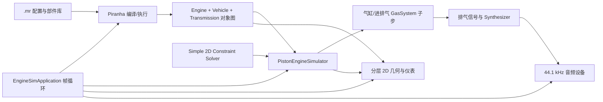

# 经典 engine-sim 源码测绘

状态：完成第一轮静态测绘
基线日期：2026-08-27
主参考：`ange-yaghi/engine-sim@85f7c3b959a908ed5232ede4f1a4ac7eafe6b630`

## 1. 范围与结论

经典项目值得参考的核心思想是：参数化发动机配置、实时曲轴响应、气路脉动驱动的声音，以及把机械结构可视化的产品表达。Power! 不翻译、移植或兼容它的实现；旧架构只用于识别有效概念和应避免的问题。原版的二维约束求解、气体/燃烧、音频延迟补偿、UI 和对象生命周期彼此穿透，且整个产品只覆盖内燃机。

本次测绘得到的重构结论是：

1. 只参考概念和用户体验；算法、对象模型、脚本、主循环与数值结果全部允许不同。
2. 用解析机构学与扭转轴网代替“用通用二维刚体约束解全部发动机内部运动”。
3. 用带类型能量端口的多领域组件图统一 ICE、BEV、HEV、PHEV、REV。
4. Lua 定义层只构建模型，C 热循环不依赖 Lua table 或旧 `.mr` 运行时。
5. 音频和 3D 只消费不可变状态快照；它们不能控制物理步数。
6. 新核心必须 headless、确定性可回放，并从第一条纵向切片就提供稳定 C ABI。

## 2. 上游状态

| 项目 | 本地基线 | 上游现状 | 对本项目的意义 |
|---|---|---|---|
| 经典开源版 | `v0.1.11a-7-g85f7c3b`，提交于 2023-01-22 | [README](https://github.com/ange-yaghi/engine-sim/blob/master/README.md) 声明只支持 Windows，并明确说明它以声音和响应为目标、不是工程科学工具 | 唯一可进行源码级测绘的主基线；MIT 许可 |
| Community Edition | `v0.1.14a-3-g4e5c20d`，提交于 2025-09-11 | [README](https://github.com/Engine-Simulator/engine-sim-community-edition/blob/master/README.md) 声明不再活跃维护，仓库只做应用分发且不含源码 | 可对照教程和最终用户行为，不能作为实现基线 |

经典 checkout 含 5 个固定子模块：`csv-io`、`delta-studio`、`direct-to-video`、`piranha`、`simple-2d-constraint-solver`。具体提交见 [reference/README.md](../reference/README.md)。

## 3. 规模清单

对主仓库的 `include/`、`src/`、`scripting/`、`test/`、`es/` 和 `assets/` 做本地统计：

| 项目 | 数量 |
|---|---:|
| C++ 实现文件 | 80 |
| C/C++ 头文件 | 114 |
| C/C++ 有效代码行（cloc） | 15,287 |
| `.mr` 脚本 | 58 |
| `.wav` 资源 | 83 |
| GoogleTest 用例 | 30，集中在 3 个测试文件 |
| 经典仓库提交数 | 212 |

测试主要覆盖 `GasSystem`、插值 `Function` 和 `Synthesizer`；没有动力总成端到端回归、测量数据拟合、跨平台构建或稳定 ABI 测试。

## 4. 当前架构图

### 4.1 配置与对象构建

- [`assets/main.mr`](../reference/engine-sim/assets/main.mr) 选择主题和发动机入口。
- [`scripting/src/compiler.cpp`](../reference/engine-sim/scripting/src/compiler.cpp) 用 Piranha 编译并执行 `.mr`。
- `scripting/include/*_node.h` 把约 140 个去重后的命名输入映射为 C++ 参数，并最终构造 `Engine`、`Vehicle`、`Transmission`。
- 脚本非常适合表达发动机部件组合，但它既是配置又是可执行图；对来自游戏 Mod 的不可信内容没有资源上限或沙箱边界。

### 4.2 机械系统

- [`src/piston_engine_simulator.cpp`](../reference/engine-sim/src/piston_engine_simulator.cpp) 为曲轴、活塞、连杆创建二维刚体和位置/连杆/离合/摩擦约束。
- `simple-2d-constraint-solver` 以 Gauss-Seidel 或通用线性方程/ODE 路径求解。
- 变速箱、整车等效质量、空气阻力和滚阻也并入同一个旋转系统。
- 多曲轴的角度漂移目前由每步直接把其它曲轴角度写成输出曲轴角度来修正；这是注释中明确标出的临时修补，不是扭转动力学模型。

### 4.3 气体、燃烧与换热

- [`include/gas_system.h`](../reference/engine-sim/include/gas_system.h) 用集中容积状态保存摩尔数、内能、二维动量和 `fuel/inert/O2` 三组分。
- 流动模型包含可压缩流、临界流、压力平衡和简单动量效应；这部分拥有项目中最完整的守恒单元测试。
- [`src/combustion_chamber.cpp`](../reference/engine-sim/src/combustion_chamber.cpp) 用经验火焰传播距离和燃烧效率反应燃料，随后把释放热量写入气体状态。
- 反应式在代码中固定为简化烃类关系；没有详细物种、蒸发、喷雾、爆震、排放后处理或可替换化学机理。
- 缸壁换热使用固定目标温度和常数形式；没有冷却回路、零件热容网络或温度相关材料数据。

### 4.4 步进与耦合

[`src/simulator.cpp`](../reference/engine-sim/src/simulator.cpp) 的典型一帧过程如下：

1. `startFrame(dt)` 以全局模拟频率计算本帧步数；默认值为 10 kHz。
2. 步数会根据合成器输入延迟增减约 10%，因此物理进度受音频缓存状态影响。
3. 每个物理步先解二维刚体约束，再更新发动机、整车和变速箱。
4. [`PistonEngineSimulator::simulateStep_`](../reference/engine-sim/src/piston_engine_simulator.cpp) 更新点火和气缸，并默认把每个物理步细分为 8 个流体子步。
5. 每步从排气支路压力/动压生成声音输入。
6. 独立合成线程重采样、加噪、滤波、卷积并输出 44.1 kHz PCM。

优点是容易得到实时声音；代价是物理时间、渲染帧和音频背压没有清晰的时钟所有权，难以做严格回放和宿主游戏集成。

### 4.5 音频

- [`src/synthesizer.cpp`](../reference/engine-sim/src/synthesizer.cpp) 有独立工作线程、环形缓冲、抗混叠、抖动/噪声、卷积和电平处理。
- [`PistonEngineSimulator::writeToSynthesizer`](../reference/engine-sim/src/piston_engine_simulator.cpp) 主要从排气压力和传播延迟构造每个排气系统的激励。
- 这是应保留的产品思路，但新实现要让燃烧、进气、排气、机械阶次、电机电磁阶次、齿轮和附件分别生成带时间戳事件，再由无锁音频图合成。

### 4.6 显示与应用

- `engine-sim-app`、输入、脚本重载、仿真、音频搬运和 UI 主要集中在 [`src/engine_sim_application.cpp`](../reference/engine-sim/src/engine_sim_application.cpp)。
- [`src/geometry_generator.cpp`](../reference/engine-sim/src/geometry_generator.cpp) 生成线、圆、环、凸轮等二维几何；[`src/simulation_object.cpp`](../reference/engine-sim/src/simulation_object.cpp) 只把二维刚体的 `x/y/theta` 加一个显示层 `z`。
- 因而当前表现是分层二维可视化，不是带真实网格、相机、光照、PBR 材质和空间声源的三维场景。

## 5. 与 Power! 目标的差距

| 目标 | 经典版现状 | 新项目要求 |
|---|---|---|
| 真 3D | 二维机构 + 显示层 | 参数化/导入网格、PBR、剖切/爆炸、热/流/应力叠加层 |
| BEV | 无电气域 | 电芯/电池包、DC 母线、逆变器、电机、BMS、再生制动、热降额 |
| REV | 无 | 严格的串联拓扑、发动机最优工作区、发电机和 DC 链路控制 |
| HEV/PHEV | 无 | 串联、并联、功率分流、离合/行星齿轮、能量管理、插电充电与 CD/CS 模式 |
| 电子控制 | 点火/节气门等由应用或脚本直接给定；无 ECU 任务、传感器/执行器、低压电网和总线 | ECU/TCU/VCU/BMS/MCU 的离散调度、设备动态、消息延迟、供电与故障闭环 |
| 排气/后处理 | 简化排气容积与支路主要服务气流/声音；固定少数组分，无催化/尾排验证 | 排气门至尾管的压力、质量、组分和热网络；背压反馈、涡轮、后处理、light-off 与累计排放 |
| 辅助系统 | 固定壁温/经验摩擦；无完整燃油、润滑、冷却和低压附件回路 | 泵、风扇、油液/冷却液、热惯性和附件功耗与控制双向耦合 |
| 材料 | 少量质量/惯量/摩擦参数；无材料实体 | 工程材料与视觉材质分离并关联，支持温度曲线和数据来源 |
| 仿真级别 | 为声音和响应优化的经验实时模型 | 明确精度档、守恒/收敛/测量验证，不宣称未经验证的工程精度 |
| 插件嵌入 | C++ 静态库但无稳定外部 ABI | headless C 核心 + 版本化 C ABI + 各游戏引擎适配器 |
| Linux | README 明示 Windows-only；CMake 含 `WIN32`、D3DX、Win32 窗口/音频和固定 `.lib` | Linux CI、Vulkan、Wayland/X11、PipeWire/ALSA/JACK、headless |
| 实时性 | 音频缓存反向调节物理步数 | 各时钟分离、同步点明确、音频回调无锁无分配 |
| 安全/维护性 | 135 处手工分配/释放指标；存在按气缸数写固定 8 元素数组的路径 | 所有权类型化、边界检查、热路径预分配、fuzz/消毒器/FFI 测试 |
| 验证 | 30 个局部单测 | 解析解、守恒、步长收敛、实测曲线、系统场景、ABI 和平台矩阵 |

## 6. 可复用与不应复用

### 建议参考

- 参数化发动机配置的用户体验和单位表达；新版本由 Lua DSL 重新设计。
- 发火顺序、曲轴/连杆/凸轮等问题域概念；如确需导入旧资产，使用独立的一次性转换器并人工核查。
- 气体守恒测试的场景思想、声音由物理事件激励的总体思路。
- 旧实现暴露出的平台、调度、生命周期和验证风险。

### 明确不复用

- `Engine`/`Simulator` 的原始指针对象图和生命周期约定。
- 让二维刚体系统承担曲柄连杆机构的全部求解。
- 由音频延迟改变仿真步数的帧循环。
- Delta Studio 的 Win32/D3D/旧音频平台层。
- Piranha、`.mr` 语法与旧节点 API；Lua DSL 从零设计。
- 固定组分燃烧、固定壁温换热等经验常数作为“高精度”默认模型。
- 旧数值输出、脚本兼容或类名映射作为新项目验收条件。

## 7. 法务与名称风险

经典主仓库为 [MIT 许可](https://github.com/ange-yaghi/engine-sim/blob/master/LICENSE)。虽然完整重写策略不需要复制旧源码，新项目仍应：

- 把“完整重写、非兼容实现”写入贡献指南；任何例外复制都必须登记文件、提交和许可。
- 不把旧仓库或许可未核实的子模块带入 C 构建。
- 单独审查声音、纹理、模型和社区发动机数据；代码 MIT 不自动覆盖所有外部资产。
- `Power!` 已取代旧工作名 `Engine3D`；发布前仍需完成商标、搜索混淆、软件包名和域名可用性检查。
- 感叹号只用于展示名；C、Lua、文件名和发布产物采用 [稳定技术标识](NAMING.md)，避免 shell、URL 和包管理器转义问题。

## 8. 测绘未覆盖项

本轮没有反编译 Community Edition 二进制，也没有把经典版强行移植到 Linux 构建。二者都与完整重写目标无关。后续无需建立逐项行为兼容测试；只有在研究产品交互或音频主观对照、且数据权利明确时，才运行原版作为外部参考。
